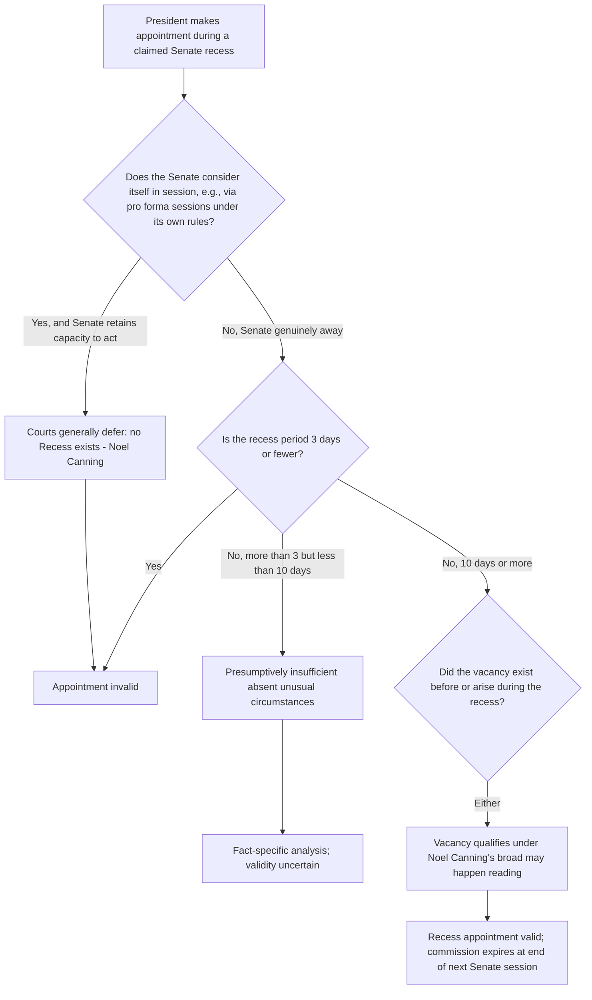

## Recess Appointments and Their Constitutional Limits

### Overview

The Recess Appointments Clause, Article II, Section 2, Clause 3, permits the President to fill vacancies that arise during a Senate recess with commissions expiring at the end of the Senate's next session, bypassing the ordinary nomination-and-confirmation process temporarily. It exists alongside the Appointments Clause as a narrow, time-limited alternative appointment mechanism, historically justified by the need to keep the government functioning when the Senate is unavailable to provide advice and consent. The doctrine's modern contours were substantially clarified by the Supreme Court's unanimous decision in *NLRB v. Noel Canning* (2014), which resolved decades of executive-legislative dispute over the Clause's scope.

### Constitutional Text

> "The President shall have Power to fill up all Vacancies that may happen during the Recess of the Senate, by granting Commissions which shall expire at the End of their next Session."

**Key Points**

- Two textual conditions appear on the face of the Clause: (1) a "Recess of the Senate," and (2) a vacancy that "may happen" during that recess.
- The commission automatically expires at the end of the Senate's "next Session," creating a built-in temporal limit distinct from ordinary officer tenure.
- The Clause applies to any office otherwise subject to the Appointments Clause (both principal and inferior officers), not merely inferior offices.

### Historical Background and the Core Interpretive Dispute

**Key Points**

- Historically, the Senate met in relatively short, distinct annual sessions with long recesses between them (originally a reflection of slow travel and communication); the Recess Appointments Clause addressed the practical problem of the Senate's near-total unavailability for months at a time.
- Two textual questions divided courts and the political branches for decades:
  1. Does "the Recess" mean only the recess *between* formal sessions (the intersession recess), or does it also include recesses *within* a session (intrasession recesses, such as August recesses)?
  2. Does a vacancy that "may happen during the Recess" mean only a vacancy that first arises during the recess, or does it also cover a vacancy that already existed before the recess began but continues to exist during it?
- Presidents of both parties increasingly used intrasession recess appointments in the 20th and early 21st centuries, particularly to bypass Senate obstruction of nominees, escalating the constitutional controversy.
- The Senate, in response, developed the practice of holding brief pro forma sessions (sometimes lasting only seconds, with no business conducted) during would-be recess periods specifically to prevent the President from claiming a "Recess" existed.

### NLRB v. Noel Canning (2014)

Arose after President Obama made three recess appointments to the National Labor Relations Board during a purported recess when the Senate was holding pro forma sessions every three business days.

**Key Points**

- **Unanimous result, divided reasoning**: All nine Justices agreed the specific appointments at issue were invalid, but the Court split 5–4 on the scope of reasoning, with Justice Breyer writing for the majority and Justice Scalia writing a concurrence in the judgment (joined by Chief Justice Roberts and Justices Thomas and Alito) advocating a much narrower reading of the Clause.
- **Intersession vs. intrasession recesses**: The majority held the Clause applies to both intersession and intrasession recesses, so long as the recess is of sufficient length. Justice Scalia's concurrence would have limited the Clause to intersession recesses only, consistent with the historical and textual understanding at the Founding.
- **"May happen" vacancies**: The majority held the Clause covers vacancies that initially arose before the recess began, as well as those that arose during it — rejecting a narrow "arises during" reading. Justice Scalia's concurrence would have limited the Clause to vacancies that first arose during the recess itself.
- **Minimum duration**: The majority adopted a presumptive floor of at least 10 days for a recess to trigger the Clause, while leaving open that a shorter recess might qualify in unusual circumstances. Recesses of 3 days or fewer are presumptively too short under the Recess Appointments Clause, drawing an analogy to the Adjournments Clause (Article I, Section 5), which requires consent of the other chamber for adjournments longer than three days.
- **Pro forma sessions count as sessions, not recess**: The majority held that when the Senate says it is in session, retains the capacity to conduct business (even if none is transacted), and follows its own rules for what constitutes a session, courts should generally defer to the Senate's own determination that it is in session — meaning the pro forma sessions defeated the existence of a "Recess" long enough to support the challenged appointments.
- **Result**: Because the Senate was, by its own determination, in session (via pro forma sessions) with no recess period exceeding three days at the relevant time, the NLRB appointments were invalid, and the underlying NLRB order (issued by a Board lacking a validly appointed quorum) was vacated.

### The Governing Framework Post-Noel Canning

**Key Points**

1. **"Recess" includes both intersession and intrasession recesses** — the majority's rule, now controlling.
2. **Presumptive 10-day floor** — a recess shorter than 10 days is presumptively too short to trigger the Clause; a recess of 3 days or fewer categorically does not qualify (subject to the theoretical possibility of extraordinary circumstances the Court did not fully specify for recesses between 3 and 10 days).
3. **Vacancies existing before or arising during the recess both qualify** — the majority's broad reading of "may happen."
4. **The Senate's own determination of whether it is in session generally controls** — courts will not look behind pro forma sessions to ask whether the Senate is "really" in recess, so long as the Senate retains the capacity, under its own rules, to conduct business if it chooses.
5. **The President cannot control this determination** — because the Senate (not the President) controls its own calendar and session structure under Article I, the practical effect of *Noel Canning* is that the Senate can effectively foreclose recess appointments entirely by continuously holding pro forma sessions, which subsequent Senates on both sides of the aisle have done as a matter of course since 2014.

### Practical and Political Consequences

**Key Points**

- Since *Noel Canning*, meaningful use of the Recess Appointments Clause has become rare in practice, because the Senate can defeat the "Recess" trigger simply by scheduling pro forma sessions at intervals of three days or fewer throughout any period the chamber would otherwise be away.
- This has shifted the practical balance of power in appointments disputes decisively toward the Senate, since a Senate majority (or even a determined minority able to compel pro forma sessions under Senate rules) can prevent recess appointments regardless of the President's preference. [Inference: commentators generally view this as the doctrine's most significant real-world effect, though the degree to which it has altered underlying nomination politics is a matter of ongoing political science debate rather than settled legal doctrine.]
- The decision left open, without resolving, the constitutionality of intrasession recesses shorter than 10 days under "unusual circumstances," meaning some residual doctrinal uncertainty persists at the margins.

### Relationship to Other Appointments and Removal Doctrines

**Key Points**

- The Recess Appointments Clause is a distinct constitutional pathway from ordinary Appointments Clause nomination-and-confirmation and from statutory inferior-officer appointment mechanisms (President alone, courts, heads of departments); it does not require Congress to have vested any alternative appointment authority by statute, since the recess appointment power derives directly from Article II itself.
- A validly recess-appointed officer, for the duration of the commission, exercises the same authority as if confirmed, and is treated as an "Officer of the United States" for purposes of the *Buckley v. Valeo* significant-authority framework and subject to the same principal/inferior officer classification questions under *Edmond v. United States*.
- The temporary nature of a recess commission (expiring at the end of the next Senate session) means recess-appointed officers face a distinct tenure structure from confirmed officers, which can interact with removal-power analysis (e.g., an agency head serving on a recess commission does not yet have the settled tenure protections that might otherwise apply to a confirmed officer under statutes like those at issue in *Humphrey's Executor* or *Seila Law*).
- The Federal Vacancies Reform Act provides a separate statutory mechanism for filling vacancies on an acting basis, operating independently of the constitutional recess appointment power and subject to its own time limits and eligibility rules; agencies and litigants sometimes must analyze both mechanisms together when an office is vacant and Senate confirmation is pending.

### Environmental and Administrative Law Applications

**Key Points**

- **EPA Administrator and other environmentally significant principal officers**: A recess-appointed EPA Administrator or Assistant Administrator would exercise full statutory authority during the commission's term, meaning regulations, enforcement actions, and permit decisions made during that period are generally valid administrative action, subject to the same *Noel Canning* validity analysis regarding whether a genuine "Recess" existed.
- **NLRB v. Noel Canning as an administrative law vehicle**: Although the case arose from a labor-relations dispute, its holding controls recess-appointment validity across all federal agencies, including EPA, the Council on Environmental Quality, and multi-member environmental commissions; an invalidly recess-appointed official's participation in rulemaking or adjudication can taint the resulting agency action for lack of a valid quorum or decision-maker, mirroring the remedy concerns seen in Appointments Clause litigation generally (e.g., *Lucia v. SEC*).
- **Multi-member board quorum issues**: For agencies structured as multi-member commissions (e.g., the NLRB itself, or analogous environmental adjudicatory boards), an invalid recess appointment can retroactively undermine the quorum required for the board to have acted at all, as it did in *Noel Canning*, creating downstream litigation risk for any decision issued during the contested period.
- **Practical rarity going forward**: Given post-2014 Senate practice of continuous pro forma sessions, recess appointments to environmentally significant offices (EPA Administrator, FERC commissioners, etc.) are now a largely theoretical rather than practical appointment pathway, redirecting attention in agency-design litigation toward removal-power and ordinary Appointments Clause compliance instead. [Inference: this practical assessment follows from observed Senate practice since 2014 rather than from any additional judicial holding foreclosing recess appointments as a category.]

### Illustrative Hypothetical Analysis

**Example**

*Scenario*: The Senate adjourns for a holiday period from December 20 to January 5 (a 16-day span) but holds pro forma sessions every Tuesday and Friday during that period, with the presiding officer gaveling in and out within seconds and no legislative business conducted. On December 28, the President appoints a new FERC Commissioner, asserting the Senate is in recess.

*Analysis*:

1. **Is there a "Recess"?** Under *Noel Canning*, courts generally defer to the Senate's own determination that it remains in session via pro forma sessions, provided the Senate retains the capacity to conduct business if needed under its own rules. If the pro forma sessions are conducted pursuant to a standing Senate order that preserves the chamber's ability to act, the Senate is treated as in session throughout, notwithstanding the 16-day gap in substantive business.
2. **Duration threshold**: Even setting aside the pro forma sessions, if the relevant recess period between sessions in which the Senate is unambiguously away is 3 days or fewer at any given interval (as structured by the twice-weekly pro forma schedule), that interval is presumptively too short to qualify under the Clause's 3-day floor.
3. **Conclusion**: The appointment is likely invalid under *Noel Canning*'s framework, because the Senate's own pro forma session practice defeats the existence of a constitutionally sufficient "Recess," mirroring the precise fact pattern the Court rejected in *Noel Canning* itself.

### Diagram: Recess Appointment Validity Analysis

### Structural Diagram: Recess Appointment Framework

<svg xmlns="http://www.w3.org/2000/svg" viewBox="0 0 760 460">
<text x="380" y="28" font-size="16" font-weight="bold" text-anchor="middle" fill="#1a1a1a">Recess Appointments Clause Framework (svg_diagram)</text>
<rect x="40" y="55" width="330" height="100" rx="8" fill="#dbeafe" stroke="#1e40af" stroke-width="1.5" />
<text x="205" y="80" font-size="13" font-weight="bold" text-anchor="middle" fill="#1e3a8a">Textual Requirements</text>
<text x="205" y="100" font-size="11" text-anchor="middle" fill="#1e3a8a">1. A "Recess of the Senate"</text>
<text x="205" y="118" font-size="11" text-anchor="middle" fill="#1e3a8a">2. A vacancy that "may happen"</text>
<text x="205" y="136" font-size="11" text-anchor="middle" fill="#1e3a8a">during that recess</text>
<rect x="390" y="55" width="330" height="100" rx="8" fill="#dcfce7" stroke="#166534" stroke-width="1.5" />
<text x="555" y="80" font-size="13" font-weight="bold" text-anchor="middle" fill="#14532d">Noel Canning Majority Rule</text>
<text x="555" y="100" font-size="11" text-anchor="middle" fill="#14532d">Intersession AND intrasession recess</text>
<text x="555" y="118" font-size="11" text-anchor="middle" fill="#14532d">Vacancies arising before OR during recess</text>
<text x="555" y="136" font-size="11" text-anchor="middle" fill="#14532d">10-day presumptive floor</text>
<rect x="40" y="175" width="330" height="90" rx="8" fill="#fee2e2" stroke="#991b1b" stroke-width="1.5" />
<text x="205" y="200" font-size="13" font-weight="bold" text-anchor="middle" fill="#7f1d1d">Scalia Concurrence (narrower)</text>
<text x="205" y="220" font-size="11" text-anchor="middle" fill="#7f1d1d">Intersession recess ONLY</text>
<text x="205" y="238" font-size="11" text-anchor="middle" fill="#7f1d1d">Vacancy must arise DURING recess</text>
<rect x="390" y="175" width="330" height="90" rx="8" fill="#fef3c7" stroke="#92400e" stroke-width="1.5" />
<text x="555" y="200" font-size="13" font-weight="bold" text-anchor="middle" fill="#78350f">Duration Floor Rules</text>
<text x="555" y="220" font-size="11" text-anchor="middle" fill="#78350f">Less than or equal to 3 days: never qualifies</text>
<text x="555" y="238" font-size="11" text-anchor="middle" fill="#78350f">10 days or more: presumptively qualifies</text>
<rect x="40" y="290" width="680" height="140" rx="8" fill="#f9fafb" stroke="#6b7280" stroke-width="1" />
<text x="380" y="315" font-size="13" font-weight="bold" text-anchor="middle" fill="#1a1a1a">Pro Forma Session Doctrine</text>
<text x="60" y="340" font-size="11" fill="#1a1a1a">Senate holds brief sessions (often seconds) during would-be recess periods</text>
<text x="60" y="362" font-size="11" fill="#1a1a1a">Courts defer to Senate's own determination that it remains in session</text>
<text x="60" y="384" font-size="11" fill="#1a1a1a">Condition: Senate must retain capacity to conduct business under its own rules</text>
<text x="60" y="406" font-size="11" fill="#1a1a1a">Practical effect: Senate can foreclose recess appointments almost entirely</text>
</svg>

### Related Topics

- The Appointments Clause: principal officers, inferior officers, and employees (*Buckley v. Valeo*, *Edmond v. United States*, *Lucia v. SEC*)
- The Federal Vacancies Reform Act and acting-officer succession
- Removal power and the unitary executive theory (*Free Enterprise Fund*, *Seila Law*, *Collins v. Yellen*)
- The Adjournments Clause (Article I, Section 5) and its analogical role in the 3-day floor
- Senate advice-and-consent practices, holds, and nomination obstruction
- Quorum requirements for multi-member federal agencies (NLRB, FERC, EPA-adjacent boards)
- Separation of powers and interbranch calendar control disputes
- Judicial review of agency action tainted by improperly constituted decision-making bodies