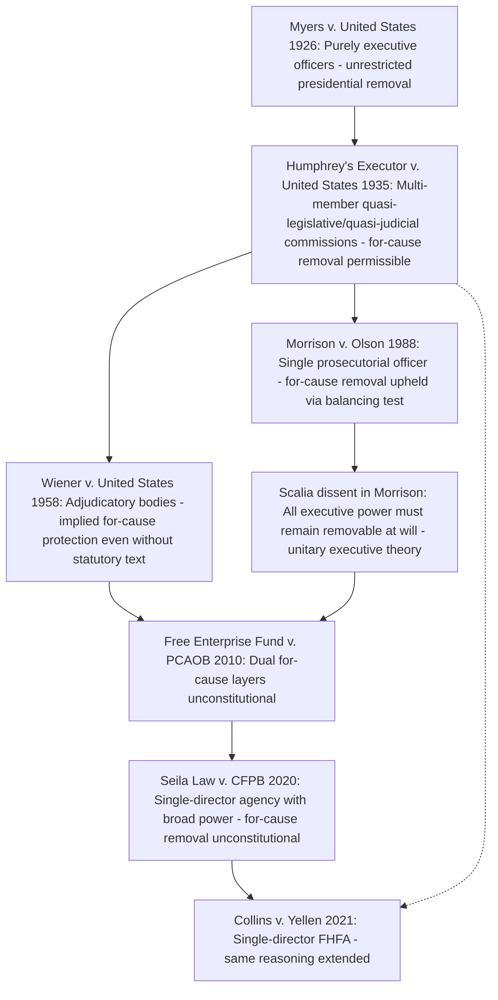

## Removal Power Historically: Myers v. United States and Humphrey's Executor

### Overview

The presidential removal power — the authority to dismiss executive branch officers — is not textually specified in the Constitution but has been inferred from Article II's vesting of "the executive Power" in the President and the Take Care Clause's command that the President "take Care that the Laws be faithfully executed." Two foundational Supreme Court decisions, *Myers v. United States* (1926) and *Humphrey's Executor v. United States* (1935), established the historical framework governing this power, and their uneasy coexistence has structured nearly a century of separation-of-powers litigation over independent agencies, culminating in the modern refinements of *Seila Law v. CFPB* (2020) and *Collins v. Yellen* (2021).

### The Textual Gap and the "Decision of 1789"

**Key Points**

- The Constitution expressly addresses appointment (Article II, Section 2) but says nothing directly about removal, creating an interpretive gap resolved primarily through structural inference and early historical practice.
- The First Congress's debate over the removal power for the Secretary of Foreign Affairs, sometimes called the "Decision of 1789," is frequently cited as evidence that the founding generation understood the President to possess an inherent removal power over principal executive officers, though historians and jurists dispute the precise scope and unanimity of that understanding. [Inference: the weight given to the Decision of 1789 varies significantly among originalist and non-originalist jurists, and it functions more as persuasive historical evidence than as binding textual command.]
- Two competing structural theories have shaped the doctrine: the "unitary executive" view (the President must retain plenary removal power over all officers exercising executive power, since Article II vests all executive power in a single President) and the "functionalist" view (Congress may create insulated, expert, multi-member bodies performing quasi-legislative and quasi-judicial functions without full presidential removal control).

### Myers v. United States (1926)

Arose from President Wilson's removal of a postmaster (an executive officer under the Post Office Department) without first obtaining Senate consent, as required by an 1876 statute that conditioned removal of certain postmasters on Senate advice and consent.

**Key Points**

- Chief Justice Taft's majority opinion (a former President himself) held the statute unconstitutional, reasoning that the President's power to remove purely executive officers is a necessary incident of the executive power vested in Article II and cannot be conditioned on Senate approval.
- The opinion reasoned expansively: because the President is responsible for the faithful execution of the laws, he must have the power to remove subordinates who assist him in that function, and Congress cannot burden this power by requiring Senate consent for removal, even though Senate consent is required for appointment.
- *Myers* is frequently read as endorsing a broad, largely unconditional presidential removal power over executive officers, sweeping in dicta well beyond the narrow postmaster context actually at issue.
- Justices Holmes, Brandeis, and McReynolds dissented, with Brandeis's dissent in particular emphasizing Congress's Article I authority to structure offices it creates, including conditioning removal.

### Humphrey's Executor v. United States (1935)

Arose from President Franklin Roosevelt's removal of Federal Trade Commission (FTC) Commissioner William Humphrey for policy disagreements, notwithstanding a statute providing that FTC commissioners could be removed by the President only for "inefficiency, neglect of duty, or malfeasance in office."

**Key Points**

- The Supreme Court unanimously upheld the for-cause removal restriction, sharply distinguishing *Myers* rather than overruling it.
- The Court characterized the FTC as exercising quasi-legislative and quasi-judicial functions (rulemaking and adjudication in aid of Congress's and the courts' respective functions) rather than purely executive functions, reasoning that Congress may insulate officers performing such hybrid functions from unrestricted presidential removal to preserve their independence and expertise.
- The opinion narrowed *Myers* to its facts: *Myers* controls removal of "purely executive" officers (like the postmaster), while *Humphrey's Executor* controls removal of officers at agencies Congress has structured as independent, multi-member, expert bodies performing adjudicatory and rulemaking functions.
- This "quasi-legislative/quasi-judicial versus purely executive" distinction became the doctrinal foundation for the modern independent agency, including bodies like the FTC, NLRB, SEC, and FCC, whose commissioners are traditionally removable only for cause.
- **Historical footnote of caution**: The characterization of independent agencies as engaged in "quasi-legislative" and "quasi-judicial" rather than executive functions has been criticized by later courts and commentators as descriptively inaccurate, since these agencies plainly exercise significant executive power (enforcement, prosecution, binding rule-making); this critique became central to the reasoning in *Seila Law* nearly a century later. [Inference: modern commentators broadly agree the quasi-legislative/quasi-judicial framing understates the executive character of independent agency functions, though *Humphrey's Executor* itself has not been overruled.]

### Reconciling Myers and Humphrey's Executor

**Key Points**

- The two cases are formally reconciled by function: purely executive officers (*Myers*) are subject to unrestricted presidential removal; officers at multi-member, expert, independent regulatory commissions performing adjudicatory and rulemaking functions (*Humphrey's Executor*) may be protected by for-cause removal restrictions.
- This functional line proved difficult to administer cleanly, since many independent agencies exercise executive-like enforcement authority alongside their adjudicatory and rulemaking functions, and the line between "purely executive" and "quasi-legislative/quasi-judicial" is not self-defining.
- *Wiener v. United States* (1958) extended *Humphrey's Executor*'s logic, holding that a member of the War Claims Commission (an adjudicatory body) could not be removed at will by the President even absent an express statutory for-cause removal provision, because the adjudicatory nature of the office itself implied a for-cause removal limitation consistent with the body's independent, quasi-judicial character.

### The Doctrine's Long Stability and Later Pressure

**Key Points**

- For roughly sixty years following *Humphrey's Executor*, the for-cause removal protection for multi-member independent agencies was treated as settled law, providing the constitutional foundation for the broader administrative state's independent commission model (FTC, SEC, NLRB, FCC, and similar bodies).
- *Morrison v. Olson* (1988) extended tolerance for removal restrictions even further, upholding for-cause removal protection for the independent counsel — a single individual performing law-enforcement (prosecutorial) functions, which are more clearly "purely executive" in character than the multi-member regulatory commissions at issue in *Humphrey's Executor*. The majority in *Morrison* de-emphasized the quasi-legislative/quasi-judicial categorization in favor of a more flexible balancing test asking whether the removal restriction unduly interferes with the President's ability to perform his constitutional duties.
- Justice Scalia's lone dissent in *Morrison* argued forcefully that all executive power, including law-enforcement functions performed by the independent counsel, must remain subject to unrestricted presidential removal, since Article II vests "the executive Power" (not "some of the executive power") in the President. This dissent became highly influential in later decades and is widely credited with providing the intellectual foundation for the unitary executive theory's judicial revival. [Inference: the direct citation and adoption of Scalia's *Morrison* dissent's reasoning in later majority opinions, discussed below, reflects a broad academic and judicial consensus that his position significantly shaped the doctrine's subsequent direction.]

### Modern Reassessment: Free Enterprise Fund, Seila Law, and Collins

**Key Points**

- *Free Enterprise Fund v. PCAOB* (2010) held that *dual* layers of for-cause removal protection (PCAOB members removable only for cause by the SEC, and SEC commissioners removable only for cause by the President) unconstitutionally insulated PCAOB members from presidential accountability, even though a single layer of for-cause protection might have been permissible under *Humphrey's Executor*-style reasoning. The Court severed the offending removal restriction rather than invalidating PCAOB's structure entirely.
- *Seila Law LLC v. CFPB* (2020) held that a single director heading an independent agency (the Consumer Financial Protection Bureau), removable only for cause, unconstitutionally insulated significant unilateral executive power from presidential control. The majority (Chief Justice Roberts) expressly declined to overrule *Humphrey's Executor* but confined it to multi-member, balanced commissions lacking rulemaking and enforcement power over ordinary Americans in the way the CFPB director possessed — explicitly treating the single-director-with-broad-power structure as meaningfully different from and more dangerous than the multi-member FTC structure in *Humphrey's Executor*.
- *Collins v. Yellen* (2021) extended *Seila Law*'s reasoning to the Federal Housing Finance Agency (FHFA), another single-director independent agency, reaffirming that single-headed agencies with substantial executive power are constitutionally distinguishable from the traditional multi-member commission model *Humphrey's Executor* addressed.
- Through this line of cases, the Court has narrowed *Humphrey's Executor* without overruling it: the case remains good law for its core holding regarding traditional multi-member expert commissions, but its reasoning is now treated with skepticism regarding the "quasi-legislative/quasi-judicial" characterization, and its application is confined away from single-director agencies wielding substantial unilateral executive power.

### Diagram: Doctrinal Evolution Timeline

### Structural Diagram: The Functional Distinction

<svg xmlns="http://www.w3.org/2000/svg" viewBox="0 0 760 440">
<text x="380" y="28" font-size="16" font-weight="bold" text-anchor="middle" fill="#1a1a1a">Myers vs. Humphrey's Executor Framework (svg_diagram)</text>
<rect x="40" y="55" width="320" height="130" rx="8" fill="#fee2e2" stroke="#991b1b" stroke-width="1.5" />
<text x="200" y="80" font-size="13" font-weight="bold" text-anchor="middle" fill="#7f1d1d">Myers v. United States (1926)</text>
<text x="200" y="102" font-size="11" text-anchor="middle" fill="#7f1d1d">Purely executive officer</text>
<text x="200" y="120" font-size="11" text-anchor="middle" fill="#7f1d1d">(postmaster)</text>
<text x="200" y="140" font-size="11" text-anchor="middle" fill="#7f1d1d">Unrestricted presidential</text>
<text x="200" y="158" font-size="11" text-anchor="middle" fill="#7f1d1d">removal power</text>
<text x="200" y="176" font-size="11" text-anchor="middle" fill="#7f1d1d">No Senate consent required</text>
<rect x="400" y="55" width="320" height="130" rx="8" fill="#dcfce7" stroke="#166534" stroke-width="1.5" />
<text x="560" y="80" font-size="13" font-weight="bold" text-anchor="middle" fill="#14532d">Humphrey's Executor (1935)</text>
<text x="560" y="102" font-size="11" text-anchor="middle" fill="#14532d">Multi-member commission</text>
<text x="560" y="120" font-size="11" text-anchor="middle" fill="#14532d">(FTC)</text>
<text x="560" y="140" font-size="11" text-anchor="middle" fill="#14532d">Quasi-legislative/judicial functions</text>
<text x="560" y="158" font-size="11" text-anchor="middle" fill="#14532d">For-cause removal permissible</text>
<text x="560" y="176" font-size="11" text-anchor="middle" fill="#14532d">Statutory cause required</text>
<rect x="40" y="210" width="680" height="80" rx="8" fill="#fef3c7" stroke="#92400e" stroke-width="1.5" />
<text x="380" y="235" font-size="13" font-weight="bold" text-anchor="middle" fill="#78350f">Modern Narrowing (Seila Law / Collins v. Yellen)</text>
<text x="380" y="258" font-size="11" text-anchor="middle" fill="#78350f">Humphrey's Executor confined to multi-member, balanced commissions</text>
<text x="380" y="276" font-size="11" text-anchor="middle" fill="#78350f">Single-director agencies with broad power treated as Myers-like</text>
<rect x="40" y="310" width="680" height="110" rx="8" fill="#f9fafb" stroke="#6b7280" stroke-width="1" />
<text x="380" y="335" font-size="13" font-weight="bold" text-anchor="middle" fill="#1a1a1a">Key Distinguishing Factors</text>
<text x="60" y="358" font-size="11" fill="#1a1a1a">Single officer vs. multi-member balanced body</text>
<text x="60" y="378" font-size="11" fill="#1a1a1a">Scope of unilateral power exercised over regulated parties</text>
<text x="60" y="398" font-size="11" fill="#1a1a1a">Degree of insulation: single vs. dual for-cause layers (Free Enterprise Fund)</text>
</svg>

### Environmental and Administrative Law Applications

**Key Points**

- **EPA Administrator**: The EPA Administrator is a single official removable at will by the President (no statutory for-cause protection), placing this office squarely within the *Myers* "purely executive" category rather than raising *Humphrey's Executor* concerns; this structure has generally not been the subject of removal-power litigation for that reason.
- **Multi-member environmental and energy commissions**: Bodies such as the Federal Energy Regulatory Commission (FERC) and the Nuclear Regulatory Commission (NRC) are structured as traditional multi-member independent commissions with staggered terms and for-cause removal protections, fitting the classic *Humphrey's Executor* model; their continued constitutional stability depends on remaining within the "multi-member, balanced commission" category the *Seila Law* Court preserved rather than drifting toward single-director structures.
- **Post-Seila Law scrutiny of environmental agency structures**: Any future statutory redesign converting a multi-member environmental commission into a single-administrator model with broad, unilateral enforcement or rulemaking power would raise the same constitutional concerns articulated in *Seila Law* and *Collins v. Yellen*, since such a structure would no longer resemble the balanced, deliberative commission model *Humphrey's Executor* upheld. [Inference: no environmental agency has yet been the direct subject of a *Seila Law*-style challenge, but the doctrinal framework would apply identically if such a restructuring occurred.]
- **State environmental agencies**: State constitutional analogues to the federal removal-power doctrine vary considerably by state constitution and are not directly governed by the federal *Myers*/*Humphrey's Executor* line, though state courts sometimes look to federal separation-of-powers reasoning as persuasive authority.

### Illustrative Hypothetical Analysis

**Example**

*Scenario*: Congress creates a new "Environmental Data Integrity Board" as a single-administrator agency (not a multi-member commission) with authority to unilaterally issue binding enforcement orders against companies for environmental data falsification, removable by the President only for "inefficiency, neglect of duty, or malfeasance in office" — language taken directly from the FTC Act provision at issue in *Humphrey's Executor*.

*Analysis*:

1. **Is this closer to Myers or Humphrey's Executor?** The single-administrator structure, standing alone, does not automatically place the office in the *Myers* category, but *Seila Law* teaches that single-director agencies wielding substantial unilateral executive power (unilateral enforcement authority over private parties, as here) are treated differently from the traditional multi-member commission model even when the removal statute uses identical "inefficiency, neglect of duty, or malfeasance" language.
2. **Application of Seila Law**: Because this Board is headed by a single administrator (not a multi-member, politically balanced commission) and exercises binding enforcement power directly against regulated parties, the structure closely parallels the CFPB director struck down in *Seila Law* rather than the FTC commissioners upheld in *Humphrey's Executor*.
3. **Conclusion**: The for-cause removal restriction on this single administrator would likely be held unconstitutional under *Seila Law*'s reasoning, notwithstanding the statute's use of *Humphrey's Executor*-derived removal language, because the structural feature the Court now treats as decisive is the single-director/unilateral-power combination, not the specific removal-for-cause phrasing.

### Related Topics

- Modern removal doctrine refinements: *Free Enterprise Fund v. PCAOB*, *Seila Law v. CFPB*, *Collins v. Yellen*
- The Appointments Clause: principal officers, inferior officers, and employees
- The unitary executive theory and its academic and judicial development
- *Morrison v. Olson* and independent counsel structures
- Multi-member independent agency design: FTC, NLRB, SEC, FERC, NRC
- Private nondelegation doctrine and its structural relationship to removal-power accountability concerns
- Congressional power to structure agencies under Article I, Section 8's Necessary and Proper Clause
- Comparative state constitutional separation-of-powers doctrines governing agency removal