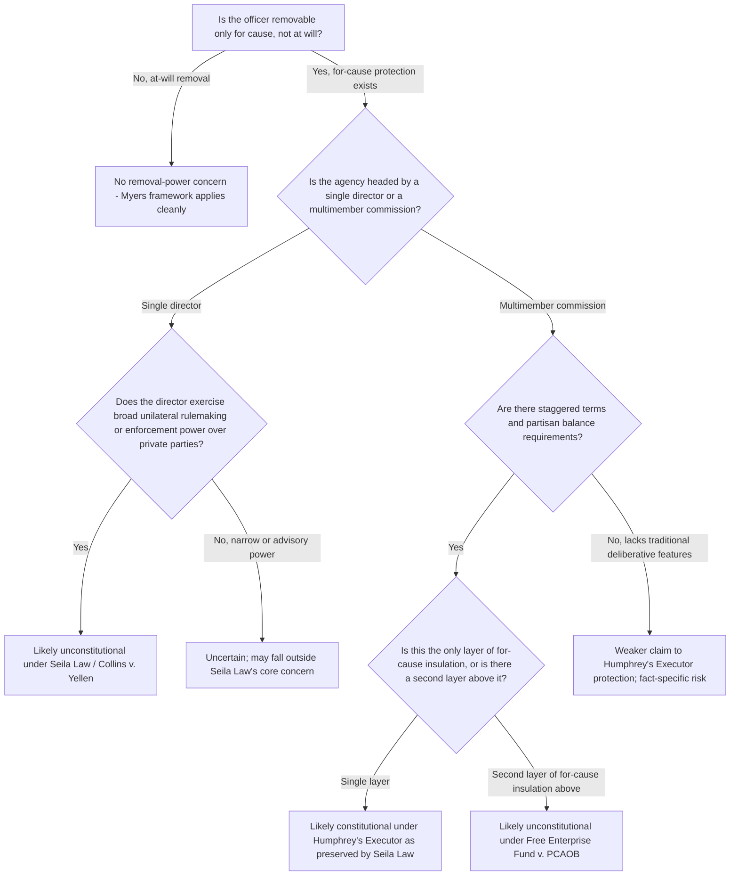

## Structural Protections for Multimember Independent Commissions

### Overview

Multimember independent commissions occupy a distinct constitutional category within the administrative state: bodies like the FTC, SEC, NLRB, FCC, FERC, and CPSC are structured with several commissioners, staggered terms, partisan balance requirements, and for-cause removal protections designed to insulate their decision-making from direct presidential control. This structural model, rooted in *Humphrey's Executor v. United States* (1935), has survived — though in narrowed form — the modern removal-power revival led by *Seila Law v. CFPB* (2020) and *Collins v. Yellen* (2021). Understanding why multimember commissions remain constitutionally distinguishable from single-director agencies is central to contemporary agency-design analysis.

### The Core Structural Features

**Key Points**

- **Multiple members**: Typically three, five, or seven commissioners, preventing concentration of unilateral authority in a single individual.
- **Staggered, fixed terms**: Commissioner terms are staggered so that no single President can appoint an entire commission's membership within one term, promoting continuity and insulating the body from complete turnover with each administration.
- **Partisan balance requirements**: Many statutes cap the number of commissioners who may belong to the same political party (e.g., no more than a bare majority from one party), a design feature intended to promote deliberative, less partisan decision-making.
- **For-cause removal protection**: Commissioners are typically removable by the President only for "inefficiency, neglect of duty, or malfeasance in office" (the formulation from the FTC Act at issue in *Humphrey's Executor*) or similar statutory language, rather than at will.
- **Collective, deliberative decision-making**: Commission action typically requires a majority vote of a quorum, embedding deliberation and requiring consensus-building rather than unilateral decision by a single officer.

### Constitutional Foundation: Humphrey's Executor v. United States (1935)

**Key Points**

- Upheld for-cause removal protection for FTC commissioners, distinguishing *Myers v. United States* (1926) (which had upheld unrestricted presidential removal of a purely executive postmaster) on the ground that the FTC exercises "quasi-legislative" and "quasi-judicial" functions rather than purely executive functions.
- Reasoned that Congress may create expert, deliberative bodies exercising rulemaking and adjudicatory functions "in aid of" Congress and the courts, respectively, and that such bodies require a measure of independence from at-will presidential removal to fulfill their function properly.
- Established the doctrinal foundation for the entire independent-commission model of administrative governance that has persisted for roughly ninety years, even as the underlying "quasi-legislative/quasi-judicial" characterization has drawn sustained criticism as inaccurate to how these agencies actually function (they plainly exercise executive power in enforcement and rule-implementation).

### The Modern Narrowing: Seila Law and Collins v. Yellen

**Key Points**

- *Seila Law LLC v. CFPB* (2020) confronted a *single*-director independent agency (the CFPB) with broad unilateral rulemaking and enforcement power, removable by the President only for cause. The majority held this structure unconstitutional, expressly declining to overrule *Humphrey's Executor* but confining it to the traditional multimember commission model.
- The Court's reasoning drew a sharp distinction: a multimember commission requires internal deliberation and consensus among commissioners with staggered terms and partisan balance, diffusing power and reducing the risk that any single unaccountable individual wields unchecked authority — a structural safeguard entirely absent when power is concentrated in one director.
- *Collins v. Yellen* (2021) reinforced this distinction, applying the same reasoning to the single-director Federal Housing Finance Agency (FHFA) and confirming that *Seila Law*'s holding was not limited to the CFPB's particular statutory design.
- **Resulting rule**: Traditional multimember, politically balanced, staggered-term independent commissions remain within *Humphrey's Executor*'s protection; single-director agencies wielding substantial unilateral executive power do not, regardless of whether the removal-restriction statutory language is identical.

### Why Multimember Structure Matters Constitutionally

**Key Points**

1. **Diffusion of power**: No single commissioner can act unilaterally; action requires majority agreement, reducing the risk any one individual becomes an unaccountable locus of executive power.
2. **Political balance as an internal check**: Partisan-balance requirements ensure no single party's appointees can dominate the commission's agenda without at least some cross-party engagement, functioning as an internal accountability mechanism distinct from direct presidential control.
3. **Staggered terms limit presidential capture**: Because terms are staggered, a President typically cannot replace an entire commission within a single term, preserving institutional continuity and expertise but also limiting the speed with which any single administration can reshape the body's composition and policy direction.
4. **Deliberative process substitutes for direct accountability**: The theory underlying *Humphrey's Executor* (and preserved in *Seila Law*) is that internal deliberation among a diverse, balanced group of commissioners serves as a partial substitute for the political accountability that direct presidential removal would otherwise provide.

### Free Enterprise Fund v. PCAOB (2010): The Dual-Layer Problem

Although PCAOB itself is technically structured with multiple members (five), this case illustrates a distinct structural pathology relevant to commission design: layered insulation from removal.

**Key Points**

- PCAOB members were removable only for cause by the SEC, and SEC commissioners were themselves removable only for cause by the President — creating two layers of for-cause protection stacked on top of each other.
- The Court held this dual-layer structure unconstitutional, reasoning that each additional layer of insulation from presidential control further attenuates accountability, and that the President must retain the ability to remove at least one layer of officials at will to maintain a functional chain of political accountability.
- The remedy was severance: the Court struck the for-cause removal restriction on PCAOB members (rendering them removable by the SEC at will) while leaving the rest of the Sarbanes-Oxley Act's PCAOB structure, including its multimember commission format, intact.
- **Key lesson for commission design**: Even a properly structured multimember commission can raise separate constitutional problems if it sits beneath another layer of insulated appointees, illustrating that multimember structure alone does not immunize an agency from all removal-power scrutiny — the layering problem is analytically distinct from the single-director problem in *Seila Law*.

### Comparative Structural Analysis

**Key Points**

- **Traditional multimember commission (constitutionally secure post-Seila Law)**: FTC, SEC, NLRB, FCC — multiple commissioners, staggered terms, partisan balance, single layer of for-cause protection directly from the President.
- **Single-director agency (constitutionally vulnerable post-Seila Law)**: CFPB (pre-*Seila Law* structure), FHFA — one administrator with broad unilateral power, for-cause removal, no internal deliberative check.
- **Dual-layered structure (constitutionally vulnerable post-Free Enterprise Fund)**: PCAOB as originally structured — multimember at one level, but insulated behind another layer of for-cause-protected officials (SEC commissioners).
- **At-will single officer (never at constitutional risk under removal doctrine)**: EPA Administrator — single official, removable at will, raising no *Humphrey's Executor*-line concerns at all because there is no removal restriction to challenge.

### Diagram: Structural Vulnerability Analysis

### Structural Diagram: Commission Design Safeguards

<svg xmlns="http://www.w3.org/2000/svg" viewBox="0 0 760 460">
<text x="380" y="28" font-size="16" font-weight="bold" text-anchor="middle" fill="#1a1a1a">Multimember Commission Structural Safeguards (svg_diagram)</text>
<rect x="230" y="55" width="300" height="70" rx="8" fill="#dbeafe" stroke="#1e40af" stroke-width="1.5" />
<text x="380" y="85" font-size="13" font-weight="bold" text-anchor="middle" fill="#1e3a8a">President</text>
<text x="380" y="105" font-size="11" text-anchor="middle" fill="#1e3a8a">Removal only for cause</text>
<line x1="380" y1="125" x2="380" y2="160" stroke="#1a1a1a" stroke-width="2" marker-end="url(#arrowB)" />
<rect x="120" y="160" width="520" height="140" rx="8" fill="#dcfce7" stroke="#166534" stroke-width="1.5" />
<text x="380" y="185" font-size="13" font-weight="bold" text-anchor="middle" fill="#14532d">Multimember Commission</text>
<circle cx="200" cy="230" r="30" fill="#fef3c7" stroke="#92400e" stroke-width="1.5" />
<text x="200" y="235" font-size="10" text-anchor="middle" fill="#78350f">Comm. A</text>
<circle cx="300" cy="230" r="30" fill="#fef3c7" stroke="#92400e" stroke-width="1.5" />
<text x="300" y="235" font-size="10" text-anchor="middle" fill="#78350f">Comm. B</text>
<circle cx="400" cy="230" r="30" fill="#fef3c7" stroke="#92400e" stroke-width="1.5" />
<text x="400" y="235" font-size="10" text-anchor="middle" fill="#78350f">Comm. C</text>
<circle cx="500" cy="230" r="30" fill="#fef3c7" stroke="#92400e" stroke-width="1.5" />
<text x="500" y="235" font-size="10" text-anchor="middle" fill="#78350f">Comm. D</text>
<circle cx="580" cy="230" r="30" fill="#fef3c7" stroke="#92400e" stroke-width="1.5" />
<text x="580" y="235" font-size="10" text-anchor="middle" fill="#78350f">Comm. E</text>

<text x="380" y="280" font-size="10" text-anchor="middle" fill="`#14532d`">Staggered terms · Partisan balance · Majority vote required</text>

<rect x="30" y="320" width="700" height="120" rx="8" fill="#f9fafb" stroke="#6b7280" stroke-width="1" />
<text x="380" y="345" font-size="13" font-weight="bold" text-anchor="middle" fill="#1a1a1a">Why This Survives Seila Law</text>
<text x="60" y="370" font-size="11" fill="#1a1a1a">No single commissioner can act unilaterally — decision requires majority agreement</text>
<text x="60" y="392" font-size="11" fill="#1a1a1a">Partisan balance and staggered terms diffuse power across time and party lines</text>
<text x="60" y="414" font-size="11" fill="#1a1a1a">Single layer of for-cause protection (contrast: Free Enterprise Fund's dual-layer problem)</text>
</svg>

### Environmental and Administrative Law Applications

**Key Points**

- **FERC (Federal Energy Regulatory Commission)**: Structured as a traditional five-member, staggered-term, partisan-balanced independent commission with for-cause removal protection — a paradigmatic *Humphrey's Executor*-model body whose environmental and energy-infrastructure regulatory authority (pipeline certification, wholesale electricity rate regulation, and increasingly climate-related grid policy) benefits from the structural protections preserved by *Seila Law*.
- **Nuclear Regulatory Commission (NRC)**: Similarly structured as a five-member commission with staggered terms, exercising licensing and safety-regulatory authority over nuclear facilities; its multimember, deliberative structure places it within the constitutionally secure category.
- **Chemical Safety and Hazard Investigation Board (CSB)**: A small multimember independent investigative board; its structure and functions (investigation and recommendation rather than binding enforcement) present a comparatively lower removal-power risk profile even considered independently of the commission-structure analysis, since it lacks the unilateral coercive power that concerned the *Seila Law* Court.
- **Contrast with EPA**: The EPA Administrator's single-official, at-will-removable structure means EPA regulatory action does not implicate this line of doctrine at all — the constitutional question in this area arises specifically for agencies Congress has chosen to insulate via for-cause removal, which EPA's leadership structure does not include.
- **Design implications for future environmental agency legislation**: Any statutory proposal to create a new independent environmental regulatory body with removal protection should adopt the traditional multimember, staggered-term, partisan-balanced format to remain within *Humphrey's Executor*'s preserved scope, and should avoid layering a second tier of for-cause-protected officials above or below the commission in a way that would trigger *Free Enterprise Fund* concerns.

### Illustrative Hypothetical Analysis

**Example**

*Scenario*: Congress creates a "National Environmental Standards Commission" with five members serving staggered five-year terms, no more than three from the same political party, removable by the President only for "inefficiency, neglect of duty, or malfeasance in office," empowered to set binding national emissions standards by majority vote.

*Analysis*:

1. **Multimember structure**: Present — five commissioners with staggered terms and partisan-balance requirements, tracking the traditional *Humphrey's Executor* model closely.
2. **Single layer of insulation**: Present — commissioners are removable directly by the President for cause; there is no second layer of insulated officials sitting above or controlling the commission's own removability, avoiding the *Free Enterprise Fund* dual-layer problem.
3. **Deliberative, majority-vote decision-making**: Present — binding standards require majority vote rather than unilateral action by a single administrator, distinguishing this structure from the CFPB director model rejected in *Seila Law*.
4. **Conclusion**: This structure closely tracks the traditional multimember independent commission model *Humphrey's Executor* protected and *Seila Law* expressly preserved; the for-cause removal restriction is likely constitutional, notwithstanding the commission's significant binding regulatory authority, because the structural safeguards (multimember composition, staggered terms, partisan balance, single-layer insulation) are precisely the features the Court has treated as constitutionally distinguishing factors.

### Related Topics

- Removal power historically: *Myers v. United States* and *Humphrey's Executor*
- Modern removal doctrine: *Free Enterprise Fund v. PCAOB*, *Seila Law v. CFPB*, *Collins v. Yellen*
- The Appointments Clause: principal officers, inferior officers, and employees
- Recess appointments and their constitutional limits
- The unitary executive theory and its structural critique of independent agencies
- Quorum requirements and validity of agency action by improperly constituted commissions
- Private nondelegation doctrine and its structural relationship to accountability concerns
- Comparative agency design: single-administrator versus multimember commission models in federal environmental law