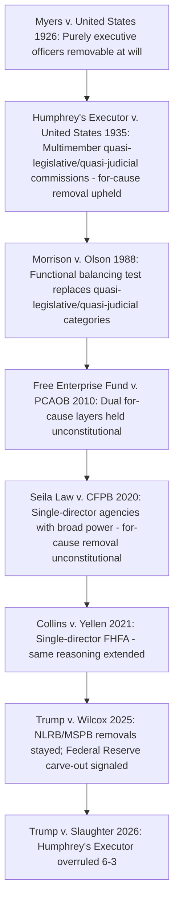

## Trump v. Slaughter and the Overruling of Humphrey's Executor

### Overview

*Trump v. Slaughter* is the 2026 Supreme Court decision that overruled *Humphrey's Executor v. United States* (1935), eliminating the constitutional basis for for-cause removal protections applied to multimember independent commissions like the Federal Trade Commission. Decided 6–3, the case resolves nearly a century of doctrinal tension between *Myers v. United States* (1926) and *Humphrey's Executor*, and marks the culmination of a fifteen-year line of removal-power cases (*Free Enterprise Fund*, *Seila Law*, *Collins v. Yellen*) that had progressively narrowed *Humphrey's Executor* before this decision eliminated it outright. [Unverified: this topic concerns a decision issued after standard pre-training knowledge cutoffs; the summary below is synthesized from contemporaneous reporting and primary-source excerpts located via web search, and practitioners should verify pin cites and exact quotations against the official U.S. Reports citation once available.]

### Factual and Procedural Background

**Key Points**

- Shortly after beginning his second term in January 2025, President Trump removed FTC Commissioners Rebecca Slaughter and Alvaro Bedoya, both Democratic appointees, without identifying any statutory cause for removal.
- The President instead stated their continued service was "inconsistent with [his] Administration's priorities" and invoked his removal authority "pursuant to [his] authority under Article II of the Constitution," rather than citing "inefficiency, neglect of duty, or malfeasance in office" as required by the FTC Act's removal provision.
- Slaughter sued, arguing the removal was ultra vires, violated the Administrative Procedure Act, and violated the Constitution; the U.S. District Court for the District of Columbia (Judge Loren AliKhan) granted summary judgment in her favor, holding *Humphrey's Executor* squarely controlled and issuing a permanent injunction barring interference with her performance of her FTC duties.
- A divided D.C. Circuit panel denied a stay pending appeal, holding the government had "no prospect of success on appeal" given *Humphrey's Executor*; Judge Rao dissented.
- The Supreme Court stayed the district court's order (allowing the removal to take effect during litigation) and granted certiorari before judgment, bypassing full court of appeals review, on two questions: (1) whether the FTC's removal protections violate separation of powers and, if so, whether *Humphrey's Executor* should be overruled; and (2) whether a federal court may prevent a person's removal from public office through equitable or legal relief.

### The Doctrinal Path to Slaughter

**Key Points**

- *Myers v. United States* (1926): established that the President generally may remove purely executive officers at will, an incident of the Article II executive power.
- *Humphrey's Executor v. United States* (1935): carved out an exception, holding that Congress could protect commissioners of multimember "expert" agencies like the FTC — characterized as exercising "quasi-legislative" and "quasi-judicial" rather than purely executive functions — from at-will removal.
- *Morrison v. Olson* (1988): substantially abandoned the quasi-legislative/quasi-judicial categorical test in favor of a functional balancing inquiry asking whether a removal restriction unduly impedes the President's ability to perform his constitutional duties.
- *Free Enterprise Fund v. PCAOB* (2010): held that stacking two layers of for-cause removal protection (PCAOB members insulated from the SEC, SEC commissioners insulated from the President) unconstitutionally diluted presidential accountability.
- *Seila Law v. CFPB* (2020): held that a single director heading an agency with substantial unilateral executive power could not be insulated by for-cause removal, distinguishing *Humphrey's Executor* as limited to multimember commissions.
- *Collins v. Yellen* (2021): extended *Seila Law*'s reasoning to the single-director Federal Housing Finance Agency.
- *Trump v. Wilcox* (2025): in an unsigned, two-page order, the Court stayed a district court injunction protecting removed members of the NLRB and Merit Systems Protection Board, reasoning the government was likely to show both agencies "exercise considerable executive power," while simultaneously carving out apparent protection for the Federal Reserve as a "uniquely structured, quasi-private entity" tracing to the First and Second Banks of the United States — widely read by commentators as a signal that *Humphrey's Executor* was in its final days for ordinary multimember commissions.

### The Holding in Trump v. Slaughter

**Key Points**

- By a 6–3 vote, the Court held the FTC's statutory for-cause removal protection unconstitutional and overruled *Humphrey's Executor*.
- Chief Justice Roberts wrote the majority opinion, joined by Justices Alito, Gorsuch, Kavanaugh, Barrett, and (in large part) Thomas.
- The majority's central formulation: "Humphrey's framework, in short, has not withstood the test of time," concluding that "if anything more is left of Humphrey's, we overrule it," while preserving only the narrowest residual observation from that decision — that an agency "exercis[ing] no part of the executive power" need not fall within the general rule of presidential removal.
- The opinion grounded its reasoning in the history, text, and structure of Article II, concluding that the President must be able to remove principal officers who exercise executive power in order to remain politically accountable for the execution of the laws, tracing this structural logic back through the Framers' rejection of diffuse, unaccountable executive models.
- Justice Gorsuch wrote a concurrence emphasizing that overruling *Humphrey's Executor* "doesn't cure every constitutional disease in the administrative state" but instead "reallocates the power Congress poured into independent agencies," reasoning that if agencies possess vast legislative and judicial authority, the proper remedy is restoring those powers to Congress rather than shielding them from presidential control via insulated commissions.
- Three Justices dissented [Unverified: specific dissenting authorship and full reasoning were not confirmed in available search results at time of writing; practitioners should confirm dissent authorship against the official opinion].

### What Survives of the Prior Framework

**Key Points**

- The Court's removal-power jurisprudence leading into *Slaughter* had already reduced *Humphrey's Executor* to two narrow exceptions to the President's general removal authority: the multimember-commission exception itself (now eliminated) and a separate *Perkins*-derived exception allowing Congress to grant tenure protections to certain inferior officers with narrowly defined duties.
- The residual language preserved in *Slaughter* — that an entity "exercis[ing] no part of the executive power" falls outside the general removal rule — appears to leave a narrow theoretical category for bodies that are not meaningfully executive in character at all, though the Court did not specify what, if anything, occupies that category post-*Slaughter*.
- The Federal Reserve's removal protections were not directly at issue in *Slaughter*; a related case, *Trump v. Cook* (concerning the removal of a Federal Reserve Governor), was pending separately, with the Court declining to stay the district court's order protecting the officer and scheduling argument for January 2026, suggesting the majority may treat the Federal Reserve as distinguishable on historical or structural grounds even after *Slaughter*. [Unverified: the outcome of *Trump v. Cook* was not resolved in available sources as of this writing and should be checked directly.]
- The inferior-officer/*Perkins* exception was not disturbed by *Slaughter*'s holding, meaning Congress may still be able to grant removal protections to certain inferior officers with narrowly defined duties, distinct from principal officers heading multimember commissions.

### The Second Question Presented: Remedies for Wrongful Removal

**Key Points**

- The Court also addressed whether federal courts may prevent removal from public office through equitable relief (injunction) or legal relief, rather than limiting removed officers to back pay.
- Historically, removed officers such as the petitioners in *Perkins*, *Myers*, and *Humphrey's Executor* itself sought back pay rather than reinstatement; more recent litigants have sought injunctions restoring them to active office pending litigation.
- The Court's approach in *Trump v. Wilcox* — staying a reinstatement injunction on the reasoning that the government faces greater harm from an improperly removed officer continuing to exercise executive power than a wrongfully removed officer faces from temporary exclusion — signaled skepticism toward injunctive reinstatement remedies for principal officers, a position commentators anticipated would carry into *Slaughter*'s remedial holding. [Unverified: the precise remedial holding in *Slaughter* itself was not fully confirmed in available search results and should be verified against the opinion's remedy section.]
- Civil service employees generally are not affected by this remedial question to the same degree, since the Civil Service Reform Act of 1978 provides independent statutory remedies (Merit Systems Protection Board appeal, reinstatement, and back pay) that do not depend on courts' equitable removal-remedy powers.

### Diagram: Doctrinal Timeline to Slaughter

### Structural Diagram: Before and After Slaughter

<svg xmlns="http://www.w3.org/2000/svg" viewBox="0 0 760 420">
<text x="380" y="28" font-size="16" font-weight="bold" text-anchor="middle" fill="#1a1a1a">Removal Power Before and After Trump v. Slaughter (svg_diagram)</text>
<rect x="30" y="55" width="340" height="150" rx="8" fill="#dcfce7" stroke="#166534" stroke-width="1.5" />
<text x="200" y="80" font-size="13" font-weight="bold" text-anchor="middle" fill="#14532d">Before Slaughter</text>
<text x="200" y="105" font-size="11" text-anchor="middle" fill="#14532d">Multimember commissions (FTC, NLRB, SEC)</text>
<text x="200" y="123" font-size="11" text-anchor="middle" fill="#14532d">protected by for-cause removal</text>
<text x="200" y="145" font-size="11" text-anchor="middle" fill="#14532d">under Humphrey's Executor exception</text>
<text x="200" y="167" font-size="11" text-anchor="middle" fill="#14532d">Single-director agencies (CFPB, FHFA)</text>
<text x="200" y="185" font-size="11" text-anchor="middle" fill="#14532d">already stripped of protection (Seila Law)</text>
<rect x="390" y="55" width="340" height="150" rx="8" fill="#fee2e2" stroke="#991b1b" stroke-width="1.5" />
<text x="560" y="80" font-size="13" font-weight="bold" text-anchor="middle" fill="#7f1d1d">After Slaughter</text>
<text x="560" y="105" font-size="11" text-anchor="middle" fill="#7f1d1d">Humphrey's Executor overruled</text>
<text x="560" y="123" font-size="11" text-anchor="middle" fill="#7f1d1d">Multimember commissions lose</text>
<text x="560" y="141" font-size="11" text-anchor="middle" fill="#7f1d1d">categorical for-cause protection</text>
<text x="560" y="163" font-size="11" text-anchor="middle" fill="#7f1d1d">Narrow residual: entities exercising</text>
<text x="560" y="181" font-size="11" text-anchor="middle" fill="#7f1d1d">"no part of the executive power"</text>
<rect x="30" y="225" width="700" height="80" rx="8" fill="#fef3c7" stroke="#92400e" stroke-width="1.5" />
<text x="380" y="250" font-size="13" font-weight="bold" text-anchor="middle" fill="#78350f">Open Questions Post-Slaughter</text>
<text x="380" y="272" font-size="11" text-anchor="middle" fill="#78350f">Federal Reserve status (Trump v. Cook, pending) · Inferior-officer / Perkins exception</text>
<text x="380" y="290" font-size="11" text-anchor="middle" fill="#78350f">Remedies: injunctive reinstatement vs. back pay for wrongfully removed officers</text>
<rect x="30" y="320" width="700" height="80" rx="8" fill="#f9fafb" stroke="#6b7280" stroke-width="1" />
<text x="380" y="345" font-size="13" font-weight="bold" text-anchor="middle" fill="#1a1a1a">Practical Effects Noted by Commentators</text>
<text x="380" y="367" font-size="11" text-anchor="middle" fill="#1a1a1a">Expanded ability to break agency quorums · Reduced insulation from partisan turnover</text>
<text x="380" y="385" font-size="11" text-anchor="middle" fill="#1a1a1a">Potential effects on independent-agency workforce retention and adjudicatory backlogs</text>
</svg>

### Environmental and Administrative Law Applications

**Key Points**

- **FERC and NRC**: These traditional multimember, staggered-term, partisan-balanced independent commissions — previously secure under *Humphrey's Executor* as preserved through *Seila Law* — lose their categorical for-cause removal protection following *Slaughter*, meaning commissioners are now presumptively removable by the President at will, absent some narrower doctrinal exception (e.g., an inferior-officer/*Perkins*-style argument, which is unlikely to apply to principal-officer commissioners) or a Federal Reserve-style historical carve-out that has not been extended to energy or nuclear regulators.
- **Practical consequence for agency quorums**: Commentators have specifically flagged that expanded removal power allows a President to break the quorum of adjudicatory multimember bodies by removing enough commissioners to leave the body unable to act — a concern directly relevant to bodies like FERC (which regularly adjudicates rate and certificate proceedings) and to any environmental adjudicatory board structured as a multimember commission, since parties awaiting decisions could face indefinite delay pending new appointments and confirmations. [Inference: this quorum-breaking concern was raised as anticipated fallout from narrowing or eliminating *Humphrey's Executor* generally, prior to and independent of the specific *Slaughter* holding, and its concrete application to environmental agencies specifically has not yet been litigated as of this writing.]
- **Reduced structural insulation from policy reversal**: Environmental and energy regulatory commissions' partisan-balance and staggered-term features — designed to prevent any single administration from immediately reshaping the body's composition and direction — are functionally weakened when the President can also remove sitting commissioners at will, independent of term expiration, even though those statutory structural features (staggered terms, partisan-balance requirements) remain on the books and are not themselves invalidated by *Slaughter*.
- **EPA unaffected directly**: Because the EPA Administrator has always been a single official removable at will (never subject to for-cause protection), *Slaughter* does not change EPA's leadership-removal analysis; its significance for environmental law lies primarily in its effect on adjacent multimember bodies like FERC, NRC, and any future environmentally focused independent commission Congress might consider creating.
- **Design implications going forward**: Legislative proposals to create new independent multimember environmental or energy regulatory bodies with for-cause removal protection now face a materially higher constitutional risk than before *Slaughter*, since the doctrinal foundation such protections previously relied upon (*Humphrey's Executor*) no longer exists as binding precedent.

### Illustrative Hypothetical Analysis

**Example**

*Scenario*: A sitting NRC commissioner, appointed for a staggered five-year term with statutory for-cause removal protection under the Energy Reorganization Act, is removed by the President without any statement of cause, for reasons of policy disagreement over nuclear licensing priorities.

*Analysis*:

1. **Pre-Slaughter posture**: Before *Slaughter*, this removal would have been analyzed under *Humphrey's Executor* as preserved by *Seila Law* — the NRC's traditional multimember, staggered-term, partisan-balanced structure would likely have placed it within the protected category, making an at-will removal without statutory cause unlawful.
2. **Post-Slaughter posture**: Following *Slaughter*'s overruling of *Humphrey's Executor*, the constitutional foundation for treating the NRC's for-cause removal statute as enforceable against the President has been eliminated; the commissioner would likely have no viable constitutional claim that the removal exceeded presidential authority, regardless of the statute's text, unless a narrower exception (Federal Reserve-style historical distinctiveness, or an inferior-officer argument) could be shown to apply — neither of which fits an NRC commissioner's role as a principal officer.
3. **Remedy consideration**: Even if the commissioner sued, *Slaughter*'s treatment of the remedy question (read alongside *Trump v. Wilcox*'s stay reasoning) suggests courts are unlikely to grant injunctive reinstatement pending litigation, leaving back pay (if any relief is available at all) as the more likely outcome.
4. **Conclusion**: This hypothetical illustrates the direct, practical shift *Slaughter* works on environmentally significant multimember commissions: statutory removal-for-cause language that was fully enforceable one term now provides little to no constitutional protection against at-will presidential removal.

### Practice Pointers

**Next Steps**

- Confirm the official U.S. Reports citation and full opinion text once published, and verify the precise vote breakdown, dissent authorship, and remedial holding against the primary source rather than secondary reporting.
- Track *Trump v. Cook* for the Court's treatment of the Federal Reserve's distinct historical status, since its resolution will clarify whether any meaningful multimember-commission exception survives *Slaughter*.
- For any client or agency with a for-cause removal statute (FERC, NRC, CPSC, and similar bodies), reassess enforceability of that protection in light of *Slaughter* before relying on it in litigation or agency-design counseling.
- Monitor lower-court and OLC guidance applying *Slaughter* to specific agencies, since the majority's residual "exercises no part of the executive power" language leaves open interpretive questions about which entities, if any, remain outside the general removal rule.

### Related Topics

- Removal power historically: *Myers v. United States* and *Humphrey's Executor* (pre-*Slaughter* doctrinal foundation)
- Structural protections for multimember independent commissions (now substantially reassessed post-*Slaughter*)
- *Free Enterprise Fund v. PCAOB*, *Seila Law v. CFPB*, and *Collins v. Yellen* as the doctrinal bridge to *Slaughter*
- *Trump v. Wilcox* and the Federal Reserve carve-out question
- *Trump v. Cook* and the pending Federal Reserve removal litigation
- The Appointments Clause: principal officers, inferior officers, and employees
- Quorum requirements and validity of multimember agency action after commissioner removals
- Civil service tenure protections and the Merit Systems Protection Board post-*Slaughter*
- The unitary executive theory as the animating framework for the majority opinion