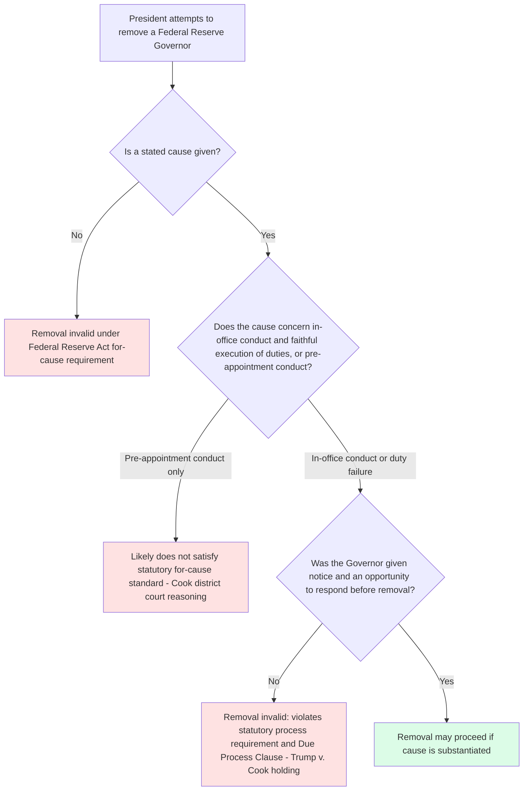

## Trump v. Cook and the Federal Reserve Removal Protection Carve-Out

### Overview

*Trump v. Cook* is the 2026 Supreme Court decision addressing whether, and under what conditions, the President may remove a member of the Federal Reserve Board of Governors under the Federal Reserve Act's "for cause" removal provision. Decided the same term as *Trump v. Slaughter* (which overruled *Humphrey's Executor v. United States* for ordinary multimember independent commissions), *Cook* is the vehicle through which the Court articulated a distinct constitutional treatment for the Federal Reserve, resting on the institution's historically unique structure rather than on the *Humphrey's Executor* framework the Court eliminated elsewhere. [Unverified: this topic concerns a decision issued after standard pre-training knowledge cutoffs; the summary below is synthesized from contemporaneous reporting, court filings, and primary-source excerpts located via web search. Practitioners should verify exact holdings, vote breakdown, and quotations against the official opinion.]

### Factual and Procedural Background

**Key Points**

- In August 2025, President Trump purported to remove Lisa Cook, a member of the Federal Reserve Board of Governors nominated by President Biden in 2023, making her the first Governor removed in the Federal Reserve's 111-year history.
- The stated basis for removal involved allegations, raised by Federal Housing Finance Agency Director Bill Pulte, that Cook had represented two different properties as her "primary residence" on mortgage documents around the same time — allegations of conduct predating her time in office; Cook was not charged with any crime, and she characterized the allegations as "flimsy," "unproven," and conveniently timed following the President's criticism of the Federal Reserve's policy decisions.
- Cook sued, arguing (1) the removal was not "for cause" as required by the Federal Reserve Act, particularly because the alleged conduct predated her appointment, and (2) she was denied constitutionally adequate process (notice and an opportunity to respond) before removal, in violation of the Fifth Amendment Due Process Clause.
- U.S. District Judge Jia Cobb issued a preliminary injunction on September 9, 2025, concluding Cook was likely to succeed on both her statutory "for cause" claim and her due process claim, reasoning that the best reading of the statute limits removal grounds to conduct concerning a Governor's behavior in office and faithful execution of statutory duties, not pre-appointment conduct.
- The D.C. Circuit denied the government's request to stay the injunction (2-1, with a later three-judge panel decision on September 15, 2025, in which two judges agreed Cook was likely to succeed on both claims and a third dissented).
- The case reached the Supreme Court on its emergency ("shadow" or "interim") docket, was argued January 21, 2026, and decided June 29, 2026 — the same day as, or closely coordinated with, *Trump v. Slaughter*.

### The Holding

**Key Points**

- By a 5–4 vote, the Court held that the Federal Reserve's for-cause removal protection for Board of Governors members is constitutional, resting on the Federal Reserve's historically unique independence from presidential control and its organic statute's structure (fixed terms, removal only for cause).
- The Court held that this statutory protection entitles a Governor to notice and some opportunity to respond before removal may be effective — meaning summary, process-free removal (as occurred here) does not satisfy the statute even where an asserted cause might otherwise be sufficient.
- The Court declined to stay the lower courts' preliminary injunction, permitting Cook to remain in office while the underlying merits litigation continues.
- Chief Justice Roberts's opinion emphasized that "any change in that scheme must come from Congress, not the courts," framing the decision as resting on respect for existing statutory structure and historical practice rather than announcing a new judicially created removal doctrine.
- The 5–4 alignment is narrower than the 6–3 majority in *Trump v. Slaughter*, indicating at least one Justice in the *Slaughter* majority treated the Federal Reserve as materially distinguishable from the FTC. [Unverified: specific vote alignment by Justice was not fully confirmed in available sources.]

### The Federal Reserve Carve-Out: Doctrinal Basis

**Key Points**

- The carve-out traces to language the Court used earlier, in the interim-docket order in *Trump v. Wilcox* (2025), describing the Federal Reserve as a "uniquely structured, quasi-private entity" that "follows in the distinct historical tradition of the First and Second Banks of the United States" — distinguishing it from ordinary executive-branch multimember commissions like the NLRB or FTC even before the Court had squarely addressed a Federal Reserve removal case.
- This historical-tradition rationale differs fundamentally from the *Humphrey's Executor* "quasi-legislative/quasi-judicial function" rationale that *Trump v. Slaughter* overruled: rather than asking whether the institution exercises executive versus legislative/judicial power, the Federal Reserve carve-out asks whether the institution has a distinctive constitutional lineage and quasi-private character that sets it apart from the ordinary administrative state altogether.
- Because the Federal Reserve's removal protections were not directly challenged as unconstitutional in *Cook* in the same posture as the FTC's were in *Slaughter* — the government's position reportedly did not squarely ask the Court to declare the Federal Reserve Act's removal provision unconstitutional in the same way it sought regarding the FTC Act — the Court's holding operated more through statutory interpretation and process requirements than through a fresh constitutional ruling striking down the removal protection.
- The practical result is that, unlike the FTC after *Slaughter*, the Federal Reserve Board of Governors retains enforceable for-cause removal protection, with the added requirement that removal be preceded by notice and an opportunity to respond — arguably a more robust due-process overlay than exists for other independent agencies' removal provisions historically.

### Relationship to Trump v. Slaughter and the Broader Removal-Power Line

**Key Points**

- *Slaughter* (overruling *Humphrey's Executor*) and *Cook* (preserving the Federal Reserve's protection) were decided in the same term and are best read together: the Court eliminated the general multimember-commission exception to at-will presidential removal while carving out the Federal Reserve specifically, based on its distinct historical character rather than reviving any part of the *Humphrey's Executor* framework generally.
- This sequencing confirms the pattern previewed in *Trump v. Wilcox* (2025), where the Court allowed removal of NLRB and Merit Systems Protection Board members to proceed while simultaneously flagging the Federal Reserve as different — commentators had read this as a strong signal that the Court intended to preserve Federal Reserve independence even while dismantling *Humphrey's Executor* for other agencies, a prediction *Cook* and *Slaughter* together appear to have confirmed.
- The Federal Reserve carve-out is narrow and institution-specific rather than a general principle available to other agencies: an agency cannot argue for *Humphrey's Executor*-style protection after *Slaughter*, and the *Cook* rationale (historical tradition tracing to the First and Second Banks of the United States) is not readily transferable to other multimember commissions like FERC, the NRC, or the SEC, which lack that specific lineage.
- Following the decision, President Trump indicated on social media that the case was "sent back... on a strictly procedural basis" and that he would "take appropriate action immediately," and subsequent reporting indicates the administration moved to pursue removal again, this time attempting to comply with the process requirements (or asserting a different cause) the Court's opinion described — an unresolved, ongoing dispute as of this writing. [Unverified: the ultimate outcome of this renewed removal attempt was not confirmed in available sources and should be checked for current status.]

### Diagram: Cook Analysis Structure

### Structural Diagram: The Federal Reserve Exception Within the Post-Slaughter Landscape

<svg xmlns="http://www.w3.org/2000/svg" viewBox="0 0 760 440">
<text x="380" y="28" font-size="16" font-weight="bold" text-anchor="middle" fill="#1a1a1a">The Federal Reserve Carve-Out Post-Slaughter (svg_diagram)</text>
<rect x="30" y="55" width="330" height="140" rx="8" fill="#fee2e2" stroke="#991b1b" stroke-width="1.5" />
<text x="195" y="80" font-size="13" font-weight="bold" text-anchor="middle" fill="#7f1d1d">Ordinary Independent Commissions</text>
<text x="195" y="102" font-size="11" text-anchor="middle" fill="#7f1d1d">FTC, NLRB, MSPB, CPSC</text>
<text x="195" y="124" font-size="11" text-anchor="middle" fill="#7f1d1d">Humphrey's Executor overruled</text>
<text x="195" y="146" font-size="11" text-anchor="middle" fill="#7f1d1d">(Trump v. Slaughter, 6-3)</text>
<text x="195" y="168" font-size="11" text-anchor="middle" fill="#7f1d1d">At-will removal now generally permitted</text>
<rect x="400" y="55" width="330" height="140" rx="8" fill="#dcfce7" stroke="#166534" stroke-width="1.5" />
<text x="565" y="80" font-size="13" font-weight="bold" text-anchor="middle" fill="#14532d">Federal Reserve Board of Governors</text>
<text x="565" y="102" font-size="11" text-anchor="middle" fill="#14532d">Unique historical tradition</text>
<text x="565" y="124" font-size="11" text-anchor="middle" fill="#14532d">(First and Second Banks lineage)</text>
<text x="565" y="146" font-size="11" text-anchor="middle" fill="#14532d">For-cause protection preserved</text>
<text x="565" y="168" font-size="11" text-anchor="middle" fill="#14532d">(Trump v. Cook, 5-4)</text>
<rect x="30" y="215" width="700" height="90" rx="8" fill="#fef3c7" stroke="#92400e" stroke-width="1.5" />
<text x="380" y="240" font-size="13" font-weight="bold" text-anchor="middle" fill="#78350f">Additional Cook Requirement</text>
<text x="380" y="262" font-size="11" text-anchor="middle" fill="#78350f">Notice and opportunity to respond required before removal is effective</text>
<text x="380" y="282" font-size="11" text-anchor="middle" fill="#78350f">"For cause" limited to in-office conduct, not pre-appointment conduct (lower court reasoning)</text>
<rect x="30" y="320" width="700" height="100" rx="8" fill="#f9fafb" stroke="#6b7280" stroke-width="1" />
<text x="380" y="345" font-size="13" font-weight="bold" text-anchor="middle" fill="#1a1a1a">Key Distinction from Ordinary Removal Doctrine</text>
<text x="380" y="368" font-size="11" text-anchor="middle" fill="#1a1a1a">Not based on quasi-legislative/quasi-judicial function (the overruled Humphrey's rationale)</text>
<text x="380" y="388" font-size="11" text-anchor="middle" fill="#1a1a1a">Based instead on distinct historical/structural tradition specific to the central bank</text>
</svg>

### Significance for Agency Design Analysis

**Key Points**

- *Cook* demonstrates that the elimination of *Humphrey's Executor* in *Slaughter* did not eliminate all forms of removal protection across the administrative state; it eliminated the *general* multimember-commission rationale while leaving room for institution-specific historical arguments.
- The decision reinforces that "independence" for the Federal Reserve is now understood as resting on a distinct constitutional foundation from other independent agencies, meaning practitioners cannot analogize other multimember commissions to the Federal Reserve simply because both share a multimember, staggered-term structure — the *Cook* rationale is expressly tied to the singular historical lineage of the central banking function, not to structural features shared by other agencies.
- The due-process notice-and-hearing requirement recognized in *Cook* is a potentially significant procedural addition: it suggests that even where "for cause" removal power exists and cause is asserted, the process afforded to the officer before removal takes effect is independently subject to constitutional scrutiny, a distinct inquiry from whether the removal restriction itself is constitutional.
- The narrow 5–4 vote, combined with the Chief Justice's statement that "any change in that scheme must come from Congress, not the courts," suggests the Federal Reserve's protected status could remain a live issue in future litigation or through legislative amendment, rather than being definitively settled for all time. [Inference: the narrowness of the vote and the emphasis on Congress's role in altering the scheme suggest the carve-out's durability is more contingent than the broader *Slaughter* holding, though this is an assessment rather than a stated element of the Court's holding.]

### Environmental and Administrative Law Applications

**Key Points**

- **No direct extension to environmental agencies**: The *Cook* carve-out is expressly grounded in the Federal Reserve's unique historical lineage; it provides no analogous protection for FERC, the NRC, the EPA, or any other environmental or energy regulatory body, all of which remain subject to *Slaughter*'s general elimination of multimember-commission removal protection.
- **Illustrates the limits of institutional-history arguments**: Any future attempt to argue that a particular environmental or energy regulatory commission deserves *Cook*-style protection would need to identify a comparably distinctive historical and structural lineage — a high bar that ordinary administrative agencies created under 20th-century regulatory statutes are unlikely to meet, since most (including FERC's predecessor, the Federal Power Commission, and the NRC's predecessor, the Atomic Energy Commission) were created as conventional New Deal-era or post-New Deal regulatory bodies without the centuries-long precedential lineage attributed to the central bank.
- **Process requirement as a potential model**: The notice-and-hearing requirement recognized in *Cook* could be cited as persuasive (though not binding) authority in future litigation involving removal of officers at other agencies, particularly where a statute's "for cause" language is asserted as satisfied without any pre-removal process — though such arguments would need to contend with *Slaughter*'s general elimination of removal protection for ordinary commissions in the first place.
- **Broader takeaway for agency-design counseling**: The combined effect of *Slaughter* and *Cook* is to make removal-power analysis highly institution-specific going forward; blanket assumptions that "independent agency" status confers removal protection, or that its absence follows automatically from *Slaughter*, are both unreliable without examining each agency's specific historical and statutory pedigree.

### Practice Pointers

**Next Steps**

- Confirm the official citation, full vote breakdown, and precise holding language of *Trump v. Cook*, 609 U.S. ___ (2026), against the published opinion once finalized in the U.S. Reports.
- Track the renewed removal attempt against Governor Cook following the decision, since the ultimate resolution of that dispute will clarify how the notice-and-hearing requirement operates in practice.
- Distinguish, in any agency-design analysis, between the now-eliminated general *Humphrey's Executor* rationale (*Slaughter*) and the narrow, institution-specific Federal Reserve rationale (*Cook*) — they are not interchangeable, and an agency cannot borrow *Cook*'s reasoning merely by asserting comparable importance to the economy or comparable multimember structure.
- Monitor whether Congress considers legislation altering the Federal Reserve Act's removal provisions in light of the Chief Justice's statement inviting congressional action, since such a change could moot or reshape the carve-out's practical significance.

### Related Topics

- Trump v. Slaughter and the overruling of Humphrey's Executor
- Removal power historically: Myers v. United States and Humphrey's Executor
- Structural protections for multimember independent commissions
- Trump v. Wilcox and the NLRB/MSPB removal disputes
- Due process requirements for removal of federal officers (notice and hearing)
- The Federal Reserve's historical and structural distinctiveness within federal agency design
- The Appointments Clause: principal officers, inferior officers, and employees
- Congressional power to amend removal-protection statutes in response to judicial rulings