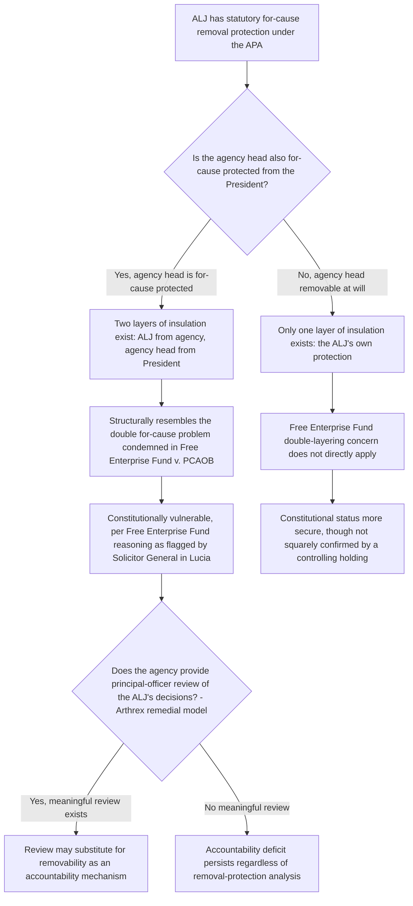

## For-Cause Protection for Administrative Law Judges After Free Enterprise Fund and Lucia v. SEC

### Overview

Administrative law judges (ALJs) occupy a distinctive position in removal-power doctrine: since 1946, the Administrative Procedure Act (APA) has protected them from removal except "for good cause established and determined by the Merit Systems Protection Board" (MSPB), creating a form of tenure protection layered on top of whatever removal protection (if any) exists for the agency head who oversees them. *Free Enterprise Fund v. PCAOB* (2010) and *Lucia v. SEC* (2018) brought this structure under direct constitutional scrutiny without fully resolving it — *Free Enterprise Fund* announced the rule against multilayered for-cause protection that plainly implicates ALJs, while *Lucia* held SEC ALJs are "Officers of the United States" but explicitly declined to decide whether their removal protections survive *Free Enterprise Fund*'s logic. That question remains formally unresolved by the Supreme Court, and recent developments — including *Trump v. Slaughter*'s 2026 overruling of *Humphrey's Executor* — have sharpened rather than settled the tension. [Unverified: whether the Supreme Court has since squarely resolved the ALJ removal-protection question in a case not captured by available search results should be independently confirmed, given the pace of removal-power doctrine in 2025–2026.]

### The Statutory Structure: APA Removal Protection for ALJs

**Key Points**

- Since the APA's enactment in 1946, ALJs across federal agencies have been removable by the employing agency "only for good cause established and determined by the Merit Systems Protection Board" — a protection designed to insulate ALJs from agency pressure so they can adjudicate impartially, including in cases where the agency itself is a party.
- This creates a structurally layered protection: (1) the ALJ is protected from at-will removal by the agency head, with the MSPB (not the agency) determining whether good cause exists; and (2) MSPB members themselves historically enjoy their own removal protections from the President, meaning an ALJ's ultimate insulation from presidential control runs through at least two layers of for-cause protection.
- The purpose of this design — impartial adjudication insulated from the political and institutional pressures of the agency whose actions the ALJ is reviewing — is doctrinally significant because courts have historically given Congress more latitude to protect officers performing adjudicative functions specifically to prevent coercive influence over pending or future adjudications.

### Free Enterprise Fund v. PCAOB (2010): The Anti-Layering Principle

**Key Points**

- Held that the Sarbanes-Oxley Act's structure — PCAOB members removable only for cause by the SEC, and SEC commissioners themselves removable only for cause by the President — unconstitutionally created two layers of for-cause insulation between an officer exercising executive power and the President.
- The Court reasoned that each additional layer of for-cause protection further attenuates the President's ability to ensure the laws are faithfully executed, since the President cannot even remove the officer who could remove the PCAOB member; accountability becomes diffused across multiple insulated actors.
- The remedy was severance of the offending removal restriction (making PCAOB members removable at will by the SEC) rather than invalidating the PCAOB's existence or its other structural features.
- **Direct relevance to ALJs**: The layered structure of ALJ removal protection (agency cannot remove without MSPB good-cause determination; MSPB members themselves for-cause protected from the President) maps closely onto the precise "double for-cause" pathology the Court condemned, making ALJ removal protections a natural next target for challenge under *Free Enterprise Fund*'s reasoning — a point the Solicitor General pressed directly in *Lucia*.

### Lucia v. SEC (2018): The Question Presented but Not Decided

**Key Points**

- The core holding of *Lucia* was that SEC ALJs are "Officers of the United States" under the Appointments Clause because they hold a continuing office and exercise significant discretion (conducting adversarial hearings, ruling on evidence, issuing decisions that become final agency action absent further review), and because the ALJ who heard Lucia's case had been appointed by SEC staff rather than the Commission itself, the appointment was invalid.
- The remedy ordered was a new hearing before a different, properly appointed ALJ (or the Commission itself).
- **The removal question was not decided**: The Solicitor General urged the Court to go further and hold that the ALJs' statutory "for cause" removal protections were themselves unconstitutional under *Free Enterprise Fund*, but the majority opinion did not reach this question, resolving the case solely on the Appointments Clause/appointment-method issue.
- **Justice Breyer's concurrence in part and dissent in part** argued the removal question was logically antecedent to the Appointments Clause question: he reasoned that if *Free Enterprise Fund* means that classifying ALJs as "Officers" would strip them of their for-cause removal protections (a result Congress plainly did not intend when enacting the APA's protections), then the Court should instead hold ALJs are not "Officers" at all, avoiding the constitutional problem through statutory interpretation. Conversely, if *Free Enterprise Fund* does not have that effect, then finding ALJs are "Officers" creates no conflict with congressional intent. Breyer would not have decided the officer-status question without first resolving this embedded removal question.
- **Justice Thomas's concurrence** (joined by Justice Gorsuch) took the opposite institutional approach, addressing only the narrow question presented (appointment method) without reaching the removal issue, consistent with a preference for incremental resolution.
- **Net effect**: *Lucia* leaves ALJ removal protections in a state of undecided constitutional vulnerability — flagged as a serious question by multiple Justices across different opinions, but not resolved as a holding of the Court.

### United States v. Arthrex, Inc. (2021): The Adjacent Patent Judge Case

Although *Arthrex* did not directly resolve the ALJ removal question, it addressed a structurally similar adjudicator (Administrative Patent Judges on the Patent Trial and Appeal Board) and offers instructive contrast.

**Key Points**

- The Federal Circuit had held that APJs were unconstitutionally structured as principal officers (because neither the Secretary of Commerce nor the PTO Director could remove them at will or review their decisions), and remedied this by invalidating the APJs' removal protections entirely — making them removable at will, which the Federal Circuit reasoned converted them into properly supervised inferior officers.
- The Supreme Court vacated, but reached a different remedy: rather than adopting the Federal Circuit's removal-stripping approach, the Court held that the constitutional defect lay in the *unreviewability* of APJ decisions, not solely in their removal protection, and ordered that PTAB decisions be made reviewable by the PTO Director (a principal officer) — preserving something closer to the APJs' original tenure structure while curing the accountability problem through review authority instead of removal authority.
- **Doctrinal significance for ALJs generally**: *Arthrex* demonstrates that the Court has at least one available remedial path for adjudicator-accountability problems that does not require eliminating for-cause removal protection — enhanced principal-officer review of the adjudicator's decisions can substitute for, or supplement, removability as the accountability mechanism. This suggests (though does not hold) that ALJ removal protections might similarly be preserved if adequate review mechanisms exist, an alternative to the more disruptive "strip the removal protection" remedy that *Free Enterprise Fund* itself employed for PCAOB.
- [Inference: legal commentators have read *Arthrex*'s remedial choice as leaving open a middle path for ALJ removal protection — preserving tenure protection while strengthening principal-officer review — though the Supreme Court has not applied this reasoning directly to APA ALJs in a controlling holding.]

### The Continuing Open Question and Contributing Uncertainty

**Key Points**

- Congressional Research Service analysis has concluded that, in light of *Free Enterprise Fund*, *Lucia*, and subsequent lower-court reasoning (including the Fifth Circuit's *Jarkesy* panel decision, which rested on both cases), Congress's ability to restrict ALJ removal at independent agencies specifically is significantly limited, since independent agencies are "independent" precisely because their heads already enjoy removal protection — meaning any additional ALJ-level for-cause protection would recreate the exact double-layering problem condemned in *Free Enterprise Fund*.
- The same analysis suggests a narrower path may survive for ALJs at agencies where the agency head is removable at will by the President (a single layer of protection at the ALJ level, not a second layer stacked on an already-insulated principal officer) — though this remains an inference from the anti-layering principle rather than a squarely decided holding.
- CRS analysis (echoing patterns from other officer-removal contexts) has also suggested that inferior officers who do not exercise significant policymaking or broad administrative authority, and whose duties are limited, may permissibly be made removable for cause even where broader officers could not be — potentially distinguishing narrowly-empowered adjudicators from ALJs exercising the kind of significant discretion described in *Lucia*.
- **The Trump v. Slaughter overlay**: The 2026 overruling of *Humphrey's Executor* in *Trump v. Slaughter* eliminates the doctrinal foundation that had allowed multimember independent agency heads to retain for-cause protection in the first place. If an independent agency's head is now removable at will by the President (post-*Slaughter*), then an ALJ within that agency who retains statutory for-cause protection would no longer present a "double layering" problem in the *Free Enterprise Fund* sense — there being only one layer of insulation (the ALJ's own) rather than two. [Inference: this reasoning suggests *Slaughter* could, somewhat counterintuitively, make ALJ-level for-cause protection more constitutionally secure at agencies that previously had insulated multimember heads, by removing the "second layer" that made the structure vulnerable — but this is an analytical inference from combining the two lines of doctrine, not a holding of any court, and no case is confirmed to have addressed this specific interaction as of this writing.]
- Congress retains the option to amend the APA to adjust or eliminate ALJ removal protections legislatively, a path CRS analysis has flagged as available regardless of how the constitutional question is ultimately resolved judicially.

### Diagram: ALJ Removal Protection Layering Analysis

### Structural Diagram: The Layering Problem

<svg xmlns="http://www.w3.org/2000/svg" viewBox="0 0 760 440">
<text x="380" y="28" font-size="16" font-weight="bold" text-anchor="middle" fill="#1a1a1a">ALJ Removal Protection: The Layering Problem (svg_diagram)</text>
<rect x="270" y="55" width="220" height="60" rx="8" fill="#dbeafe" stroke="#1e40af" stroke-width="1.5" />
<text x="380" y="90" font-size="12" font-weight="bold" text-anchor="middle" fill="#1e3a8a">President</text>
<line x1="380" y1="115" x2="380" y2="150" stroke="#1a1a1a" stroke-width="2" marker-end="url(#arrowC)" />
<text x="410" y="135" font-size="10" fill="#7f1d1d">for-cause layer 1</text>
<rect x="270" y="150" width="220" height="60" rx="8" fill="#fef3c7" stroke="#92400e" stroke-width="1.5" />
<text x="380" y="185" font-size="12" font-weight="bold" text-anchor="middle" fill="#78350f">Agency Head / Commission</text>
<line x1="380" y1="210" x2="380" y2="245" stroke="#1a1a1a" stroke-width="2" marker-end="url(#arrowC)" />
<text x="410" y="230" font-size="10" fill="#7f1d1d">for-cause layer 2 (via MSPB)</text>
<rect x="270" y="245" width="220" height="60" rx="8" fill="#fee2e2" stroke="#991b1b" stroke-width="1.5" />
<text x="380" y="280" font-size="12" font-weight="bold" text-anchor="middle" fill="#7f1d1d">Administrative Law Judge</text>
<rect x="30" y="325" width="700" height="95" rx="8" fill="#f9fafb" stroke="#6b7280" stroke-width="1" />
<text x="380" y="350" font-size="13" font-weight="bold" text-anchor="middle" fill="#1a1a1a">Free Enterprise Fund's Concern</text>
<text x="380" y="372" font-size="11" text-anchor="middle" fill="#1a1a1a">Two stacked for-cause layers dilute presidential accountability at each remove</text>
<text x="380" y="392" font-size="11" text-anchor="middle" fill="#1a1a1a">Post-Slaughter: if the agency-head layer is eliminated, only one layer (the ALJ's) remains</text>
</svg>

### Environmental and Administrative Law Applications

**Key Points**

- **EPA ALJs**: EPA's ALJs (who preside over enforcement proceedings under statutes like the Clean Air Act, Clean Water Act, and RCRA) sit beneath the EPA Administrator, who has always been a single official removable at will by the President — meaning EPA's ALJ structure has never presented the classic "double for-cause" layering problem in the first place, since there is no independently insulated agency head above them. EPA ALJ removal protection under the APA is therefore likely on firmer constitutional ground than ALJs at traditionally structured independent multimember commissions.
- **Environmental Appeals Board (EAB)**: EAB judges, who hear administrative appeals of EPA permit and enforcement decisions, present a related but distinct question from ALJs proper; their appointment and removal structure should be separately analyzed under both *Lucia*'s officer-status framework and the removal-layering analysis, since EAB members are appointed by the Administrator (a single at-will-removable official) rather than by a multimember commission.
- **FERC ALJs**: In contrast, ALJs presiding over FERC proceedings (rate cases, certificate proceedings) sit beneath a traditionally structured multimember commission; following *Trump v. Slaughter*'s elimination of *Humphrey's Executor*, FERC commissioners are now understood to be removable at will by the President (absent some other applicable exception), which — per the layering analysis above — would mean FERC ALJs retaining for-cause protection would no longer present a double-layering problem, since only the ALJ-level protection remains as an independent layer of insulation. [Inference: this specific application to FERC has not been confirmed by any court decision and represents an analytical extension of the doctrinal principles discussed above.]
- **Practical stakes for environmental enforcement**: Because EPA and other environmental agencies rely heavily on ALJ adjudication for civil penalty assessments, permit revocations, and compliance order review, any broad judicial or legislative narrowing of ALJ removal protection could affect the perceived impartiality and stability of environmental enforcement adjudication, a concern raised generally in ALJ removal-protection commentary regarding the risk of agency pressure on adjudicators who decide cases in which the agency itself is a party.

### Illustrative Hypothetical Analysis

**Example**

*Scenario*: An ALJ presiding over Clean Water Act penalty proceedings at a hypothetical independent multimember environmental commission (structured, pre-*Slaughter*, like the FTC) is removed by the commission for reasons the commission characterizes as "good cause" as determined through internal commission review rather than an MSPB determination, and the ALJ challenges the removal as both statutorily and constitutionally defective.

*Analysis*:

1. **Statutory question**: The APA requires that good cause be "established and determined by the Merit Systems Protection Board," not by the agency itself; a commission-only determination without MSPB involvement is very likely statutorily invalid, independent of any constitutional question, mirroring Breyer's concern in *Lucia* about preserving the specific statutory structure Congress enacted.
2. **Constitutional question — layering, pre-Slaughter assumption**: If this hypothetical commission's members were themselves for-cause protected (the traditional independent-commission structure), the combination of (a) commission member for-cause protection from the President and (b) ALJ for-cause protection from the commission would recreate the *Free Enterprise Fund* double-layering problem, rendering the ALJ protection constitutionally vulnerable under the reasoning the Solicitor General pressed unsuccessfully in *Lucia*.
3. **Constitutional question — post-Slaughter reality**: Because *Trump v. Slaughter* has eliminated *Humphrey's Executor*-based protection for ordinary multimember commissions, this commission's members are now presumptively removable at will by the President; this removes the "first layer" from the analysis, meaning the ALJ's own for-cause protection is now the only layer of insulation between the ALJ and ultimate presidential accountability — a structure closer to what *Free Enterprise Fund* left undisturbed (a single layer of for-cause protection) than to what it invalidated (two stacked layers).
4. **Conclusion**: The ALJ's removal is likely defective on statutory grounds regardless of the constitutional analysis; on the constitutional question, the post-*Slaughter* landscape may make ALJ-level for-cause protection at this commission more defensible than it would have been before *Slaughter*, though this remains an unresolved and analytically contested area of doctrine rather than settled law.

### Practice Pointers

**Next Steps**

- Confirm whether any post-*Lucia* Supreme Court decision has squarely resolved the ALJ removal-protection question left open in that case, particularly in light of the accelerated pace of removal-power litigation in 2025–2026.
- For any specific agency's ALJs, map the full removal chain (ALJ to agency head to President) and determine, post-*Slaughter*, whether the agency head is now removable at will — this determines whether a *Free Enterprise Fund* double-layering argument remains available against that agency's ALJs.
- Distinguish the *Lucia* appointment-method holding (squarely decided) from the *Lucia* removal-protection question (left open) when advising on ALJ-related litigation risk; they are analytically separate issues that are frequently conflated in general discussion of the case.
- Consider the *Arthrex* remedial model (enhanced principal-officer review in lieu of removal-protection elimination) as a potential argument for preserving ALJ tenure protections while addressing accountability concerns, recognizing this remains a persuasive analogy rather than binding authority for APA ALJs specifically.

### Related Topics

- The Appointments Clause: principal officers, inferior officers, and employees (*Lucia v. SEC*, *Freytag v. Commissioner*)
- Removal power historically: *Myers v. United States* and *Humphrey's Executor*
- Trump v. Slaughter and the overruling of Humphrey's Executor
- Structural protections for multimember independent commissions
- *United States v. Arthrex* and Appointments Clause remedies for adjudicators
- SEC v. Jarkesy and the Seventh Amendment right to jury trial in agency enforcement proceedings
- The Merit Systems Protection Board's role in federal employee and ALJ removal determinations
- Congressional options for amending the Administrative Procedure Act's removal provisions