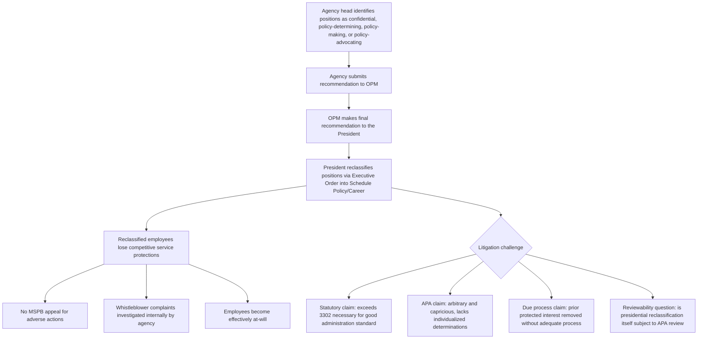

## Political Appointees, Career Civil Servants, and Civil Service Reclassification Debates

### Overview

The federal workforce is divided between political appointees, who serve at the President's pleasure and turn over with each administration, and career civil servants, who are hired competitively, protected from at-will removal, and intended to provide continuity and technical expertise across administrations. This division rests on the Pendleton Civil Service Reform Act of 1883 and the Civil Service Reform Act of 1978 (CSRA), and it interacts directly with the constitutional removal-power doctrine discussed elsewhere in this chapter, since civil service protections are a species of the same for-cause insulation the Supreme Court has scrutinized for principal officers. The most significant current flashpoint is Schedule F, now formally implemented as "Schedule Policy/Career," which reclassifies large numbers of career positions into an excepted-service category stripped of traditional tenure protections — an initiative first proposed in 2020, rescinded in 2021, and reinstated and substantially expanded in 2025–2026. [Unverified: this topic involves fast-moving 2025–2026 developments; the summary below reflects information located via web search as of this writing and should be checked against current agency guidance and any subsequent litigation outcomes.]

### The Traditional Civil Service Framework

**Key Points**

- **Political appointees**: Include principal officers (Cabinet secretaries, agency heads) subject to Senate confirmation, non-career Senior Executive Service (SES) members, and Schedule C employees in confidential or policy-determining positions; these individuals generally serve at the President's pleasure and turn over with changes in administration.
- **Career civil servants**: Hired through competitive examination or merit-based procedures under the "competitive service," protected from removal except for cause following notice and an opportunity to respond, and generally intended to remain in place across administrations to provide institutional continuity, technical expertise, and non-partisan implementation of statutory programs.
- **The Pendleton Act (1883)**: Established the foundational merit-based civil service system in response to the spoils system and patronage abuses of the 19th century, creating the original competitive service concept.
- **The Civil Service Reform Act of 1978 (CSRA)**: Modernized civil service law, created the Merit Systems Protection Board (MSPB) to adjudicate adverse personnel actions, established the Senior Executive Service as a hybrid category of senior career managers with some flexibility for the administration while retaining certain protections, and codified the "excepted service" category for positions exempted from standard competitive hiring and removal procedures.
- **5 U.S.C. § 7511(b)(2)**: A CSRA provision exempting from civil service removal protections federal employees "whose position has been determined to be of a confidential, policy-determining, policy-making or policy-advocating character" — a provision that had been little-noticed and rarely used before becoming the legal foundation for Schedule F and its successor, Schedule Policy/Career.

### The Constitutional Tension: Accountability Versus Continuity

**Key Points**

- The traditional civil service model embodies a policy choice favoring administrative continuity, expertise, and insulation from partisan pressure over direct presidential control — the same basic values that historically justified for-cause removal protections for principal officers under *Humphrey's Executor v. United States* before that case was overruled in *Trump v. Slaughter* (2026).
- Unitary executive theory, which underlies the modern removal-power revival (*Free Enterprise Fund*, *Seila Law*, *Collins v. Yellen*, *Trump v. Slaughter*), extends analytically to career civil servants performing executive functions: if the President must retain removal authority over principal officers to ensure faithful execution of the laws, a parallel argument holds that officials implementing significant policy decisions — even at the career level — should not be insulated from removal by tenure protections that Congress, rather than the Constitution, has created.
- Civil service tenure protections have historically been treated differently from removal protections for principal officers, resting more on Congress's Article I power to structure the federal workforce and its Necessary and Proper Clause authority than on the same separation-of-powers analysis applied to agency heads — but this distinction has been increasingly contested as the unitary executive theory has gained judicial traction.
- Commentary following the *Trump v. Slaughter* and *Trump v. Wilcox* line of cases has specifically flagged that expanded presidential removal authority over principal officers could extend, by similar reasoning, to reconsideration of tenure protections for career civil servants and even the Senior Executive Service, with at least one federal appellate judge (Judge James Ho of the Fifth Circuit) publicly suggesting courts should reconsider whether civil service tenure protections generally violate Article II. [Inference: this remains a minority or exploratory judicial position rather than a governing rule, but its emergence in prominent circuit-level commentary signals a live doctrinal question.]

### Schedule F / Schedule Policy/Career: History and Current Status

**Key Points**

- **Origin (2020)**: The Schedule F concept originated in an October 2020 executive order during the first Trump administration, creating a new excepted-service schedule for career positions of a "confidential, policy-determining, policy-making, or policy-advocating character not normally subject to change as a result of a Presidential transition," using the pre-existing but rarely invoked § 7511(b)(2) exemption as its statutory hook.
- **Rescission (2021)**: The Biden administration rescinded the Schedule F executive order early in its term, and OPM subsequently issued a rule intended to make future reclassification of this kind more difficult.
- **Reinstatement (2025)**: The Schedule F framework was reinstated at the beginning of the second Trump administration in 2025, with the January 2025 executive order and subsequent OPM guidance directing agency heads to identify positions of a "confidential, policy-determining, policy-making, or policy-advocating character" for recommendation to OPM and ultimately the President.
- **Renaming and finalized rule (February 2026)**: The initiative was rebranded "Schedule Policy/Career," with a final OPM rule issued February 6, 2026, following a comment period that drew approximately 40,500 public comments, of which roughly 94% opposed the rule according to advocacy-group analysis.
- **Executive implementation (April–June 2026)**: President Trump signed executive orders formally converting career positions into Schedule Policy/Career — reported figures include an April 30, 2026 order and a subsequent June 3, 2026 order reclassifying approximately 8,000 to nearly 10,000 positions, concentrated at GS-15 and senior levels, accompanied by an extensive appendix (reportedly 229 pages) listing thousands of specific positions.
- **Effect on reclassified employees**: Employees moved into Schedule Policy/Career lose competitive-service protections, can no longer challenge adverse personnel actions before the Merit Systems Protection Board, have whistleblower complaints investigated by their own agency rather than an independent body, and effectively become at-will employees — removable without the notice, cause, and appeal rights that traditionally attached to their positions.
- **Ongoing litigation**: Multiple lawsuits, primarily brought by federal employee unions, challenge the policy on statutory grounds (violation of the CSRA and the specific "necessary for conditions of good administration" standard for excepting positions from the competitive service, as articulated in prior case law such as *Horner*), Administrative Procedure Act grounds (arbitrary and capricious reclassification without individualized position-by-position determinations), and constitutional due process grounds (employees removed after reclassification arguing entitlement to process before removal). As of this writing, no court has issued a nationwide injunction halting implementation, and transfers have proceeded under agency implementation guidance.

### Key Legal and Statutory Issues in the Reclassification Debate

**Key Points**

1. **Statutory authority limits**: 5 U.S.C. § 3302 and related provisions have been read by at least one prior court (the *Horner* line of cases, as characterized in current CRS analysis) to require that OPM except positions from the competitive service "only when 'necessary' for 'conditions of good administration,'" and to require meaningful judicial review of such reclassification decisions rather than unreviewable discretion — a standard the 2026 final rule attempts to distinguish rather than directly contest.
2. **Individualized versus categorical determinations**: A central plaintiffs' argument is that mass reclassification of thousands of positions by executive order, without position-by-position individualized determinations that each role is genuinely "confidential, policy-determining, policy-making, or policy-advocating," exceeds the statutory exemption's proper scope and constitutes arbitrary and capricious agency action under the APA.
3. **Reviewability of presidential reclassification**: The 2026 final rule's provision that the President himself will reclassify positions via executive order (rather than OPM through ordinary rulemaking) raises a distinct question of whether such presidential action is subject to APA judicial review at all, given that the APA generally does not apply directly to the President's own actions (as established in cases like *Franklin v. Massachusetts*), potentially insulating the reclassification decision itself from the ordinary "arbitrary and capricious" review that would apply to an OPM rule.
4. **Due process for removed employees**: Employees removed from their positions after reclassification to Schedule Policy/Career may argue they were entitled to some form of due process before removal, based on their prior property interest in continued employment under the competitive service protections that existed before reclassification — an argument that requires establishing the reclassification itself did not validly and retroactively eliminate that protected interest.
5. **Collective bargaining and whistleblower implications**: Reclassification removes affected employees from standard civil service rules covering due process and potentially collective bargaining rights, and shifts whistleblower complaint investigation from independent bodies to the employing agency itself — raising accountability concerns distinct from the core removal-protection question.

### Diagram: Schedule Policy/Career Reclassification Process and Legal Challenges

### Structural Diagram: The Federal Workforce Spectrum

<svg xmlns="http://www.w3.org/2000/svg" viewBox="0 0 760 460">
<text x="380" y="28" font-size="16" font-weight="bold" text-anchor="middle" fill="#1a1a1a">Federal Workforce Accountability Spectrum (svg_diagram)</text>
<rect x="30" y="55" width="200" height="110" rx="8" fill="#fee2e2" stroke="#991b1b" stroke-width="1.5" />
<text x="130" y="80" font-size="12" font-weight="bold" text-anchor="middle" fill="#7f1d1d">Political Appointees</text>
<text x="130" y="102" font-size="10" text-anchor="middle" fill="#7f1d1d">Cabinet, agency heads,</text>
<text x="130" y="118" font-size="10" text-anchor="middle" fill="#7f1d1d">Schedule C, non-career SES</text>
<text x="130" y="140" font-size="10" text-anchor="middle" fill="#7f1d1d">Serve at President's pleasure</text>
<rect x="280" y="55" width="200" height="110" rx="8" fill="#fef3c7" stroke="#92400e" stroke-width="1.5" />
<text x="380" y="80" font-size="12" font-weight="bold" text-anchor="middle" fill="#78350f">Schedule Policy/Career</text>
<text x="380" y="102" font-size="10" text-anchor="middle" fill="#78350f">Reclassified career positions</text>
<text x="380" y="118" font-size="10" text-anchor="middle" fill="#78350f">Formerly competitive service</text>
<text x="380" y="140" font-size="10" text-anchor="middle" fill="#78350f">Effectively at-will post-reclassification</text>
<rect x="530" y="55" width="200" height="110" rx="8" fill="#dcfce7" stroke="#166534" stroke-width="1.5" />
<text x="630" y="80" font-size="12" font-weight="bold" text-anchor="middle" fill="#14532d">Career Civil Servants</text>
<text x="630" y="102" font-size="10" text-anchor="middle" fill="#14532d">Competitive service</text>
<text x="630" y="118" font-size="10" text-anchor="middle" fill="#14532d">MSPB appeal rights</text>
<text x="630" y="140" font-size="10" text-anchor="middle" fill="#14532d">Removal only for cause with process</text>
<rect x="30" y="195" width="700" height="90" rx="8" fill="#dbeafe" stroke="#1e40af" stroke-width="1.5" />
<text x="380" y="220" font-size="13" font-weight="bold" text-anchor="middle" fill="#1e3a8a">Schedule Policy/Career: Reclassification Mechanism</text>
<text x="380" y="245" font-size="11" text-anchor="middle" fill="#1e3a8a">5 U.S.C. section 7511(b)(2): exempts "confidential, policy-determining,</text>
<text x="380" y="263" font-size="11" text-anchor="middle" fill="#1e3a8a">policy-making, or policy-advocating" positions from standard protections</text>
<rect x="30" y="300" width="700" height="145" rx="8" fill="#f9fafb" stroke="#6b7280" stroke-width="1" />
<text x="380" y="325" font-size="13" font-weight="bold" text-anchor="middle" fill="#1a1a1a">2026 Implementation Timeline</text>
<text x="60" y="350" font-size="11" fill="#1a1a1a">Feb 6, 2026: OPM final rule (approx. 40,500 comments, ~94% opposed)</text>
<text x="60" y="372" font-size="11" fill="#1a1a1a">Apr 30, 2026: Executive order moving thousands of employees into new schedule</text>
<text x="60" y="394" font-size="11" fill="#1a1a1a">Jun 3, 2026: Executive order reclassifying approximately 8,000 GS-15+ positions</text>
<text x="60" y="416" font-size="11" fill="#1a1a1a">Jun 10, 2026: Agency implementation deadline; multiple union lawsuits pending</text>
</svg>

### Environmental and Administrative Law Applications

**Key Points**

- **EPA career scientific and policy staff**: Career positions at EPA involved in setting technical standards, drafting proposed rules, or advising on enforcement priorities are precisely the kind of "policy-determining, policy-making, or policy-advocating" roles the Schedule Policy/Career framework targets; reclassification of such positions would remove long-tenured technical staff from traditional civil service protection, potentially increasing turnover and reducing institutional continuity in environmental rulemaking and enforcement expertise across administrations.
- **Impact on rulemaking consistency and expertise retention**: Environmental regulatory programs (air quality standards, water quality criteria, chemical risk assessment) often depend on career staff with specialized scientific and technical expertise built over many years; reclassification to an at-will status could affect recruitment and retention of such expertise, a concern raised generally in civil service reclassification commentary regarding attractiveness of federal service to specialized professionals.
- **Politicization concerns for environmental enforcement**: Because Schedule Policy/Career employees can be removed without cause, career staff responsible for enforcement referrals, permit denials, or unfavorable technical findings involving regulated industries could face increased pressure or turnover risk tied to policy disagreements rather than performance, a concern echoing the broader rationale for insulating adjudicative and technical functions from at-will removal.
- **Interaction with EAB and ALJ structures**: To the extent Environmental Appeals Board staff or supporting technical personnel are reclassified, this raises questions distinct from (but potentially interacting with) the separate Appointments Clause and removal-protection analysis applicable to EAB judges and EPA ALJs discussed elsewhere in this chapter — reclassification of supporting career staff is a civil-service-law question, while EAB/ALJ officer status is a constitutional Appointments Clause and removal-power question, and the two should not be conflated.
- **State-level parallels**: Some states have considered or adopted analogous reclassification frameworks for state environmental agency staff, raising similar continuity-versus-accountability tradeoffs at the state level, though state civil service law varies considerably and is not directly governed by the federal CSRA framework.

### Illustrative Hypothetical Analysis

**Example**

*Scenario*: A career EPA employee serving as a senior technical advisor on air quality rulemaking, with fifteen years of competitive-service tenure, is reclassified into Schedule Policy/Career under a 2026 executive order and subsequently removed without cause after publicly expressed disagreement with a proposed rule rollback.

*Analysis*:

1. **Threshold classification question**: Whether this position genuinely qualifies as "confidential, policy-determining, policy-making, or policy-advocating" under § 7511(b)(2) is contestable; a senior technical advisor role may involve substantial policy input but could also be characterized as primarily technical/scientific rather than policy-advocating in the sense the statute contemplates, making the individualized-determination argument (that mass reclassification without position-specific analysis is arbitrary and capricious) directly relevant.
2. **Statutory challenge**: The employee could argue, consistent with pending litigation theories, that the reclassification failed to satisfy the "necessary for conditions of good administration" standard and lacked the individualized determination required by governing case law, particularly if the position was swept into a categorical, appendix-based mass reclassification rather than assessed on its own merits.
3. **Due process challenge**: Because the employee held prior competitive-service tenure (a recognized property interest under existing precedent governing federal employment), removal following reclassification without notice or an opportunity to respond could support a due process claim, contingent on whether the reclassification itself is found to have validly and prospectively eliminated that protected interest before the removal occurred.
4. **Reviewability complication**: If the specific reclassification occurred via presidential executive order rather than OPM rulemaking, the threshold question of whether the reclassification decision itself is subject to APA review at all would need to be resolved before reaching the merits of the arbitrary-and-capricious claim.
5. **Conclusion**: This hypothetical illustrates the layered nature of current reclassification challenges — statutory, procedural, and constitutional theories operate somewhat independently, and success on one does not necessarily resolve the others, reflecting the genuinely unsettled state of this area of law as litigation proceeds through 2026.

### Practice Pointers

**Next Steps**

- Monitor pending federal employee union litigation challenging the 2026 Schedule Policy/Career final rule and implementing executive orders for developments on the statutory, APA, and due process theories described above.
- Distinguish, in any specific case, between the constitutional removal-power questions governing principal officers and agency heads (covered elsewhere in this chapter) and the primarily statutory and administrative-law questions governing career civil service reclassification, since they rest on different legal foundations even though both relate to executive accountability.
- Track whether Congress exercises its Congressional Review Act authority to reject the OPM final rule, an avenue explicitly identified as available in current commentary.
- For agency-specific analysis (e.g., EPA, FERC, NRC), review each agency's specific list of positions reclassified under the 2026 executive orders to assess concrete impact on environmental regulatory and enforcement functions.

### Related Topics

- Removal power historically: Myers v. United States and Humphrey's Executor
- Trump v. Slaughter and the overruling of Humphrey's Executor
- Structural protections for multimember independent commissions
- For-cause protection for administrative law judges after Free Enterprise Fund and Lucia v. SEC
- The Merit Systems Protection Board's role in adjudicating adverse personnel actions
- The Civil Service Reform Act of 1978 and the Senior Executive Service
- Administrative Procedure Act review of presidential versus agency action (*Franklin v. Massachusetts*)
- Whistleblower protection mechanisms in federal employment law
- Unitary executive theory as applied beyond principal officers to the broader civil service