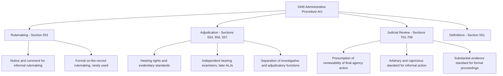

## History and Purposes of the 1946 Administrative Procedure Act

### Overview

The Administrative Procedure Act (APA), enacted June 11, 1946, is the foundational statute governing how federal administrative agencies make rules and adjudicate disputes, and how courts review agency action. It emerged from decades of tension between the rapid growth of the administrative state during the New Deal and longstanding concerns about the compatibility of unchecked agency power with constitutional separation of powers and individual due process. The APA represented a hard-fought legislative compromise between competing visions of administrative governance, and its basic architecture — rulemaking, adjudication, and judicial review — remains the operative framework for federal agency action today, including the environmental and administrative law doctrines addressed throughout this course.

### Historical Background: The Rise of the Administrative State

**Key Points**

- The late 19th and early 20th centuries saw the emergence of the first modern federal regulatory agencies, beginning with the Interstate Commerce Commission (1887) and expanding through the Progressive Era with agencies like the Federal Trade Commission (1914) and the Federal Reserve (1913).
- The New Deal era (1933–1938) produced an explosion of new federal agencies exercising broad rulemaking, licensing, and adjudicatory authority — the Securities and Exchange Commission, the National Labor Relations Board, the Federal Communications Commission, and many others — often with combined legislative, executive, and judicial functions concentrated within a single agency.
- This concentration of functions provoked significant constitutional and political controversy: critics argued that agencies exercising rulemaking (legislative-like), enforcement (executive-like), and adjudicatory (judicial-like) power within a single body violated separation-of-powers principles and denied regulated parties basic procedural protections associated with traditional courts.
- The nondelegation doctrine cases of the mid-1930s (*Panama Refining Co. v. Ryan* and *A.L.A. Schechter Poultry Corp. v. United States*, both 1935) reflected judicial anxiety about the scope of delegated authority to agencies and the National Industrial Recovery Act's code-making process, though the Court's nondelegation concerns receded substantially after 1937 even as broader anxiety about agency procedure persisted.

### The Attorney General's Committee on Administrative Procedure (1939–1941)

**Key Points**

- In response to mounting criticism, President Franklin Roosevelt's Attorney General appointed a committee in 1939 to study federal administrative procedure comprehensively, producing the influential 1941 Final Report of the Attorney General's Committee on Administrative Procedure.
- The Committee's report documented wide variation in procedures across different agencies, catalogued due process concerns (including agencies combining investigative, prosecutorial, and adjudicatory functions within the same staff or personnel), and proposed a framework for more uniform and procedurally regular administrative practice.
- The Committee was internally divided, producing both majority recommendations favoring more modest procedural reform and a minority position favoring more aggressive structural separation of agency functions — a division that foreshadowed the compromises embedded in the eventual statute.
- World War II intervened before Congress could act on comprehensive administrative procedure legislation, delaying enactment by several years while the war effort dominated the legislative agenda.

### The Legislative Compromise of 1946

**Key Points**

- Post-war political dynamics created renewed momentum for administrative procedure legislation: business and regulated-industry interests sought greater procedural protections and predictability in dealing with agencies, while New Deal defenders sought to preserve agency flexibility and expertise-based decision-making that they viewed as essential to effective regulation.
- The APA that emerged from this process, sponsored by Senator Pat McCarran and shepherded through extensive committee work, represented a carefully negotiated compromise rather than a decisive victory for either the pro-regulation or anti-regulation camps: it imposed meaningful procedural requirements on agencies without dismantling the basic administrative-agency model or requiring wholesale separation of agency functions.
- The Act passed with substantial bipartisan support and was signed into law by President Truman on June 11, 1946, taking effect later that year.
- Because the APA was the product of extended negotiation among competing interests, courts and commentators have historically treated its legislative history (including the 1941 Attorney General's Committee report and the subsequent Senate and House committee reports) as unusually authoritative for interpretive purposes, reflecting the considered judgment of a broad coalition rather than a narrow partisan enactment.

### Core Purposes of the APA

**Key Points**

1. **Procedural uniformity**: To establish a baseline set of procedural requirements applicable across the many disparate federal agencies, replacing the previously ad hoc and agency-specific procedures that had provoked criticism from the 1941 Attorney General's Committee report.
2. **Public participation**: To ensure that affected parties and the public have meaningful opportunity to participate in agency decision-making, most prominently through the notice-and-comment rulemaking process for informal (legislative) rules.
3. **Procedural due process in adjudication**: To provide baseline hearing rights, evidentiary standards, and decisional independence (through the creation of what became the modern administrative law judge role) for formal agency adjudications affecting individual rights and interests.
4. **Judicial review as a check on agency power**: To establish a general presumption of judicial reviewability of final agency action and to specify the standards courts should apply in reviewing different types of agency decisions, ensuring agencies remain accountable to the rule of law rather than operating as unreviewable islands of discretion.
5. **Preserving agency expertise and flexibility**: Simultaneously, to avoid so thoroughly encumbering agencies with procedural requirements, or so thoroughly separating their internal functions, that they could no longer function efficiently or apply the specialized expertise that justified their creation in the first place.
6. **Definitional clarity**: To establish common definitions (of "agency," "rule," "order," "adjudication," "rulemaking," and similar terms) that would apply consistently across the many organic statutes creating individual agencies, providing an interpretive backbone for administrative law generally.

### Key Structural Provisions Established by the 1946 Act

**Key Points**

- **Rulemaking (5 U.S.C. § 553)**: Established the notice-and-comment process for informal rulemaking — publication of a notice of proposed rulemaking in the Federal Register, an opportunity for interested persons to submit comments, and publication of the final rule with a concise general statement of basis and purpose — alongside a more elaborate (and rarely used) formal rulemaking process for situations where an organic statute requires rules to be made "on the record after opportunity for an agency hearing."
- **Adjudication (5 U.S.C. §§ 554, 556, 557)**: Established procedural requirements for formal agency adjudication, including the right to notice, the right to present evidence, the role of an independent hearing officer (later formalized as the administrative law judge), and separation-of-functions requirements intended to prevent the same agency personnel from serving as both prosecutor and judge in the same matter.
- **Judicial review (5 U.S.C. §§ 701–706)**: Established a general presumption of reviewability of final agency action, standing and reviewability doctrines, and the now-familiar standards of review, including the "arbitrary and capricious" standard for informal action and the "substantial evidence" standard for formal, on-the-record proceedings.
- **Creation of the hearing examiner role**: The APA created a corps of relatively independent hearing examiners (renamed "administrative law judges" in 1972) to preside over formal adjudications, addressing the 1941 Committee's due process concerns about combined investigative and adjudicatory functions by insulating these officials from ordinary agency supervision and performance-rating structures — a structural innovation whose modern removal-protection implications are addressed elsewhere in this chapter.
- **Definitional sections (5 U.S.C. § 551)**: Provided the operative definitions of "agency," "rule," "order," "license," "sanction," "relief," "rulemaking," and "adjudication" that continue to govern the scope and application of the Act's other provisions.

### Diagram: The APA's Core Framework

### Structural Diagram: Historical Timeline to Enactment

<svg xmlns="http://www.w3.org/2000/svg" viewBox="0 0 760 440">
<text x="380" y="28" font-size="16" font-weight="bold" text-anchor="middle" fill="#1a1a1a">Path to the 1946 Administrative Procedure Act (svg_diagram)</text>
<rect x="30" y="55" width="160" height="90" rx="8" fill="#dbeafe" stroke="#1e40af" stroke-width="1.5" />
<text x="110" y="80" font-size="11" font-weight="bold" text-anchor="middle" fill="#1e3a8a">1887-1914</text>
<text x="110" y="100" font-size="10" text-anchor="middle" fill="#1e3a8a">Early agencies:</text>
<text x="110" y="116" font-size="10" text-anchor="middle" fill="#1e3a8a">ICC, FTC, Fed</text>
<rect x="220" y="55" width="160" height="90" rx="8" fill="#dcfce7" stroke="#166534" stroke-width="1.5" />
<text x="300" y="80" font-size="11" font-weight="bold" text-anchor="middle" fill="#14532d">1933-1938</text>
<text x="300" y="100" font-size="10" text-anchor="middle" fill="#14532d">New Deal agency</text>
<text x="300" y="116" font-size="10" text-anchor="middle" fill="#14532d">explosion</text>
<rect x="410" y="55" width="160" height="90" rx="8" fill="#fee2e2" stroke="#991b1b" stroke-width="1.5" />
<text x="490" y="80" font-size="11" font-weight="bold" text-anchor="middle" fill="#7f1d1d">1935</text>
<text x="490" y="100" font-size="10" text-anchor="middle" fill="#7f1d1d">Schechter and</text>
<text x="490" y="116" font-size="10" text-anchor="middle" fill="#7f1d1d">Panama Refining</text>
<rect x="600" y="55" width="140" height="90" rx="8" fill="#fef3c7" stroke="#92400e" stroke-width="1.5" />
<text x="670" y="80" font-size="11" font-weight="bold" text-anchor="middle" fill="#78350f">1939-1941</text>
<text x="670" y="100" font-size="10" text-anchor="middle" fill="#78350f">AG Committee</text>
<text x="670" y="116" font-size="10" text-anchor="middle" fill="#78350f">Final Report</text>
<line x1="190" y1="100" x2="220" y2="100" stroke="#1a1a1a" stroke-width="2" marker-end="url(#arrowD)" />
<line x1="380" y1="100" x2="410" y2="100" stroke="#1a1a1a" stroke-width="2" marker-end="url(#arrowD)" />
<line x1="570" y1="100" x2="600" y2="100" stroke="#1a1a1a" stroke-width="2" marker-end="url(#arrowD)" />
<rect x="150" y="180" width="460" height="90" rx="8" fill="#f3f4f6" stroke="#4b5563" stroke-width="1.5" />
<text x="380" y="205" font-size="12" font-weight="bold" text-anchor="middle" fill="#1f2937">World War II delays legislative action</text>
<text x="380" y="230" font-size="10" text-anchor="middle" fill="#1f2937">Post-war political momentum: business seeks procedural</text>
<text x="380" y="248" font-size="10" text-anchor="middle" fill="#1f2937">protections; New Deal defenders seek preserved flexibility</text>
<line x1="380" y1="270" x2="380" y2="305" stroke="#1a1a1a" stroke-width="2" marker-end="url(#arrowD)" />
<rect x="180" y="305" width="400" height="110" rx="8" fill="#dbeafe" stroke="#1e40af" stroke-width="2" />
<text x="380" y="335" font-size="13" font-weight="bold" text-anchor="middle" fill="#1e3a8a">June 11, 1946</text>
<text x="380" y="358" font-size="12" font-weight="bold" text-anchor="middle" fill="#1e3a8a">Administrative Procedure Act enacted</text>
<text x="380" y="380" font-size="10" text-anchor="middle" fill="#1e3a8a">Negotiated compromise; signed by President Truman</text>
<text x="380" y="398" font-size="10" text-anchor="middle" fill="#1e3a8a">Bipartisan legislative product</text>
</svg>

### The APA's Enduring Significance and Interpretive Legacy

**Key Points**

- The APA has been amended numerous times since 1946 (including the Freedom of Information Act (1966), the Government in the Sunshine Act (1976), the Negotiated Rulemaking Act (1990), and the renaming of hearing examiners to administrative law judges in 1972), but its core architecture of rulemaking, adjudication, and judicial review has remained fundamentally stable for nearly eighty years.
- The Supreme Court has repeatedly emphasized the APA's status as a considered legislative compromise, treating this history as relevant to statutory interpretation — for instance, resisting judicially imposed procedural requirements beyond what the text specifies, on the theory that Congress carefully balanced competing interests and courts should not upset that balance through additional procedural innovation (a principle most prominently associated with *Vermont Yankee Nuclear Power Corp. v. NRC* (1978)).
- The APA's default rules apply "except to the extent that" a specific organic statute provides otherwise, meaning it functions as a background framework that individual agency-enabling statutes (including major environmental statutes like the Clean Air Act and Clean Water Act) can modify, supplement, or substitute for specific programs — understanding this default/override relationship is essential to analyzing any specific agency's procedural obligations.
- The APA's judicial review provisions, particularly the presumption of reviewability and the arbitrary-and-capricious standard, have become the primary vehicle through which courts police the boundaries of agency discretion across virtually all federal regulatory programs, including environmental rulemaking and enforcement.

### Environmental and Administrative Law Applications

**Key Points**

- **EPA's procedural foundation**: Although EPA did not exist until 1970 (decades after the APA's enactment), virtually all of its rulemaking and adjudicatory activity operates against the APA's background framework; the Clean Air Act, Clean Water Act, and similar statutes generally layer additional, statute-specific procedural requirements on top of the APA's baseline notice-and-comment process rather than displacing it entirely.
- **Hybrid rulemaking**: Many environmental statutes require procedures that exceed the APA's bare notice-and-comment minimum (sometimes called "hybrid rulemaking"), reflecting Congress's judgment that certain environmental rules warrant additional procedural rigor (such as required responses to significant comments, or opportunities for informal hearings) beyond section 553's default requirements — but courts have generally required that such enhancements be specifically authorized by the relevant organic statute, consistent with *Vermont Yankee*'s reluctance to allow judicially invented procedural additions.
- **Judicial review of environmental rules**: The APA's arbitrary-and-capricious standard (or the parallel standard specified in a given environmental statute's judicial review provision) is the primary mechanism through which environmental rules are challenged in court, making the APA's 1946 compromise directly relevant to understanding the standard of scrutiny applied to EPA rulemaking today.
- **EPA adjudication**: EPA's use of administrative law judges and the Environmental Appeals Board for enforcement adjudications traces directly to the APA's 1946 creation of the hearing-examiner role and its due-process-oriented separation-of-functions requirements, linking this chapter's coverage of Appointments Clause and removal-power doctrine (discussed earlier in this chapter) back to the APA's foundational purposes.

### Related Topics

- The APA's definitions of agency, rule, order, and adjudication (5 U.S.C. § 551)
- Notice-and-comment rulemaking procedures under Section 553
- Formal versus informal rulemaking and the rare use of on-the-record rulemaking
- Judicial review standards: arbitrary and capricious versus substantial evidence
- *Vermont Yankee Nuclear Power Corp. v. NRC* and limits on judicially imposed procedure
- The creation and evolution of the administrative law judge role
- For-cause protection for administrative law judges after Free Enterprise Fund and Lucia v. SEC
- The relationship between organic statutes and APA default procedures in environmental law