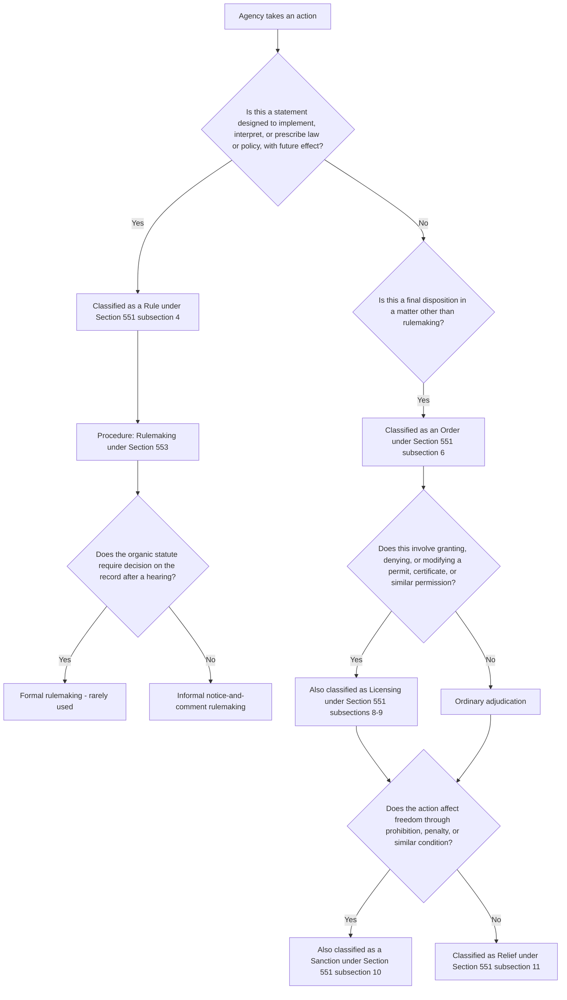

## Core Definitions: Agency, Rule, Order, License, and Sanction

### Overview

Section 551 of the Administrative Procedure Act (5 U.S.C. § 551) supplies the operative definitions that determine the scope and application of nearly every other provision in the Act. Whether a body qualifies as an "agency," whether a given action is a "rule" or an "order," and whether that action constitutes a "license" or "sanction" each trigger different procedural pathways and different standards of judicial review. These definitions function as gatekeeping concepts: getting the classification right is often the decisive step in determining which procedural requirements apply and how a court will review the resulting agency action.

### "Agency" — 5 U.S.C. § 551(1)

**Key Points**

- Defined broadly as "each authority of the Government of the United States, whether or not it is within or subject to review by another agency," subject to a list of specific exclusions.
- **Excluded entities** include Congress, the federal courts, the governments of U.S. territories or possessions, courts martial and military commissions, and (for many APA purposes) certain functions related to war or foreign affairs and to specific subject matters Congress has separately carved out.
- **The President**: The Supreme Court held in *Franklin v. Massachusetts* (1992) that the President is not an "agency" under the APA, meaning presidential action itself is generally not subject to APA judicial review, even though actions taken by agencies implementing a presidential directive remain reviewable. This distinction is significant for analyzing hybrid actions where a statute directs the President to make a determination that an agency subsequently implements.
- **Independent versus executive agencies**: The definition's phrase "whether or not it is within or subject to review by another agency" ensures that both executive-branch agencies subject to presidential oversight (such as EPA) and traditionally independent multimember commissions (such as FERC) fall within the definition, without regard to their structural independence or removal-protection status — the APA's definitional scope operates independently of the constitutional removal-power questions addressed elsewhere in this course.
- **Government corporations and government-controlled entities**: Bodies with substantial governmental characteristics and functions, even if organized in corporate form, may qualify as agencies depending on the degree of governmental control and function, a fact-specific inquiry courts have addressed inconsistently across different contexts (illustrated by the statutory characterization dispute over Amtrak's status discussed in connection with private nondelegation doctrine).
- **Practical significance**: Only entities meeting the "agency" definition are subject to the APA's rulemaking, adjudication, and judicial review provisions in the first place; if a body is not an "agency," its actions may escape APA scrutiny entirely (subject to other potential avenues of review, such as constitutional claims).

### "Rule" and "Rule Making" — 5 U.S.C. § 551(4)–(5)

**Key Points**

- A "rule" is defined as "the whole or a part of an agency statement of general or particular applicability and future effect designed to implement, interpret, or prescribe law or policy," and expressly includes agency statements concerning the organization, procedure, or practice requirements of an agency, as well as valuations, rates, wages, and similar matters.
- "Rule making" is defined as "the agency process for formulating, amending, or repealing a rule" — the procedural pathway (governed primarily by 5 U.S.C. § 553) through which rules are created.
- **General versus particular applicability**: The definition covers both rules of general applicability (such as a nationwide emissions standard applicable to an entire industry category) and rules of "particular applicability," a category that has generated substantial interpretive debate, since it blurs the traditional distinction between rulemaking (prospective, general policy-setting) and adjudication (retrospective, party-specific dispute resolution).
- **Future effect**: The "future effect" requirement is the key textual anchor distinguishing rules from orders; a rule generally operates prospectively to govern conduct going forward, while an order (as discussed below) typically resolves a specific matter based on past or present facts.
- **Legislative versus interpretive rules**: Courts have developed a distinction (not explicit in the statutory text but central to modern administrative law) between legislative rules (which carry the force of law and typically require notice-and-comment procedure) and interpretive rules, general statements of policy, and rules of agency organization, procedure, or practice (which are exempt from notice-and-comment under § 553(b)(A) but still fall within the broad statutory definition of "rule").
- **Environmental law example**: An EPA regulation establishing a National Ambient Air Quality Standard is a paradigmatic legislative rule — general applicability, prospective effect, and legally binding force — subject to full notice-and-comment rulemaking procedures.

### "Order" and "Adjudication" — 5 U.S.C. § 551(6)–(7)

**Key Points**

- An "order" is defined as "the whole or a part of a final disposition, whether affirmative, negative, injunctive, or declaratory in form, of an agency in a matter other than rule making but including licensing."
- "Adjudication" is defined as "the agency process for formulating an order" — the procedural pathway (governed primarily by 5 U.S.C. §§ 554, 556, 557 for formal adjudication) through which orders are issued.
- **Residual/negative definition**: The "order" definition is explicitly residual — it captures agency final dispositions that are "other than rule making," meaning the rule/order distinction functions as a binary classification covering essentially all agency action, with rulemaking and adjudication as the two fundamental categories of agency decision-making process.
- **Notably includes licensing**: The statutory text specifically clarifies that licensing actions (discussed below) are treated as a form of "order" for APA purposes, despite licensing's practical and functional similarities to rulemaking in some contexts (e.g., a general permitting scheme).
- **Formal versus informal adjudication**: As with rulemaking, adjudication divides into formal adjudication (triggered when an organic statute requires a decision "on the record after opportunity for an agency hearing," invoking the procedural protections of §§ 554, 556, and 557) and informal adjudication (the residual category, encompassing the vast majority of agency decisions, including many permitting and enforcement actions, subject to only the APA's general judicial review provisions rather than trial-type procedural requirements).
- **Environmental law example**: An EPA administrative enforcement action assessing a civil penalty against a specific facility for a Clean Water Act violation is an adjudication resulting in an order — a particularized disposition based on that facility's specific conduct, resolved through an adjudicatory process (potentially involving an ALJ) rather than through rulemaking.

### "License" and "Licensing" — 5 U.S.C. § 551(8)–(9)

**Key Points**

- A "license" is defined broadly to include "the whole or part of an agency permit, certificate, approval, registration, charter, membership, statutory exemption or other form of permission."
- "Licensing" is defined as "agency process respecting the grant, renewal, denial, revocation, suspension, annulment, withdrawal, limitation, amendment, modification, or conditioning of a license."
- Licensing is treated as a species of adjudication resulting in an order (per the "order" definition's explicit inclusion of licensing), even though the outcome (a permit or certificate) may function prospectively in a manner resembling a rule.
- **Environmental law significance**: This definition is central to environmental law because most environmental regulatory programs operate substantially through permitting — Clean Water Act NPDES permits, Clean Air Act Title V operating permits, RCRA hazardous waste permits, and similar mechanisms are all "licenses" for APA purposes, meaning their issuance, renewal, denial, or revocation is analyzed as licensing/adjudication rather than rulemaking, with corresponding procedural and judicial-review consequences.
- **Special provision for license renewal (5 U.S.C. § 558(c))**: The APA contains a specific provision addressing renewal of existing licenses, generally requiring that a licensee who has made a timely and sufficient renewal application not have their existing license lapse pending agency action on the renewal, absent good cause — a provision with direct relevance to ongoing environmental permit renewal disputes.

### "Sanction" and "Relief" — 5 U.S.C. § 551(10)–(11)

**Key Points**

- "Sanction" is defined expansively to include the whole or part of an agency prohibition, requirement, limitation, or other condition affecting the freedom of a person, and specifically enumerates actions such as withholding relief, imposing penalties or fines, destruction/seizure of property, assessment of damages or costs, and requiring or denying certificates, licenses, or other forms of permission.
- "Relief" is correspondingly defined to include the whole or part of an agency grant of money, assistance, license, authority, exemption, exception, privilege, or remedy, as well as recognition of a claim, right, immunity, or the taking of favorable action generally.
- **Sanctions in environmental enforcement**: Civil penalty assessments, compliance orders, permit revocations, and cease-and-desist directives issued by EPA or state environmental agencies against regulated entities for statutory or permit violations are paradigmatic "sanctions" under this definition, triggering the procedural protections associated with adjudication when imposed through formal proceedings.
- **Relief in environmental contexts**: Conversely, EPA's grant of a permit, an exemption from a regulatory requirement, or a favorable enforcement discretion determination would constitute "relief" under this framework.
- **Interaction with due process**: Because sanctions directly affect a regulated party's "freedom" (property or liberty interests in continuing an activity, maintaining a permit, or avoiding a penalty), the sanction/relief framework interacts closely with due process analysis regarding what procedural protections must attach before an agency may impose a sanction.

### The Rule/Order Dichotomy: Practical Consequences

**Key Points**

1. **Different procedural pathways**: Classification as a rule triggers rulemaking procedures under § 553 (or the more elaborate formal rulemaking procedures if the organic statute requires an on-the-record hearing); classification as an order triggers adjudicatory procedures under §§ 554, 556, 557 (if formal) or more minimal procedural requirements (if informal).
2. **Different judicial review postures**: Rules are typically challenged through pre-enforcement review in a court of appeals (often under a specific statutory review provision in the organic statute, such as the Clean Air Act's judicial review section), while orders resulting from adjudication are typically reviewed following the conclusion of the adjudicatory process, sometimes requiring exhaustion of administrative remedies first.
3. **Retroactivity concerns**: Because rules have "future effect" by definition, agencies generally cannot use rulemaking to impose retroactive liability; orders, by contrast, necessarily apply to past or present conduct already before the agency in a specific matter.
4. **The "general or particular applicability" ambiguity**: Because the "rule" definition covers both general and particular applicability, some agency actions that resemble individualized adjudications in substance (affecting a specific, small set of parties) may nonetheless be classified as rules if they operate prospectively and are framed in general terms, creating recurring classification disputes at the margins.

### Diagram: Classification Decision Framework

### Structural Diagram: The Section 551 Definitional Map

<svg xmlns="http://www.w3.org/2000/svg" viewBox="0 0 760 460">
<text x="380" y="28" font-size="16" font-weight="bold" text-anchor="middle" fill="#1a1a1a">APA Section 551 Core Definitions Map (svg_diagram)</text>
<rect x="290" y="50" width="180" height="60" rx="8" fill="#dbeafe" stroke="#1e40af" stroke-width="1.5" />
<text x="380" y="85" font-size="13" font-weight="bold" text-anchor="middle" fill="#1e3a8a">Agency Action</text>
<line x1="380" y1="110" x2="190" y2="150" stroke="#1a1a1a" stroke-width="2" marker-end="url(#arrowE)" />
<line x1="380" y1="110" x2="570" y2="150" stroke="#1a1a1a" stroke-width="2" marker-end="url(#arrowE)" />
<rect x="60" y="150" width="260" height="70" rx="8" fill="#dcfce7" stroke="#166534" stroke-width="1.5" />
<text x="190" y="178" font-size="13" font-weight="bold" text-anchor="middle" fill="#14532d">Rule (general/particular,</text>
<text x="190" y="198" font-size="13" font-weight="bold" text-anchor="middle" fill="#14532d">future effect)</text>
<rect x="440" y="150" width="260" height="70" rx="8" fill="#fef3c7" stroke="#92400e" stroke-width="1.5" />
<text x="570" y="178" font-size="13" font-weight="bold" text-anchor="middle" fill="#78350f">Order (final disposition,</text>
<text x="570" y="198" font-size="13" font-weight="bold" text-anchor="middle" fill="#78350f">other than rulemaking)</text>
<line x1="190" y1="220" x2="190" y2="255" stroke="#1a1a1a" stroke-width="2" marker-end="url(#arrowE)" />
<line x1="570" y1="220" x2="480" y2="255" stroke="#1a1a1a" stroke-width="2" marker-end="url(#arrowE)" />
<line x1="570" y1="220" x2="660" y2="255" stroke="#1a1a1a" stroke-width="2" marker-end="url(#arrowE)" />
<rect x="60" y="255" width="260" height="60" rx="8" fill="#f3f4f6" stroke="#4b5563" stroke-width="1.5" />
<text x="190" y="280" font-size="11" text-anchor="middle" fill="#1f2937">Rule Making process</text>
<text x="190" y="298" font-size="10" text-anchor="middle" fill="#1f2937">Section 553</text>
<rect x="350" y="255" width="260" height="60" rx="8" fill="#fee2e2" stroke="#991b1b" stroke-width="1.5" />
<text x="480" y="280" font-size="11" text-anchor="middle" fill="#7f1d1d">Licensing (permit, certificate,</text>
<text x="480" y="298" font-size="10" text-anchor="middle" fill="#7f1d1d">approval, registration)</text>
<rect x="620" y="255" width="120" height="60" rx="8" fill="#e0e7ff" stroke="#3730a3" stroke-width="1.5" />
<text x="680" y="280" font-size="10" text-anchor="middle" fill="#312e81">Ordinary</text>
<text x="680" y="296" font-size="10" text-anchor="middle" fill="#312e81">Adjudication</text>
<rect x="150" y="340" width="460" height="90" rx="8" fill="#f9fafb" stroke="#6b7280" stroke-width="1" />
<text x="380" y="365" font-size="12" font-weight="bold" text-anchor="middle" fill="#1a1a1a">Sanction vs. Relief (Section 551 subsections 10-11)</text>
<text x="380" y="388" font-size="10" text-anchor="middle" fill="#1a1a1a">Sanction: penalty, prohibition, revocation, seizure</text>
<text x="380" y="406" font-size="10" text-anchor="middle" fill="#1a1a1a">Relief: grant of money, license, exemption, or favorable action</text>
</svg>

### Illustrative Hypothetical Analysis

**Example**

*Scenario*: EPA takes three related actions regarding a class of industrial chemicals: (1) it issues a nationwide rule setting a new maximum discharge limit applicable to all facilities in a given industry category; (2) it denies a specific facility's application to renew its NPDES discharge permit based on the facility's history of violations; and (3) it assesses a civil penalty against that same facility for discharges exceeding its prior permit limits.

*Analysis*:

1. **Action 1 (nationwide discharge limit)**: This is a **rule** — a statement of general applicability with future effect, implementing the Clean Water Act's statutory framework. It must proceed through notice-and-comment rulemaking under § 553, and challenges to it would generally proceed through pre-enforcement review under the Clean Water Act's specific judicial review provision.
2. **Action 2 (permit renewal denial)**: This is **licensing**, a form of **order** — the denial of a permit renewal application is a final disposition in a matter other than rulemaking, specifically falling within the licensing definition's coverage of "denial" of a license. Because it also functions as a **sanction** in the broader sense of withholding relief and denying continued permission to operate, it triggers the adjudicatory procedural protections applicable to license denial actions, including the good-cause requirement for lapsing existing licenses under § 558(c) if a timely renewal application was filed.
3. **Action 3 (civil penalty assessment)**: This is a **sanction** resulting from an **order** issued through **adjudication** — a particularized disposition based on this facility's specific past conduct, imposing a monetary penalty (an enumerated example of a sanction under § 551(10)), likely requiring formal adjudicatory procedures if the Clean Water Act's enforcement provisions call for a hearing on the record.
4. **Conclusion**: A single EPA regulatory program can simultaneously generate rules, licensing orders, and sanctions, each subject to distinct procedural requirements and judicial review postures — illustrating why correctly classifying agency action under § 551 is often the threshold step in any APA analysis.

### Related Topics

- History and purposes of the 1946 Administrative Procedure Act
- Notice-and-comment rulemaking procedures under Section 553
- Formal versus informal adjudication under Sections 554, 556, and 557
- Judicial review standards: arbitrary and capricious versus substantial evidence
- The legislative rule versus interpretive rule distinction and its exemption from notice-and-comment
- Permitting frameworks under the Clean Water Act, Clean Air Act, and RCRA as licensing under the APA
- *Franklin v. Massachusetts* and the exclusion of presidential action from APA review
- Due process protections attaching to sanctions and license revocations