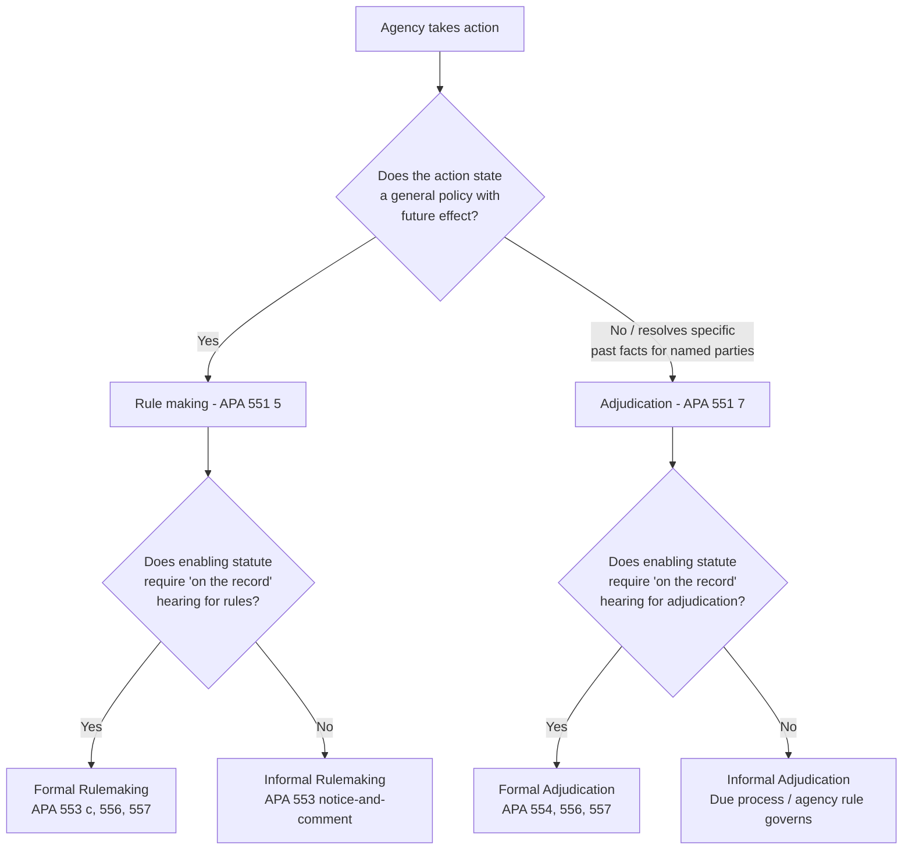

## The Procedural Taxonomy of Rulemaking versus Adjudication

### Overview

The distinction between rulemaking and adjudication is the foundational architectural choice built into the Administrative Procedure Act (APA). Every procedural obligation an agency owes — notice, hearing rights, evidentiary standards, judicial review posture — flows from which of these two categories the agency's action falls into. The APA does not regulate "administrative action" as an undifferentiated mass; it regulates two structurally distinct modes of agency output, each with its own definitional section, its own procedural track, and its own review standard.

### Statutory Definitions

The APA defines these terms by reference to their products, not by reference to the process itself — a circularity Congress resolved by defining "rule" and "order" first, then defining "rule making" and "adjudication" as the processes for producing them.

**Rule making** is defined as "agency process for formulating, amending, or repealing a rule."

**Rule** is defined as "the whole or a part of an agency statement of general or particular applicability and future effect designed to implement, interpret, or prescribe law or policy."

**Adjudication** is defined as "agency process for the formulation of an order."

**Order** is defined as "the whole or a part of a final disposition... of an agency in a matter other than rule making but including licensing."

Note the residual structure: adjudication is defined negatively, as everything that is *not* rulemaking (with licensing pulled back in as an express inclusion). This means the taxonomy is not two independent categories but one affirmative category (rulemaking) and one catch-all (adjudication).

### The Core Distinguishing Criteria

**1. Temporal Orientation**

- Rulemaking is prospective — it has "future effect." A rule governs conduct that has not yet occurred.
- Adjudication is retrospective — it resolves a "final disposition" concerning past or existing facts, applying existing law to a completed set of circumstances.

**2. Applicability**

- Rulemaking produces statements of "general or particular applicability" — but in practice, general applicability is the paradigm case: a rule binds a class of persons defined by their characteristics, not by name.
- Adjudication resolves matters concerning specifically named parties. The order binds the parties to that proceeding.

**3. Function**

- Rulemaking is legislative in character — the agency acts as a delegated legislature, filling in statutory details through policy formulation.
- Adjudication is judicial in character — the agency acts as a delegated court, applying law to a specific factual record to produce a binding disposition.

### The *Londoner*/*Bi-Metallic* Distinction (Constitutional Antecedent)

Before the APA codified this taxonomy in 1946, the Supreme Court had already drawn the constitutional version of the same line, and this case pair remains the conceptual bedrock for why the distinction matters.

- **Londoner v. City and County of Denver** (1908): A city assessed a special tax against a small, identifiable group of property owners for a street paving project. [Unverified — case-specific procedural holding] Because the assessment turned on facts particular to each parcel and owner, the Court held due process required individualized notice and an opportunity to be heard.
- **Bi-Metallic Investment Co. v. State Board of Equalization** (1915): Colorado increased the valuation of all taxable property in Denver by a flat percentage. Justice Holmes held that when a rule of general applicability affects a large number of people, the ordinary political process — not individualized hearings — is the constitutionally adequate check. "Where a rule of conduct applies to more than a few people it is impracticable that everyone should have a direct voice in its adoption."

This pairing establishes the functional test still used today: **the smaller and more identifiable the affected class, and the more the decision turns on adjudicative facts specific to that class, the more it resembles adjudication and triggers individualized hearing rights.** The larger and more general the class, and the more the decision turns on legislative facts (policy, statistics, predictive judgments), the more it resembles rulemaking and triggers only general participatory procedures (notice-and-comment).

### Procedural Tracks Under the APA

Each category bifurcates further into an "informal" and "formal" track, creating four total procedural modes.

**Informal (Notice-and-Comment) Rulemaking — APA §553**

- Publication of a Notice of Proposed Rulemaking (NPRM) in the Federal Register
- Opportunity for "interested persons" to submit written data, views, or arguments (comments)
- Publication of the final rule with a "concise general statement of its basis and purpose"
- No trial-type hearing; no cross-examination; no exclusive evidentiary record requirement (though courts have layered on de facto record requirements through hard-look review)

**Formal Rulemaking — APA §§553(c), 556, 557**

- Triggered only when the enabling statute requires rules to be made "on the record after opportunity for an agency hearing"
- Imports trial-type procedures: presiding officer, oral evidence, cross-examination, exclusive record, and an initial or recommended decision
- Rare in practice; the Supreme Court in *United States v. Florida East Coast Railway Co.* (1973) construed the triggering language narrowly, holding that a statute must use the specific "on the record" phrasing (or its functional equivalent) to mandate formal rulemaking, sharply limiting its use

**Formal Adjudication — APA §§554, 556, 557**

- Triggered when a statute requires adjudication "on the record after opportunity for an agency hearing" — the default posture for adjudication of individual rights (licensing revocations, benefits denials, enforcement actions)
- Includes: an unbiased decisionmaker (often an Administrative Law Judge), the right to present evidence, cross-examine witnesses, an exclusive record for decision, and a reasoned decision subject to administrative and judicial appeal

**Informal Adjudication — Residual Category**

- Everything adjudicative that does not trigger §554's formal procedures
- The APA imposes almost no specific procedural template here; procedural content is instead supplied by the enabling statute, agency regulations, and constitutional due process (under the *Mathews v. Eldridge* balancing test)
- This is, numerically, the largest bucket of federal agency action — most permit denials, informal denials of benefits, and routine enforcement decisions fall here

### Comparative Table

| Dimension | Rulemaking | Adjudication |
| --- | --- | --- |
| APA definition | §551(5) | §551(7) |
| Product | Rule | Order |
| Temporal effect | Prospective (future effect) | Retrospective (past/existing facts) |
| Applicability | General (typically) | Particular (named parties) |
| Character | Legislative | Judicial |
| Default informal procedure | §553 notice-and-comment | No default; governed by due process/agency rule |
| Formal-track trigger | "on the record" language (rare) | "on the record" language (common) |
| Formal-track sections | §§556–557 | §554, §§556–557 |
| Review posture | Arbitrary-and-capricious / hard-look | Substantial evidence (formal) / arbitrary-and-capricious (informal) |
| Judicial deference to underlying interpretation | *Chevron*-lineage (pre-*Loper Bright*) doctrines | Same, but often filtered through *Skidmore* for adjudicative interpretations |

### Hybrid and Contested Zones

The clean taxonomy breaks down at several recurring pressure points, and these are the areas most tested and most litigated.

**1. Rulemaking that resembles adjudication.** When an agency issues a rule affecting a small, closed class of specifically identifiable entities (e.g., a rate order affecting a single named utility), courts ask whether the *Bi-Metallic* rationale still applies. [Inference] The more particularized the impact, the stronger the argument for adjudicative-style process, even where the agency has labeled its action a "rule."

**2. Adjudication that makes policy.** Agencies frequently announce generally applicable legal rules through adjudicative orders rather than rulemaking — a technique the Supreme Court sanctioned in **SEC v. Chenery Corp. (II)** (1947), holding that an agency has discretion to proceed by adjudication rather than rulemaking even where the adjudicated order has broad prospective, rule-like effect. This creates a structural loophole: agencies can achieve general-policy effect while avoiding §553's notice-and-comment burdens, provided they act through the adjudicatory form.

**3. Licensing.** The APA folds licensing into the "order"/adjudication category by express definition, even though license grants and denials often affect open-ended future conduct in a rule-like way. §558 supplies specialized procedural protections (particularly around license renewal, suspension, and revocation) layered on top of the general adjudication framework.

**4. Interpretive rules, policy statements, and general statements of policy.** §553(b)(A) exempts these from notice-and-comment, but they are still nominally "rules" under §551(5)'s broad definition. The line between an exempt policy statement and a substantive rule requiring notice-and-comment turns on whether the agency statement has genuinely binding, present effect on regulated parties — a test articulated across cases like *American Mining Congress v. EPA* and *Pacific Gas & Electric Co. v. FPC*, focusing on whether the agency has retained discretion to depart from the stated policy in individual cases.

### Diagram: Decision Flow for Classifying Agency Action

### Practical Illustration

**Example — Environmental Law Context:**

- An EPA rule setting a nationwide ambient air quality standard for a pollutant, applicable to all sources in that category, is **rulemaking**: prospective, general, policy-formulating. It proceeds through §553 notice-and-comment (and, under the Clean Air Act, additional statute-specific procedural overlays).
- EPA's denial of a specific facility's application for a Clean Water Act discharge permit, based on that facility's particular effluent characteristics, is **adjudication** (specifically, licensing-adjudication under §551(7)/§558): retrospective application of existing standards to one named party's factual record.
- If EPA instead announces, through the adjudicated denial of that one facility's permit, a general interpretive principle it intends to apply to all similarly situated facilities going forward, it has used *Chenery II*'s adjudication-as-policymaking technique — technically adjudication in form, but rule-like in substantive effect.

### Judicial Review Consequences

The taxonomy is not academic — it dictates the standard of review a reviewing court applies under APA §706.

- Informal rulemaking and informal adjudication are both reviewed under the **arbitrary and capricious** standard (§706(2)(A)), though courts apply the "hard look" doctrine more rigorously to rulemaking records built through comment-and-response.
- Formal rulemaking and formal adjudication are reviewed under the **substantial evidence** standard (§706(2)(E)), which requires the agency's factual findings to be supported by the exclusive administrative record compiled at the formal hearing.

[Inference] Because formal procedures are rare outside ratemaking and certain licensing contexts, in practice the operative distinction most administrative law students and practitioners encounter is informal rulemaking versus informal adjudication, with the formal track functioning largely as a doctrinal reference point rather than the dominant mode of agency action.

**Related Topics**

- §553 notice-and-comment rulemaking procedure in detail (NPRM, comment period, final rule, logical outgrowth doctrine)
- §554/556/557 formal adjudication procedure and the role of Administrative Law Judges
- The *Chenery* doctrine and agency choice between rulemaking and adjudication
- Exemptions from rulemaking: interpretive rules, policy statements, and procedural rules under §553(b)
- The *Mathews v. Eldridge* due process balancing test for informal adjudication
- Formal rulemaking's near-extinction after *United States v. Florida East Coast Railway Co.*
- Licensing procedures under APA §558
- Hybrid rulemaking procedures imposed by organic statutes (e.g., Clean Air Act §307, TSCA)