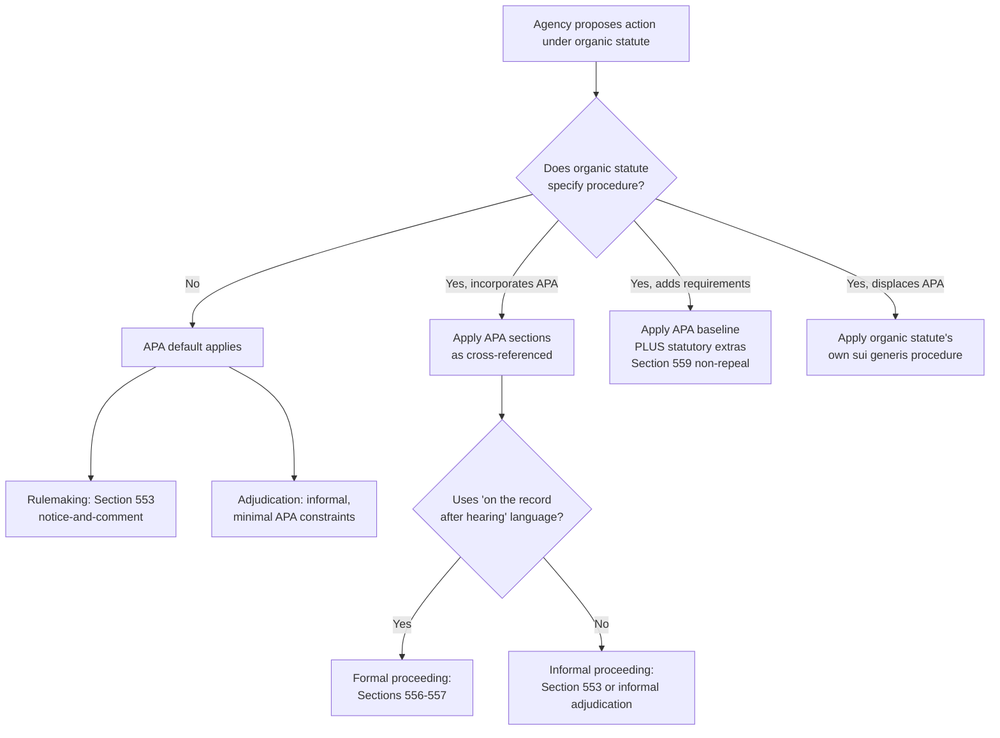

## Relationship Between the APA and Agency Organic Statutes

### Overview

The Administrative Procedure Act (APA), codified at 5 U.S.C. §§ 551–559 (rulemaking and adjudication procedures) and §§ 701–706 (judicial review), functions as a **default procedural framework** that applies to federal agencies unless displaced or supplemented by an agency's own **organic statute** — the enabling legislation that creates the agency, defines its jurisdiction, and grants it substantive authority. Understanding how these two bodies of law interact is foundational to administrative law analysis, since virtually every agency action requires layering organic-statute authority with APA procedural requirements.

### The APA as a "Backstop" Statute

**Key Points**

- The APA was enacted in 1946 as a uniform, cross-agency procedural code, applicable "except to the extent that" a more specific statute provides otherwise (5 U.S.C. § 559).
- It does not grant agencies substantive authority to regulate; it only governs *how* agencies must exercise whatever substantive authority Congress has already granted elsewhere.
- The organic statute answers "*can* the agency do X?" The APA answers "*how* must the agency do X, procedurally?"

This dual structure means no single statute can be read in isolation. A practitioner must always ask two separate questions:

1. **Substantive/jurisdictional question** — Does the organic statute authorize this action? (e.g., does the Clean Air Act authorize EPA to set this particular standard?)
2. **Procedural question** — What procedure governs how the agency reaches and announces that action? (e.g., must EPA use notice-and-comment rulemaking under § 553, or something more/less formal?)

### Statutory Text Governing the Relationship

5 U.S.C. § 559 is the operative provision:

> "This subchapter, chapter 7, and the provisions of section 552 of this title do not limit or repeal additional requirements imposed by statute or otherwise recognized by law. Except as otherwise required by law, this subchapter and chapter 7 do not supersede or modify the provisions of any other statute."

Two distinct rules flow from this text:

- **Non-repeal rule**: The APA does not repeal or displace *additional* procedural protections that an organic statute layers on top of the APA's baseline (e.g., a statute requiring a public hearing beyond what § 553 demands).
- **Non-supersession rule**: The APA does not override *conflicting* organic-statute procedures unless the organic statute is itself construed to incorporate APA procedures, or unless "otherwise required by law."

**[Inference]** In practice, courts often resolve apparent conflicts by treating the organic statute as *lex specialis* (the more specific law controls) relative to the APA's general default — though the precise interaction depends heavily on the organic statute's own text and legislative history.

### Modes of Interaction

There are four principal ways an organic statute can relate to the APA's default procedures.

#### 1. Silence — APA Defaults Apply

If the organic statute authorizes rulemaking or adjudication but says nothing about procedure, the APA's default track governs:

- **Rulemaking**: informal ("notice-and-comment") rulemaking under § 553, unless the organic statute's language triggers formal rulemaking.
- **Adjudication**: formal adjudication under §§ 554, 556–557 applies only if a hearing is required "on the record after opportunity for an agency hearing" — otherwise, the agency may use informal adjudication with minimal APA constraints.

#### 2. Incorporation by Reference

Many organic statutes explicitly invoke APA procedures — e.g., "rules shall be issued in accordance with section 553 of title 5" or "on the record after opportunity for a hearing in accordance with section 556 and 557." This eliminates interpretive ambiguity and directly imports the APA machinery.

#### 3. Supplementation ("APA-Plus")

An organic statute may layer additional procedural requirements *on top of* APA baseline requirements without replacing them. Common examples:

- **Hybrid rulemaking** statutes requiring a rulemaking record, cross-examination rights, or specific comment periods beyond § 553's minimums (e.g., the Magnuson-Moss Warranty Act's FTC rulemaking provisions, the Clean Air Act's § 307(d) rulemaking docket requirements).
- Statutorily mandated cost-benefit analyses, small-business impact statements, or environmental review (NEPA) that stack onto the APA's notice-and-comment floor.

Because § 559 protects "additional requirements," these supplemental procedures survive alongside — not instead of — the APA.

#### 4. Displacement/Exemption

An organic statute may expressly exempt an agency action from APA procedures altogether. Common displacement patterns:

- Statutes directing agencies to act by adjudication-like orders exempt from § 553 (e.g., certain benefits determinations).
- National security, foreign affairs, military, or contract/grant exemptions that track or expand the APA's own § 553(a) exemptions.
- Statutes creating **sui generis** procedures wholly independent of the APA model (e.g., certain formal licensing schemes with their own hearing rules).

**[Unverified]** Whether a given exemption is "complete" (ousting APA judicial review too) or merely procedural (leaving § 706 judicial review intact) is a recurring interpretive dispute that depends on the specific statutory language and is not resolvable as a general rule.

### Interaction with Judicial Review Provisions

The APA's judicial review chapter (5 U.S.C. §§ 701–706) is itself subject to organic-statute displacement:

- § 701(a)(1) excludes review "to the extent that statutes preclude judicial review" — so an organic statute can foreclose APA review entirely for certain actions.
- § 701(a)(2) excludes review of action "committed to agency discretion by law," a standard often informed by how much discretion the organic statute confers.
- Many organic statutes contain **special review provisions** designating a specific court (often a court of appeals, bypassing district court) and specific timing/venue rules (e.g., Hobbs Act review provisions used by the FCC, EPA under certain CAA provisions, and others). Where such special review statutes exist, they generally control over the APA's default judicial review pathway.

### Formal vs. Informal Triggering Language

A recurring technical question is what organic-statute language triggers **formal** (on-the-record) proceedings under §§ 556–557 rather than **informal** proceedings under § 553/informal adjudication.

- The Supreme Court's canonical framework comes from *United States v. Florida East Coast Railway Co.*, 410 U.S. 224 (1973): formal rulemaking is required only when the organic statute uses the specific phrase "on the record after opportunity for an agency hearing" (or functionally equivalent language), not merely "after hearing" or "after notice and hearing."
- Courts examine the organic statute's precise wording, structural context, and sometimes legislative history to determine whether Congress intended to trigger the APA's formal track.

**[Inference]** This has led to informal rulemaking becoming the dominant mode of agency rulemaking in modern practice, since few organic statutes use the "on the record" magic words, and agencies/courts have generally resisted expanding formal rulemaking's reach given its cost and rigidity.

### Diagram: Decision Flow for Determining Applicable Procedure

### Illustrative Example

**Example**

Consider a hypothetical organic statute for the fictional "Federal Water Quality Board" that states:

> "The Board shall promulgate emission standards after providing notice and an opportunity for public comment, and shall additionally convene a public hearing with the right of interested parties to submit rebuttal evidence."

Analysis:

1. **Substantive authority**: The organic statute grants rulemaking power over emission standards — this satisfies the threshold "can the agency act" question.
2. **Baseline procedure**: "Notice and an opportunity for public comment" tracks § 553's informal rulemaking language — the APA's default informal track applies.
3. **Supplementation**: The additional "public hearing with rebuttal evidence" requirement is *not* found in § 553. Under § 559's non-repeal principle, this becomes an **added** procedural layer — informal rulemaking "plus" a hearing requirement — not a switch to full formal rulemaking under §§ 556–557, because the "on the record after opportunity for an agency hearing" trigger language is absent.
4. **Judicial review**: If the organic statute is silent on review, APA §§ 701–706 governs, applying the arbitrary-and-capricious standard under § 706(2)(A) to the final rule.

### Environmental Law Application

Administrative & Environmental Law contexts frequently illustrate this relationship:

- **Clean Air Act § 307(d)**: Establishes a hybrid rulemaking procedure for many EPA actions — more elaborate than § 553 (requiring a structured rulemaking docket, statement of basis and purpose responding to significant comments, and a defined administrative record for judicial review) but short of full formal rulemaking. This is a textbook "supplementation" case.
- **Clean Water Act NPDES permitting**: Blends APA adjudication concepts with CWA-specific permit procedures under 40 C.F.R. Part 124, often triggering formal adjudicatory hearing rights in certain contested permit proceedings.
- **NEPA**: Operates as a cross-cutting procedural statute that layers environmental review obligations onto whatever substantive rulemaking or licensing procedure the organic statute and APA otherwise require — a further illustration of the "additional requirements" principle under § 559.

**[Unverified]** The degree to which CAA § 307(d)-style hybrid procedures should be characterized doctrinally as "supplementing" versus "substituting for" § 553 has been the subject of scholarly debate; the majority characterization treats it as a supplemental/hybrid regime layered on the APA framework.

### Practical Analytical Framework

**Key Points**

When analyzing any agency action, apply this sequence:

1. Identify the organic statute provision authorizing the specific action.
2. Determine if the organic statute prescribes procedure; if silent, default to APA §§ 553 (rulemaking) or informal adjudication.
3. Check for "magic words" triggering formal proceedings (§§ 556–557).
4. Identify any organic-statute provisions that add requirements (§ 559 non-repeal) — these survive alongside APA baseline.
5. Identify any organic-statute provisions that displace APA judicial review (special review statutes, preclusion clauses, § 701(a) carve-outs).
6. Cross-check for cross-cutting statutes (NEPA, RFA, Paperwork Reduction Act, Congressional Review Act) that impose independent procedural obligations regardless of the organic statute's own text.

### Conclusion

The APA and an agency's organic statute operate as complementary, not competing, sources of law: the organic statute is the exclusive source of an agency's *substantive* authority to act, while the APA supplies the *default procedural chassis*, subject to express incorporation, supplementation, or displacement by the organic statute itself under the interpretive rules of 5 U.S.C. § 559. Mastery of administrative law requires fluency in reading these two texts together rather than treating the APA as a freestanding, self-sufficient code.

**Related Topics**

- Formal vs. informal rulemaking triggers and the "magic words" doctrine (*Florida East Coast Railway*)
- Section 553 notice-and-comment rulemaking mechanics and exemptions
- Formal adjudication under Sections 554, 556–557
- Section 701(a) preclusion of review and committed-to-agency-discretion doctrine
- Special statutory review provisions and the Hobbs Act review model
- Hybrid rulemaking regimes (Clean Air Act § 307(d), Magnuson-Moss Act)
- NEPA as a cross-cutting procedural overlay
- Chevron/Loper Bright-era deference and its interaction with organic-statute interpretation
- The Congressional Review Act's relationship to APA rulemaking