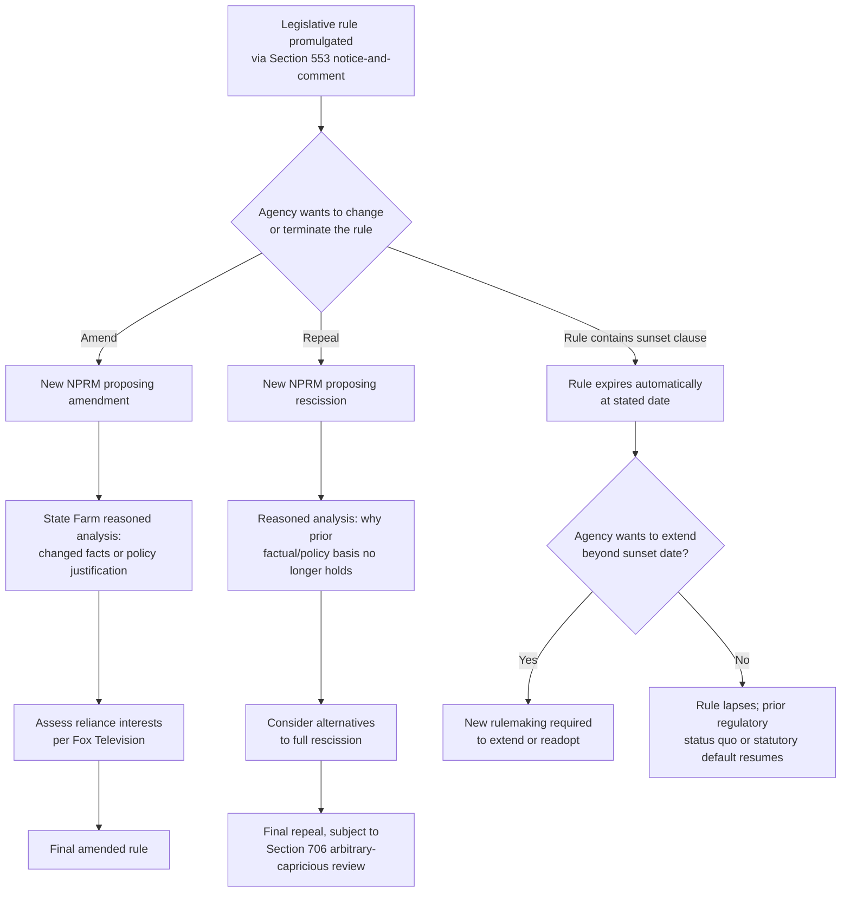

## Amendment, Repeal, and Sunset of Existing Rules

### Overview

Once an agency has promulgated a legislative rule through the Administrative Procedure Act's rulemaking procedures, that rule does not remain frozen. Agencies frequently need to amend, repeal, or allow rules to expire through sunset mechanisms. A foundational principle of administrative law is that **undoing a rule generally requires the same procedural formality used to create it** — but this principle has important exceptions, nuances, and recent doctrinal developments that significantly affect agency flexibility.

### The Symmetry Principle

**Key Points**

- 5 U.S.C. § 551(5) defines "rule making" to include "agency process for formulating, amending, or repealing a rule" — meaning amendment and repeal are themselves "rule making" subject to the same APA procedures as original promulgation.
- This creates a **procedural symmetry principle**: if a rule was issued through notice-and-comment under § 553, then amending or repealing it generally also requires notice-and-comment.
- The doctrinal foundation is often traced to *Motor Vehicle Mfrs. Ass'n v. State Farm Mutual Automobile Insurance Co.*, 463 U.S. 29 (1983), which held that an agency rescinding a rule must supply a reasoned analysis for the change, not merely a lesser justification than would be required for a new rule.

**[Inference]** The symmetry principle is sometimes described as flowing from separation-of-powers and rule-of-law concerns — agencies should not be able to easily unwind considered policy judgments without public participation — though the precise doctrinal grounding blends statutory text (§ 551(5)) with judicially developed reasoned-decisionmaking requirements.

### Amendment of Existing Rules

#### Procedural Requirements

Amending a legislative rule generally requires:

1. A new notice-and-comment proceeding under § 553 (unless an exemption applies).
2. A reasoned explanation for the change, addressing:
   - Why the prior rule's justification no longer holds, or why circumstances have changed.
   - Reliance interests that regulated parties or the public may have developed under the old rule.
   - Whether the agency considered relevant alternatives to the proposed amendment.

#### The Reasoned Explanation Standard for Policy Changes

*FCC v. Fox Television Stations, Inc.*, 556 U.S. 502 (2009), clarified that an agency changing policy need not demonstrate that the new policy is *better* than the old one by some heightened standard — it need only show that the new policy is permissible under the statute, that there are good reasons for it, and that the agency believes it to be better. However, Fox also held that:

- The agency must display **awareness that it is changing position**.
- If the new policy rests on factual findings that contradict prior findings, or if the prior policy engendered **serious reliance interests**, the agency must provide a **more detailed justification** than would suffice for a new rule adopted on a blank slate.

**[Inference]** This "more detailed justification" requirement for reliance-disrupting changes has become a significant battleground in litigation over agency policy reversals across administrations, with courts sometimes disagreeing about how substantial the reliance interest must be to trigger heightened scrutiny.

#### Example: Amendment Analysis

**Example**

Suppose EPA promulgated a rule in 2015 setting a numeric effluent limitation for a pollutant, following full notice-and-comment, based on then-available treatment technology data. In 2026, EPA proposes to relax that limitation, citing new technology cost data.

Required steps:

1. **New notice-and-comment**: EPA must publish a Notice of Proposed Rulemaking (NPRM) proposing the amendment, since the original rule was legislative and issued via § 553.
2. **State Farm reasoned analysis**: EPA must explain why the factual or policy basis for the original limitation has changed — not merely assert a preference for a different outcome.
3. **Reliance interest assessment**: If regulated entities invested capital in treatment systems designed to meet the original limitation, EPA arguably must address whether and how the amendment accounts for those reliance interests (per Fox Television's reliance-interest doctrine).
4. **Record support**: The agency's technical justification (e.g., updated cost-of-compliance data) must be adequately supported in the rulemaking record to survive arbitrary-and-capricious review under § 706(2)(A).

### Repeal of Existing Rules

#### Full Notice-and-Comment for Rescission

*State Farm* remains the leading case: NHTSA's rescission of a passive-restraint (automatic seatbelt/airbag) requirement was held arbitrary and capricious because the agency failed to consider a less drastic alternative (airbags alone) and failed to adequately justify reversing its earlier factual findings about the safety benefits of passive restraints.

**Key Points from State Farm's framework:**

- Rescinding a rule is treated as **equivalent in procedural weight** to promulgating a new rule — the agency cannot simply "unpromulgate" without new notice-and-comment and adequate reasoned justification.
- An agency changing course must consider **whether its factual predicates have changed**, and if not, must explain why its policy judgment has changed despite unchanged facts.
- Failure to consider **obvious alternatives** to outright rescission (such as amendment short of full repeal) can independently render a rescission arbitrary and capricious.

#### Distinguishing Repeal of Interpretive Rules

As addressed in the companion topic on exemptions, *Perez v. Mortgage Bankers Ass'n*, 575 U.S. 92 (2015), held that agencies need **not** use notice-and-comment to amend or repeal **interpretive** rules, even long-standing ones — abrogating the D.C. Circuit's *Paralyzed Veterans* doctrine. This creates an important asymmetry:

| Rule Type | Amendment/Repeal Procedure Required |
| --- | --- |
| Legislative rule (issued via § 553) | Notice-and-comment generally required (symmetry principle) |
| Interpretive rule | No notice-and-comment required (*Perez*) |
| General statement of policy | No notice-and-comment required |
| Procedural rule | No notice-and-comment required |

**[Unverified]** Some courts and commentators have questioned whether *Perez*'s holding creates incentives for agencies to characterize rules as "interpretive" specifically to preserve unilateral repeal flexibility — this remains a debated strategic and doctrinal question rather than a settled empirical finding.

### Sunset Provisions and Automatic Expiration

Sunset mechanisms differ from amendment/repeal because they build expiration into the rule's original text rather than requiring a subsequent rulemaking action to terminate it.

#### Types of Sunset Mechanisms

1. **Statutory sunset clauses** — Congress builds an expiration date into the organic statute itself, after which the underlying regulatory authority or program lapses unless reauthorized (common in appropriations riders, emergency authorizations, and some regulatory programs).
2. **Regulatory sunset provisions** — An agency voluntarily includes an expiration date in a rule's own text (e.g., "this rule shall expire on [date] unless readopted"), often used for:
   - Interim or emergency rules issued under the good cause exemption, intended as temporary bridges.
   - Pilot programs or experimental regulatory approaches.
3. **Periodic review requirements** — Executive orders (e.g., E.O. 13563's retrospective review directive) and some organic statutes require agencies to periodically review existing rules for continued necessity, though these typically don't create automatic expiration — they create a review *obligation*.

#### Procedural Treatment of Sunset-Triggered Termination

**[Inference]** When a rule expires by its own sunset terms, the termination is generally understood not to require a new notice-and-comment rulemaking, because the "repeal" was already accomplished — and subjected to public comment — at the time the sunset provision itself was adopted. However, if an agency wishes to *extend* a sunsetting rule beyond its stated expiration, that extension would typically be treated as a new rulemaking action requiring its own procedural compliance, since it modifies the previously noticed terms.

#### Good Cause and Interim Final Rules with Sunset Clauses

Agencies sometimes pair the good cause exemption (§ 553(b)(B)) with a sunset clause to justify bypassing pre-promulgation notice-and-comment for urgent action, while still providing eventual public input:

- The agency issues an **interim final rule (IFR)** effective immediately (invoking good cause), paired with a **post-promulgation comment period**.
- The IFR often includes a sunset or "unless finalized by [date]" clause, converting to a permanent rule only after considering comments, or lapsing if the agency does not act.

**Example**

During a public health emergency, an agency issues an interim final rule modifying a permitting deadline, effective immediately under the good cause exemption, with a 60-day post-promulgation comment period and an automatic sunset 180 days later unless the agency issues a final rule incorporating public comments. This structure attempts to balance urgency against the APA's participatory values.

### Diagram: Lifecycle of a Rule Through Amendment, Repeal, or Sunset

### Judicial Review Standard for Amendments and Repeals

Amendments and repeals, like original rules, are reviewed under § 706(2)(A)'s arbitrary-and-capricious standard. Courts examine:

- Whether the agency **articulated a satisfactory explanation** for its action, including a rational connection between facts found and the choice made (the *State Farm* formulation, itself drawing on *Burlington Truck Lines v. United States*, 371 U.S. 156 (1962)).
- Whether the agency **considered relevant factors** and did not ignore an important aspect of the problem.
- Whether the agency's explanation runs counter to the evidence before it, or is so implausible that it could not be ascribed to a difference in view or agency expertise.

**[Inference]** Post-*Loper Bright Enterprises v. Raimondo*, 603 U.S. 369 (2024) (eliminating *Chevron* deference to agency statutory interpretations), courts reviewing whether an amended or repealed rule remains within statutory authority now apply independent judgment to the underlying statutory question, which may increase litigation risk for agencies attempting significant policy reversals that depend on a reinterpretation of ambiguous statutory terms — though the practical scope of this shift is still developing in case law.

### Environmental Law Applications

- **Regulatory rollback litigation**: Environmental deregulation efforts (e.g., attempts to repeal or narrow Clean Power Plan-type rules, WOTUS redefinitions, vehicle emissions standards) have repeatedly tested the *State Farm*/*Fox* framework, since environmental rules often involve substantial industry reliance interests (capital investment in compliance technology) as well as public health reliance interests.
- **Sunset provisions in permits and emergency rules**: EPA and state environmental agencies frequently use sunset-style mechanisms in emergency air-quality orders, temporary variances, and pilot permitting programs.
- **Periodic review mandates**: Some environmental statutes (e.g., certain Clean Air Act NAAQS review cycles under § 109(d), requiring periodic reconsideration of air quality standards) function as quasi-sunset mechanisms, compelling agencies to revisit rules on a fixed schedule even without full automatic expiration.

### Conclusion

Amendment, repeal, and sunset each represent distinct procedural pathways for altering an existing rule's legal force, but they share a common thread: courts insist that agencies cannot escape reasoned decisionmaking simply because they are undoing rather than creating a rule. The symmetry principle embedded in § 551(5)'s definition of "rule making," reinforced by *State Farm* and refined by *Fox Television* and *Perez*, means that legislative rule amendments and repeals require the same notice-and-comment rigor as original promulgation, while interpretive rules and sunset-triggered expirations follow more flexible paths. Practitioners must carefully classify both the original rule type and the nature of the contemplated change to determine which procedural track applies.

**Related Topics**

- *Motor Vehicle Mfrs. Ass'n v. State Farm* and the reasoned decisionmaking standard
- *FCC v. Fox Television Stations* and the reliance-interest doctrine for policy reversals
- *Perez v. Mortgage Bankers Ass'n* and the interpretive rule repeal asymmetry
- Interim final rules and post-promulgation comment structures
- Retrospective review executive orders (E.O. 13563 and successors)
- *Loper Bright* and post-*Chevron* judicial review of agency statutory reinterpretation
- Arbitrary-and-capricious review under Section 706(2)(A)
- Regulatory reliance interests in environmental deregulation litigation
- NAAQS periodic review cycles under Clean Air Act Section 109(d)