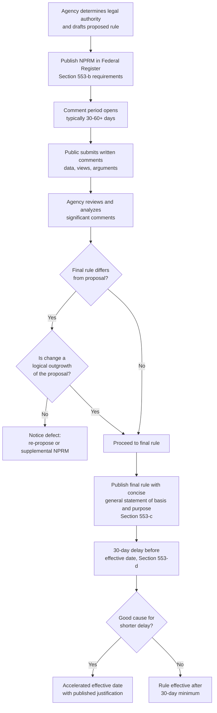

## Section 553 Procedural Requirements

### Overview

5 U.S.C. § 553 establishes the core procedural framework for federal agency rulemaking — commonly called "informal" or "notice-and-comment" rulemaking. It is the single most frequently invoked provision in administrative law practice, governing the vast majority of federal regulations. Section 553 divides into three operative subsections: (a) scope/exemptions, (b) required contents of notice, and (c) the comment and publication requirements, with (d) and (e) addressing effective dates and petitions for rulemaking respectively.

### Structural Breakdown of Section 553

**Key Points**

- **§ 553(a)** — Scope and exemptions (military/foreign affairs; management, personnel, public property, loans, grants, benefits, contracts).
- **§ 553(b)** — Contents required in a Notice of Proposed Rulemaking (NPRM), plus exemptions for interpretive rules, policy statements, procedural rules, and good cause.
- **§ 553(c)** — Comment opportunity and the requirement of a "concise general statement of basis and purpose" in the final rule.
- **§ 553(d)** — 30-day minimum delay before a substantive rule's effective date, with exceptions.
- **§ 553(e)** — Right of interested persons to petition for issuance, amendment, or repeal of a rule.

### Step 1: Notice of Proposed Rulemaking — § 553(b)

An agency initiating informal rulemaking must publish a notice in the *Federal Register* containing:

1. **A statement of the time, place, and nature of public rulemaking proceedings** — typically the comment period dates and submission method (now almost universally electronic via regulations.gov).
2. **Reference to the legal authority under which the rule is proposed** — the specific statutory citation empowering the agency to act (this ties directly back to the organic-statute analysis).
3. **Either the terms or substance of the proposed rule, or a description of the subjects and issues involved** — the "logical outgrowth" doctrine (discussed below) governs how much specificity is required.

**[Inference]** In contemporary practice, agencies almost always publish the full proposed regulatory text rather than relying on the more minimal "description of subjects and issues" option, largely to reduce litigation risk regarding adequacy of notice and to allow more precise public comment — though this is an evolved practice norm rather than a strict textual requirement of § 553(b).

#### The Logical Outgrowth Doctrine

Because a final rule often differs from the proposed rule (reflecting public input), courts have developed the **logical outgrowth test** to determine whether the final rule still satisfies § 553(b)'s notice requirement:

- A final rule is a permissible "logical outgrowth" of the proposal if interested parties **should have anticipated** that the change was possible, and thus should have filed comments addressing it.
- If the final rule is **substantially different** from the proposal such that affected parties would have had no reason to comment on the actual approach ultimately adopted, the agency has committed a notice violation, and courts may vacate or remand the rule.

**Example**

EPA proposes a rule setting a numeric limit of 50 ppm for a pollutant with a stated range of "between 25 and 75 ppm" under consideration. The final rule adopts 60 ppm. This is likely a logical outgrowth, since commenters were on notice that values within that range were live options. If, however, EPA's final rule instead adopted a wholly different regulatory *approach* — e.g., a technology-based standard instead of a numeric limit — without any signal in the NPRM that such an approach was under consideration, this would likely fail the logical outgrowth test.

### Step 2: Opportunity to Comment — § 553(c)

§ 553(c) requires that "the agency shall give interested persons an opportunity to participate in the rule making through submission of written data, views, or arguments with or without opportunity for oral presentation."

**Key Points**

- The APA text does **not** mandate oral hearings for informal rulemaking — written comments suffice unless an organic statute or agency discretion adds oral hearing requirements.
- There is no APA-specified minimum comment period length, though:
  - Executive Order 12866 (as amended) and OMB guidance generally direct agencies to provide **at least 60 days** for significant rules, with 30 days as an absolute practical floor in most circumstances.
  - Courts have found comment periods that are unreasonably short (e.g., a matter of days) for the complexity of the rule to be procedurally inadequate, though there's no fixed numeric APA floor.
- Agencies must **consider and respond to significant comments** in the rulemaking record — this obligation, while not stated explicitly in § 553(c)'s bare text, is a well-established judicial gloss required to satisfy arbitrary-and-capricious review under § 706(2)(A) and to permit meaningful judicial review of the agency's reasoning.

#### Ex Parte Contacts and the Rulemaking Record

**[Inference]** Unlike formal adjudication (which has explicit APA ex parte contact restrictions under § 557(d)), informal rulemaking under § 553 has no comparable statutory ex parte restriction — though many agencies voluntarily maintain "sunshine" practices (logging meetings with outside parties, placing relevant substantive materials from such meetings in the public docket) to protect the rule's ultimate defensibility on judicial review, particularly following *Sierra Club v. Costle*, 657 F.2d 298 (D.C. Cir. 1981), and related D.C. Circuit case law addressing the limits on off-the-record influence in informal rulemaking.

### Step 3: Concise General Statement of Basis and Purpose — § 553(c)

After considering the comments, the agency must incorporate "a concise general statement of their basis and purpose" in the final rule. Despite the modest statutory phrasing, judicial gloss has transformed this into a substantial obligation:

- The statement must **respond to significant comments** raised during the comment period — failure to address a significant comment can render the rule arbitrary and capricious.
- The statement must **explain the agency's reasoning**, establishing the "rational connection between the facts found and the choice made" required by *State Farm* and its predecessor, *Burlington Truck Lines v. United States*.
- In practice, this "concise" statement often runs to dozens or hundreds of pages in the Federal Register preamble for significant rules — a substantial expansion beyond the statute's literal brevity.

**[Unverified]** Commentators have noted the tension between § 553(c)'s textual call for a "concise" statement and the practical reality of lengthy preambles; the prevailing judicial approach effectively treats thoroughness of reasoning as more important than textual concision, though this characterization reflects an interpretive trend rather than a single controlling precedent.

### Step 4: Publication and Effective Date — § 553(d)

§ 553(d) requires that a substantive rule be published **at least 30 days before its effective date**, subject to three exceptions:

1. A rule that grants or recognizes an exemption or relieves a restriction.
2. Interpretive rules and statements of policy.
3. A case in which the agency finds good cause (published with the rule) that the 30-day delay is impracticable, unnecessary, or contrary to the public interest.

**[Inference]** The 30-day delay period is generally understood as serving a distinct purpose from the § 553(b) good cause exemption for skipping notice-and-comment altogether — an agency could comply fully with notice-and-comment but still need a separate good-cause finding under § 553(d) to justify an accelerated effective date, since these are analytically separate procedural safeguards.

### Petitions for Rulemaking — § 553(e)

§ 553(e) grants "interested person[s] the right to petition for the issuance, amendment, or repeal of a rule." Key features:

- Agencies must **respond** to rulemaking petitions (though the APA doesn't specify a strict timeline), and unreasonable delay in responding can itself be challenged under § 706(1) (compelling agency action unlawfully withheld or unreasonably delayed).
- Denial of a rulemaking petition is generally reviewable, but under a **highly deferential** standard — courts recognize that agencies have substantial discretion over rulemaking priorities and resource allocation.
- *Massachusetts v. EPA*, 549 U.S. 497 (2007), is the leading environmental law illustration: the Supreme Court held that EPA's denial of a petition to regulate greenhouse gas emissions from motor vehicles under the Clean Air Act was reviewable and that EPA's stated reasons for denial were inadequate under the statute, remanding for the agency to ground any denial in the statutory criteria (endangerment finding standard) rather than policy considerations outside the statute.

### Diagram: Section 553 Rulemaking Sequence

### SVG Illustration: Section 553 Timeline (svg_diagram)

<svg xmlns="http://www.w3.org/2000/svg" viewBox="0 0 800 220">
<title>Section 553 Rulemaking Timeline (svg_diagram)</title>
<line x1="40" y1="110" x2="760" y2="110" stroke="#333" stroke-width="2" />
<circle cx="80" cy="110" r="8" fill="#2563eb" />
<text x="80" y="70" font-size="13" text-anchor="middle" font-family="sans-serif">NPRM Published</text>
<text x="80" y="150" font-size="11" text-anchor="middle" font-family="sans-serif">§553(b)</text>
<circle cx="280" cy="110" r="8" fill="#16a34a" />
<text x="280" y="70" font-size="13" text-anchor="middle" font-family="sans-serif">Comment Period</text>
<text x="280" y="150" font-size="11" text-anchor="middle" font-family="sans-serif">§553(c) — 30-60+ days</text>
<circle cx="480" cy="110" r="8" fill="#d97706" />
<text x="480" y="70" font-size="13" text-anchor="middle" font-family="sans-serif">Final Rule + Basis</text>
<text x="480" y="150" font-size="11" text-anchor="middle" font-family="sans-serif">&amp; Purpose Statement §553(c)</text>
<circle cx="680" cy="110" r="8" fill="#dc2626" />
<text x="680" y="70" font-size="13" text-anchor="middle" font-family="sans-serif">Effective Date</text>
<text x="680" y="150" font-size="11" text-anchor="middle" font-family="sans-serif">§553(d) — 30-day minimum delay</text>
</svg>

### Common Procedural Defects and Litigation Grounds

**Key Points**

Litigants challenging rulemaking under § 553 commonly allege:

1. **Inadequate notice** — final rule not a logical outgrowth of the proposal.
2. **Failure to respond to significant comments** — undermining the reasoned basis-and-purpose requirement.
3. **Inadequate comment period** — too short given rule complexity, though no fixed statutory minimum exists.
4. **Improper reliance on exemptions** — misclassifying a legislative rule as interpretive, or improperly invoking good cause.
5. **Data/methodology not disclosed for comment** — if an agency relies on technical data or studies not made available during the comment period, this can violate the meaningful-comment requirement (sometimes analyzed under the "logical outgrowth"/adequate notice framework or as an independent procedural defect).

### Environmental Law Applications

- **EPA rulemakings** are among the most frequently litigated under § 553, given the technical complexity, high stakes, and broad stakeholder interest in environmental standards (NAAQS, effluent limitations, hazardous waste listings).
- **Massachusetts v. EPA** illustrates § 553(e) petition mechanics in the climate context, establishing that denial of a rulemaking petition must be grounded in the statutory standard, not extra-statutory policy preferences.
- **Data availability disputes**: Environmental rulemakings often involve complex scientific modeling (air dispersion models, risk assessments); failure to place key technical data in the docket for public comment is a recurring challenge basis (e.g., disputes over whether industry or agency-generated technical studies were adequately disclosed during comment periods).
- **Logical outgrowth disputes in environmental rules**: Because environmental rules often involve iterative technical refinement between proposal and finalization (e.g., changing a numeric standard based on comment-period data), logical outgrowth challenges are a recurring feature of Clean Air Act and Clean Water Act rulemaking litigation.

### Conclusion

Section 553 establishes the APA's core informal rulemaking procedure: publish notice with adequate specificity, provide a meaningful opportunity for written comment, respond to significant comments in a reasoned basis-and-purpose statement, and observe the 30-day pre-effective-date delay absent good cause. Though facially minimal in its statutory text, decades of judicial gloss — particularly the logical outgrowth doctrine and the reasoned-decisionmaking requirements tied to § 706 review — have transformed § 553 compliance into a demanding, litigation-tested standard that shapes how agencies draft, propose, and finalize the overwhelming majority of federal regulations.

**Related Topics**

- The logical outgrowth doctrine in depth
- Good cause exemption standards under Section 553(b)(B)
- Interpretive rules vs. legislative rules classification
- Ex parte contacts in informal rulemaking (*Sierra Club v. Costle*)
- Section 706 arbitrary-and-capricious review standard
- Petitions for rulemaking and unreasonable delay claims (Section 706(1))
- *Massachusetts v. EPA* and endangerment-finding rulemaking
- Hybrid rulemaking statutes (Clean Air Act Section 307(d))
- Data disclosure and the "meaningful opportunity to comment" requirement