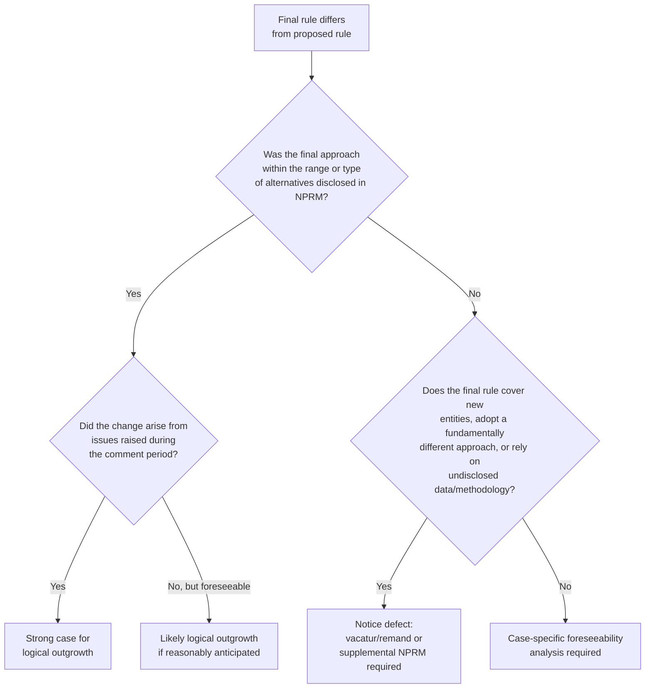

## Adequacy of Notice and the Logical Outgrowth Doctrine

### Overview

The logical outgrowth doctrine is the primary judicial test for determining whether a final rule satisfies the notice requirement of 5 U.S.C. § 553(b) when it differs from the version originally proposed in the Notice of Proposed Rulemaking (NPRM). Because meaningful public participation is central to informal rulemaking's legitimacy, courts must police the boundary between permissible refinement of a proposal in response to comments and an impermissible bait-and-switch that deprives the public of a genuine opportunity to comment on the rule actually adopted.

### The Underlying Tension

**Key Points**

- Agencies are *expected* and often *required* to modify proposed rules in response to public comments — a final rule that simply rubber-stamps the NPRM without considering comments would itself violate § 553(c)'s reasoned-decisionmaking requirements.
- Yet if the final rule strays too far from the proposal, affected parties never had a genuine opportunity to comment on the rule as actually adopted, defeating § 553(b)'s core purpose.
- The logical outgrowth doctrine mediates this tension: it permits change but polices the *degree and direction* of that change relative to what was proposed.

### The Doctrinal Test

A final rule satisfies notice requirements if it is a "logical outgrowth" of the proposed rule — meaning interested parties **should have anticipated** that the change was possible and reasonably should have filed comments on it. Courts articulate the test in various formulations across circuits, but common elements include:

1. **Foreseeability** — Would a reasonable commenter have anticipated that the agency might adopt the final approach, given the terms of the NPRM?
2. **Fair notice of the range of alternatives under consideration** — Did the NPRM signal that the specific approach ultimately adopted was among the options being considered?
3. **No surprise/no denial of opportunity to comment** — Did affected parties have a genuine chance to address the substance of what was ultimately adopted, even if not the exact final text?

**[Inference]** Different circuits articulate the test with varying emphasis — some frame it primarily as a foreseeability inquiry, others emphasize whether the change flows naturally from issues raised during the comment period itself — but the core inquiry (would parties have had reason to comment on this outcome) is consistently applied.

### Illustrative Fact Patterns: Logical Outgrowth vs. Notice Failure

#### Typically Found to Be a Logical Outgrowth

- **Adjusting a numeric standard within a disclosed range**: If the NPRM proposes a standard "between X and Y" or solicits comment on specific alternative values, adopting any value within that disclosed range (or directly responsive to comments about that range) is generally a logical outgrowth.
- **Tightening or loosening a proposed standard in direct response to comments**: If commenters argue the proposed standard is too stringent (or too lenient) and the agency adjusts accordingly within the same regulatory framework, this is typically permissible.
- **Adding exceptions or clarifications requested by commenters**: Narrowing a rule's scope or adding compliance flexibility in direct response to comment-period concerns is usually foreseeable.

#### Typically Found to Violate Notice Requirements

- **Adopting a fundamentally different regulatory approach**: Switching from a numeric performance standard to a technology-mandate approach (or vice versa) without any signal in the NPRM that such an alternative was under consideration.
- **Expanding the rule's scope to cover new entities or activities** not mentioned or reasonably encompassed by the NPRM's described subject matter.
- **Relying on data, studies, or methodologies not disclosed during the comment period**, such that commenters had no opportunity to address the technical basis for the final rule — sometimes analyzed as a logical outgrowth problem, sometimes as an independent "meaningful opportunity to comment" defect.

**Example**

An agency's NPRM proposes to regulate emissions of Pollutant A from Source Category 1, describing a numeric standard range of 10–20 units and soliciting comment on whether a work-practice standard should be considered "as an alternative compliance option." The final rule:

- Adopts a numeric standard of 15 units for Source Category 1 → **logical outgrowth** (within disclosed range).
- Adds a work-practice compliance alternative → **logical outgrowth** (explicitly flagged as under consideration).
- Extends the same numeric standard to Source Category 2, never mentioned in the NPRM → **likely notice failure** (new regulated entities with no opportunity to comment on applicability to their operations).

### Leading Case Law Themes

**[Inference]** While case citations and holdings vary significantly by circuit and have evolved over decades, several recurring principles appear across the body of logical outgrowth jurisprudence (particularly in the D.C. Circuit, which handles a large share of federal rulemaking review):

- Courts examine whether the final rule's central features were **flagged, even generally**, in the NPRM — exact final numeric values need not be pre-announced, but the *type* of approach and its general parameters should be discernible.
- Courts consider whether commenters **actually did** raise the issue that led to the change — if the final approach emerged organically from issues that commenters themselves raised (showing the public *did* have meaningful input on that specific question), this cuts in favor of finding adequate notice, since it demonstrates the process functioned as intended.
- A change made **sua sponte** by the agency, disconnected from any comment addressing that specific issue, is more likely to be found a notice violation than a change directly responsive to comments actually received.

### Remedies for Notice Defects

When a court finds inadequate notice under the logical outgrowth analysis, available remedies include:

1. **Vacatur and remand** — the rule is set aside, and the agency must restart with adequate notice (a new or supplemental NPRM) if it wishes to adopt the same approach.
2. **Remand without vacatur** — in some circumstances, particularly where vacating the rule would cause significant disruption, courts may remand for further proceedings while leaving the rule in effect pending correction (a more flexible, discretionary remedy debated extensively in administrative law scholarship and case law).
3. **Supplemental notice-and-comment on remand** — the agency may cure the defect by issuing a supplemental NPRM specifically covering the previously unnoticed aspect, then finalizing after considering new comments.

**[Unverified]** Whether remand without vacatur is a generally available remedy for APA violations (as opposed to vacatur being the presumptive remedy under § 706(2)) has been the subject of ongoing circuit-level and scholarly debate; practice varies, and the Supreme Court has not definitively resolved the scope of courts' discretion on this question in a way that eliminates circuit-level variation.

### Diagram: Logical Outgrowth Analysis

### Interaction with the Comment-Response Requirement

The logical outgrowth doctrine operates alongside — but is analytically distinct from — the § 553(c) requirement that agencies respond to significant comments:

| Doctrine | Question Asked | Failure Consequence |
| --- | --- | --- |
| Logical outgrowth | Did the public have fair notice of the final rule's substance? | Notice defect; possible vacatur/remand |
| Comment-response requirement | Did the agency adequately consider and respond to significant comments received? | Arbitrary-and-capricious defect under § 706(2)(A) |

**[Inference]** These doctrines frequently overlap in practice — a rule that fails to respond to a significant comment about an alternative approach may also indicate that the agency's ultimate approach was not adequately foreshadowed — but they remain conceptually separate grounds for challenge, and a rule could theoretically satisfy one while failing the other.

### Environmental Law Applications

- **NAAQS and effluent limitation rulemakings**: EPA's technical, iterative rulemaking process for air quality standards and water effluent limits frequently generates logical outgrowth challenges, since numeric standards are often revised between proposal and finalization based on updated modeling or comment-period data.
- **New source categories and applicability expansions**: Environmental rules extending regulatory coverage to new industrial source categories or activities not clearly flagged in the NPRM are a recurring pattern in logical outgrowth litigation, since regulated parties in the newly covered category may argue they had no meaningful opportunity to comment.
- **Data and modeling disclosure disputes**: Because environmental rulemaking often relies on complex scientific models (dispersion modeling, risk assessment, cost-benefit analysis), disputes over whether underlying data and methodologies were adequately disclosed during the comment period are a frequent variant of the logical outgrowth/adequate notice challenge.
- **WOTUS and CAA rule revisions**: Successive redefinitions of jurisdictional terms (e.g., "waters of the United States") have generated notice-adequacy litigation where final rules adopted definitional approaches arguably not clearly foreshadowed in the corresponding NPRMs.

### Practical Drafting Implications for Agencies

**Key Points**

To minimize logical outgrowth risk, agencies typically:

1. Propose a **range of alternatives** explicitly in the NPRM rather than a single fixed approach, preserving flexibility to select any point within the disclosed range.
2. **Solicit comment on specific alternative approaches** even if the agency's preferred approach is different, to preserve the option of adopting an alternative without a notice defect.
3. **Place key technical data and models in the docket** at the proposal stage, not just at finalization.
4. Consider a **supplemental NPRM** or additional comment period when post-comment developments suggest a final approach diverging significantly from the original proposal.

### Conclusion

The logical outgrowth doctrine operationalizes § 553(b)'s notice requirement by asking whether the public had a fair and reasonably foreseeable opportunity to comment on the rule an agency ultimately adopts — not merely the rule as originally proposed. It permits the iterative, responsive rulemaking process that notice-and-comment is designed to enable, while guarding against final rules that spring surprising, unforeshadowed regulatory approaches on affected parties. Given its fact-intensive, foreseeability-driven analysis, logical outgrowth challenges remain one of the most commonly litigated procedural grounds for vacating federal rules, particularly in technically complex regulatory areas like environmental law where standards are frequently refined between proposal and finalization.

**Related Topics**

- Section 553(b) notice content requirements
- Comment-response requirements and the concise general statement of basis and purpose
- Supplemental notice-and-comment procedures and curing notice defects
- Remand without vacatur as an APA remedy
- Section 706(2)(A) arbitrary-and-capricious review
- Data and methodology disclosure obligations in technical rulemaking
- Hybrid rulemaking under Clean Air Act Section 307(d) and enhanced rulemaking-record requirements
- Ex parte contacts and their interaction with notice adequacy