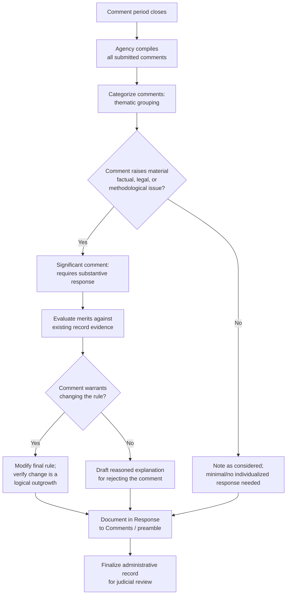

## Building the Rulemaking Record and Responding to Significant Comments

### Overview

The rulemaking record is the complete evidentiary and analytical foundation upon which an agency's final rule stands or falls on judicial review. Unlike formal adjudication's closed, trial-like record, the informal rulemaking record under 5 U.S.C. § 553 is compiled through an ongoing, iterative process — but it carries equally significant legal consequences, since judicial review under § 706 is generally confined to the record the agency actually compiled. Understanding how to construct an adequate record and properly address significant comments is essential to rulemaking practice and to defending (or challenging) a rule's validity.

### What Constitutes the Rulemaking Record

**Key Points**

The administrative record for an informal rulemaking typically includes:

1. **The Notice of Proposed Rulemaking (NPRM)** and any supplemental notices.
2. **All public comments** submitted during the comment period(s).
3. **Technical studies, data, and models** relied upon by the agency, whether agency-generated or third-party.
4. **Internal agency memoranda and analyses** that informed the proposed or final rule (subject to deliberative process considerations).
5. **The final rule preamble**, including the concise general statement of basis and purpose required by § 553(c).
6. **Any Regulatory Impact Analysis (RIA)** required under Executive Order 12866 or related cost-benefit analysis mandates.
7. **Records of relevant ex parte communications** the agency chooses to (or is required to) document and place in the docket.

**[Inference]** The precise contours of what must be included in the certified administrative record — particularly regarding internal deliberative materials, pre-decisional drafts, and communications with the Office of Management and Budget during interagency review — remain contested in litigation, with courts sometimes ordering record supplementation and agencies sometimes asserting deliberative process privilege to withhold certain internal materials.

### The Record Review Principle

A foundational administrative law doctrine, traced substantially to *Citizens to Preserve Overton Park, Inc. v. Volpe*, 401 U.S. 402 (1971), holds that judicial review of agency action is generally limited to the record before the agency at the time of decision — courts do not conduct de novo fact-finding or permit the agency to justify its action with post-hoc rationalizations developed during litigation.

- **The Chenery doctrine** (*SEC v. Chenery Corp.*, 318 U.S. 80 (1943) and 332 U.S. 194 (1947)) reinforces this: a court reviewing agency action must judge the action solely on the grounds the agency itself invoked, not on alternative grounds that might independently justify the outcome.
- Practical consequence: agencies must **build a complete and legally sufficient record contemporaneously** with the rulemaking process — they cannot cure record deficiencies after the fact through litigation briefs or post-hoc affidavits explaining the "real" reasons for the rule.

**[Inference]** Courts do sometimes permit limited record supplementation (e.g., to explain technical terms, fill gaps in cases of bad faith, or address claims that the agency ignored relevant factors) but treat this as a narrow exception to the general record-review principle rather than a routine practice.

### The Duty to Respond to Significant Comments

#### Doctrinal Basis

Although § 553(c)'s text only requires a "concise general statement of basis and purpose," judicial gloss has established that this statement must **meaningfully engage with significant comments** received during the comment period. Failure to do so can render a rule arbitrary and capricious under § 706(2)(A), because:

- A rule adopted without addressing significant contrary evidence or arguments fails the *State Farm* requirement of a "rational connection between the facts found and the choice made."
- Meaningful judicial review is impossible if the agency's reasoning process — including how it grappled with opposing views — is not documented.

#### What Makes a Comment "Significant"

**Key Points**

Not every comment requires an individualized response. Comments are generally considered "significant" (triggering a response obligation) when they:

1. Raise a **material factual or legal issue** that could change the outcome if accepted.
2. Present **new data, studies, or methodologies** that contradict or call into question the agency's technical basis.
3. Identify a **viable alternative approach** the agency did not adequately consider.
4. Point out a **legal or statutory authority problem** with the proposed rule.
5. Come from a **substantial number of commenters** raising the same substantive concern (mass-comment campaigns raising a common, non-frivolous point may require at least a generic response, though pure form-letter volume alone doesn't necessarily elevate significance).

**Comments generally NOT requiring individualized response:**

- Purely repetitive comments that restate points already addressed.
- Comments outside the scope of the rulemaking (addressing matters not within the proposed rule's subject matter).
- General policy objections unsupported by specific factual or legal argument (e.g., "I don't like this rule").
- Frivolous or clearly meritless legal arguments.

**[Inference]** The "significant comment" threshold is inherently fact-specific and somewhat discretionary in application; agencies routinely group similar comments and provide a single consolidated response addressing the common substantive point, which courts have generally accepted as satisfying the response obligation without requiring literally individualized replies to each commenter.

### Structuring the Response-to-Comments Document

In practice, most substantial rulemakings include a dedicated **Response to Comments (RTC) document** or a detailed comment-response section within the final rule preamble. A well-constructed RTC typically:

1. **Organizes comments thematically** (e.g., by regulatory provision addressed, or by subject matter category) rather than commenter-by-commenter, to manage volume efficiently.
2. **Summarizes the substance** of each significant comment or comment category.
3. **Explains the agency's response** — whether accepting, rejecting, or partially accepting the comment's point, and why.
4. **Cites supporting record evidence** for factual determinations underlying the response.
5. **Explains any changes made to the final rule** in response to particular comments, connecting back to the logical outgrowth analysis (i.e., documenting that the resulting change was a foreseeable outgrowth of issues actually raised).

**Example**

Suppose an EPA rulemaking on hazardous air pollutant standards receives:

- 500 form-letter comments from environmental advocacy campaign supporters generally supporting stricter standards.
- 12 detailed technical comments from industry submitting alternative emissions-testing data.
- 3 comments raising a statutory authority objection.

A properly constructed RTC would:

- Acknowledge the volume of supportive form comments with a brief consolidated response (not requiring extensive individualized engagement, since they raise no new technical point).
- Provide detailed, substantive responses to the 12 technical comments, addressing the alternative data specifically — including whether the agency incorporated it, and if not, why the agency's own data/methodology was preferred.
- Directly address the statutory authority argument, since a legal authority challenge is definitionally significant and must be resolved to establish the rule's validity.

### Diagram: Comment Processing and Record-Building Workflow

### Consequences of an Inadequate Record or Response

If a reviewing court finds that the agency failed to adequately address significant comments or build a sufficient record:

1. **Remand** (with or without vacatur) for the agency to properly address the deficiency.
2. **Vacatur** of the rule if the deficiency is severe enough to undermine confidence in the outcome.
3. Findings that the rule is **arbitrary and capricious** under § 706(2)(A) for failing to consider an important aspect of the problem (the *State Farm* framework).

**[Unverified]** Whether a given comment-response inadequacy warrants full vacatur versus a more limited remand often depends on circuit-specific remedial doctrine and case-specific factors (e.g., disruption caused by vacatur, likelihood the agency could justify the same outcome on remand) — this is an area of continuing doctrinal variation rather than a settled uniform rule.

### Deliberative Process Privilege and Record Scope Disputes

Agencies frequently assert that certain **pre-decisional, deliberative internal materials** (draft analyses, internal disagreements, draft preambles) are not part of the reviewable administrative record and/or are protected from disclosure, based on:

- The deliberative process privilege (rooted in common-law and FOIA Exemption 5 principles, though the *scope of the reviewable record* question is analytically distinct from the *FOIA disclosure* question).
- Concerns about chilling candid internal agency deliberation if draft materials become routinely discoverable.

**[Inference]** Litigants challenging rules frequently seek record supplementation to include such materials, particularly where they suspect the agency's stated rationale in the final rule preamble diverges from its actual internal decision-making process; courts apply varying standards for compelling such disclosure, generally requiring a strong showing (e.g., of bad faith or that the formal record is inadequate to explain the decision) before ordering supplementation beyond the agency's certified record.

### Environmental Law Applications

- **Technical comment volume**: Environmental rulemakings (NAAQS reviews, effluent guidelines, hazardous waste listings) routinely generate voluminous, highly technical comments from industry, environmental groups, and state agencies, making thematic organization of the RTC especially critical.
- **Peer review and Science Advisory Board input**: EPA rulemakings often incorporate Science Advisory Board (SAB) review and Clean Air Scientific Advisory Committee (CASAC) input as part of the record, and failure to adequately address SAB/CASAC recommendations has been a recurring litigation theme in NAAQS rulemaking challenges.
- **Cost-benefit analysis disputes**: Environmental rules frequently face challenges to the adequacy of the agency's Regulatory Impact Analysis, particularly regarding methodology for valuing health benefits, discount rates applied to future benefits/costs, and treatment of co-benefits — these disputes often turn on whether commenters' methodological critiques were adequately addressed in the RTC.
- **Overton Park's continuing relevance**: Environmental cases (including *Overton Park* itself, which arose from a highway-through-parkland dispute implicating environmental and transportation statutes) remain foundational for the principle that courts review the agency's actual contemporaneous record and reasoning, not post-hoc litigation justifications — a principle regularly invoked in environmental rule challenges.

### Practical Best Practices for Record-Building

**Key Points**

1. **Contemporaneous documentation**: Build the record as the rulemaking proceeds, rather than attempting to reconstruct justifications after comments close.
2. **Preserve all technical data relied upon** in the docket, ensuring public access during the comment period (not merely at finalization).
3. **Address comments by substance, not volume** — a single well-reasoned technical comment can require more substantive engagement than thousands of form letters.
4. **Explicitly connect final rule changes to comments received**, reinforcing both the logical outgrowth analysis and the reasoned-decisionmaking requirement.
5. **Anticipate litigation** by ensuring the preamble's reasoning is self-contained and doesn't rely on unstated assumptions that would only surface in litigation briefing (which the *Chenery* doctrine would preclude as post-hoc rationalization).

### Conclusion

The rulemaking record and the agency's response to significant comments together form the evidentiary and reasoning foundation that determines whether a rule survives judicial review. Because courts confine review to the record the agency actually compiled and the rationale it actually articulated — per *Overton Park* and *Chenery* — agencies must treat record-building and comment-response drafting as integral, contemporaneous components of the rulemaking process rather than after-the-fact formalities. In technically complex domains like environmental law, where rulemakings routinely generate extensive scientific and economic comment, disciplined record management and substantive, well-organized comment responses are often decisive in determining whether a rule withstands challenge.

**Related Topics**

- *Citizens to Preserve Overton Park v. Volpe* and the record-review principle
- The *Chenery* doctrine and the prohibition on post-hoc rationalization
- *State Farm*'s reasoned decisionmaking framework
- Logical outgrowth doctrine and its interaction with comment-driven rule changes
- Deliberative process privilege and administrative record scope disputes
- Regulatory Impact Analysis requirements under Executive Order 12866
- Science Advisory Board and peer review integration in EPA rulemaking
- Remedies for inadequate rulemaking records: remand vs. vacatur
- Section 706(1) claims for unreasonable delay in responding to rulemaking petitions