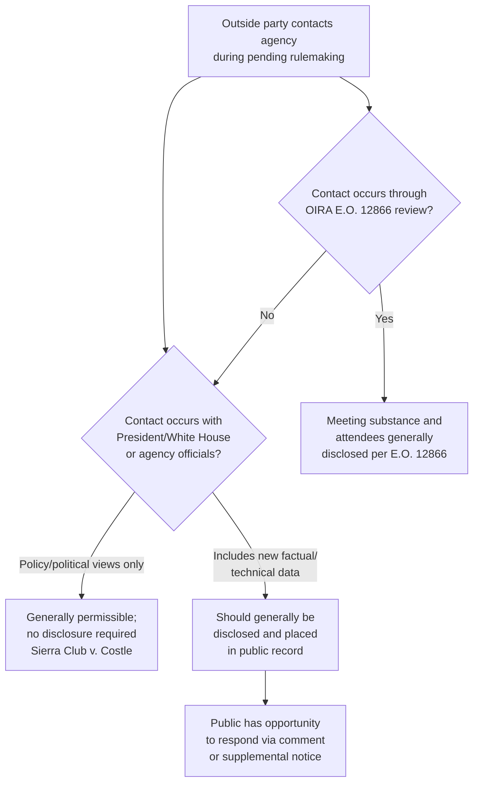

## Ex Parte Contacts in Informal Rulemaking

### Overview

Ex parte contacts — communications between agency decisionmakers and interested outside parties that occur outside the formal public comment process — present a distinctive challenge in informal rulemaking. Unlike formal adjudication, where 5 U.S.C. § 557(d) imposes explicit statutory restrictions on ex parte communications, § 553 contains **no comparable textual restriction** on off-the-record contacts during notice-and-comment rulemaking. This textual gap has generated substantial judicial and administrative practice addressing when, and to what extent, off-the-record influence on rulemaking is permissible.

### The Statutory Gap

**Key Points**

- § 557(d), added by the 1976 Government in the Sunshine Act, imposes detailed ex parte contact restrictions **only on formal, on-the-record proceedings** (formal rulemaking and formal adjudication under §§ 556–557).
- § 553 contains no equivalent provision — Congress did not extend the same ex parte restrictions to informal rulemaking.
- This omission reflects, in part, a structural difference: informal rulemaking is understood as a more **legislative-like, policy-oriented** process (akin to how Congress may freely receive lobbying input when drafting legislation), whereas formal adjudication and formal rulemaking are more **adjudicative/trial-like**, warranting insulation from off-the-record influence.

**[Inference]** This legislative-versus-adjudicative conceptual distinction is often cited as the rationale for why Congress and courts have generally tolerated a degree of ex parte contact in informal rulemaking that would be impermissible in formal proceedings — though this rationale has also drawn criticism from scholars who argue that modern informal rulemaking often resembles adjudication in its case-specific, technical, high-stakes character.

### Judicial Development: The D.C. Circuit Framework

Because the APA's text is silent, much of the operative law governing ex parte contacts in informal rulemaking comes from D.C. Circuit case law (given that court's outsized role in reviewing federal rulemaking).

#### Home Box Office and the High-Water Mark

*Home Box Office, Inc. v. FCC*, 567 F.2d 9 (D.C. Cir. 1977), initially suggested a fairly restrictive approach — indicating that once a rulemaking proceeding had commenced (particularly after the comment period), off-the-record contacts with agency decisionmakers could be problematic and might need to be disclosed and placed in the public record to preserve the integrity of the process and enable meaningful judicial review.

#### Sierra Club v. Costle: The Governing Modern Standard

*Sierra Club v. Costle*, 657 F.2d 298 (D.C. Cir. 1981), substantially narrowed *Home Box Office*'s approach and is generally regarded as the leading modern statement on ex parte contacts in informal rulemaking. Key holdings and reasoning:

- **Ex parte contacts with informal rulemaking decisionmakers, including with the President or White House staff, are generally permissible** and do not automatically violate the APA, reflecting the practical reality that rulemaking is a fundamentally political and policy-laden process in which the President and other officials have legitimate interests.
- However, **relevant factual or technical material introduced through such contacts that forms a basis for the agency's decision should generally be disclosed and placed in the public record** to permit meaningful public comment and judicial review — the concern is less about the *existence* of the contact and more about *undisclosed factual input* that affects the rule's substance without any opportunity for public rebuttal.
- The court distinguished between:
  - **Political/policy input** (e.g., White House views on regulatory priorities, cost concerns, competing policy considerations) — generally permissible without disclosure, since this reflects legitimate presidential oversight of executive branch policy.
  - **New factual or technical data** introduced ex parte that the agency relies upon — this should generally be disclosed to preserve the adequacy of the record and the public's opportunity to respond.

**[Inference]** *Sierra Club v. Costle* is widely understood as reflecting a pragmatic accommodation between the reality of interagency and White House involvement in significant rulemakings (particularly given OMB/OIRA's formal regulatory review role under Executive Order 12866) and the APA's participatory and record-based judicial review values — though the precise line between "permissible undisclosed policy input" and "impermissible undisclosed factual basis" remains a matter of case-by-case application rather than a bright-line rule.

### The Interagency Review Dimension: OMB/OIRA

**Key Points**

A significant category of "ex parte-adjacent" contact in modern rulemaking occurs through the **Office of Information and Regulatory Affairs (OIRA)** review process under Executive Order 12866 (and its predecessors/successors):

- OIRA reviews significant proposed and final rules before publication, often involving substantive discussions with the issuing agency about regulatory approach, cost-benefit analysis, and policy design.
- E.O. 12866 requires disclosure of the **substance** of OIRA meetings with outside parties concerning a rule under review, along with the identity of attendees, to be made available to the public — reflecting an executive-branch-level accommodation of the *Sierra Club v. Costle* disclosure concern for factual/substantive input, without treating OIRA's own policy-coordination role as itself objectionable.
- Communications purely internal to the Executive Branch (agency-to-OIRA, or OIRA-to-White House) are generally treated differently from contacts with outside private parties, since interagency coordination on policy is treated as a legitimate function of unified executive branch policymaking rather than "ex parte" influence in the APA sense.

**[Unverified]** The precise boundary of what OIRA-related materials become part of the judicially reviewable administrative record — as opposed to remaining internal deliberative executive branch communications — continues to generate litigation and scholarly disagreement, and practices have evolved somewhat across different administrations' regulatory review executive orders.

### Distinguishing Ex Parte Contacts from the Comment Process

| Feature | Public Comment (§ 553(c)) | Ex Parte Contact |
| --- | --- | --- |
| Formality | Written submission to public docket | Meetings, calls, informal correspondence |
| Public visibility | Automatically part of public record | Visibility depends on voluntary/required disclosure |
| Statutory basis | Explicitly required by § 553(c) | Not addressed by § 553's text |
| Judicial treatment | Core part of reviewable record | Governed by *Sierra Club v. Costle* disclosure principles for factual content |

### Practical Agency Practices to Manage Ex Parte Risk

**Key Points**

Although not uniformly mandated by statute, many agencies adopt voluntary practices to reduce litigation risk associated with ex parte contacts, including:

1. **Logging meetings** with outside parties regarding pending rulemakings, noting attendees, date, and general subject matter.
2. **Placing substantive materials** (white papers, technical submissions, data) provided during such meetings into the public rulemaking docket.
3. **Encouraging outside parties to submit written comments** memorializing points made in meetings, ensuring the substance becomes part of the reviewable record.
4. **Distinguishing internal deliberative communications** (protected by deliberative process considerations) from outside-party factual submissions (which should generally be disclosed).

**[Inference]** These practices are often characterized as prudential risk-management measures adopted in light of *Sierra Club v. Costle*'s disclosure principle, rather than strict, independently enforceable statutory mandates under § 553 itself — meaning the degree of rigor varies somewhat by agency and by the political sensitivity of the particular rulemaking.

### Diagram: Ex Parte Contact Treatment in Informal Rulemaking

### Consequences of Improper Ex Parte Influence

If a court finds that an agency's rule was improperly influenced by undisclosed ex parte factual material that was not made available for public comment:

1. **Remand** for the agency to disclose the relevant material and reopen comment on that specific issue.
2. **Vacatur**, if the improperly considered material was central to the agency's rationale and cannot be disentangled from an otherwise valid record.
3. Findings that the resulting rule lacks a **reasoned basis** supportable on the public record, implicating § 706(2)(A) arbitrary-and-capricious review.

**[Unverified]** Because ex parte contact challenges in informal rulemaking are relatively fact-intensive and less frequently litigated to a definitive remedy than notice or comment-response challenges, the precise remedial pattern (vacatur vs. remand) for ex parte violations is less doctrinally settled than for other § 553 defects.

### Environmental Law Applications

- **High-profile environmental rulemakings** (climate rules, NAAQS reviews, WOTUS redefinitions) routinely attract significant White House and OIRA engagement given their economic and political stakes, making the *Sierra Club v. Costle* framework directly relevant to how such engagement is documented.
- **Industry and environmental group meetings** with EPA officials during pending rulemakings are common, and EPA's practice of logging meetings and encouraging written follow-up submissions reflects the prudential risk-management approach described above.
- **Science-based technical contacts**: Because environmental rules often rest on complex scientific and economic modeling, ex parte submissions of technical data (e.g., alternative risk assessments, cost studies) are particularly likely to trigger the *Sierra Club v. Costle* disclosure principle, since such data goes to the factual basis of the rule rather than pure policy preference.
- ***Sierra Club v. Costle* itself arose in the environmental context** — the case concerned EPA's coal-conversion regulations under the Clean Air Act, including alleged undisclosed White House and congressional contacts, making it doctrinally rooted in environmental rulemaking practice.

### Conclusion

Because § 553 contains no textual ex parte contact restriction comparable to § 557(d)'s formal-proceeding rules, informal rulemaking operates under a judicially developed framework — most authoritatively stated in *Sierra Club v. Costle* — that tolerates off-the-record policy and political input (including from the President and OIRA) while requiring disclosure of factual or technical material that forms a basis for the agency's decision. This framework reflects informal rulemaking's hybrid character as simultaneously a policy-driven, quasi-legislative process and a record-based, judicially reviewable determination, and it continues to shape how agencies manage outside contacts, document meetings, and structure interagency review — particularly in high-stakes, technically complex regulatory areas such as environmental law.

**Related Topics**

- Section 557(d) ex parte restrictions in formal proceedings, contrasted
- OIRA review under Executive Order 12866 and regulatory review transparency requirements
- The rulemaking record and its judicially reviewable scope
- *Sierra Club v. Costle* and the coal-conversion rulemaking context
- Deliberative process privilege and internal executive branch communications
- Presidential control of administrative agencies and unitary executive theory
- Logical outgrowth doctrine and undisclosed technical data as a notice defect
- Section 706(2)(A) arbitrary-and-capricious review and record-based decisionmaking