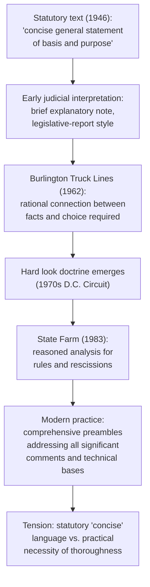

## The Concise General Statement of Basis and Purpose

### Overview

The "concise general statement of their basis and purpose" is the operative textual requirement of 5 U.S.C. § 553(c) governing what an agency must include when it publishes a final rule following notice-and-comment. Despite its modest statutory phrasing, this provision has become — through decades of judicial interpretation — one of the most substantively demanding requirements in administrative law, effectively requiring agencies to produce a comprehensive, reasoned explanation of the rule's factual basis, policy justification, and response to significant public input.

### Statutory Text and Its Modest Origins

§ 553(c) provides, in relevant part:

> "After consideration of the relevant matter presented, the agency shall incorporate in the rules adopted a concise general statement of their basis and purpose."

**Key Points**

- The statutory language is deliberately minimal — "concise" and "general" suggest a brief, non-technical explanation, consistent with the APA's original 1946 conception of informal rulemaking as a relatively lightweight, legislative-style process.
- **[Inference]** The drafters' apparent intent, as reflected in the Attorney General's 1947 Manual on the APA, was for this statement to function similarly to a legislative committee report accompanying a statute — explaining the general rationale without exhaustively rebutting every objection — rather than the elaborate, adjudication-like explanatory documents that have become standard practice today.

### The Judicial Transformation: From "Concise" to Comprehensive

Over time, reviewing courts — particularly in connection with the emergence of "hard look" review — have transformed the basis-and-purpose statement from a brief explanatory note into a document that must satisfy the full reasoned-decisionmaking requirements of § 706(2)(A) arbitrary-and-capricious review.

#### Core Functions the Statement Must Now Serve

1. **Establish the rational connection between facts and the rule adopted** — per *Burlington Truck Lines v. United States*, 371 U.S. 156 (1962), and *Motor Vehicle Mfrs. Ass'n v. State Farm*, 463 U.S. 29 (1983).
2. **Respond to significant comments** raised during the comment period, demonstrating the agency actually considered contrary views and data.
3. **Explain any changes** from the proposed rule, connecting back to the logical outgrowth analysis.
4. **Identify the statutory authority** relied upon and explain how the rule fits within that authority.
5. **Enable meaningful judicial review** — courts have repeatedly emphasized that without an adequately reasoned statement, they cannot perform their § 706 review function, since *Chenery* forecloses reliance on post-hoc litigation rationalizations.

**[Inference]** This expansion is often described as a product of the "hard look doctrine" that developed substantially in the D.C. Circuit from the 1970s onward, under which courts scrutinize not just whether an agency followed correct procedures but whether its substantive reasoning process was adequate — though the doctrinal label "hard look" itself is a judicial and academic shorthand rather than a term appearing in the APA's text.

### Required Content in Practice

**Key Points**

A basis-and-purpose statement satisfying modern judicial expectations typically addresses:

- **Statutory authority and jurisdictional basis** for the rule.
- **Factual and technical basis**, including data, studies, and modeling relied upon.
- **Policy rationale** — why the agency chose this particular regulatory approach among alternatives.
- **Response to significant comments**, including comments proposing alternative approaches, challenging the agency's data, or raising legal objections.
- **Explanation of any changes** between the proposed and final rule.
- **Cost-benefit or economic analysis**, particularly for "significant" rules under Executive Order 12866, addressing costs, benefits, and alternatives considered.
- **Effective date justification**, if departing from the standard 30-day delay under § 553(d).

### The "Concise" Requirement in Tension with Modern Practice

**[Unverified]** There is a widely recognized tension between § 553(c)'s textual command for a "concise general statement" and the practical reality that final rule preambles for significant regulations often run to dozens or hundreds of pages in the Federal Register. Commentators have noted this gap between statutory text and practice, though courts have generally not treated preamble length itself as a violation — the operative concern is the *adequacy of reasoning and comment-responsiveness*, not brevity, meaning a longer document that thoroughly addresses significant issues is preferred over a truly "concise" one that fails to grapple with contrary evidence.

### Example: Structuring a Basis-and-Purpose Statement

**Example**

Consider a hypothetical EPA rule establishing new emission standards for a manufacturing sector. A properly structured basis-and-purpose statement (typically presented as the preamble to the final rule) would include:

1. **Introduction and statutory authority** — citing the specific Clean Air Act provision authorizing the standard.
2. **Background and regulatory history** — summarizing prior standards, the proposed rule, and the comment period.
3. **Summary of major comments and agency responses** — organized thematically (e.g., technical feasibility comments, cost comments, health-benefit comments, legal authority comments).
4. **Technical basis for the final standard** — explaining what data and analysis support the specific numeric limit adopted, including any changes from the proposal and why those changes remain a logical outgrowth.
5. **Cost-benefit analysis summary** — referencing the full Regulatory Impact Analysis, addressing significant methodological comments (e.g., discount rate disputes, co-benefit valuation disputes).
6. **Effective date and compliance timeline rationale**.
7. **Severability and reservations** — statements clarifying that if part of the rule is invalidated, remaining provisions still stand (an increasingly common drafting practice, though distinct from the § 553(c) requirement itself).

### Diagram: Evolution of Section 553(c)'s Practical Requirements

### Consequences of an Inadequate Statement

A basis-and-purpose statement that fails to meet judicial expectations can result in:

1. **Vacatur or remand** for failure to satisfy § 706(2)(A)'s reasoned-decisionmaking requirement.
2. Findings that the agency **failed to consider an important aspect of the problem** (the *State Farm* formulation).
3. Inability to defend the rule in litigation, since *Chenery* precludes the agency from supplying missing reasoning through post-hoc litigation briefs — the statement itself must contain the operative justification.

### Relationship to Other § 553 Requirements

| Requirement | Statutory Basis | Function |
| --- | --- | --- |
| NPRM content | § 553(b) | Provides notice of what's proposed |
| Opportunity to comment | § 553(c) | Enables public input |
| **Basis and purpose statement** | § 553(c) | Documents the agency's reasoning and comment responses |
| 30-day delay | § 553(d) | Provides transition time before compliance obligations begin |

The basis-and-purpose statement functions as the **synthesis point** where the agency demonstrates that notice was adequate (by showing the final rule tracks disclosed alternatives), that comments were genuinely considered (by responding to significant ones), and that the ultimate decision is reasoned (by connecting facts to the chosen outcome).

### Environmental Law Applications

- **EPA rule preambles** are frequently the most extensively litigated component of environmental rulemakings, since challengers routinely argue that the agency's stated basis fails to adequately address significant technical or economic comments (e.g., alternative cost data, competing scientific studies, feasibility challenges from regulated industry).
- **NAAQS rulemakings** under Clean Air Act § 109 require the basis-and-purpose statement to address CASAC (Clean Air Scientific Advisory Committee) recommendations, and failure to adequately explain departures from CASAC advice has been a recurring challenge theme.
- **Cost-benefit methodology disputes**: Environmental rule preambles often face challenges regarding the adequacy of their treatment of co-benefits, discount rates, and the monetization of health and ecological benefits — testing whether the "concise" statement adequately engages with significant methodological comments on these points.
- **Severability provisions**: Environmental rules increasingly include explicit severability language within the basis-and-purpose statement, reflecting lessons learned from litigation where courts vacated entire complex regulatory packages due to a single flawed provision.

### Conclusion

Although § 553(c)'s text calls only for a "concise general statement of basis and purpose," judicial development — particularly through the hard look doctrine and the *State Farm* reasoned-decisionmaking framework — has transformed this requirement into the central vehicle through which an agency must demonstrate the factual, legal, and policy adequacy of its rule. The statement must connect the rule to its statutory authority, respond to significant public comments, justify the technical and economic basis for the agency's choices, and provide the exclusive record of reasoning that a reviewing court can consider under the *Chenery* doctrine. In technically complex fields like environmental law, this transforms what began as a brief explanatory requirement into what is often the single most heavily scrutinized document in the rulemaking process.

**Related Topics**

- *State Farm* and the reasoned decisionmaking standard
- The hard look doctrine's development in the D.C. Circuit
- Responding to significant comments and record-building
- The *Chenery* doctrine and the prohibition on post-hoc rationalization
- Logical outgrowth doctrine and connecting the final rule to the NPRM
- Regulatory Impact Analysis and cost-benefit methodology under Executive Order 12866
- CASAC and Science Advisory Board input in NAAQS rulemaking
- Severability doctrine in agency rulemaking
- Section 706(2)(A) arbitrary-and-capricious review