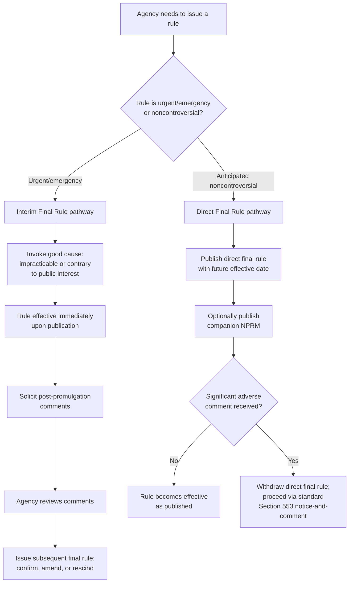

## Direct Final Rules, Interim Final Rules, and the Good Cause Exception

### Overview

Agencies have developed several procedural techniques to expedite rulemaking or bypass pre-promulgation notice-and-comment when circumstances warrant. Direct final rulemaking and interim final rulemaking are practice-derived tools — not explicitly named in the APA's text — that agencies use to manage rules expected to be uncontroversial or urgent, while the good cause exception under 5 U.S.C. § 553(b)(B) is the statutory mechanism that legally authorizes bypassing standard notice-and-comment procedures. These three concepts interrelate closely: good cause is often the doctrinal hook that makes interim final rules lawful, while direct final rulemaking represents a different strategy built around the "unnecessary" prong of good cause rather than urgency.

### The Good Cause Exception: Statutory Foundation

5 U.S.C. § 553(b)(B) exempts an agency from notice-and-comment "when the agency for good cause finds (and incorporates the finding and a brief statement of reasons therefor in the rules issued) that notice and public procedure thereon are impracticable, unnecessary, or contrary to the public interest."

**Key Points**

Three independent grounds satisfy good cause:

1. **Impracticable** — circumstances make prior notice-and-comment genuinely infeasible within the necessary timeframe (e.g., a rapidly evolving public health emergency, an imminent statutory deadline that cannot be met if standard procedures are followed).
2. **Unnecessary** — the rule is of a type where public comment would serve no useful purpose (e.g., a rule that merely restates existing statutory mandates with no agency discretion, or purely technical/ministerial corrections).
3. **Contrary to the public interest** — not merely inconvenient, but affirmatively harmful to public interests if notice-and-comment delay occurred (e.g., pre-announcing enforcement thresholds that regulated parties could exploit before the rule takes effect).

**[Inference]** Courts uniformly treat "contrary to the public interest" as a narrow ground requiring genuine adverse consequences from delay — general administrative inconvenience or a preference for efficiency does not satisfy this prong, and agencies invoking it bear a substantial burden to articulate specific, non-conclusory harms.

### Judicial Scrutiny of Good Cause Findings

**Key Points**

- Good cause exemptions are **narrowly construed**, consistent with the general judicial approach to APA exemptions.
- The required "brief statement of reasons" incorporated into the rule must provide **genuine, non-conclusory justification** — courts routinely reject boilerplate recitations of the statutory language without case-specific factual support.
- Courts examine whether the agency **had adequate time** to conduct standard notice-and-comment but simply failed to act promptly — self-created urgency (where an agency delays action and then claims emergency conditions justify skipping procedures) is generally viewed skeptically.
- The exemption is assessed **as of the time the rule was issued**, based on the circumstances the agency actually confronted, not retrospectively.

**[Inference]** Because good cause findings are subject to relatively close judicial scrutiny compared to some other APA exemptions, agencies that invoke this exception face meaningful litigation risk if the justification does not withstand examination — this has made good cause a frequently litigated exemption despite its facially narrow drafting.

### Interim Final Rules (IFRs)

#### Structure and Purpose

An interim final rule is a rule that takes **immediate legal effect upon publication** (bypassing pre-promulgation notice-and-comment, typically invoking the good cause exception) while simultaneously **soliciting post-promulgation public comment**. The agency commits to considering those comments and potentially revising the rule afterward.

**Key Points**

- IFRs are typically used when:
  - An emergency or urgent statutory deadline makes pre-promulgation notice-and-comment impracticable.
  - Congress has directed immediate implementation of a statutory mandate with limited implementation discretion.
  - A pressing public health, safety, or economic circumstance requires immediate agency action.
- The rule is **legally binding and enforceable immediately** upon its effective date, distinguishing it from a mere proposed rule.
- Post-promulgation comments can lead to a **subsequent final rule** that amends, confirms, or (in rare cases) rescinds the interim rule.

#### Legal Vulnerabilities of IFRs

**[Inference]** Because IFRs bypass pre-promulgation comment, they remain vulnerable to challenge on the underlying good cause finding itself — a court that disagrees with the agency's urgency or necessity justification can vacate the IFR even though it was already in effect, potentially creating significant retroactive disruption for regulated parties who had already begun complying.

#### Distinguishing IFRs from Ordinary Final Rules

| Feature | Ordinary Final Rule | Interim Final Rule |
| --- | --- | --- |
| Pre-promulgation comment | Required (§ 553(b)-(c)) | Bypassed via good cause |
| Immediate legal effect | Yes, after § 553(d) delay | Yes, often immediately or with abbreviated delay |
| Post-promulgation comment | Not applicable | Solicited and considered |
| Vulnerability | Standard § 706 review | § 706 review plus good cause scrutiny |

### Direct Final Rules

#### Structure and Purpose

Direct final rulemaking is a technique used for rules the agency believes will be **entirely noncontroversial**, designed to conserve agency and public resources when no significant opposition is anticipated.

**Key Points**

Typical direct final rule procedure:

1. The agency publishes the rule as a "direct final rule" in the Federal Register, stating it will become effective on a specified future date **unless** the agency receives significant adverse comment during a specified window.
2. Simultaneously (or shortly after), the agency often publishes a companion NPRM proposing the identical rule, to preserve the standard notice-and-comment option if adverse comment is received.
3. If **no significant adverse comment** is received by the specified date, the rule becomes effective as published — without ever having gone through a traditional comment-and-response cycle.
4. If **significant adverse comment** is received, the agency **withdraws** the direct final rule and proceeds through standard notice-and-comment via the companion NPRM (or a newly issued one).

**[Inference]** Direct final rulemaking is generally understood as resting on the "unnecessary" prong of the good cause exception (or, in some administrative practice, as simply a case-by-case application of ordinary § 553 procedures structured to withdraw automatically upon objection) — the theory being that if no one objects, the notice-and-comment process would have served no practical purpose, though the exact doctrinal characterization (whether it's truly a good cause invocation or a structurally compliant application of standard procedure) has been debated and may vary somewhat by agency practice.

#### Common Use Cases for Direct Final Rules

- Technical corrections and clarifications to existing regulations.
- Adoption of updated technical standards or reference materials with minimal substantive controversy.
- Routine administrative or procedural updates.
- Minor adjustments that regulated parties have generally indicated support for or indifference to.

**[Unverified]** The precise threshold for what constitutes "significant adverse comment" sufficient to trigger withdrawal of a direct final rule varies by agency policy and is not uniformly defined across the federal government; agencies typically retain considerable discretion in characterizing whether received comments meet that threshold.

### Diagram: Direct Final Rule vs. Interim Final Rule Pathways

### Example: Comparative Application

**Example**

Consider two hypothetical EPA actions:

**Scenario A (Interim Final Rule)**: A newly discovered contaminant poses an immediate public health threat in drinking water systems, and the agency's organic statute requires action "as expeditiously as practicable." EPA issues an interim final rule immediately banning the contaminant above a specified threshold, invoking good cause based on the imminent health risk (impracticability of delay), while opening a 60-day post-promulgation comment period to refine the threshold or compliance mechanisms based on stakeholder input.

**Scenario B (Direct Final Rule)**: EPA needs to update a cross-reference in its regulations to reflect a renumbered ASTM technical testing standard, with no substantive policy change. EPA publishes this as a direct final rule effective in 30 days unless significant adverse comment is received, alongside a companion NPRM. No adverse comments are received, and the technical correction becomes effective as published — never requiring a full comment-and-response cycle.

### Risk Management Considerations for Agencies

**Key Points**

When choosing among standard notice-and-comment, interim final rulemaking, and direct final rulemaking, agencies typically weigh:

1. **Litigation risk**: IFRs and good-cause invocations face closer judicial scrutiny than standard notice-and-comment rules; a successful good cause challenge can result in vacatur of an already-effective and relied-upon rule.
2. **Urgency vs. resource conservation**: IFRs address genuine time pressure; direct final rules address anticipated lack of controversy, not urgency.
3. **Reversibility costs**: If a direct final rule draws adverse comment and must be withdrawn, or an IFR is challenged and vacated, the agency may need to restart the process — a cost that must be weighed against the time saved if the streamlined approach succeeds.
4. **Statutory deadlines**: Organic statutes with hard compliance deadlines often push agencies toward IFRs when standard notice-and-comment timelines would cause the agency to miss a statutory deadline.

### Environmental Law Applications

- **Emergency environmental and public health actions**: EPA has used interim final rules for time-sensitive matters such as emergency pesticide suspensions under FIFRA, urgent hazardous substance designations, and rapid-response standards following newly identified contamination risks.
- **Technical standard updates**: Direct final rulemaking is commonly used by EPA and other environmental agencies to incorporate updated technical testing methods, laboratory certification standards, or minor administrative corrections to existing environmental regulations (e.g., updating incorporated-by-reference industry testing standards) without triggering full notice-and-comment for changes anticipated to be noncontroversial.
- **Statutory deadline pressure**: Many environmental statutes (Clean Air Act, Clean Water Act, RCRA, TSCA) impose specific rulemaking deadlines; when agencies face litigation-driven or statutory deadlines they cannot meet through standard procedures, IFRs paired with good cause findings are sometimes used, though such approaches remain subject to challenge if the urgency justification is not well-supported on the specific facts.
- **Litigation vulnerability in environmental IFRs**: Environmental interim final rules have faced good-cause challenges where petitioners argue the agency had adequate advance notice of the underlying issue (e.g., known contamination trends) and thus could have conducted standard notice-and-comment, undermining the impracticability justification.

### Conclusion

Direct final rules and interim final rules represent two distinct agency strategies for managing the tension between the APA's participatory ideals and practical needs for efficiency or urgency, both ultimately grounded in — or structurally adjacent to — the good cause exception of § 553(b)(B). Interim final rules address genuine urgency by allowing immediate effect with promised post-hoc public input, while direct final rules address anticipated lack of controversy by allowing automatic effectiveness absent adverse comment, with a built-in fallback to standard procedures if that assumption proves wrong. Because good cause findings receive meaningful judicial scrutiny and narrow construction, agencies employing either technique must develop specific, well-documented, non-conclusory justifications to withstand challenge — a recurring point of litigation risk in fast-moving or technically complex regulatory areas such as environmental law.

**Related Topics**

- Section 553(b)(B) good cause exception standards and judicial scrutiny
- Section 553(a) and (b) subject-matter and category exemptions generally
- Post-promulgation comment periods and subsequent final rule procedures
- Statutory deadline pressure and litigation-driven rulemaking timelines
- Amendment and repeal of rules issued via interim final rulemaking
- Section 706(2)(A) arbitrary-and-capricious review of good cause findings
- Emergency rulemaking authority under environmental organic statutes (FIFRA, TSCA, CAA)
- The logical outgrowth doctrine as applied to post-comment revisions of IFRs