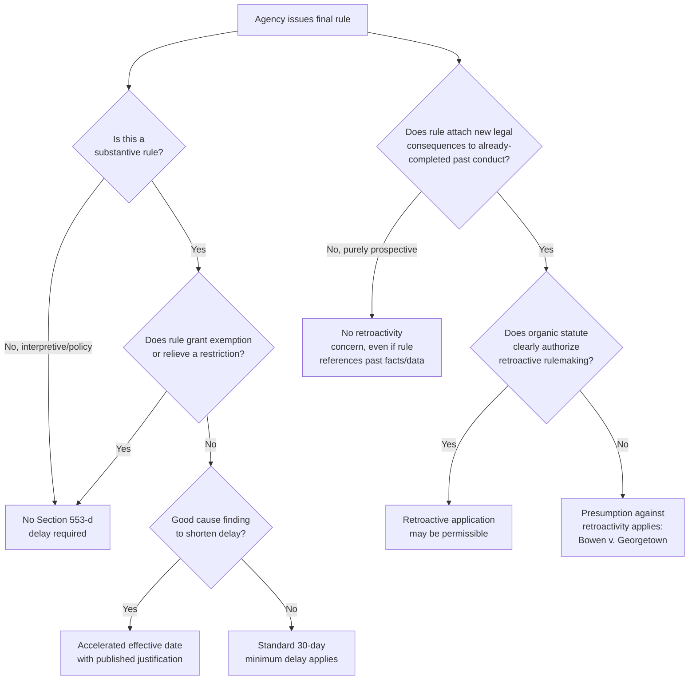

## Effective Dates, Delayed Effectiveness, and Retroactivity Limits

### Overview

The timing of a rule's legal force — when it becomes effective, whether its effectiveness can be delayed, and whether it may apply retroactively — is governed by a combination of APA text, judicial doctrine, and organic-statute provisions. 5 U.S.C. § 553(d) establishes the baseline effective-date rule for informal rulemaking, while a separate and analytically distinct body of law governs the more fundamental question of whether a rule may have retroactive effect at all. These two issues are often confused but require separate analysis: effective-date timing concerns *when* a rule's prospective obligations begin, while retroactivity concerns whether a rule may attach new legal consequences to *already-completed* conduct.

### Section 553(d): The 30-Day Delay Requirement

**Key Points**

§ 553(d) provides that "the required publication or service of a substantive rule shall be made not less than 30 days before its effective date," subject to three exceptions:

1. A rule that **grants or recognizes an exemption or relieves a restriction**.
2. **Interpretive rules and statements of policy** (already exempt from notice-and-comment under § 553(b)(A), and correspondingly exempt from the delay requirement).
3. Cases where the agency finds **good cause** (published with the rule) that the delay is impracticable, unnecessary, or contrary to the public interest.

The 30-day delay serves a distinct purpose from pre-promulgation notice-and-comment: it gives regulated parties a transition window to achieve compliance before new obligations take legal effect, even after the substantive rulemaking process has concluded.

**[Inference]** The "relieves a restriction" exception is generally understood to reflect a policy judgment that parties benefiting from eased regulatory burdens need no transition delay to prepare — the delay's protective purpose (allowing time to comply with new obligations) simply doesn't apply when a rule removes rather than imposes a burden.

### Distinguishing § 553(d) Delay from § 553(b)(B) Good Cause for Skipping Notice-and-Comment

**Key Points**

These are separate, independently applicable good cause findings:

| Provision | What It Excuses | Independent Requirement |
| --- | --- | --- |
| § 553(b)(B) | Pre-promulgation notice-and-comment | Agency must find comment impracticable/unnecessary/contrary to public interest |
| § 553(d)(3) | The 30-day pre-effectiveness delay | Agency must separately find the delay itself impracticable/unnecessary/contrary to public interest |

**[Inference]** An agency could theoretically satisfy full notice-and-comment procedures under § 553(b)-(c) but still need an independent good cause finding under § 553(d)(3) to justify an accelerated effective date — for example, where the substantive rulemaking process took the normal course but urgent post-finalization circumstances (e.g., an emerging safety issue) justify immediate effectiveness rather than the standard 30-day transition.

### Delayed Effectiveness and Agency Discretion to Postpone

Beyond the minimum 30-day floor, agencies sometimes seek to **delay** a rule's effective date beyond what was originally announced — a distinct procedural question that has generated significant litigation, particularly regarding rules issued by a prior administration that a subsequent administration seeks to postpone or reconsider.

**Key Points**

- **Postponing an already-effective or soon-to-be-effective rule is generally treated as a substantive action requiring its own notice-and-comment justification**, since delaying a rule's legal force is functionally similar to suspending or partially repealing it — implicating the same symmetry principle that governs amendment and repeal.
- Courts have generally rejected attempts to indefinitely postpone effective dates through mere administrative announcement without adequate notice-and-comment and reasoned justification, treating such postponements as subject to the same *State Farm* reasoned-decisionmaking scrutiny as an outright rescission.
- A brief, good-cause-justified delay (e.g., addressing a genuine implementation logistics problem) is more likely to survive scrutiny than an extended or indefinite delay used as a de facto method of avoiding a rule's substantive effect without going through repeal procedures.

**[Unverified]** The degree of procedural formality required for a delay of an effective date varies with the delay's length and apparent purpose; short administrative delays for implementation logistics have sometimes been treated more leniently than delays that appear designed to functionally nullify a rule pending reconsideration, but the precise line is fact-dependent and has been the subject of considerable litigation, particularly in the environmental and labor regulatory contexts during recent administration transitions.

### Retroactivity: A Distinct and More Restrictive Doctrine

Retroactivity analysis is governed by a different, more restrictive body of law than the § 553(d) effective-date rules, because retroactive rules raise more serious due process, fair notice, and separation-of-powers concerns.

#### The Bowen v. Georgetown University Hospital Framework

*Bowen v. Georgetown University Hospital*, 488 U.S. 204 (1988), is the foundational case:

- The Supreme Court held that a statute conferring rulemaking authority does not, by itself, authorize an agency to give its regulations **retroactive effect** unless Congress has expressly granted that power.
- "Retroactivity" in this sense means a rule that **attaches new legal consequences to events completed before the rule's effective date** — for example, a rule announced today that purports to change the legal treatment of conduct that occurred, and was already complete, before the rule was announced.
- Absent clear congressional authorization for retroactive rulemaking, agency rules are presumed to operate **only prospectively**.

**[Inference]** This presumption against retroactivity is generally understood as rooted in fundamental fair notice and due process principles — regulated parties should be able to rely on the law as it stood at the time they acted, and retroactive rule changes undermine that reliance interest in a way ordinary prospective rulemaking does not.

#### Distinguishing "Retroactive" from "Rules Affecting Past Conduct's Future Consequences"

**Key Points**

Courts distinguish:

- **True retroactivity** (impermissible absent clear authorization) — a rule that changes the legal status or consequences of conduct that was already fully completed under the old legal regime.
- **Prospective rules with effects informed by past facts** (generally permissible) — a rule that applies going forward but takes into account historical facts or conduct in structuring its prospective requirements (e.g., a rule setting future emission limits based on a facility's historical baseline emissions is not "retroactive" merely because it references past data).

**Example**

An agency's new rule states: "Effective January 1, 2027, all facilities must meet Standard X." This is a purely prospective rule — permissible without special retroactivity authorization, even though it changes legal obligations going forward.

Contrast: An agency's new rule states: "Facilities that failed to meet Standard X during 2024–2026 shall be deemed to have violated their permits and subject to penalties as of those prior dates." This second formulation is **truly retroactive** — it attaches new legal consequences (violation status, penalty exposure) to already-completed past conduct, and would require clear congressional authorization under *Bowen*.

### Retroactivity in Adjudication Distinguished

**[Inference]** *Bowen*'s retroactivity limitation applies most clearly to *rulemaking*. Agency adjudications, by contrast, have historically been understood to have some inherent retroactive effect by their nature (since an adjudicative order typically resolves a dispute about past conduct), and courts have applied a more flexible balancing test (weighing factors such as reliance interests, the burden retroactive application imposes, and the statutory purpose served) when assessing whether a new adjudicative rule or interpretation may be applied to the case at hand or to past conduct more generally. This adjudication-specific retroactivity framework is analytically distinct from the *Bowen* rulemaking retroactivity bar.

### Diagram: Effective Date and Retroactivity Analysis

### Judicial Review of Effective Date and Retroactivity Disputes

**Key Points**

Challenges in this area typically proceed under:

1. **§ 706(2)(A) arbitrary-and-capricious review** — for challenges to a good cause finding justifying accelerated effectiveness or a postponement of an effective date without adequate justification.
2. **§ 706(2)(C) in excess of statutory authority** — for challenges asserting that an agency's retroactive application of a rule exceeds authority under *Bowen*, since the agency lacked clear congressional authorization for retroactivity.
3. **Due process challenges** — in more extreme cases, particularly where retroactive application would impose severe, unforeseeable liability on regulated parties who reasonably relied on prior law.

### Environmental Law Applications

- **Compliance deadline litigation**: Environmental rules frequently generate disputes over effective-date postponements — for example, challenges to an agency's attempt to delay implementation of emission standards or permitting deadlines pending reconsideration, tested against the *State Farm*-style scrutiny applicable to effective-date delays functioning as de facto suspensions.
- **Baseline-referencing standards**: Many environmental standards (e.g., "best available control technology" determinations, historical emissions baselines for cap-and-trade programs) reference past facility performance data — these are generally treated as permissible prospective rules under the *Bowen* framework, not impermissible retroactivity, since the legal *consequences* attach only going forward even though *historical data* informs the standard.
- **Enforcement retroactivity disputes**: Disputes sometimes arise over whether EPA or state agencies may apply a newly announced interpretation of an existing requirement to penalize past conduct that occurred under a different (or ambiguous) prior interpretation — implicating both the *Bowen* rulemaking retroactivity framework (if implemented through rule change) and fair-notice due process principles in enforcement contexts.
- **Statutory deadline vs. effective date tension**: Environmental organic statutes often impose specific rulemaking deadlines; when agencies miss such deadlines and later attempt to issue rules with retroactive application to the missed deadline period, this raises direct *Bowen* concerns absent express statutory authorization for such retroactive cure.

### Conclusion

Effective-date timing and retroactivity present two distinct but related temporal dimensions of rulemaking law. Section 553(d) establishes a baseline 30-day transition delay before substantive rules take prospective effect, subject to good cause exceptions independently analyzed from the § 553(b)(B) notice-and-comment good cause exception; attempts to postpone an already-announced effective date are generally treated with the same reasoned-decisionmaking scrutiny as a substantive rule change. Retroactivity, governed by the more restrictive *Bowen v. Georgetown University Hospital* framework, presumes that agency rules operate only prospectively absent clear congressional authorization — reflecting heightened due process and fair notice concerns distinct from the transition-timing purposes served by § 553(d). Practitioners must carefully distinguish these doctrines, since conflating "when a rule takes effect" with "whether a rule may reach back to already-completed conduct" can lead to significant analytical errors in advising clients or litigating agency action.

**Related Topics**

- *Bowen v. Georgetown University Hospital* and the presumption against retroactivity
- Section 553(b)(B) good cause exception, contrasted with Section 553(d) delay good cause
- *State Farm* reasoned decisionmaking applied to effective-date postponements
- Amendment, repeal, and sunset of existing rules (symmetry principle)
- Section 706(2)(C) in excess of statutory authority review
- Due process and fair notice limits on retroactive enforcement
- Baseline and historical-data-referencing prospective standards in environmental law
- Interim final rules and accelerated effective dates under good cause