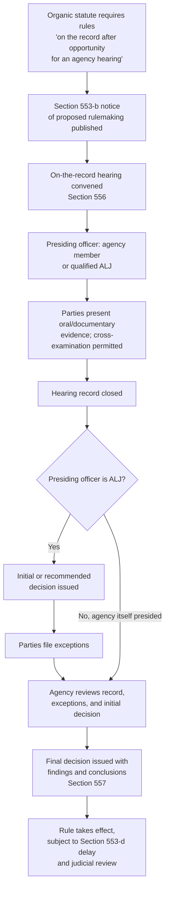

## Formal On-the-Record Rulemaking Under Sections 556 and 557

### Overview

Formal rulemaking is the APA's most procedurally demanding rulemaking track, requiring agencies to conduct a trial-like, on-the-record proceeding governed by 5 U.S.C. §§ 556–557 rather than the more streamlined notice-and-comment process of § 553. Triggered only when an organic statute requires rules to be made "on the record after opportunity for an agency hearing," formal rulemaking imports the same procedural apparatus used in formal adjudication — oral hearings, cross-examination rights, exclusive-record decisionmaking, and strict ex parte restrictions — into the rulemaking context. Though rarely used today, understanding its structure remains essential to administrative law, both historically and because the trigger-language analysis remains a live interpretive issue whenever a new or ambiguous organic statute is enacted.

### The Triggering Mechanism

**Key Points**

- 5 U.S.C. § 553(c) provides that when rules are required by statute "to be made on the record after opportunity for an agency hearing," §§ 556 and 557 apply *instead of* § 553(c)'s ordinary comment procedures (§ 553(b) and (d) still generally apply for notice and effective-date purposes, but the comment-and-decision process is replaced).
- The Supreme Court's decision in *United States v. Florida East Coast Railway Co.*, 410 U.S. 224 (1973), established that this "magic words" trigger requires the organic statute to use language functionally equivalent to "on the record after opportunity for an agency hearing" — mere requirements for "hearing" or "notice and hearing," without more, do **not** trigger formal rulemaking.
- This narrow construction reflects a strong judicial and administrative preference for informal rulemaking, given formal rulemaking's substantial cost, delay, and rigidity.

**[Inference]** *Florida East Coast Railway*'s narrow reading is widely understood as having effectively marginalized formal rulemaking as a live procedural track in modern administrative practice — few organic statutes use the precise triggering language, and Congress has generally avoided drafting new statutes that would invoke it, given the recognized burdens of the formal process.

### Structural Framework: Sections 556 and 557

#### Section 556: Hearing Procedures

§ 556 governs the conduct of the on-the-record hearing itself, including:

1. **Presiding officer** — the hearing must be conducted by the agency, one or more agency members, or an administrative law judge (ALJ) qualified under § 3105.
2. **Burden of proof** — the proponent of a rule or order generally bears the burden of proof (though organic statutes may allocate this differently).
3. **Evidence rules** — parties are entitled to present oral or documentary evidence, and to conduct **cross-examination** "as may be required for a full and true disclosure of the facts."
4. **Exclusivity of the record** — the rule must be decided **exclusively on the record** made at the hearing; the decisionmaker cannot consider material outside that record.
5. **Official notice** — agencies may take official notice of material facts not appearing in the evidence, but parties must be given an opportunity to rebut such noticed facts.

#### Section 557: Decisional Procedures

§ 557 governs how the decision is reached and issued after the hearing concludes:

1. **Initial or recommended decisions** — if the presiding officer is an ALJ, that officer typically issues an initial decision, which may become final absent appeal, or a recommended decision subject to full agency review.
2. **Exceptions and review** — parties may file exceptions to the initial or recommended decision, with supporting reasons, for consideration by the reviewing agency.
3. **Findings and conclusions** — the final decision must include findings and conclusions, along with the reasons or basis for them, on all material issues of fact, law, or discretion presented in the record.
4. **Ex parte contact restrictions** — § 557(d) (added by the 1976 Government in the Sunshine Act) strictly prohibits ex parte communications between agency decisionmakers and any interested person outside the agency regarding the merits of the proceeding, once the proceeding has commenced. Any such improper communication must be placed on the public record, and the presiding officer may require the offending party to show cause why its interest in the proceeding should not be adversely affected.

### Comparing Formal Rulemaking to Informal (§ 553) Rulemaking

| Feature | Informal Rulemaking (§ 553) | Formal Rulemaking (§§ 556–557) |
| --- | --- | --- |
| Trigger | Default track; applies unless formal rulemaking triggered | Organic statute requires "on the record after hearing" |
| Public input mechanism | Written comments | Oral hearing with cross-examination |
| Decisionmaker | Agency generally, based on written record | Presiding officer/ALJ, subject to agency review |
| Record | Comments, data, agency analysis | Exclusive on-the-record hearing transcript and evidence |
| Ex parte contacts | Generally permissible (*Sierra Club v. Costle*) for policy input; factual material should be disclosed | Strictly prohibited under § 557(d) once proceeding commences |
| Cost/time | Relatively efficient | Substantially more resource-intensive and time-consuming |
| Modern usage | Dominant rulemaking mode | Rare; largely confined to specific statutory contexts |

### Comparing Formal Rulemaking to Hybrid Rulemaking

**Key Points**

Formal rulemaking should also be distinguished from **hybrid rulemaking** regimes (such as those under Clean Air Act § 307(d) or the Magnuson-Moss Warranty Act), which add procedural elements beyond § 553 (structured comment periods, defined rulemaking dockets, sometimes limited cross-examination rights) without fully adopting the trial-type §§ 556–557 framework. Hybrid rulemaking represents a middle ground that Congress has more frequently chosen when it wants more rigor than bare notice-and-comment but wishes to avoid the full costs of formal rulemaking's on-the-record hearing structure.

### Diagram: Formal Rulemaking Procedural Sequence

### Ex Parte Restrictions: The Sharpest Contrast with Informal Rulemaking

**Key Points**

§ 557(d)'s ex parte restrictions represent the most significant procedural divergence from informal rulemaking's more permissive approach (as established in *Sierra Club v. Costle*):

- Once a formal rulemaking proceeding has commenced, **any** ex parte communication relevant to the merits between an interested outside person and an agency decisionmaker is prohibited.
- If such a communication occurs, it must be **disclosed and placed on the public record**, and the presiding officer has discretion to require the offending party to show cause why its interests in the proceeding should not be adversely affected as a sanction.
- This restriction applies even to policy-oriented communications (e.g., from the White House) that would generally be tolerated in informal rulemaking — reflecting formal rulemaking's more adjudicative, trial-like character.

**[Inference]** This stark procedural contrast is a key reason formal rulemaking's rarity is significant: it means the vast majority of federal rules are made in a process where a degree of political and policy input from outside the formal record is tolerated, while the small subset of formal rules must be decided in functional isolation from such influence, reflecting Congress's judgment (via the specific organic statute) that these particular determinations warrant adjudicative-style insulation.

### Judicial Review of Formal Rules

Formal rules are reviewed under a **substantial evidence** standard rather than the ordinary arbitrary-and-capricious standard applicable to informal rules:

- 5 U.S.C. § 706(2)(E) provides for review to set aside agency action found to be "unsupported by substantial evidence" in cases subject to §§ 556–557 or otherwise reviewed on the record of an agency hearing.
- The substantial evidence standard asks whether the record, taken as a whole, contains evidence a reasonable mind might accept as adequate to support the agency's conclusion — generally considered a **more searching form of review** than arbitrary-and-capricious review, since it requires the reviewing court to examine the sufficiency of the actual evidentiary record rather than simply assessing the agency's reasoning process.

**[Unverified]** Whether substantial evidence review is meaningfully more rigorous than arbitrary-and-capricious review in practice, or whether the two standards tend to converge in application, has been debated among courts and commentators; the formal textual distinction is clear, but practical application can vary.

### Historical Context and Modern Rarity

**[Inference]** Formal rulemaking was more prominent in certain regulatory contexts historically (e.g., early Federal Trade Commission and Interstate Commerce Commission practice, and some FDA proceedings), but has become exceedingly rare in modern administrative practice following *Florida East Coast Railway*'s narrow construction of the triggering language and Congress's general drafting practice of avoiding the "magic words" when creating new regulatory programs. Agencies and Congress have widely recognized informal or hybrid rulemaking as more administrable for most modern regulatory needs, given the substantial time and resource costs formal rulemaking imposes.

### Environmental Law Applications

**[Inference]** Formal, on-the-record rulemaking under §§ 556–557 is rarely, if ever, the operative procedure in major environmental rulemaking programs — environmental statutes such as the Clean Air Act, Clean Water Act, RCRA, and TSCA generally rely on informal rulemaking under § 553 or hybrid rulemaking procedures (such as CAA § 307(d)) rather than triggering the "on the record after hearing" formal rulemaking language. This makes formal rulemaking primarily of doctrinal and historical significance in the environmental law context, though understanding the *Florida East Coast Railway* framework remains important background for interpreting any newly enacted or ambiguous statutory hearing requirements that might arise in environmental statutes, and for distinguishing formal rulemaking from the more common hybrid rulemaking and formal *adjudication* procedures that do appear in environmental permitting contexts (e.g., certain contested NPDES permit hearings, which may trigger formal adjudicatory — not rulemaking — procedures).

### Conclusion

Formal on-the-record rulemaking under §§ 556–557 represents the APA's most rigorous procedural track, importing trial-like hearing procedures, exclusive-record decisionmaking, and strict ex parte restrictions into the rulemaking process. Its narrow triggering standard — requiring specific "on the record after opportunity for an agency hearing" statutory language, as established in *Florida East Coast Railway* — combined with its substantial costs, has rendered it a marginal feature of modern administrative practice, with informal and hybrid rulemaking dominating the regulatory landscape, including in environmental law. Nonetheless, understanding formal rulemaking's structure remains essential both for historical context and for correctly analyzing any organic statute whose hearing-requirement language approaches the *Florida East Coast Railway* threshold.

**Related Topics**

- *United States v. Florida East Coast Railway Co.* and the "magic words" trigger doctrine
- Formal adjudication procedures and their relationship to formal rulemaking
- Section 557(d) ex parte restrictions, contrasted with informal rulemaking practice
- Substantial evidence review under Section 706(2)(E)
- Hybrid rulemaking regimes (Clean Air Act Section 307(d), Magnuson-Moss Act)
- Administrative law judges and the qualifications requirement under Section 3105
- Historical formal rulemaking practice (FTC, ICC, early FDA proceedings)
- Formal adjudicatory hearings in environmental permitting (NPDES contested case proceedings)