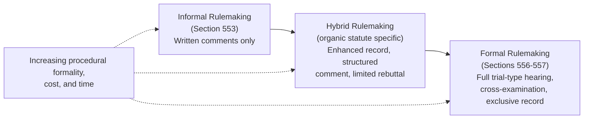

## Hybrid Rulemaking Procedures Created by Organic Statutes

### Overview

Hybrid rulemaking occupies the middle ground between the APA's two statutory tracks — informal notice-and-comment rulemaking under § 553 and formal on-the-record rulemaking under §§ 556–557. Rather than a single defined APA category, "hybrid rulemaking" refers to a family of procedures that Congress has created through specific organic statutes, layering additional procedural requirements onto the § 553 baseline without triggering the full trial-type apparatus of formal rulemaking. These regimes emerged largely as a legislative and judicial response to concerns that bare notice-and-comment was too thin for high-stakes, technically complex, or economically significant regulatory decisions, while full formal rulemaking was too costly and rigid.

### Historical Origins

**Key Points**

- Hybrid rulemaking developed substantially in the 1970s, partly in response to a period of "hard look" judicial review in which some courts (particularly the D.C. Circuit) began requiring more elaborate procedural protections in informal rulemaking than § 553's bare text demanded — sometimes engrafting judicially created procedural requirements onto agencies' notice-and-comment processes.
- The Supreme Court's decision in *Vermont Yankee Nuclear Power Corp. v. NRDC*, 435 U.S. 519 (1978), significantly curtailed this judicial practice, holding that **courts generally may not impose additional procedural requirements on agencies beyond what the APA (or the applicable organic statute) itself demands** — agencies are entitled to use the minimum procedures Congress has specified unless the organic statute or the APA requires more.
- Following *Vermont Yankee*, the primary legitimate source of "extra" procedural requirements shifted decisively to **Congress itself**, through organic statutes that expressly mandate hybrid procedures — rather than courts judicially engrafting such requirements onto § 553.

**[Inference]** *Vermont Yankee* is widely understood as having redirected the locus of procedural innovation in rulemaking away from judicial invention and toward explicit congressional design, which is why virtually all significant hybrid rulemaking regimes trace to specific statutory text (rather than generalized judicial doctrine) enacted by Congress in particular regulatory contexts.

### Common Features of Hybrid Rulemaking Regimes

While hybrid statutes vary considerably, common additional procedural elements include:

1. **Defined rulemaking record requirements** — a more formalized, court-like administrative record requirement, sometimes specifying what must be included and how it must be certified.
2. **Extended or structured comment periods** — often longer than typical § 553 comment periods, sometimes with multiple comment rounds (initial comment, reply comment).
3. **Limited cross-examination or rebuttal rights** — some hybrid statutes permit interested parties to submit rebuttal evidence or, in narrower circumstances, to cross-examine on discrete disputed factual issues, without adopting the full trial-type hearing of §§ 556–557.
4. **Enhanced statement of basis and purpose requirements** — often mandating that the agency specifically respond to significant comments and explain its reasoning in more detail than § 553(c)'s bare text requires.
5. **Docket and disclosure requirements** — requiring that technical data and studies relied upon be placed in a publicly accessible docket during the comment period, addressing meaningful-comment concerns.
6. **Judicial review provisions** — often paired with special review provisions designating a specific reviewing court (frequently a court of appeals) and sometimes an enhanced standard of review tied to the more developed record.

### Leading Example: Clean Air Act Section 307(d)

**Key Points**

Clean Air Act § 307(d) is one of the most prominent and frequently studied hybrid rulemaking statutes, applicable to many (though not all) EPA rulemakings under the Act. Its key features include:

1. **Docketing requirement** — EPA must establish a rulemaking docket containing the proposed rule, all documents supporting the proposal, and comments received.
2. **Statement of basis and purpose** — the final rule must include a response to each significant comment, criticism, or new data submitted during the comment period.
3. **Prohibition on post-comment-period ex parte data**: information or data relied upon in the final rule but not available to the public during the comment period generally must be disclosed, with an additional comment opportunity provided if necessary.
4. **Effective date and judicial review provisions** — § 307(d) actions are subject to specific review timing and venue provisions, generally channeling review to the D.C. Circuit or the relevant regional circuit for many CAA rules.
5. **Record-based review**: the reviewing court's analysis is explicitly tied to "the rulemaking record" as defined by the statute, reinforcing the *Overton Park*/*Chenery* record-review principles in a statutorily codified form specific to CAA rulemaking.

**Example**

When EPA proposes a National Ambient Air Quality Standard (NAAQS) revision under CAA § 307(d) procedures, the agency must: publish the proposal with supporting technical documents in the docket; accept and respond to all significant comments (including from CASAC, industry, and public health groups); disclose any new data developed during the process (potentially triggering supplemental comment); and produce a response-to-comments document addressing all significant issues — all while remaining short of the full oral hearing and cross-examination rights of formal rulemaking under §§ 556-557.

### Other Notable Hybrid Rulemaking Statutes

**[Inference]** Beyond CAA § 307(d), several other statutes have historically incorporated hybrid rulemaking elements, though specific statutory details and the degree of "hybrid-ness" vary:

- **Magnuson-Moss Warranty—Federal Trade Commission Improvement Act** — historically required the FTC to provide interested parties an opportunity to make oral presentations and, under some circumstances, limited cross-examination on genuinely disputed material facts, for certain trade regulation rules — a statute often cited as a paradigmatic hybrid rulemaking example due to its explicit incorporation of trial-type elements into what remains fundamentally an informal-rulemaking-based process.
- **Toxic Substances Control Act (TSCA)** — has included provisions requiring more detailed rulemaking records and, in some contexts, expanded procedural requirements for certain rules, reflecting the technical complexity of chemical regulation.
- **Occupational Safety and Health Act** — OSHA rulemaking for certain health and safety standards has historically involved procedures with elements beyond bare § 553, including in some instances the opportunity for interested parties to request a public hearing with limited cross-examination rights on disputed factual issues.

**[Unverified]** The precise current procedural requirements under these statutes may have been modified by subsequent legislative or regulatory changes; practitioners should verify the current text of the specific organic statute and implementing regulations before relying on any characterization of a particular hybrid rulemaking regime's exact requirements.

### Diagram: Hybrid Rulemaking Positioned Between Informal and Formal Tracks

### Vermont Yankee's Continuing Constraint on Judicial Innovation

**Key Points**

*Vermont Yankee*'s holding remains significant precisely because it establishes the boundary within which hybrid rulemaking must operate:

- Courts **cannot** independently require agencies to adopt hybrid-style procedures (extra hearings, cross-examination, enhanced records) as a matter of judicially perceived "good administrative practice" absent a statutory or constitutional basis.
- Any hybrid procedural requirement must trace to either: (a) the specific organic statute's text, (b) the agency's own voluntary choice to adopt more elaborate procedures than legally required, or (c) in rare cases, due process constitutional requirements in circumstances involving specific individual rights.
- This means the scope of hybrid rulemaking is fundamentally **congressionally defined** rather than judicially expandable — a court reviewing a rulemaking cannot invalidate it merely because the court believes additional procedures would have been preferable, so long as the agency complied with whatever the applicable statute (APA baseline plus organic statute enhancements) actually required.

**[Inference]** This constraint is often cited as reinforcing the *Chenery*/*Overton Park* framework's emphasis on record-based review rather than open-ended judicial procedural innovation — courts assess compliance with defined procedural requirements, not their own preferences about optimal process design.

### Judicial Review Under Hybrid Rulemaking Statutes

Hybrid rulemaking statutes often specify or imply a particular standard of review, though many (including CAA § 307(d)) generally retain the arbitrary-and-capricious standard under § 706(2)(A) rather than shifting to the substantial evidence standard applicable to formal rulemaking. However, the **more developed record** typically compiled under hybrid procedures often results in more searching practical scrutiny, since courts have a richer record against which to assess the reasonableness of the agency's decision — a form of "hard look" review that operates within the arbitrary-and-capricious standard rather than replacing it.

**[Unverified]** Whether hybrid rulemaking's enhanced record requirements meaningfully alter the practical rigor of judicial review (as opposed to merely the formal standard applied) is a matter of ongoing scholarly and judicial discussion, with some arguing that richer records enable more searching de facto review even under a nominally unchanged legal standard.

### Environmental Law Applications

- **CAA Section 307(d) as the paradigmatic environmental hybrid regime**: Because so much of EPA's major rulemaking activity under the Clean Air Act proceeds through § 307(d) procedures, this statute is arguably the single most important hybrid rulemaking regime in environmental law, governing NAAQS reviews, New Source Performance Standards, hazardous air pollutant standards, and numerous other significant EPA actions.
- **TSCA chemical rulemaking**: TSCA's rulemaking provisions for chemical risk evaluation and management rules have historically included enhanced procedural and record requirements reflecting the technical complexity and high stakes of chemical regulation decisions.
- **Interaction with NEPA**: Hybrid rulemaking's enhanced record and disclosure requirements often intersect with NEPA's own environmental review and disclosure obligations when a rulemaking itself triggers NEPA analysis, creating a dual-track procedural framework in environmental rulemakings that fall under both regimes.
- **Litigation significance**: Because CAA § 307(d) and similar hybrid statutes impose specific docketing and comment-response obligations, EPA rulemaking challenges frequently include claims that the agency failed to meet these statute-specific requirements (in addition to or instead of general § 553/§ 706 claims), making familiarity with the specific organic statute's hybrid provisions essential for environmental rulemaking litigation.

### Conclusion

Hybrid rulemaking represents Congress's considered response to the perceived gap between informal rulemaking's minimal procedural demands and formal rulemaking's excessive costs — a response necessitated in part by *Vermont Yankee*'s foreclosure of judicial procedural innovation as an alternative path. By layering specific, statutorily defined enhancements (structured records, extended comment procedures, limited rebuttal rights, detailed comment-response obligations) onto the § 553 baseline, organic statutes like Clean Air Act § 307(d) create a middle procedural track calibrated to the technical complexity and stakes of the underlying regulatory decisions. Because these enhancements are organic-statute-specific rather than uniformly defined across the U.S. Code, practitioners must examine the particular statutory text governing any given rulemaking to determine exactly which hybrid procedural obligations apply — a task made especially important in environmental law, where CAA § 307(d) governs a substantial share of the field's most significant regulatory actions.

**Related Topics**

- *Vermont Yankee Nuclear Power Corp. v. NRDC* and the limits on judicial procedural innovation
- Clean Air Act Section 307(d) rulemaking record and comment-response requirements
- Formal rulemaking under Sections 556-557, contrasted
- The concise general statement of basis and purpose under Section 553(c)
- Building the rulemaking record and responding to significant comments
- NEPA's interaction with hybrid rulemaking disclosure obligations
- Hard look review and its post-*Vermont Yankee* boundaries
- TSCA and OSHA rulemaking procedural enhancements