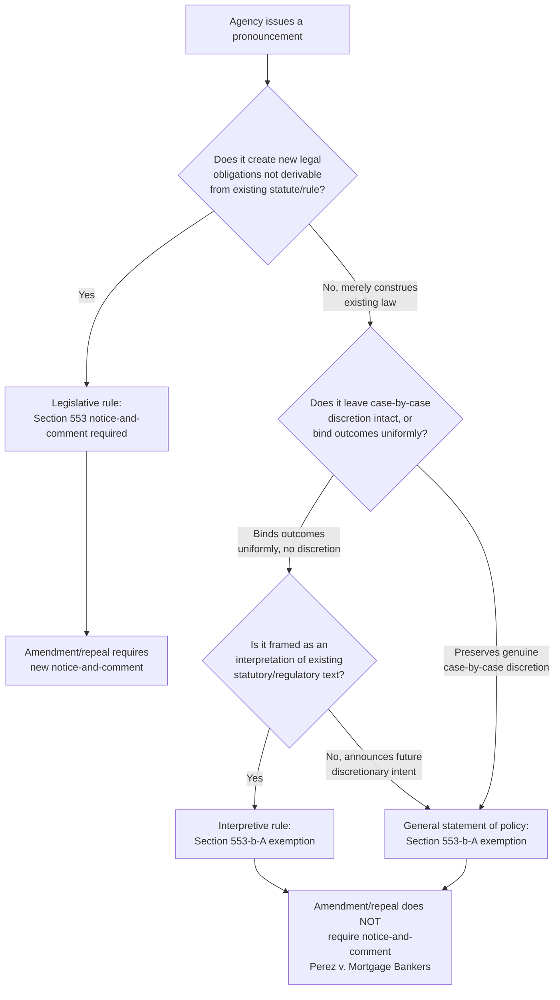

## Legislative Rules Versus Interpretive Rules Versus General Statements of Policy

### Overview

The classification of an agency pronouncement as a **legislative rule**, an **interpretive rule**, or a **general statement of policy** is one of the most consequential — and most litigated — threshold questions in administrative law. The classification determines whether notice-and-comment rulemaking under 5 U.S.C. § 553(b)-(c) is required, whether the pronouncement carries the "force of law," and how much deference a reviewing court will afford it. Because agencies have institutional incentives to characterize pronouncements as non-legislative to avoid rulemaking's procedural burdens, courts have developed extensive doctrinal tests to police the boundary — tests that remain unsettled and contested in application.

### The Three Categories Defined

**Key Points**

1. **Legislative rules** (also called substantive rules) — pronouncements that create new law, rights, duties, or obligations; they have "the force and effect of law" and bind both the agency and regulated parties. Legislative rules **require** notice-and-comment under § 553(b)-(c) (absent an exemption) and, once validly promulgated, carry the same legal force as if enacted by Congress within the scope of the agency's delegated authority.
2. **Interpretive rules** — pronouncements that advise the public of the agency's construction of a statute or existing legislative rule, without themselves creating new legal obligations. They are exempt from notice-and-comment under § 553(b)(A). Interpretive rules do not bind courts to the same degree as legislative rules and traditionally receive lesser judicial deference (see below).
3. **General statements of policy** — pronouncements that announce the agency's tentative intentions for the future exercise of discretionary power, without binding the agency or regulated parties to any particular outcome in a specific case. Also exempt from notice-and-comment under § 553(b)(A).

### Why the Classification Matters

| Consequence | Legislative Rule | Interpretive Rule / Policy Statement |
| --- | --- | --- |
| Notice-and-comment required | Yes (§ 553(b)-(c)) | No (§ 553(b)(A) exemption) |
| Binding force on regulated parties | Yes | Generally no (in theory) |
| Binding force on the agency itself | Yes | Traditionally more flexible |
| Amendment/repeal procedure | Requires new notice-and-comment (symmetry principle) | May be amended/repealed without notice-and-comment (*Perez v. Mortgage Bankers Ass'n*) |
| Judicial deference to agency's interpretation | Generally stronger claim to deference when validly promulgated within delegated authority | Historically assessed under *Skidmore*-type persuasiveness factors rather than binding deference |

### Doctrinal Tests for Distinguishing Legislative from Interpretive Rules

**[Inference]** No single test commands unanimous acceptance across all circuits; courts apply overlapping and sometimes competing formulations, generally examining several factors in combination:

1. **The "legal effect" test** — Does the rule, as a practical matter, create new rights or obligations that did not previously exist, or does it merely restate/clarify what the underlying statute or existing legislative rule already required? A rule that would be enforceable and create a violation for noncompliance, independent of the underlying statute's own terms, points toward legislative status.
2. **The "independent basis" test** — Could the agency have reached the same result by interpreting the existing statute or rule without the new pronouncement? If the pronouncement is not a plausible reading of preexisting law but instead fills a genuine regulatory gap or changes a preexisting substantive standard, this points toward legislative status.
3. **The "agency's own characterization" factor** — How did the agency itself describe the rule (e.g., in the Federal Register notice, citing rulemaking authority vs. merely announcing an interpretation)? While not dispositive (agencies cannot self-declare a legislative rule "interpretive" to avoid notice-and-comment), the agency's stated intent and cited authority are relevant evidence.
4. **The "binding effect in practice" test** — Does the agency treat the pronouncement as binding on its own staff and enforcement decisions, foreclosing case-by-case discretion? A guidance document that agency personnel are directed to follow without deviation functions more like a legislative rule regardless of its label.

**Example**

The IRS issues a "notice" interpreting an ambiguous term in the tax code, stating the agency's view that certain transactions qualify for a deduction. If the notice merely articulates the IRS's reading of existing statutory language — a reading a court could independently reach through statutory interpretation — it is likely interpretive. If, instead, the notice imposes specific new compliance procedures, recordkeeping obligations, or safe-harbor conditions not derivable from the statute's text alone, and IRS examiners are directed to enforce those specific conditions without deviation, a court may find the notice functions as a legislative rule requiring notice-and-comment.

### Distinguishing Policy Statements from Legislative Rules

**Key Points**

The leading formulation for policy statements asks whether the pronouncement:

1. **Leaves the agency and its decisionmakers free to exercise discretion** in individual cases, or instead effectively binds outcomes.
2. **Has not yet been applied in a way that forecloses case-by-case consideration** of the particular facts presented.

A statement that announces "the agency generally intends to pursue enforcement priority X" while leaving individual enforcement decisions to case-specific discretion is a policy statement. A statement that says "the agency will treat all conduct meeting criteria Y as a per se violation, with no case-specific exceptions" functions as a legislative rule, because it has eliminated the discretionary, case-by-case character that defines a genuine policy statement.

**[Inference]** Courts have sometimes found that agencies' apparent "policy statements" cross into legislative rule territory when, in practice, the agency applies them so rigidly and uniformly that the promised case-by-case discretion becomes illusory — this "practical binding effect" inquiry closely parallels the interpretive/legislative rule distinction's emphasis on real-world operation over formal labeling.

### The Interpretive Rule Amendment Question: Perez v. Mortgage Bankers Ass'n

*Perez v. Mortgage Bankers Ass'n*, 575 U.S. 92 (2015), resolved a significant sub-issue: whether an agency must use notice-and-comment to **amend or repeal** a long-standing interpretive rule (the so-called *Paralyzed Veterans* doctrine from D.C. Circuit precedent, which had required such procedure).

- The Supreme Court unanimously rejected the *Paralyzed Veterans* doctrine, holding that because interpretive rules are exempt from notice-and-comment under § 553(b)(A) in the first instance, they remain exempt when being amended or repealed — the APA's text draws no distinction between initial issuance and subsequent modification of interpretive rules.
- This reinforces interpretive rules' inherent flexibility: agencies can revise their interpretive guidance relatively freely compared to legislative rules, which require full notice-and-comment for any amendment under the symmetry principle.

**[Inference]** *Perez* is sometimes read as creating a structural incentive for agencies to favor interpretive-rule-style guidance over legislative rulemaking, since guidance offers greater long-term flexibility to adjust positions without procedural cost — a dynamic that has fueled ongoing scholarly and judicial attention to whether agencies are appropriately classifying their pronouncements.

### Judicial Deference Implications

**Key Points**

- **Legislative rules**, validly promulgated through notice-and-comment within the scope of clear congressional delegation, historically received strong deference to the agency's reasonable interpretations embodied in the rule (formerly analyzed under the *Chevron* framework).
- **Interpretive rules** have historically received a more variable degree of deference, often analyzed under the *Skidmore v. Swift & Co.*, 323 U.S. 134 (1944), framework — deference calibrated to the persuasiveness of the agency's reasoning, its consistency over time, and its expertise, rather than the more categorical deference sometimes afforded to legislative rules.

**[Unverified]** Following *Loper Bright Enterprises v. Raimondo*, 603 U.S. 369 (2024), which eliminated *Chevron* deference to agency statutory interpretations embodied in regulations, the precise practical deference gap between legislative and interpretive rules may be narrowing, since courts now exercise independent judgment on statutory meaning across the board — though *Skidmore*-style respect for agency expertise and consistency likely remains relevant to interpretive rules, and the full implications of *Loper Bright* for this classification framework continue to develop in case law.

### Diagram: Classification Decision Framework

### Practical Litigation Posture

**Key Points**

Because agencies benefit from issuing guidance rather than legislative rules (avoiding notice-and-comment delay and cost, and preserving amendment flexibility under *Perez*), challengers frequently argue that a given "guidance document," "interpretive rule," or "policy statement" is actually a legislative rule improperly issued without required procedures. Common litigation strategies include:

1. Demonstrating the pronouncement's **practical binding effect** on agency staff or regulated parties (e.g., internal directives requiring uniform application, or public statements suggesting mandatory compliance).
2. Showing the pronouncement **imposes obligations with no clear basis** in preexisting statutory or regulatory text.
3. Pointing to **enforcement patterns** treating noncompliance with the "guidance" as a per se violation, undermining any claim that discretion remains genuinely open.
4. Highlighting **agency statements** (litigation positions, public communications) describing the guidance as mandatory or as establishing a fixed compliance standard.

### Environmental Law Applications

- **EPA guidance documents**: Environmental law generates substantial litigation over the legislative/interpretive line, given EPA's frequent use of guidance memoranda addressing technical implementation questions (e.g., permitting guidance, jurisdictional determinations under the Clean Water Act, enforcement discretion policies).
- **WOTUS jurisdictional guidance**: Determinations regarding which waters qualify as "waters of the United States" have repeatedly generated disputes over whether specific agency memoranda function as legislative rules (requiring notice-and-comment) or permissible interpretive guidance, given their significant practical effect on permitting obligations.
- **Enforcement policy statements**: EPA's enforcement discretion policies (e.g., regarding self-disclosure and audit policies, or temporary enforcement flexibility during emergencies) are typically framed as general statements of policy, preserving case-by-case enforcement discretion — a classification that is sometimes contested if the agency appears to apply the policy without genuine case-by-case variation.
- **Technical guidance and permitting criteria**: Detailed technical guidance documents (e.g., on modeling methodologies, testing protocols, or permit application requirements) frequently sit in contested territory, since they may functionally dictate permitting outcomes even while formally labeled as non-binding guidance.

### Conclusion

The tripartite distinction between legislative rules, interpretive rules, and general statements of policy governs one of administrative law's most consequential and frequently litigated procedural gateways: whether an agency pronouncement must undergo notice-and-comment before taking effect. While courts apply a range of overlapping tests — focusing on legal effect, independent statutory basis, and practical binding effect — the inquiry remains fact-intensive and contested, particularly as agencies have institutional incentives to favor the greater flexibility and lower procedural cost of interpretive rules and policy statements, reinforced by *Perez v. Mortgage Bankers Ass'n*'s holding that such guidance can be freely amended without notice-and-comment. In technically complex, high-stakes regulatory fields like environmental law, this classification question remains a persistent and consequential battleground in litigation over agency guidance documents.

**Related Topics**

- *Perez v. Mortgage Bankers Ass'n* and the interpretive rule amendment doctrine
- Section 553(b)(A) exemptions in depth
- *Skidmore v. Swift & Co.* deference and its post-*Loper Bright* significance
- *Loper Bright Enterprises v. Raimondo* and the elimination of *Chevron* deference
- Guidance documents and the "practical binding effect" test
- Good cause exemption under Section 553(b)(B), contrasted
- Amendment, repeal, and sunset of existing legislative rules
- Finality doctrine under Section 704 and reviewability of guidance documents