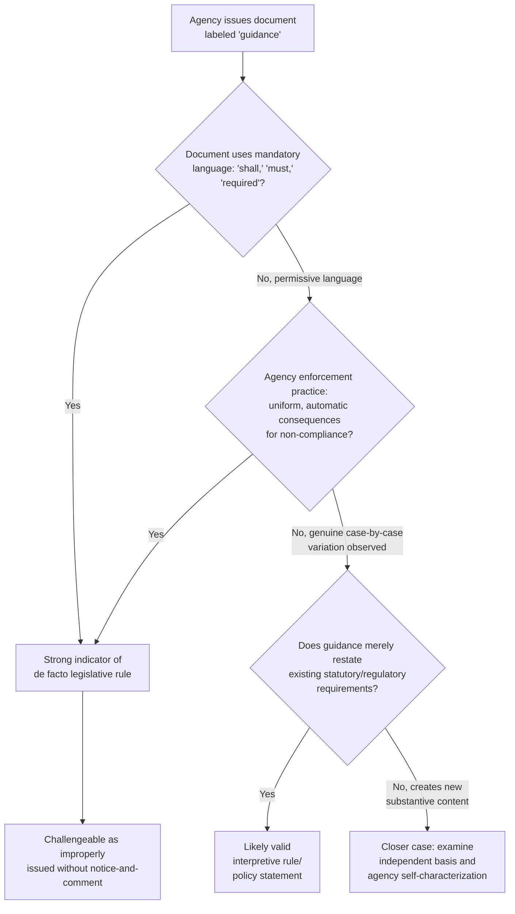

## Guidance Documents and the Problem of De Facto Binding Effect

### Overview

Guidance documents — the broad umbrella term encompassing agency memoranda, manuals, letters, FAQs, enforcement policies, and similar pronouncements issued outside notice-and-comment rulemaking — have become one of the most significant and contested phenomena in modern administrative practice. While formally classified as interpretive rules or general statements of policy exempt from § 553's procedural requirements, guidance documents frequently function, in practice, as binding regulatory mandates. This gap between formal classification and operational reality — the "de facto binding effect" problem — sits at the center of ongoing administrative law disputes and represents a natural extension of the legislative/interpretive/policy classification framework into its most practically significant application.

### Why Agencies Rely on Guidance

**Key Points**

Agencies have substantial institutional incentives to use guidance documents rather than legislative rulemaking:

1. **Speed** — guidance can be issued immediately, without the months or years often required for notice-and-comment rulemaking.
2. **Flexibility** — guidance can be revised or withdrawn without a new rulemaking proceeding (reinforced by *Perez v. Mortgage Bankers Ass'n*, which confirmed interpretive rules may be freely amended).
3. **Resource conservation** — avoiding notice-and-comment saves substantial agency staff time and resources that would otherwise go toward responding to comments and building a defensible record.
4. **Addressing implementation gaps** — guidance allows agencies to clarify ambiguous statutory or regulatory requirements as practical questions arise, without waiting for a full rulemaking cycle.
5. **Avoiding OIRA review** — significant legislative rules typically undergo centralized review under Executive Order 12866; guidance documents have historically faced less centralized review, though this has been subject to periodic executive branch reform efforts.

**[Inference]** The sheer practical convenience of guidance relative to legislative rulemaking has led to a substantial expansion in agencies' reliance on guidance documents across virtually all major regulatory agencies, a trend frequently noted by administrative law scholars and periodically targeted by executive branch and congressional reform initiatives aimed at increasing guidance transparency and accountability.

### The Core Problem: Formal Classification vs. Operational Reality

**Key Points**

The central tension is this: a document formally labeled "guidance" and issued without notice-and-comment may nonetheless:

- Be treated by agency staff as **mandatory** for enforcement or compliance purposes, with no genuine case-by-case deviation.
- Be relied upon by regulated parties as the **actual operative standard**, since deviating from guidance risks enforcement action even if the guidance is not technically "binding law."
- Function as the practical basis for **adverse agency action** against a party who fails to comply, even though the party had no notice-and-comment opportunity to contest the standard before it was applied to them.
- Create such strong incentives to comply that regulated parties treat it as legally binding regardless of its formal status — sometimes called the "practical compulsion" problem.

This dynamic effectively allows agencies to achieve the substantive result of legislative rulemaking (binding, generally applicable standards) while avoiding legislative rulemaking's procedural safeguards (notice, comment, reasoned response, judicial review of the underlying record).

### Judicial Tests for Identifying De Facto Legislative Rules

Courts examine several recurring indicators when a guidance document is challenged as functioning as an improperly issued legislative rule:

1. **Mandatory language** — Does the document use language such as "shall," "must," or "required" rather than "may," "should consider," or "generally"?
2. **Absence of a genuine safe harbor for deviation** — Does the guidance explicitly state (and does agency practice confirm) that regulated parties may propose alternative approaches, or does noncompliance with the guidance's specific terms trigger automatic adverse consequences?
3. **Internal agency treatment** — Are agency personnel (inspectors, examiners, enforcement staff) instructed to apply the guidance uniformly without deviation, effectively treating it as binding?
4. **Practical consequences of noncompliance** — Does departing from the guidance result in automatic penalties, denial of a benefit, or enforcement action, or does the agency actually engage in individualized assessment?
5. **Independent legal basis** — Could the same substantive result be reached through straightforward interpretation of the existing statute or legislative rule, or does the guidance fill a genuine gap by creating new substantive content?

**[Inference]** No single factor is dispositive, and courts weigh these considerations holistically; the inquiry often turns on a close examination of both the document's text and the agency's actual practice, since even a document phrased in permissive language ("agency generally expects") can be found to have de facto binding effect if enforcement practice reveals rigid, uniform application.

### Example: The De Facto Binding Effect Problem in Action

**Example**

An agency issues an "enforcement guidance" memorandum stating: "Facilities are encouraged to implement monitoring protocol X; failure to do so will be considered by inspectors when evaluating overall compliance." On its face, this appears to preserve discretion (permissive language, one factor among several).

If, in practice, agency records show that inspectors treat any facility not implementing protocol X as automatically noncompliant, issue citations solely for lack of protocol X regardless of other compliance indicators, and provide no meaningful path for facilities to demonstrate equivalent alternative compliance — a court may find the guidance functions as a de facto legislative rule, since the "encouragement" is illusory and the practical consequence of noncompliance is uniform and automatic.

Contrast: If agency records show genuine variation in enforcement outcomes — some facilities without protocol X face no adverse action because inspectors found other adequate monitoring approaches — this pattern supports the guidance's classification as genuine, non-binding guidance preserving case-by-case discretion.

### Diagram: De Facto Binding Effect Analysis

### Reviewability Threshold: The Finality Requirement

**Key Points**

Before a court can even reach the de facto binding effect question, a challenger must establish that the guidance constitutes **final agency action** under § 704, per the two-part test from *Bennett v. Spear*, 520 U.S. 154 (1997):

1. The action must mark the **consummation of the agency's decisionmaking process** (not merely tentative or interlocutory).
2. The action must be one by which **rights or obligations have been determined**, or from which **legal consequences will flow**.

**[Inference]** Guidance documents present a recurring finality puzzle: an agency defending a guidance challenge will often argue the guidance is not "final" because it is merely advisory and doesn't itself determine rights or obligations, while a challenger will argue the guidance's practical binding effect demonstrates that legal consequences do flow from it — making the finality inquiry and the de facto binding effect inquiry closely intertwined in guidance litigation, since evidence of practical bindingness tends to support both the finality argument and the improper-legislative-rule argument simultaneously.

### Executive and Congressional Responses to the Guidance Problem

**Key Points**

Recognizing the guidance transparency and accountability concerns, various executive branch and legislative initiatives have periodically addressed guidance document practices, including:

1. **Guidance repositories and transparency requirements** — some administrations have directed agencies to maintain public, searchable databases of active guidance documents.
2. **Internal review requirements** — directing significant guidance documents through a review process (sometimes involving OIRA) analogous to, though generally less rigorous than, the review applied to significant legislative rules.
3. **Explicit disclaimers** — requiring guidance documents to include disclaimer language clarifying their non-binding status and stating that deviation will not, by itself, result in enforcement action.
4. **Sunset or periodic review requirements** — encouraging agencies to periodically review and retire outdated guidance documents.

**[Unverified]** The specific content, scope, and continuity of such executive branch guidance-reform initiatives have varied across administrations, and practitioners should verify current executive orders and agency-specific guidance policies rather than assuming a stable, uniform framework governs guidance document practice government-wide.

### Practical Advice for Regulated Parties

**Key Points**

Entities navigating agency guidance should generally:

1. **Distinguish formal legal obligations** (statutes, legislative rules) from **guidance-based expectations**, recognizing that guidance in theory permits deviation with adequate justification.
2. **Document instances of agency flexibility or inflexibility** in applying guidance, since such patterns are directly relevant to any future de facto binding effect challenge.
3. **Consider petitioning for rulemaking** under § 553(e) if a guidance document appears to function as a de facto rule, seeking to compel the agency to either formalize the standard through proper notice-and-comment or confirm its non-binding status.
4. **Preserve challenges early**, since finality and ripeness doctrines may affect the timing and viability of a guidance challenge — waiting until an enforcement action is brought may be one viable path, but pre-enforcement review may also be available if the guidance has sufficiently concrete, immediate practical effect.

### Environmental Law Applications

- **EPA guidance proliferation**: Environmental regulatory programs generate an especially large volume of guidance documents given their technical complexity — covering topics such as permitting criteria, testing methodologies, risk assessment protocols, and enforcement discretion policies.
- **Jurisdictional and permitting guidance**: Guidance addressing Clean Water Act jurisdictional questions (e.g., wetlands determinations) or Clean Air Act permitting applicability has repeatedly generated de facto binding effect litigation, given the significant practical consequences guidance can have on whether a party needs a permit at all.
- **State agency guidance under delegated programs**: Many environmental programs are delegated to state agencies (e.g., state-implemented NPDES or air permitting programs), and state-level guidance documents interpreting federal requirements can raise parallel de facto binding effect questions under state administrative procedure acts, which often mirror the federal APA's legislative/interpretive rule framework.
- **Enforcement discretion guidance**: EPA's self-disclosure and audit policies, compliance guidance, and enforcement priority memoranda are frequently structured to explicitly preserve case-by-case discretion, reflecting agency awareness of de facto binding effect litigation risk in this heavily guidance-dependent regulatory field.

### Conclusion

The de facto binding effect problem exposes a structural tension at the heart of modern administrative practice: agencies' practical need for flexible, rapidly issued guidance collides with the APA's foundational commitment to notice-and-comment participation for rules that function as binding law. Courts navigate this tension through fact-intensive inquiries into a guidance document's language, the agency's actual enforcement practice, and whether the document creates genuinely new substantive content or merely restates existing legal obligations — inquiries that closely parallel and extend the broader legislative/interpretive/policy classification framework. Because guidance documents represent an increasingly dominant mode of agency communication with regulated parties, particularly in technically complex fields like environmental law, the de facto binding effect doctrine remains one of the most practically significant and actively litigated areas of contemporary administrative law.

**Related Topics**

- Legislative rules vs. interpretive rules vs. general statements of policy classification framework
- *Perez v. Mortgage Bankers Ass'n* and interpretive rule amendment flexibility
- *Bennett v. Spear* finality doctrine and its application to guidance challenges
- Section 553(e) petitions for rulemaking as a guidance-formalization strategy
- Ripeness doctrine and pre-enforcement review of guidance documents
- OIRA review of significant guidance under executive branch transparency initiatives
- Enforcement discretion policies in environmental permitting and compliance contexts
- State administrative procedure act parallels in delegated environmental programs