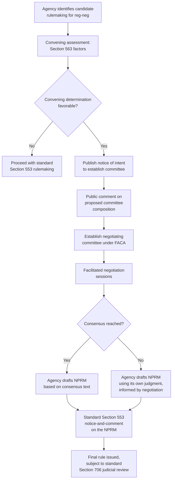

## Negotiated Rulemaking and Consensus-Based Rule Development

### Overview

Negotiated rulemaking ("reg-neg") is a procedural innovation authorized by the Negotiated Rulemaking Act of 1990, codified at 5 U.S.C. §§ 561–570, that allows agencies to convene a representative committee of affected stakeholders to negotiate the substantive text of a proposed rule **before** the agency issues its NPRM. Rather than the traditional sequential process — agency drafts, publishes, and receives comments after the fact — negotiated rulemaking front-loads stakeholder input into the drafting process itself, aiming to produce a proposal so well-vetted by affected interests that formal notice-and-comment becomes largely confirmatory rather than adversarial.

### Statutory Framework

**Key Points**

The Negotiated Rulemaking Act establishes:

1. **Discretionary authority** — agencies are not required to use negotiated rulemaking; it remains an optional supplement to standard § 553 procedures, not a replacement for them.
2. **A convening determination** — before establishing a negotiated rulemaking committee, the agency must determine that negotiated rulemaking is appropriate, considering factors such as:
   - Whether there is a **limited number of identifiable interests** significantly affected by the rule.
   - Whether it is **feasible for a committee to negotiate** in good faith to reach a consensus.
   - Whether the rulemaking is unlikely to be unreasonably delayed by the negotiation process.
   - Whether the agency has adequate resources to support the committee's activities.
   - Whether the agency retains authority to make the final decision, notwithstanding any committee consensus (since the negotiated committee's recommendation does not bind the agency's ultimate legal authority to issue the rule).
3. **Federal Register notice of intent to establish a committee**, inviting public comment on the proposed committee's composition and the issues to be negotiated.
4. **Committee formation** under the Federal Advisory Committee Act (FACA) framework, with balanced representation of interests significantly affected by the rule, including the agency itself as a participant.
5. **Facilitated negotiation**, often with a neutral facilitator or mediator, aimed at reaching **consensus** — typically defined as unanimous agreement among committee members, absent an alternative definition adopted by the committee itself.
6. **Publication of the negotiated result as an NPRM**, which then proceeds through standard § 553 notice-and-comment procedures — negotiated rulemaking does **not** replace notice-and-comment but precedes and informs it.

**[Inference]** Because the negotiated result must still go through standard § 553 notice-and-comment, negotiated rulemaking is best understood as a pre-proposal stakeholder engagement mechanism rather than an alternative procedural track exempting agencies from ordinary rulemaking requirements — the theory being that a well-negotiated proposal will generate fewer adversarial comments and less litigation risk during the subsequent standard rulemaking process.

### The Theoretical Rationale

**Key Points**

Negotiated rulemaking was developed to address perceived shortcomings of the traditional adversarial notice-and-comment model:

1. **Reducing litigation risk** — a rule developed with direct stakeholder buy-in is theoretically less likely to generate the kind of adversarial, entrenched opposition that leads to litigation after finalization.
2. **Improving information quality** — direct negotiation allows the agency to access practical, on-the-ground information from affected parties earlier in the process, potentially producing a more technically sound and administrable rule.
3. **Building legitimacy and compliance** — stakeholders who participated in crafting a rule may be more likely to accept and comply with it, even if the final rule doesn't fully satisfy every participant's preferences.
4. **Addressing the "ossification" critique** — traditional notice-and-comment rulemaking has been criticized (particularly by administrative law scholars) as having become excessively slow, formalized, and litigation-defensive; negotiated rulemaking was intended as one response to this "ossification" phenomenon by front-loading engagement rather than treating the comment period as an adversarial afterthought.

**[Unverified]** The empirical evidence regarding whether negotiated rulemaking actually achieves its goals of reduced litigation and faster rule finalization has been mixed and debated in administrative law scholarship; some studies and commentators have questioned whether the process delivers on its theoretical promise, given the significant time and resource investment required to convene and facilitate a negotiating committee, though this remains a contested empirical question rather than a settled finding.

### Structural Requirements of the Negotiating Committee

**Key Points**

1. **Balanced representation** — the committee must include representatives of all interests significantly affected by the potential rule, avoiding domination by any single interest group.
2. **Agency participation** — the agency itself typically participates as a committee member (not merely an observer), since the agency retains ultimate decisionmaking authority and needs direct engagement with the negotiation.
3. **FACA compliance** — because negotiated rulemaking committees are advisory committees providing recommendations to a federal agency, they generally operate subject to Federal Advisory Committee Act requirements (open meetings, balanced membership, public notice), which the Negotiated Rulemaking Act coordinates with.
4. **Facilitator/convener role** — a neutral third party often assists in identifying appropriate committee membership (the "convening" function) and facilitating the negotiation sessions themselves, helping manage group dynamics and consensus-building.

### The Consensus Requirement and Its Limits

**Key Points**

- "Consensus" under the Act generally means **unanimous concurrence** among committee members on the proposed rule text, unless the committee itself defines consensus differently (e.g., a supermajority threshold) at the outset.
- **Consensus is not legally binding on the agency** — even if the committee reaches full consensus, the agency retains full legal authority and discretion to issue an NPRM that departs from the negotiated text, subject to the same substantive and procedural requirements (including reasoned decisionmaking) that would apply to any other rulemaking.
- **Failure to reach consensus does not preclude the agency from proceeding** with a rulemaking based on its own judgment, informed by the negotiation process even if a full agreement was not achieved.

**[Inference]** Because the agency's ultimate decisionmaking authority remains legally undiminished, negotiated rulemaking is understood as an *input-generation* mechanism rather than a delegation of decisionmaking authority to private parties — a structure consistent with non-delegation principles that would likely bar a scheme in which private negotiating parties held binding rulemaking authority.

### Diagram: Negotiated Rulemaking Process Flow

### Judicial Review of Negotiated Rules

**Key Points**

- Rules developed through negotiated rulemaking remain subject to the **same judicial review standards** as any other informally promulgated rule — typically arbitrary-and-capricious review under § 706(2)(A), since the negotiation process does not alter the underlying rulemaking track or standard of review.
- Because the negotiated committee's consensus is not binding, a party dissatisfied with the final rule (even a former committee member) retains the same right to challenge the rule through standard notice-and-comment and judicial review channels as any other member of the public.
- **[Inference]** Some commentators have suggested that a party's participation in a successful consensus negotiation could create practical or reputational disincentives to later challenge the resulting rule, though this is a matter of practical dynamics rather than a formal legal waiver or estoppel — a committee member's participation does not, by itself, forfeit that party's legal right to challenge the eventual rule.

### Practical Considerations and Criticisms

**Key Points**

Commonly cited practical challenges and criticisms of negotiated rulemaking include:

1. **Resource intensity** — convening and facilitating a negotiating committee requires substantial agency staff time and often external facilitator costs, which can offset anticipated time savings later in the process.
2. **Identifying "all significantly affected interests"** — in complex regulatory areas with diffuse or hard-to-organize interests (e.g., dispersed individual consumers or future generations affected by environmental harms), ensuring genuinely balanced representation can be difficult.
3. **Risk of capture or unequal bargaining power** — well-resourced, organized interests (often regulated industry) may have greater capacity to participate effectively in sustained negotiation than diffuse public interest groups, raising concerns about whether the negotiated outcome truly reflects broad-based consensus or disproportionately reflects better-resourced participants' preferences.
4. **Limited empirical uptake** — negotiated rulemaking has been used relatively sparingly across the federal government relative to its potential scope, reflecting agencies' persistent preference for traditional notice-and-comment in most rulemakings.

### Environmental Law Applications

- **EPA's historical use of negotiated rulemaking**: EPA has used negotiated rulemaking for certain technically complex or multi-stakeholder environmental rules where a definable set of affected interests could be identified (e.g., specific industry sector standards, certain equipment or emissions testing protocol rules), reflecting the technique's suitability for rules with clearly bounded, organized stakeholder groups.
- **Challenges in diffuse-interest environmental rulemakings**: Broadly applicable environmental rules with diffuse public health or ecological beneficiaries (e.g., NAAQS reviews affecting the general public's air quality) present a more difficult fit for negotiated rulemaking's "limited number of identifiable interests" convening criterion, since the affected public interest is broad and not easily represented by a small negotiating committee.
- **Technical standard-setting rules**: Environmental rules involving specific technical or engineering standards (testing methodologies, equipment specifications, certain permitting procedural rules) may be better suited to negotiated rulemaking than rules involving fundamental, high-stakes policy tradeoffs where affected interests are less likely to reach genuine consensus.

### Conclusion

Negotiated rulemaking represents a structural attempt to address perceived shortcomings in the traditional, sequential notice-and-comment model by front-loading stakeholder engagement into the rule-drafting process itself, aiming to produce more technically sound, broadly accepted rules with reduced downstream litigation risk. Governed by the Negotiated Rulemaking Act's framework — discretionary convening determinations, FACA-compliant committee structures, and a non-binding consensus mechanism — the technique preserves the agency's ultimate decisionmaking authority and does not exempt the resulting rule from standard § 553 notice-and-comment or § 706 judicial review. While theoretically appealing, negotiated rulemaking's practical uptake has remained limited, reflecting genuine challenges around resource intensity, identifying balanced representation for diffuse interests, and unresolved empirical questions about whether it delivers its promised efficiency and legitimacy benefits — considerations that particularly shape its suitability for different types of environmental rulemaking depending on how concentrated or diffuse the affected interests are.

**Related Topics**

- Section 553 procedural requirements for the resulting NPRM and final rule
- Federal Advisory Committee Act requirements for committee composition and transparency
- The ossification critique of notice-and-comment rulemaking
- Hybrid rulemaking procedures as an alternative response to procedural rigidity concerns
- Section 706(2)(A) arbitrary-and-capricious review applied to negotiated rules
- Building the rulemaking record and responding to significant comments
- Stakeholder engagement mechanisms in technical environmental standard-setting
- Non-delegation principles and limits on private party rulemaking authority