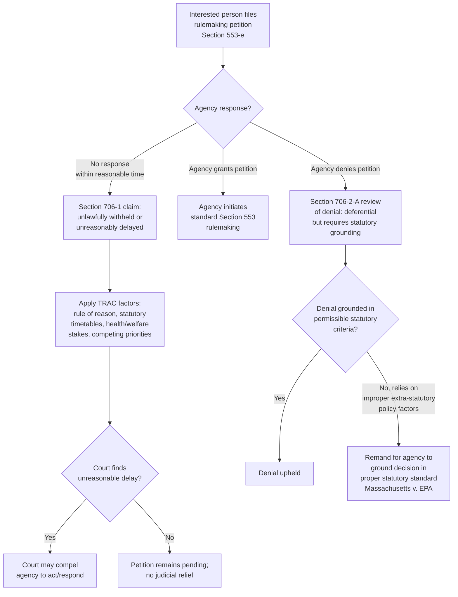

## Petitions for Rulemaking and Review of Agency Refusals to Act

### Overview

5 U.S.C. § 553(e) grants "an interested person the right to petition for the issuance, amendment, or repeal of a rule" — a modest textual provision that has become the doctrinal foundation for a significant body of law governing when courts can compel agencies to act, and how courts review agency decisions to deny such petitions or otherwise decline to regulate. Because agencies possess substantial discretion over their regulatory agendas and resource allocation, judicial review of rulemaking petition denials operates under distinctively deferential standards compared to review of rules the agency actually promulgates — but that deference is not absolute, as the landmark climate change case *Massachusetts v. EPA* demonstrates.

### The Statutory Right to Petition

**Key Points**

- § 553(e) applies broadly to "interested persons," a category courts generally construe to include any party with a genuine stake in the requested rulemaking action, without requiring a showing of particularized legal injury at the petition stage itself.
- The petition right covers three distinct requests: **issuance** of a new rule, **amendment** of an existing rule, or **repeal** of an existing rule.
- The APA does not specify a **required timeline** for agency response to a rulemaking petition, nor does it mandate a specific format for agency consideration — this procedural gap has generated substantial litigation regarding unreasonable delay.
- Agencies typically respond to petitions by either granting the petition (initiating a rulemaking), denying it (with some statement of reasons), or simply failing to respond within any reasonable timeframe.

### Section 706(1): Compelling Unreasonably Delayed Agency Action

**Key Points**

5 U.S.C. § 706(1) authorizes reviewing courts to "compel agency action unlawfully withheld or unreasonably delayed." This provision is the primary vehicle for challenging an agency's failure to respond to a rulemaking petition (or failure to act on other required actions) within a reasonable time.

#### The TRAC Factors

Courts assessing unreasonable delay claims frequently apply the framework from *Telecommunications Research & Action Center v. FCC* ("TRAC"), 750 F.2d 70 (D.C. Cir. 1984), which considers:

1. The time agencies take to act must be governed by a **"rule of reason."**
2. Where **Congress has provided a timetable** or other indication of the speed it expects, that timetable may supply content for the rule of reason.
3. Delays reasonable in the sphere of **economic regulation** are less tolerable when **human health and welfare** are at stake.
4. The court should consider the **effect of expediting delayed action** on agency activities of a higher or competing priority.
5. The court should consider the **nature and extent of the interests prejudiced** by delay.
6. The court need not find any **impropriety** lurking behind agency lassitude to conclude unreasonable delay has occurred.

**[Inference]** The TRAC factors are widely applied across circuits as the leading framework for unreasonable delay analysis, though courts retain considerable discretion in weighing these factors against the specific facts of a given agency's resource constraints, competing priorities, and the nature of the underlying statutory scheme.

#### Distinguishing "Unlawfully Withheld" from "Unreasonably Delayed"

- **"Unlawfully withheld"** typically applies where a statute imposes a clear, mandatory duty to act (e.g., "the agency shall issue regulations by [date]"), and the agency has simply failed to perform that discrete, legally required action.
- **"Unreasonably delayed"** applies more broadly where the agency retains some discretion over timing, but the delay has become so extended, in light of the TRAC factors, that it effectively amounts to a denial of the underlying right or obligation.

**[Unverified]** The line between these two categories is not always sharply drawn in practice, and courts sometimes analyze delay claims under a combined framework without rigidly separating "withheld" from "delayed" analysis, particularly since *Norton v. Southern Utah Wilderness Alliance*, 542 U.S. 55 (2004), clarified that § 706(1) relief is available only to compel a **discrete agency action** that the agency is **legally required to take** — courts cannot use § 706(1) to compel an agency to act on a rulemaking merely because judicial policy preference favors regulation, absent a genuine legal obligation to act.

### Review of Petition Denials: Deferential But Not Unreviewable

**Key Points**

When an agency affirmatively denies a rulemaking petition (rather than simply failing to respond), judicial review proceeds under § 706(2)(A)'s arbitrary-and-capricious standard, but courts apply this standard with **substantial deference** to the agency's decision, reflecting:

1. Agencies' **broad discretion over rulemaking priorities**, given finite resources and competing regulatory demands.
2. The recognition that a **decision not to regulate** often involves complex, polycentric policy judgments (weighing costs, benefits, scientific uncertainty, and competing statutory mandates) that courts are generally not well-positioned to second-guess.
3. The general principle, reflected in cases addressing enforcement discretion (e.g., *Heckler v. Chaney*, 470 U.S. 821 (1985), in the closely related enforcement context), that agency inaction often receives more deferential treatment than agency action.

However, this deference is **not absolute** — an agency's denial must still be grounded in permissible statutory considerations and cannot rest on factors Congress did not authorize the agency to weigh.

### Massachusetts v. EPA: The Landmark Petition Denial Case

*Massachusetts v. EPA*, 549 U.S. 497 (2007), remains the leading case illustrating the limits of deference to petition denials, arising directly from environmental law:

**Key Points**

- A group of states and environmental organizations petitioned EPA to regulate greenhouse gas emissions from new motor vehicles under Clean Air Act § 202(a)(1), arguing such emissions contributed to climate change and thus qualified as "air pollutants" subject to regulation upon an "endangerment" finding.
- EPA denied the petition, citing several rationales, including scientific uncertainty about the causal link between greenhouse gases and climate change, and policy concerns about the wisdom of regulating in this area given ongoing international negotiations and other administration climate initiatives.
- The Supreme Court first held that **Massachusetts had standing** to challenge the denial, based on the state's sovereign interest in its coastline as a "special solicitude" litigant — a significant standing holding in its own right.
- On the merits, the Court held that:
  1. Greenhouse gases **qualify as "air pollutants"** under the Clean Air Act's broad statutory definition.
  2. EPA's stated policy reasons for declining to regulate (that regulation might be unwise given competing considerations) were **not proper grounds** for declining to make an endangerment finding — the statute requires EPA to ground its decision in the specific statutory endangerment standard, not in freestanding policy preferences about whether regulation is a good idea.
  3. EPA's denial was therefore **inadequately grounded in the statutory criteria**, and the case was remanded for EPA to ground any future decision in the specific statutory standard.

**[Inference]** *Massachusetts v. EPA* is widely understood as establishing that even highly deferential review of a petition denial requires the agency's stated reasons to be **tethered to the actual statutory standard** governing the decision — an agency cannot substitute freestanding policy judgment for the specific criteria Congress has established, even in the context of a discretionary-seeming rulemaking petition denial.

### Diagram: Rulemaking Petition Review Pathways

### Distinguishing Rulemaking Petitions from Enforcement Discretion Review

**Key Points**

Petition-denial review should be distinguished from the closely related but analytically separate doctrine governing judicial review of agency **enforcement** discretion:

- *Heckler v. Chaney*, 470 U.S. 821 (1985), established a **presumption of unreviewability** for agency decisions not to pursue individual enforcement actions, treating such decisions as generally "committed to agency discretion by law" under § 701(a)(2).
- Rulemaking petition denials are **not** subject to the same presumption of unreviewability — *Massachusetts v. EPA* confirms that petition denials remain reviewable under ordinary § 706(2)(A) standards, even though that review is deferential in practice.

**[Inference]** This distinction reflects a judgment that rulemaking (a generally applicable, prospective policy action) is more amenable to judicial oversight than individual enforcement discretion (which involves case-specific resource allocation decisions closely analogous to prosecutorial discretion) — though both categories involve substantial agency discretion, the *degree* of deference and the *presumption* of reviewability differ.

### Practical Litigation Strategy Considerations

**Key Points**

Parties considering a rulemaking petition strategy should generally weigh:

1. **Statutory hook** — identifying a specific statutory provision that constrains the agency's discretion (as with the Clean Air Act's endangerment standard in *Massachusetts v. EPA*) significantly strengthens the prospects for a successful challenge to a denial, compared to petitions resting on purely policy-based arguments.
2. **Building an administrative record** — a well-documented petition, supported by scientific, technical, or economic evidence, creates a stronger record for subsequent judicial review if the agency denies the petition or delays unreasonably.
3. **Timing and exhaustion** — pursuing the petition process, even if ultimately denied, often serves as an important administrative exhaustion step supporting subsequent litigation, and may also generate a more complete record of the agency's reasoning (or lack thereof) for judicial review.
4. **Standing considerations** — as *Massachusetts v. EPA* illustrates, establishing standing to challenge a petition denial can itself be a significant litigation hurdle, particularly for diffuse harms like climate change impacts, though the Court's "special solicitude" analysis for state plaintiffs created an important, if narrow, avenue for certain climate-related litigants.

### Environmental Law Applications

- **Climate change regulation**: *Massachusetts v. EPA* itself remains the foundational case establishing that EPA (and by extension, other environmental agencies) cannot decline to make statutorily required findings based on freestanding policy disagreement with the wisdom of regulation, directly shaping subsequent EPA greenhouse gas regulatory actions under the Clean Air Act.
- **Endangered species and habitat petitions**: The Endangered Species Act's citizen petition provisions for species listing decisions operate under an analogous framework, with courts reviewing agency denials or delays in listing determinations under similar deference-but-not-unreviewability principles, often incorporating specific statutory deadlines that inform the TRAC "rule of reason" analysis.
- **Chemical and pesticide regulation petitions**: TSCA and FIFRA both contain citizen petition mechanisms allowing interested parties to request that EPA evaluate or restrict specific chemicals, generating recurring unreasonable delay litigation given the substantial technical review timelines these statutes often require.
- **Statutory deadlines as TRAC factor inputs**: Environmental statutes frequently contain specific rulemaking deadlines (unlike many other regulatory areas), which directly inform the TRAC factors' emphasis on congressionally indicated timetables — making unreasonable delay claims often more readily established in environmental contexts where explicit statutory deadlines have been missed.

### Conclusion

Petitions for rulemaking under § 553(e), paired with § 706(1)'s mechanism for compelling unreasonably delayed action and § 706(2)(A)'s framework for reviewing petition denials, together form an important — if generally deferential — check on agency inaction. While courts apply substantial deference to agency decisions not to regulate, reflecting legitimate resource and policy-judgment concerns, *Massachusetts v. EPA* establishes that this deference has real limits: agencies must ground petition denials in the actual statutory criteria Congress established, not in freestanding policy preferences about whether regulation is wise. This framework has particular significance in environmental law, where citizen petition provisions, statutory deadlines, and the landmark climate change litigation in *Massachusetts v. EPA* have made rulemaking petition review a central mechanism for compelling agency engagement with pressing regulatory questions.

**Related Topics**

- *Massachusetts v. EPA* and the endangerment finding framework
- *Heckler v. Chaney* and the presumption of unreviewability for enforcement discretion
- The TRAC factors and unreasonable delay analysis
- *Norton v. Southern Utah Wilderness Alliance* and the discrete-action requirement for Section 706(1) claims
- Standing doctrine and "special solicitude" for state plaintiffs
- Section 701(a)(2) committed-to-agency-discretion review exemption
- Citizen petition provisions under the Endangered Species Act, TSCA, and FIFRA
- Statutory deadlines and their role in agency accountability litigation