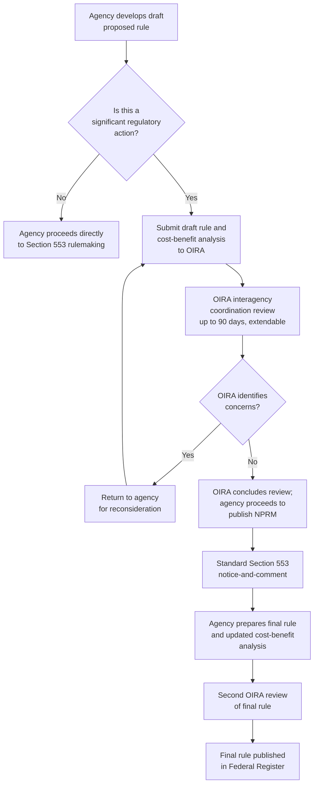

## Executive Order 12866 and Centralized White House Regulatory Review

### Overview

Executive Order 12866, "Regulatory Planning and Review," issued by President Clinton on September 30, 1993, remains the foundational framework governing centralized executive branch review of federal agency rulemaking. It establishes the Office of Information and Regulatory Affairs (OIRA), housed within the Office of Management and Budget (OMB), as the entity responsible for coordinating and reviewing "significant regulatory actions" across the executive branch. Though not a source of independent substantive rulemaking authority, E.O. 12866 operates as a powerful procedural overlay on the APA framework, shaping how, when, and under what analytical standards significant federal rules move from proposal to finalization.

### Historical Context and Predecessor Orders

**Key Points**

- E.O. 12866 succeeded President Reagan's Executive Order 12291 (1981), which had first established centralized OMB review of agency rulemaking and introduced cost-benefit analysis requirements — E.O. 12866 refined and somewhat softened that predecessor framework while preserving its core centralized review structure.
- Executive Order 12866, issued by President Clinton on September 30, 1993, establishes and governs the process under which OIRA currently reviews agency draft and proposed final regulatory actions, with objectives including enhancing planning and coordination, reaffirming the primacy of federal agencies in regulatory decisionmaking, and making the process more accessible and open to the public. [archives](https://obamawhitehouse.archives.gov/omb/inforeg_administrator)
- President Obama subsequently issued E.O. 13563, "Improving Regulation and Regulatory Review," in 2011, which reaffirms and amplifies the principles embodied in E.O. 12866 by encouraging agencies to coordinate their regulatory activities and consider regulatory approaches that reduce burden while maintaining flexibility. [US EPA](https://www.epa.gov/laws-regulations/summary-executive-order-12866-regulatory-planning-and-review)

**[Inference]** E.O. 12866 has proven durable across administrations of both parties for over three decades, with subsequent executive orders generally building upon or supplementing rather than replacing its core framework — though specific administrations have periodically issued additional orders adjusting particular implementation details (e.g., regulatory budgeting requirements, specific review thresholds, or independent agency coverage).

### Core Purposes of the Order

The order's stated purposes include reducing regulatory burden, determining whether existing regulations have become unjustified or unnecessary due to changed circumstances, confirming that regulations are compatible with each other and not duplicative or inappropriately burdensome in the aggregate, and ensuring regulations are consistent with the President's priorities and the order's principles. [ASPE](https://aspe.hhs.gov/executive-order-12866-regulatory-planning-review)

**Key Points**

- Agencies are directed to submit to OIRA, within 90 days of the order, a program for periodically reviewing existing significant regulations to determine whether they should be modified or eliminated. [ASPE](https://aspe.hhs.gov/executive-order-12866-regulatory-planning-review)
- The order frames regulatory review as serving both **substantive** goals (ensuring good cost-justified regulatory outcomes) and **coordination** goals (avoiding conflicting or duplicative agency actions).

### The OIRA Review Mechanism

**Key Points**

Coordinated review of agency rulemaking is intended to ensure regulations are consistent with applicable law, presidential priorities, and the order's principles, and that decisions by one agency do not conflict with policies or actions of another agency; OMB carries out this review function, with OIRA serving as the repository of expertise concerning regulatory issues and methodologies affecting more than one agency. [ASPE](https://aspe.hhs.gov/executive-order-12866-regulatory-planning-review)

#### Timing and Process

- For all significant regulatory actions, the Executive Order requires OIRA review before the actions take effect, with OIRA having up to 90 days (which can be extended) to review a rule. [The White House](https://obamawhitehouse.archives.gov/omb/oira/about)
- This review helps promote adequate interagency review of draft proposed and final regulatory actions, coordinating them with other agencies to avoid inconsistent, incompatible, or duplicative policies. [The White House](https://obamawhitehouse.archives.gov/omb/oira/about)
- In practice, the more costly and controversial regulations are typically submitted to OIRA both before they are proposed and again before they are issued as a final rule — meaning significant rules often undergo OIRA review twice within a single rulemaking's lifecycle. [Thecre](https://www.thecre.com/oira_reg/?p=7429)

#### What Counts as a "Significant Regulatory Action"

E.O. 12866 defines "significant regulatory action" broadly to include rules that:

1. Have an annual effect on the economy of a specified dollar threshold or adversely affect a sector of the economy in a material way.
2. Create a serious inconsistency or interfere with an action taken or planned by another agency.
3. Materially alter the budgetary impact of entitlements, grants, user fees, or loan programs.
4. Raise novel legal or policy issues arising from the President's priorities or the order's principles.

**[Inference]** Because this definition is relatively expansive, a substantial share of major federal rulemakings — particularly in economically significant regulatory areas like environmental law, energy, and health — routinely qualify for OIRA review, making the E.O. 12866 process a near-universal feature of significant federal rulemaking practice.

### Cost-Benefit Analysis Requirements

**Key Points**

Executive Order 12866 requires agencies to conduct an analysis of the benefits and costs of rules and, to the extent permitted by law, directs that regulatory action shall only proceed on the basis of a reasoned determination that the benefits of a regulation justify the costs. [The White House](https://obamawhitehouse.archives.gov/omb/oira/about)

- This cost-benefit requirement is implemented through **Regulatory Impact Analyses (RIAs)**, which agencies typically prepare for economically significant rules and submit to OIRA alongside the proposed and final rule text.
- E.O. 13563 further requires agencies to quantify anticipated benefits and costs of proposed rulemakings as accurately as possible using the best available techniques, and to ensure that scientific and technological information or processes used to support regulatory actions are objective. [US EPA](https://www.epa.gov/laws-regulations/summary-executive-order-12866-regulatory-planning-and-review)
- E.O. 13563 also directs agencies to, where feasible and appropriate, seek the views of those likely to be affected by a proposed rulemaking before a notice of proposed rulemaking is issued — an early-engagement principle conceptually related to, though distinct from, formal negotiated rulemaking. [US EPA](https://www.epa.gov/laws-regulations/summary-executive-order-12866-regulatory-planning-and-review)

### OIRA's Legal Authority: Consultation, Not Veto

**Key Points**

A critical structural feature of the E.O. 12866 framework is that OIRA's authority is understood as advisory and coordinative rather than a formal veto power over agency substantive decisions:

- Nothing in the order shall be construed as displacing the agencies' authority or responsibilities as authorized by law; the order allows OIRA to return a proposed regulatory action to an agency for reconsideration, but the order does not authorize OIRA to veto a proposed action. [Department of Justice](https://www.justice.gov/olc/file/1349716/dl)
- OIRA exercises only a "power of consultation" — a significant power, but not the authority to reject an agency's ultimate judgment. [Department of Justice](https://www.justice.gov/olc/file/1349716/dl)
- Subject to the guidance set by the order, the authority to make the ultimate decision rests where Congress has placed it — in the relevant agency. [Department of Justice](https://www.justice.gov/olc/file/1349716/dl)
- E.O. 12866 designates OIRA to coordinate and implement regulatory policy while ensuring that agencies retain the authority provided by the laws enacted by Congress. [Department of Justice](https://www.justice.gov/olc/file/1349716/dl)

**[Inference]** This "consultation, not command" framing is legally significant because it preserves the formal statutory delegation of rulemaking authority to the agency itself (consistent with the organic-statute analysis governing agency authority), while still giving OIRA substantial practical leverage — since an agency generally cannot publish a significant rule without completing OIRA review, the practical effect of OIRA's "return for reconsideration" power can functionally delay or reshape a rule even without a formal veto.

### Public Transparency Features

**Key Points**

- One of the order's stated objectives is to make the regulatory review process more accessible and open to the public. [archives](https://obamawhitehouse.archives.gov/omb/inforeg_administrator)
- RegInfo.gov publishes information about all OIRA reviews under E.O. 12866, including lists of pending reviews by agency, reviews concluded in recent periods, and OIRA's letters to agencies. [Reginfo.gov](https://www.reginfo.gov/public/do/eoPackageMain)
- Outside parties may request meetings with OIRA officials regarding a rule under review, typically by specifying the rule name and regulatory identification number (RIN). This meeting-disclosure practice is directly relevant to the ex parte contacts framework discussed in connection with informal rulemaking — E.O. 12866 requires disclosure of the substance of such meetings and attendee identities, operationalizing the *Sierra Club v. Costle* disclosure principle at the executive-branch level. [archives](https://obamawhitehouse.archives.gov/omb/inforeg_administrator)

### Extension to Independent Regulatory Agencies

**Key Points**

Traditionally, E.O. 12866 review applied primarily to executive branch agencies, with independent regulatory agencies (e.g., the SEC, FCC, FTC) generally exempted from centralized OIRA review, reflecting their distinct statutory insulation from direct presidential control.

- An Office of Legal Counsel opinion addressed extending regulatory review under Executive Order 12866 to independent regulatory agencies, discussing the President's constitutional authority to oversee the faithfulness of officers executing the laws, even for officers heading independent agencies. [Department of Justice](https://www.justice.gov/olc/file/1349716/dl)
- By 2025, OIRA and independent agencies had begun working out a more integrated relationship, with independent agencies having acquiesced in OIRA review — nearly all major independent regulators had by then submitted rules for review. [Global Policy Watch](https://www.globalpolicywatch.com/2025/08/oira-review-of-independent-agency-rulemakings-what-we-know-so-far/)
- These reviews have reportedly not imposed major delays on independent agency rulemaking, with both OIRA and the agencies willing to dispense with certain formalities to expedite reviews, integrating OIRA review into independent agency rulemaking without undue disruption. [Global Policy Watch](https://www.globalpolicywatch.com/2025/08/oira-review-of-independent-agency-rulemakings-what-we-know-so-far/)

**[Unverified]** The precise legal and practical scope of OIRA review over independent agencies remains an evolving and somewhat contested area, implicating broader separation-of-powers and unitary executive theory questions about the President's authority over agencies Congress has structurally insulated from direct removal power; practitioners should verify the current status of any specific independent agency's relationship to OIRA review given the pace of recent developments in this area.

### Diagram: E.O. 12866 Review Process Within the Rulemaking Lifecycle

### Judicial Reviewability of OIRA Review Itself

**[Inference]** E.O. 12866 compliance is generally understood as **not independently judicially enforceable** — because it is a presidential management directive rather than a statute, courts have generally treated compliance (or non-compliance) with the order's internal review procedures as not, by itself, a basis for invalidating a final rule under the APA, so long as the rule independently satisfies § 553 and § 706 requirements. The order itself typically includes language disclaiming any intent to create judicially enforceable rights, reinforcing its character as an internal executive branch management tool rather than a source of external legal obligations.

### Environmental Law Applications

- **EPA rules as frequent OIRA review subjects**: Given their often substantial economic impact, EPA rulemakings (NAAQS revisions, greenhouse gas regulations, effluent guidelines) are routinely classified as "significant regulatory actions" requiring OIRA review, making the E.O. 12866 process a near-universal feature of major environmental rulemaking.
- **Cost-benefit analysis controversies**: Environmental rules have generated extensive debate regarding E.O. 12866's cost-benefit analysis requirements, particularly regarding methodology for valuing health and ecological benefits, discount rates for long-term or intergenerational environmental harms (e.g., climate change impacts), and treatment of co-benefits — these methodological disputes often surface both in OIRA review and in subsequent judicial challenges to the resulting rule's basis-and-purpose statement.
- **Interagency coordination on environmental-adjacent rules**: Because environmental regulation frequently intersects with energy, transportation, and economic policy, E.O. 12866's interagency coordination function is particularly significant for environmental rules with cross-cutting effects (e.g., vehicle emissions standards implicating both EPA and Department of Transportation authority).
- **Extended review timelines for major climate rules**: High-profile, economically significant environmental rules (such as major greenhouse gas regulations) have frequently experienced extended OIRA review periods beyond the nominal 90-day framework, reflecting their complexity and the extended interagency coordination such reviews entail.

### Conclusion

Executive Order 12866 establishes the enduring framework for centralized executive branch review of significant federal rulemaking, positioning OIRA as a coordinative and consultative body rather than a substantive rulemaking authority in its own right. While the order requires cost-benefit analysis and imposes real practical influence over the timing and content of significant rules — particularly in economically substantial and technically complex areas like environmental law — it operates alongside, rather than displacing, the statutory framework of the APA and agency organic statutes, preserving formal decisionmaking authority in the agencies to which Congress has delegated it. Its transparency features, including public disclosure of review status and meeting logs on RegInfo.gov, reflect an attempt to balance centralized coordination with public accountability, even as questions about its application to independent regulatory agencies and its practical influence on agency substantive judgment continue to evolve.

**Related Topics**

- Regulatory Impact Analysis methodology and cost-benefit analysis standards
- OIRA review of independent regulatory agencies and separation-of-powers questions
- Ex parte contacts in informal rulemaking and E.O. 12866 meeting disclosure requirements
- E.O. 13563 and subsequent regulatory review executive orders
- The concise general statement of basis and purpose and its relationship to RIA disclosure
- Unitary executive theory and presidential control of administrative agencies
- Guidance documents and OIRA review of significant guidance
- Statutory deadlines and their interaction with OIRA review timelines in environmental rulemaking