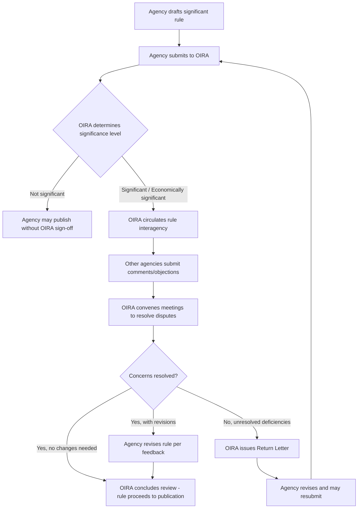

## OIRA Interagency Review and Return Letters

### Overview

The Office of Information and Regulatory Affairs (OIRA), housed within the Office of Management and Budget (OMB), conducts centralized review of federal agency regulatory actions before they are published in the Federal Register. This function derives principally from Executive Order 12866 (1993), as amended, and its predecessor Executive Order 12291 (1981). OIRA review is a gatekeeping mechanism: significant regulatory actions cannot proceed to publication until OIRA completes its review or the statutory/executive review period expires.

A **return letter** is the formal mechanism by which OIRA declines to complete review and sends a rule back to the originating agency, either because the rule is deficient under the executive order's standards or because interagency concerns remain unresolved.

### Legal and Institutional Framework

**Statutory and Executive Basis**

- Executive Order 12866, "Regulatory Planning and Review" (September 30, 1993), is the primary authority governing OIRA review.
- Executive Order 13563 (2011) reaffirmed and supplemented EO 12866's principles, emphasizing public participation, retrospective review, and flexibility.
- Executive Order 14094 (2023), "Modernizing Regulatory Review," amended thresholds and procedures under EO 12866.
- The Paperwork Reduction Act (44 U.S.C. §§ 3501–3521) separately empowers OIRA to review agency information collection requests, a distinct but related function.
- The Congressional Review Act (5 U.S.C. §§ 801–808) intersects with OIRA's role because OIRA's determination of a rule's "major" status affects CRA reporting obligations.

**Institutional Placement**

OIRA is a statutorily created office within OMB (31 U.S.C. § 501 note; Paperwork Reduction Act), led by an Administrator who is Senate-confirmed. OIRA desk officers are assigned to specific agencies and serve as the primary point of contact during review.

### What Triggers OIRA Review: "Significant Regulatory Actions"

Under EO 12866 § 3(f), as modified by EO 14094, a regulatory action is "significant" if it is likely to:

1. Have an annual effect on the economy of $200 million or more (adjusted for inflation; historically $100 million under the original EO 12866), or adversely affect in a material way a sector of the economy, productivity, competition, jobs, the environment, public health/safety, or state/local/tribal governments or communities;
2. Create a serious inconsistency or interfere with an action taken or planned by another agency;
3. Materially alter the budgetary impact of entitlements, grants, user fees, or loan programs, or the rights and obligations of recipients thereof; or
4. Raise novel legal or policy issues arising from the President's priorities or the EO's principles.

A subset of significant actions meeting the $200 million threshold or having major policy implications are designated **"economically significant"** — these require a full cost-benefit analysis under § 6(a)(3)(C).

**Note on OIRA's Role in Designation**

The determination of whether a rule is "significant" is made collaboratively between the issuing agency and OIRA, but OIRA has final say. Agencies submit a description of planned regulatory actions, and OIRA desk officers assess significance early, often during the Unified Agenda process.

### The Interagency Review Process

#### Stage 1: Pre-Submission and Agenda Coordination

Agencies identify upcoming significant rules through the **Unified Agenda of Regulatory and Deregulatory Actions**, published semi-annually. This gives OIRA and other agencies advance notice.

#### Stage 2: Submission to OIRA

The issuing agency submits the draft rule (NPRM, interim final rule, direct final rule, or final rule) along with:

- The regulatory text
- A cost-benefit analysis (for economically significant rules) or a simplified assessment
- Supporting analyses (e.g., Regulatory Flexibility Act certification, Paperwork Reduction Act submissions, environmental justice analysis)
- A statement of legal authority

#### Stage 3: Interagency Circulation

This is the defining feature of "interagency" review. OIRA circulates the draft to:

- Other executive agencies with subject-matter interest or overlapping jurisdiction
- The Council of Economic Advisers, National Economic Council, Domestic Policy Council, or other White House offices, depending on subject matter
- Relevant Cabinet departments if cross-cutting issues arise (e.g., a rule affecting both EPA and Department of Energy)

Agencies receiving the circulated rule can submit comments, raise objections, or request meetings. OIRA desk officers act as intermediaries, convening meetings to resolve disputes.

#### Stage 4: OIRA Substantive Review

OIRA reviews the rule against EO 12866's principles, including:

- Whether the rule is needed and whether the problem could be addressed through non-regulatory means
- Whether the agency identified and assessed alternatives
- Whether benefits justify costs (for economically significant rules), using the framework in OMB Circular A-4
- Consistency with the President's priorities and other agencies' actions
- Compliance with the Regulatory Flexibility Act, Unfunded Mandates Reform Act, and other cross-cutting statutes

#### Stage 5: Resolution

Three general outcomes:

1. **Concluded review without changes** — OIRA signs off; the rule proceeds to publication.
2. **Concluded review with changes** — the agency revises the rule to address OIRA/interagency concerns, often documented in redlines or an exchange of memoranda.
3. **Returned to agency** — OIRA issues a **return letter**.

### Review Timelines

Under EO 12866 § 6(b)(2):

- OIRA generally has **90 days** to complete review, which can be extended by **30 days** with the OIRA Administrator's approval (or longer if agreed with the agency head).
- OIRA may complete review faster for less complex rules.
- EO 13563 encouraged expedited review timelines and greater transparency about pending rules.

[Inference] In practice, review periods routinely exceed the nominal 90-day limit through informal extensions negotiated between OIRA and the submitting agency, particularly for economically significant or politically sensitive rules; publicly available OIRA review-time data (via reginfo.gov) show substantial variance across administrations and rule types.

### Return Letters

#### Legal Basis

EO 12866 § 6(b)(3) authorizes OIRA to return a rule to the agency for further consideration if:

- The rule is not consistent with the executive order's requirements, or
- OIRA determines the rule requires further analysis before it can proceed.

#### Characteristics of a Return Letter

- **Formal and public**: Return letters are typically posted on reginfo.gov (OIRA's public database) and are matters of public record, though the underlying interagency deliberative correspondence is often withheld under executive privilege or deliberative process privilege in litigation.
- **Substantive rationale**: The letter identifies specific deficiencies — e.g., inadequate cost-benefit justification, failure to consider a reasonable alternative, insufficient interagency coordination, or conflict with another agency's regulatory program.
- **Not necessarily a permanent rejection**: A returned rule can be resubmitted after the agency addresses OIRA's concerns. It is a procedural setback, not a judicial vacatur.
- **Distinguishable from informal "kickbacks"**: Much interagency friction is resolved informally (through meetings, redlines, or withdrawal by the agency) without ever reaching a formal return letter. Formal returns are relatively rare and often signal a significant unresolved policy or legal dispute.

#### Illustrative Historical Examples

[Unverified — illustrative, verify specifics before citing] OIRA has issued return letters across administrations for rules ranging from EPA air quality implementation rules to Department of Labor wage rules, typically citing inadequate economic analysis or failure to address significant interagency comments. Because return letters are agency- and rule-specific and their frequency/content vary by administration and are updated continuously on reginfo.gov, specific instances should be verified directly against the OIRA public database rather than relied upon from general recollection.

#### Consequences of a Return

- The agency cannot publish the rule in the Federal Register until it resubmits and OIRA either concludes review or the rule is withdrawn.
- A return can trigger internal agency reconsideration of policy approach, additional data-gathering, or revised cost-benefit modeling.
- Return letters can become salient in litigation over the "reasoned decisionmaking" requirement of the Administrative Procedure Act (5 U.S.C. § 706(2)(A)), as a rule's revision history — including OIRA's concerns — can sometimes be probed in record review, subject to privilege limitations articulated in cases like *In re Franklin National Bank Securities Litigation*-line deliberative process doctrine and *Department of Commerce v. New York*, 588 U.S. 752 (2019) (on pretext review generally, not OIRA-specific, but illustrative of judicial scrutiny of the rationale behind agency action).

### Cost-Benefit Analysis Standards (Circular A-4)

For economically significant rules, OIRA evaluates the agency's cost-benefit analysis against **OMB Circular A-4** (originally issued 2003; substantially revised in 2023), which specifies:

- Baseline definition and problem statement
- Identification of a reasonable range of regulatory alternatives
- Monetization of benefits and costs, including methods for valuing statistical lives, discounting future effects, and handling non-quantifiable benefits
- Discount rate guidance — the 2023 revision moved toward a **default discount rate of 2%**, replacing the prior 3%/7% dual-rate approach, reflecting updated Treasury and consumption-rate methodology [Inference: reflects the 2023 Circular A-4 update; consult the current Circular for authoritative rates as OMB guidance is subject to revision]
- Distributional and equity considerations, added emphasis under EO 13563 and EO 14094

$$NB = \sum_{t=0}^{T} \frac{B_t - C_t}{(1+r)^t}$$

Where $NB$ is net present value of benefits, $B_t$ and $C_t$ are benefits and costs in year $t$, and $r$ is the discount rate.

OIRA's determination that a cost-benefit analysis is inadequate under Circular A-4 is one of the most common substantive grounds for a return letter.

### Diagram: OIRA Interagency Review Workflow

### Transparency Mechanisms

- **reginfo.gov**: OIRA's public disclosure portal listing rules under review, review status, meeting logs with outside parties (required disclosure of ex parte contacts under EO 12866 § 6(b)(4)), and return letters.
- **EO 12866 § 6(b)(4)** requires OIRA to maintain a public log of all documents exchanged between OIRA and the agency, and to disclose any communications with parties outside the executive branch regarding a rule under review.
- **Presidential/OIRA Administrator communications**: EO 12866 requires that any substantive communication between OIRA and the agency (including changes made at OIRA's request) be identified in writing and made part of the public record once the rule is published.

### Interaction with Other Statutes and Review Layers

| Review Layer | Governing Authority | Focus |
| --- | --- | --- |
| OIRA/EO 12866 review | Executive Order (not judicially enforceable directly) | Cost-benefit, interagency consistency, presidential priorities |
| Regulatory Flexibility Act review | 5 U.S.C. § 601 et seq. | Small entity impact |
| Unfunded Mandates Reform Act | 2 U.S.C. § 1501 et seq. | State/local/tribal government cost mandates |
| Paperwork Reduction Act | 44 U.S.C. § 3501 et seq. | Information collection burden |
| Congressional Review Act | 5 U.S.C. § 801 et seq. | Congressional disapproval of "major" rules |
| Judicial (APA) review | 5 U.S.C. § 706 | Arbitrary-and-capricious, procedural compliance |

**Key Points**

- OIRA review under EO 12866 is not itself judicially reviewable — courts have generally held that compliance with the executive order is committed to executive discretion, not subject to APA challenge (see *DRG Funding Corp. v. Secretary of HUD*, 76 F.3d 1212 (D.C. Cir. 1996), and similar precedent holding EO 12866 creates no private right of action).
- A return letter delays but does not permanently bar a rule; it is a procedural, intra-executive-branch event.
- The distinction between "significant," "economically significant," and non-significant rules determines the intensity of review and the applicable analytical burden.
- Interagency review is designed to catch conflicts before they surface publicly or in litigation, particularly where multiple agencies (e.g., EPA and DOT on vehicle emissions, or EPA and Army Corps of Engineers on wetlands jurisdiction) have overlapping authority.

**Example**

A hypothetical EPA rule setting new National Ambient Air Quality Standards (NAAQS) would be economically significant. Before publication:

1. EPA submits the draft NAAQS rule and supporting Regulatory Impact Analysis to OIRA.
2. OIRA circulates to Department of Energy, Department of Transportation, and the Council of Economic Advisers given cross-sector economic effects.
3. DOE raises concerns about energy-sector compliance costs; DOT flags interaction with vehicle emissions standards.
4. OIRA convenes an interagency meeting; EPA is asked to strengthen its cost estimates under Circular A-4.
5. If EPA's revised analysis still fails to justify the standard's stringency relative to alternatives considered, OIRA may issue a return letter citing inadequate benefit-cost justification under § 6(b)(3).
6. EPA revises and resubmits, or elevates the dispute to the White House for resolution.

**Related Topics**

- Executive Order 12866 and 13563: full textual analysis of substantive review principles
- OMB Circular A-4: cost-benefit methodology deep dive, including 2023 revisions to discount rates and distributional weighting
- Unified Agenda of Regulatory and Deregulatory Actions
- Congressional Review Act and "major rule" determinations
- Regulatory Flexibility Act and Small Business Regulatory Enforcement Fairness Act
- Judicial reviewability of executive orders and the "committed to agency discretion" doctrine
- Ex parte contact disclosure requirements under EO 12866 § 6(b)(4)
- Interagency working groups and White House policy councils (NEC, DPC, CEQ) in rulemaking coordination
- *Department of Commerce v. New York* and pretext review of agency rationales
- Deliberative process privilege in litigation over rulemaking records