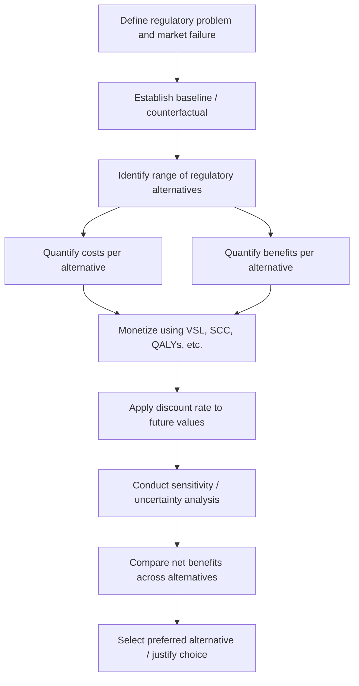

## Cost Benefit Analysis Methodology and Its Critics

### Overview

Cost-benefit analysis (CBA) is the analytical framework used by federal agencies, principally under the direction of OMB Circular A-4 and Executive Order 12866, to evaluate whether a proposed regulation's societal benefits justify its societal costs. CBA is both a technocratic decision tool and a contested site of legal, economic, and philosophical debate about how administrative law should value human life, health, environmental goods, and distributional fairness.

### Legal and Institutional Basis

- **Executive Order 12866** (1993), § 1(a): "in choosing among alternative regulatory approaches, agencies should select those approaches that maximize net benefits."
- **Executive Order 13563** (2011): reaffirmed CBA principles, added emphasis on retrospective review and flexible, cost-effective regulatory design.
- **Executive Order 14094** (2023): "Modernizing Regulatory Review," updated significance thresholds and instructed OMB to revise Circular A-4.
- **OMB Circular A-4** (2003, revised 2023): the operative technical guidance document specifying methods for baseline-setting, alternatives analysis, monetization, discounting, and uncertainty treatment.
- **Statutory CBA mandates**: Some statutes require or permit CBA explicitly (e.g., Toxic Substances Control Act as amended by the Lautenberg Act, 15 U.S.C. § 2601 et seq.); others prohibit cost consideration for certain determinations (e.g., Clean Air Act NAAQS setting under § 109, as interpreted in *Whitman v. American Trucking Ass'ns*, 531 U.S. 457 (2001), holding EPA may not consider costs in setting primary NAAQS).

This statutory variation means CBA's role differs by program: sometimes it's a mandatory decision criterion, sometimes an OIRA/EO 12866 overlay applied regardless of the underlying statute's own criteria, and sometimes explicitly barred from operative use in the statutory decision itself (though still often prepared for informational purposes).

### Core Methodological Steps (Circular A-4 Framework)

1. **Problem definition and need for regulation** — market failure or other rationale (externality, information asymmetry, public good).
2. **Baseline determination** — the counterfactual absent the rule.
3. **Identification of a reasonable range of alternatives**, including the primary alternative and at least one meaningfully different alternative.
4. **Identification and quantification of benefits and costs** — direct, indirect, and (per 2023 revision) distributional effects.
5. **Monetization** where feasible, using standard valuation techniques.
6. **Discounting** future costs and benefits to present value.
7. **Uncertainty and sensitivity analysis** — including Monte Carlo or scenario-based ranges.
8. **Net benefit comparison across alternatives.**

$$NPV = \sum_{t=0}^{T} \frac{B_t - C_t}{(1+r)^t}$$

Where $B_t$ and $C_t$ are monetized benefits and costs in year $t$, $r$ is the discount rate, and $T$ is the analysis horizon.

### Key Valuation Techniques

**Value of a Statistical Life (VSL)**

VSL estimates the willingness-to-pay for small reductions in mortality risk, aggregated across a population, rather than valuing any identified individual's life.

$$VSL = \frac{WTP}{\Delta p}$$

Where $WTP$ is aggregate willingness to pay for a risk reduction and $\Delta p$ is the change in mortality probability across the affected population.

[Unverified — agency-specific and updated periodically] Federal agencies such as EPA and DOT publish and periodically update VSL figures (historically in the range of several million dollars to over $10 million per statistical life in recent guidance), derived from labor market wage-risk studies and stated-preference surveys; exact current figures should be checked against each agency's most recent guidance memorandum rather than assumed static.

**Discounting**

- The 2023 Circular A-4 revision shifted the default discount rate toward **2%**, replacing the earlier dual 3%/7% approach (3% reflecting the social rate of time preference, 7% reflecting the pre-tax rate of return on private capital).
- Discounting intergenerational effects (e.g., climate change costs decades out) is especially contested because even modest rate differences compound into large present-value disparities over long horizons.

**Social Cost of Carbon (SCC)**

A specialized monetization tool estimating the marginal economic damage from one additional ton of $CO_2$ emissions, used to monetize climate benefits/costs of rules (e.g., vehicle fuel economy standards, power plant rules). The Interagency Working Group on Social Cost of Greenhouse Gases has revised SCC estimates multiple times across administrations, reflecting both updated science (climate damage functions) and changes in discount rate assumptions. [Inference] Because SCC directly embeds discount-rate and damage-function assumptions that are contested, it functions as one of the more litigated and politically salient inputs in modern regulatory CBA, particularly in energy and environmental rulemakings.

**Quality-Adjusted Life Years (QALYs) and Health Valuation**

Used in some health and safety rulemakings as an alternative or complement to VSL, particularly for morbidity (non-fatal) effects, though CBA at the federal level (per Circular A-4) has generally centered on VSL/WTP-based approaches for mortality risk rather than QALY-based cost-effectiveness analysis, which is more common in health-technology assessment contexts (e.g., some cost-effectiveness work referencing thresholds analogous to those historically used by entities like NICE in the UK, not a standard U.S. regulatory requirement).

### Diagram: CBA Analytical Workflow

### Distributional and Equity Analysis (Post-2023 Emphasis)

The 2023 Circular A-4 revision and EO 14094 directed agencies to give greater weight to:

- **Distributional impacts** — who bears costs and who receives benefits, disaggregated by income, race, geography, etc.
- **Equity-weighted benefits** — the concept that a dollar of benefit may carry different social value depending on the recipient's income level, a departure from the traditional unweighted-dollar aggregation approach.
- **Environmental justice** considerations, particularly for EPA and rules affecting overburdened or underserved communities, consistent with Executive Order 14096 (2023) on environmental justice.

[Inference] This represents one of the more significant recent methodological shifts, moving federal CBA practice away from strict Kaldor-Hicks efficiency (aggregate net benefit regardless of distribution) toward incorporating distributional weighting, though implementation specifics and consistency across agencies remain evolving practice.

### Legal Doctrine Intersecting with CBA

- ***Whitman v. American Trucking Ass'ns***, 531 U.S. 457 (2001): Clean Air Act does not permit cost consideration in setting NAAQS; illustrates that CBA's legal role is statute-dependent, not universal.
- ***Michigan v. EPA***, 576 U.S. 743 (2015): held EPA unreasonably interpreted the Clean Air Act's Hazardous Air Pollutants provision to ignore costs entirely in the threshold "appropriate and necessary" finding — cost must be considered at some stage, though the Court left flexibility as to how.
- ***Entergy Corp. v. Riverkeeper, Inc.***, 556 U.S. 208 (2009): upheld EPA's use of cost-benefit analysis under the Clean Water Act § 316(b) cooling water intake structure rule, where the statute was ambiguous as to whether cost-benefit balancing was permitted.
- **Arbitrary-and-capricious review (APA § 706(2)(A))**: courts scrutinize whether an agency's CBA reasonably considered significant costs/benefits, an important alternative, and reliance interests — failure to adequately justify methodology (e.g., discount rate choice, omitted co-benefits) is a common ground for vacatur.

### Major Critiques of CBA Methodology

#### 1. Commensurability and Valuation Critique

Critics (notably in law-and-society and environmental law scholarship, e.g., work associated with scholars like Frank Ackerman, Lisa Heinzerling, and Douglas Kysar) argue that reducing human life, health, ecosystems, and non-market goods to monetary units is a category error — some values are not commensurable with dollars, and monetization distorts moral reasoning by making tradeoffs appear more objective and precise than they are.

#### 2. Discount Rate and Intergenerational Equity Critique

Discounting future harms (especially climate and long-latency health harms) can make severe but distant harms appear numerically trivial in present value terms, systematically undervaluing obligations to future generations. Critics argue this embeds a value judgment (favoring present consumption) inside an ostensibly neutral technical parameter.

#### 3. Distributional Blindness (Traditional Kaldor-Hicks Critique)

Traditional CBA asks whether aggregate benefits exceed aggregate costs, not who bears each — it can approve a rule that concentrates costs on a poor community while benefits accrue diffusely to wealthier populations, so long as the net is positive. The 2023 Circular A-4 revision was a direct policy response to this critique, though implementation and consistency remain contested.

#### 4. Data and Uncertainty Critique

Benefits (especially of preventive/precautionary regulation) are often harder to quantify than costs, which tend to be more readily estimated by regulated industry. Critics argue this creates a systematic bias toward understating benefits and overstating costs, tilting outcomes toward under-regulation. [Inference] This asymmetry is a recurring theme in administrative law scholarship rather than a settled empirical finding applicable to all rules; the direction and magnitude of bias is rule-specific and contested.

#### 5. Public Choice / Capture Critique

Because CBA requires extensive data often supplied or contested by regulated industry (through comments, consultant studies, litigation), critics argue the process is vulnerable to strategic manipulation, effectively giving well-resourced regulated parties disproportionate influence over which costs/benefits get counted and how.

#### 6. Precautionary Principle Critique

Some environmental and public health scholars argue CBA's ex ante quantification requirement is poorly suited to genuinely novel or catastrophic risks (e.g., emerging chemicals, systemic ecological tipping points) where scientific uncertainty is high, and that a precautionary approach (shifting the burden to demonstrate safety) is more appropriate than a probabilistic expected-value calculation.

#### 7. Rent-Seeking and Delay Critique (Opposing Direction)

From a deregulatory perspective, critics (e.g., some law-and-economics scholars) argue CBA, especially as institutionalized through OIRA review, can be weaponized to delay or block beneficial regulation through prolonged analytical requirements, effectively empowering centralized White House control over agency expertise-driven judgments — a critique about process capture rather than the theoretical validity of CBA itself.

#### 8. Co-Benefits Controversy

Regulations often produce ancillary benefits beyond their primary target (e.g., a rule targeting mercury emissions also reduces particulate matter, yielding respiratory health co-benefits). Debate exists over how heavily agencies should rely on co-benefits to justify a rule's net benefit finding, with critics on one side arguing co-benefits are legitimately counted health benefits, and critics on the other arguing heavy reliance on co-benefits can mask a weak primary justification. [Inference] This debate has recurred prominently in EPA mercury and air toxics rulemakings and reflects genuine, unresolved methodological disagreement rather than a settled question.

### Comparative Table: CBA Defenses vs. Critiques

| Dimension | Defense of CBA | Principal Critique |
| --- | --- | --- |
| Decision structure | Provides transparent, comparable metric across diverse regulatory options | Monetization obscures non-commensurable values |
| Discounting | Reflects genuine time preference and opportunity cost of capital | Undervalues future/intergenerational harms |
| Distributional treatment | Recent reforms (2023 Circular A-4) allow equity weighting | Traditional Kaldor-Hicks approach ignores who bears costs/benefits |
| Institutional check | OIRA review disciplines agency discretion, prevents arbitrary rules | Centralizes power in OMB, vulnerable to political/industry influence |
| Empirical rigor | Forces agencies to substantiate claims with data | Benefit-side data often weaker than cost-side data, creating bias |
| Precaution vs. calculation | Enables systematic tradeoff analysis under uncertainty | Poorly suited to catastrophic, high-uncertainty risks |

**Key Points**

- CBA's legal force varies by statute: some statutes mandate it, some prohibit cost consideration for specific determinations (*Whitman*), and EO 12866 imposes it as an executive-branch overlay regardless of the underlying statute where not barred.
- Circular A-4 (2023 revision) represents the most significant methodological update in two decades, notably lowering the default discount rate and formally incorporating distributional/equity analysis.
- VSL, SCC, and discount rate selection are the three most consequential and most contested technical inputs in modern regulatory CBA.
- Critiques span the ideological spectrum: some argue CBA under-protects (commensurability, discounting, data-bias critiques) while others argue it over-constrains agencies and enables regulatory delay (public choice, rent-seeking critiques).

**Example**

Consider a hypothetical OSHA workplace safety rule reducing exposure to a hazardous chemical, estimated to prevent 50 statistical deaths per year and cost regulated industry $300 million annually in compliance.

- Using a VSL of approximately $10 million per statistical life (illustrative figure), benefits ≈ $500 million/year, costs = $300 million/year, yielding a net benefit of $200 million/year — CBA would favor the rule.
- A critic might argue: (a) if compliance costs are concentrated on small businesses in low-income regions while safety benefits accrue broadly, the aggregate net-benefit figure obscures a regressive cost distribution; (b) the VSL figure itself embeds contested assumptions about how to aggregate individual risk preferences into a population-level value; (c) latent or hard-to-quantify effects (e.g., chronic low-dose exposure effects not yet scientifically characterized) may be omitted entirely from the benefit side, understating the rule's justification.

**Related Topics**

- OMB Circular A-4 (2023 revision): full technical comparison to 2003 version
- Value of Statistical Life: agency-specific figures and derivation methodologies (EPA, DOT, OSHA)
- Social Cost of Carbon: Interagency Working Group history and *Louisiana v. Biden* litigation over its use
- *Whitman v. American Trucking Ass'ns* and statutory cost-consideration doctrine
- *Michigan v. EPA* and the "appropriate and necessary" cost-consideration threshold
- Distributional/equity-weighted CBA: theoretical foundations and implementation challenges
- Precautionary principle in environmental law and comparative EU regulatory approaches
- Retrospective regulatory review and ex post CBA accuracy assessment
- Regulatory Flexibility Act small-entity cost analysis as a parallel/complementary framework
- Judicial review standards for agency cost-benefit methodology under APA § 706(2)(A)