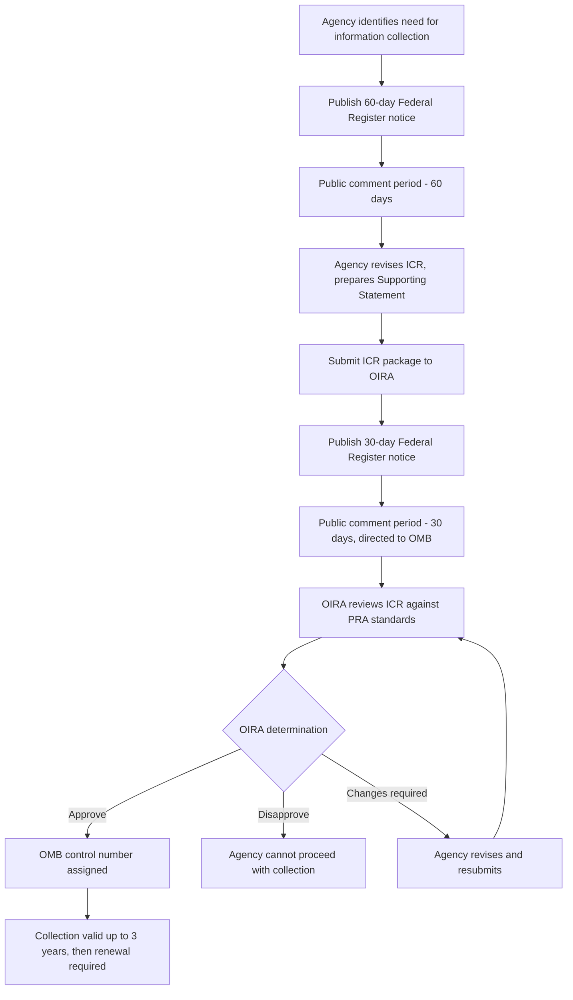

## The Paperwork Reduction Act and Information Collection Review

### Overview

The Paperwork Reduction Act (PRA), codified at 44 U.S.C. §§ 3501–3521, is a federal statute designed to minimize the burden that federal agencies impose on the public through information collection requirements — forms, surveys, recordkeeping mandates, reporting requirements, and similar instruments. It establishes a centralized review process administered by OIRA, requiring most agency information collections to receive OMB approval before they may be lawfully imposed on the public. The PRA operates alongside, but analytically distinct from, OIRA's EO 12866 review of substantive rules.

### Legislative History and Purpose

- **Original PRA of 1980** (Pub. L. 96-511): created OIRA within OMB and established the initial information collection clearance process, motivated by concerns over the cumulative regulatory paperwork burden on individuals and businesses.
- **Paperwork Reduction Act of 1995** (Pub. L. 104-13, codified at 44 U.S.C. § 3501 et seq.): substantially reorganized and strengthened the framework, currently the operative statutory text.
- **Purpose** (44 U.S.C. § 3501): to minimize federal paperwork burden, ensure the greatest possible public benefit from and maximize the utility of information collected, improve information resource management, and ensure information technology is acquired in a manner consistent with these goals.

### Key Definitions

- **"Information collection"** (44 U.S.C. § 3502(3)): the obtaining, causing to be obtained, soliciting, or requiring the disclosure of facts or opinions by or for an agency, regardless of form or format, to 10 or more persons — including forms, surveys, recordkeeping requirements, third-party disclosure requirements, and reporting requirements.
- **"Burden"** (44 U.S.C. § 3502(2)): the time, effort, or financial resources expended by persons to generate, maintain, retain, disclose, or provide information to or for a federal agency.
- **"Collection of information"** includes both collections directly by the agency and collections the agency requires third parties to conduct (e.g., a regulation requiring regulated entities to survey their customers).

### Institutional Roles

- **OIRA**: reviews and approves/disapproves agency information collection requests (ICRs); assigns OMB control numbers.
- **Agency Chief Information Officers / Information Collection Clearance Officers**: prepare and submit ICRs.
- **Agency PRA/Regulatory Affairs offices**: coordinate the internal review and Federal Register notice process.

### The Information Collection Review Process

#### Step 1: 60-Day Federal Register Notice

Before submitting an ICR to OMB, the agency must publish a notice in the Federal Register (44 U.S.C. § 3506(c)(2)(A)) providing at least **60 days** for public comment. The notice must:

- Describe the nature of the information collection and its proposed use
- Estimate the burden (hours and cost) on respondents
- Solicit comments on: (1) necessity and utility of the collection, (2) accuracy of the burden estimate, (3) ways to enhance quality/utility/clarity, and (4) ways to minimize burden, including through technology.

#### Step 2: Agency Response and Submission to OMB

After the 60-day comment period, the agency addresses public comments and submits the ICR package to OIRA, including:

- **Supporting Statement** (Parts A and B) — describing the collection's purpose, use, respondent burden calculation methodology, and (for statistical collections) survey methodology
- The proposed collection instrument (form, survey, questionnaire)
- A summary of public comments received and agency responses

#### Step 3: 30-Day Federal Register Notice

Concurrent with or following OMB submission, the agency publishes a second Federal Register notice providing an additional **30 days** for public comment, directed specifically to OMB (44 U.S.C. § 3507(a)).

#### Step 4: OIRA Review

OIRA reviews the ICR against PRA standards, generally within **60 days** of submission (44 U.S.C. § 3507(b)), though this period can be extended. OIRA may:

- **Approve** the collection and assign an **OMB control number**
- **Disapprove** the collection
- **Instruct the agency to make changes** and resubmit
- **File a "public protection" comment** if it lacks sufficient information to make a determination within the statutory period, which operates similarly in effect to a disapproval until resolved

#### Step 5: Approval, Control Number, and Expiration

Approved collections receive an OMB control number, which must be displayed on the collection instrument itself (44 U.S.C. § 3512 — discussed below). Approval is generally valid for **up to three years**, after which the agency must seek renewal through substantially the same process.

### Diagram: PRA Information Collection Clearance Workflow

### The Public Protection Provision

44 U.S.C. § 3512 is one of the PRA's most litigated and practically significant provisions:

> No person shall be subject to any penalty for failing to comply with a collection of information that is subject to the PRA if the collection does not display a currently valid OMB control number, or if the agency fails to inform the person that they are not required to respond unless the collection displays a valid control number.

This creates an enforceable defense: a person cannot be penalized for failing to respond to (or for inaccuracies in responding to) an information collection that lacks a valid OMB control number. Courts have applied this provision to bar enforcement actions and, in some cases, to preclude evidentiary use of information gathered through non-compliant collections. [Inference] The precise scope of § 3512 as a defense — e.g., whether it applies to substantive agency action beyond direct penalties for non-response — has been the subject of varying judicial interpretation across circuits, and specific case outcomes should be verified against current circuit precedent.

### Exemptions and Exclusions

Not all agency information-gathering activities are subject to PRA review. Key exclusions (44 U.S.C. § 3518 and related provisions) include:

- Collections during the conduct of a federal criminal investigation, prosecution, or civil action to which the federal government is a party
- Collections during an administrative action or investigation involving a specific party
- Compulsory process in a specific proceeding (e.g., subpoenas)
- Collections from fewer than 10 persons
- Certain intelligence and national security activities
- General solicitations of comments from the public in a rulemaking (as opposed to structured information collection instruments), though this line can be factually contested

### Burden Estimation Methodology

Agencies must estimate, for each ICR:

- **Number of respondents**
- **Frequency of response**
- **Average time per response** (hours)
- **Total annual burden hours** = respondents × frequency × time per response
- **Cost burden**, including both the value of respondent time (often using a wage-rate proxy) and any direct monetary costs (e.g., equipment, recordkeeping systems)

$$Total\ Burden\ Hours = N_{respondents} \times f_{frequency} \times t_{hours\ per\ response}$$

Aggregate PRA burden hour estimates across the federal government are compiled and reported via OIRA's annual **Information Collection Budget** and are publicly viewable on reginfo.gov.

### PRA's Relationship to Substantive Rulemaking

A regulation that imposes a new reporting or recordkeeping requirement typically triggers **both**:

1. **EO 12866 review** (substantive cost-benefit review of the rule itself), and
2. **PRA review** (specific burden-hour clearance of the resulting information collection instrument).

These are procedurally parallel but analytically distinct: a rule can clear EO 12866 review on cost-benefit grounds while its associated ICR is separately scrutinized (and potentially disapproved or modified) under PRA standards focused specifically on burden minimization and practical utility.

### Judicial Review and PRA Litigation

- Courts have generally treated PRA compliance as reviewable under the APA, but with significant deference to OMB's clearance determinations.
- A common litigation posture: a regulated party challenges enforcement of a rule by arguing the underlying information collection was never validly approved (or that approval lapsed), invoking the § 3512 public protection defense.
- [Unverified — verify current circuit split status] Circuits have differed somewhat on the scope of PRA judicial review and the availability of private rights of action to challenge OMB's substantive approval decisions directly, as opposed to raising PRA compliance defensively in an enforcement action; specific circuit positions should be checked against current case law before citing.

### Comparative Table: EO 12866 Review vs. PRA Review

| Dimension | EO 12866 / OIRA Regulatory Review | PRA / Information Collection Review |
| --- | --- | --- |
| Legal basis | Executive Order (not directly judicially enforceable) | Statute (44 U.S.C. § 3501 et seq.) |
| Subject matter | Substantive regulatory content, cost-benefit analysis | Forms, surveys, reporting/recordkeeping burden |
| Trigger threshold | "Significant regulatory action" | Any collection directed to 10+ persons (absent exemption) |
| Public comment | Via standard notice-and-comment rulemaking (APA) | Two dedicated notices: 60-day and 30-day |
| Approval artifact | OIRA "concludes review" / no formal certificate | OMB control number |
| Duration of approval | N/A (one-time review per rule) | Generally up to 3 years, then renewal |
| Enforcement consequence of non-compliance | N/A directly (though can affect rule validity) | § 3512 public protection defense against penalties |
| Public database | reginfo.gov (EO 12866 rule review status) | reginfo.gov (ICR status, OMB control numbers, burden hours) |

**Key Points**

- The PRA requires OMB approval (via OIRA) for most agency information collections directed at 10 or more persons, with a public comment process built into the clearance mechanism (60-day and 30-day Federal Register notices).
- The § 3512 "public protection" provision is the PRA's primary enforcement mechanism from the public's perspective: no penalty may attach for failure to comply with a collection lacking a valid, displayed OMB control number.
- PRA review is distinct from, but often runs parallel to, EO 12866 substantive rule review — a rule can involve both simultaneously if it creates new reporting/recordkeeping obligations.
- Key statutory exemptions (criminal investigations, party-specific administrative proceedings, sub-10-respondent collections) narrow the PRA's reach.
- Burden estimates (hours and cost) are the central metric OIRA evaluates, aggregated federal-government-wide in the annual Information Collection Budget.

**Example**

Suppose EPA finalizes a rule requiring facilities exceeding a certain emissions threshold to submit an annual chemical inventory report.

1. Because this creates a new information collection directed at more than 10 respondents, EPA must prepare an ICR alongside the substantive rule.
2. EPA publishes a 60-day Federal Register notice describing the reporting form and estimating, say, 500 respondent facilities × 8 hours per report = 4,000 annual burden hours.
3. Commenters argue the estimate undercounts small-facility burden; EPA revises its methodology and resubmits.
4. EPA publishes the 30-day OMB-directed notice and submits the ICR package (Supporting Statement, draft form) to OIRA.
5. OIRA reviews, potentially requests simplification of redundant data fields to reduce burden, and upon satisfaction assigns an OMB control number.
6. The final form must display this control number; if EPA later attempts to enforce a penalty against a facility for failing to submit the report using an expired or missing control number, the facility may raise the § 3512 defense.

**Related Topics**

- OIRA interagency review and return letters (EO 12866 substantive review, distinct from PRA clearance)
- reginfo.gov architecture: Information Collection Review dashboard vs. regulatory review dashboard
- Federal Register notice-and-comment procedures under APA § 553 compared to PRA's dual 60-day/30-day notices
- OMB Circular A-130: federal information resources management, related to PRA's IT policy goals
- Small Business Paperwork Relief Act and its amendments to PRA burden estimation for small entities
- E-Government Act of 2002 and its relationship to PRA information management goals
- Judicial doctrines on PRA private rights of action and the § 3512 defense across circuits
- Confidential Information Protection and Statistical Efficiency Act (CIPSEA) as it interacts with PRA-cleared statistical collections
- Annual Information Collection Budget: aggregate federal burden-hour reporting and trends