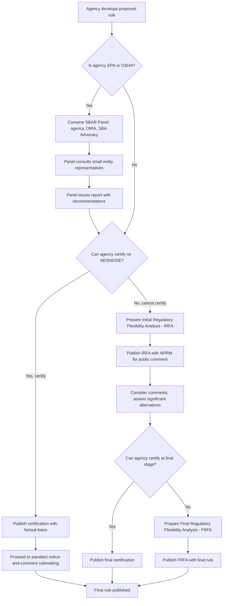

## The Regulatory Flexibility Act and Small Entity Impact Analysis

### Overview

The Regulatory Flexibility Act (RFA), codified at 5 U.S.C. §§ 601–612, requires federal agencies to consider the impact of proposed and final rules on small entities — small businesses, small organizations, and small governmental jurisdictions — and to analyze less burdensome regulatory alternatives where a rule would have a significant economic impact on a substantial number of them. The RFA was substantially strengthened by the **Small Business Regulatory Enforcement Fairness Act of 1996 (SBREFA)**, which added judicial review and enhanced procedural requirements.

### Legislative History and Purpose

- **Regulatory Flexibility Act of 1980** (Pub. L. 96-354): enacted in response to concerns that uniform federal regulations disproportionately burdened small businesses relative to their larger competitors, who could more easily absorb fixed compliance costs.
- **Small Business Regulatory Enforcement Fairness Act of 1996** (Pub. L. 104-121, Title II): added § 611 (judicial review of RFA compliance), created Small Business Advocacy Review (SBAR) panels for EPA and OSHA, and established the congressional disapproval mechanism now codified as the Congressional Review Act.
- **Small Business Jobs Act of 2010**: amended RFA periodic review requirements.
- **Purpose**: to ensure that agencies, when developing regulations, consider the range of impacts a rule may have on small entities and examine alternatives that could accomplish the regulatory objective while minimizing significant adverse economic impact.

### Key Definitions

**"Small entity"** (5 U.S.C. § 601(6)) encompasses three categories, each cross-referenced to other statutory/regulatory size standards:

1. **Small business** — as defined under the Small Business Act, 15 U.S.C. § 632, using Small Business Administration (SBA) size standards that vary by North American Industry Classification System (NAICS) code (e.g., employee count or annual receipts thresholds specific to each industry).
2. **Small organization** — any not-for-profit enterprise that is independently owned and operated and not dominant in its field, per agency-specific definitions.
3. **Small governmental jurisdiction** — governments of cities, counties, towns, townships, villages, school districts, or special districts with a population of less than 50,000.

### The Analytical Framework

#### Step 1: Threshold Certification Decision

For every proposed and final rule subject to notice-and-comment rulemaking under 5 U.S.C. § 553, the agency must determine whether the rule, if promulgated, would have a **"significant economic impact on a substantial number of small entities"** (SEISNOSE).

- If the agency **certifies** that the rule will **not** have such an impact, it must publish the certification and a statement of the factual basis for that certification (5 U.S.C. § 605(b)). No further RFA analysis is required.
- If the agency **cannot certify**, it must prepare a regulatory flexibility analysis.

[Inference] "Significant economic impact" and "substantial number" are not further defined numerically in the statute itself, and agencies generally apply their own interpretive thresholds (sometimes informally, e.g., a percentage-of-revenue impact threshold), which has been a recurring point of litigation and GAO/SBA Office of Advocacy criticism regarding inconsistent application across agencies.

#### Step 2: Initial Regulatory Flexibility Analysis (IRFA) — at the Proposed Rule Stage

If certification is not made, the agency must prepare and publish an **Initial Regulatory Flexibility Analysis** with the NPRM (5 U.S.C. § 603), containing:

- A description of the reasons the action is being considered
- The objectives and legal basis for the rule
- An estimate of the number and types of small entities affected
- A description of projected reporting, recordkeeping, and other compliance requirements, including classes of small entities subject to them and the professional skills needed for compliance
- Identification of all relevant federal rules that may duplicate, overlap, or conflict with the proposed rule
- A description of **significant alternatives** to the proposed rule that accomplish the statutory objectives while minimizing significant economic impact on small entities

#### Step 3: Final Regulatory Flexibility Analysis (FRFA) — at the Final Rule Stage

If the agency does not certify at the final rule stage, it must prepare a **Final Regulatory Flexibility Analysis** (5 U.S.C. § 604), containing:

- A statement of the need for, and objectives of, the rule
- A summary of significant issues raised by public comments on the IRFA, the agency's assessment of those issues, and changes made in response
- A description of and estimate of the number of small entities to which the rule will apply
- A description of projected reporting, recordkeeping, and compliance requirements, including an estimate of the classes of small entities subject to the requirement and the type of professional skills needed
- A description of the steps taken to minimize significant economic impact on small entities, including why alternatives were rejected

### Small Business Advocacy Review (SBAR) Panels

For rules issued by **EPA** and **OSHA** specifically, SBREFA § 609 mandates an additional procedural layer before the proposed rule is even published: the agency must convene a panel — consisting of representatives from the agency, OIRA, and the SBA Office of Advocacy — that:

- Reviews the draft rule's potential small entity impacts
- Consults directly with small entity representatives to solicit input
- Prepares a report to the agency, generally within 60 days of convening, summarizing findings and recommendations

This panel process is unique to EPA and OSHA among federal agencies and reflects a heightened statutory concern about the small-entity impact of environmental and workplace safety regulation specifically.

### Diagram: RFA Small Entity Analysis Workflow

### The "Significant Alternatives" Requirement

Both the IRFA and FRFA must describe alternatives considered to minimize small entity impact while still achieving the rule's statutory objective. Per 5 U.S.C. § 603(c) and § 604(a)(6), agencies must specifically consider:

1. Differing compliance or reporting requirements that account for the resources available to small entities
2. Clarification, consolidation, or simplification of compliance and reporting requirements for small entities
3. Use of performance rather than design standards
4. Exemption of small entities from all or part of the rule's requirements

Failure to meaningfully engage with these alternatives — as opposed to reciting them pro forma — has been a recurring basis for judicial remand under § 611 review.

### Judicial Review Under SBREFA (5 U.S.C. § 611)

Prior to SBREFA, RFA compliance was widely considered judicially unenforceable, since the pre-1996 statute contained no explicit private right of action. SBREFA added § 611, which:

- Authorizes judicial review of agency compliance with RFA certification, IRFA, and FRFA requirements
- Permits a small entity that is adversely affected by a final rule to seek judicial review, typically **within one year** of the rule's publication (with exceptions for good cause)
- Limits the remedy: courts may **remand** the rule to the agency for further RFA consideration, but § 611(a)(4) is generally read as **not authorizing invalidation of the underlying rule** solely for RFA noncompliance — the substantive rule can survive even if the RFA analysis is deficient, with the agency ordered to supplement its analysis.

[Inference] This remedial limitation is one of the RFA's most consequential structural features: because courts generally cannot vacate a rule purely for RFA noncompliance, the RFA functions more as a procedural forcing mechanism for agency deliberation and transparency than as a substantive constraint with strong judicial teeth, though the precise scope of available remedies has been litigated and should be checked against current circuit case law for specific fact patterns.

### Role of the SBA Office of Advocacy

The independent SBA **Office of Advocacy** (established by the RFA itself, 15 U.S.C. § 634a et seq.) serves as a watchdog function:

- Monitors agency RFA compliance government-wide
- Can file formal comments on proposed rules urging stronger small-entity analysis or alternatives
- Publishes an annual report to Congress and the President assessing agency RFA compliance
- Participates directly in EPA/OSHA SBAR panels

### Periodic Review of Existing Rules

5 U.S.C. § 610 requires agencies to review existing rules that have or will have a significant economic impact on a substantial number of small entities within **10 years** of promulgation (and periodically thereafter), to determine whether the rule should be continued, amended, or rescinded, considering:

- Continued need for the rule
- Nature of complaints or comments received
- Complexity of the rule
- Extent of overlap/duplication/conflict with other rules
- Time since the rule was last evaluated and degree to which technology, economic conditions, or other factors have changed the relevant market

### Relationship to EO 12866 and OIRA Review

RFA analysis is procedurally distinct from but often submitted alongside EO 12866 materials during OIRA review — a rule with significant small-entity impact will typically also be a "significant regulatory action" under EO 12866, triggering both cost-benefit review and RFA analysis in parallel. OIRA desk officers frequently coordinate with SBA Office of Advocacy input during interagency review, particularly for EPA and OSHA rules subject to the SBAR panel process.

### Comparative Table: RFA vs. Other Regulatory Impact Statutes

| Dimension | Regulatory Flexibility Act (RFA) | Unfunded Mandates Reform Act (UMRA) | EO 12866 / Circular A-4 CBA |
| --- | --- | --- | --- |
| Affected party focus | Small businesses, small organizations, small governments | State/local/tribal governments and private sector (mandate cost threshold) | General public / society-wide |
| Trigger | Significant economic impact on substantial number of small entities | Mandate cost exceeding inflation-adjusted statutory threshold | "Significant regulatory action" designation |
| Core analytical product | IRFA / FRFA | Written statement with cost estimates | Regulatory Impact Analysis |
| Special agency procedure | SBAR panels (EPA, OSHA only) | None comparable | None comparable |
| Judicial review | Yes, since SBREFA § 611 (remand only, no rule invalidation) | Limited; UMRA judicial review is significantly constrained | No direct judicial review of EO compliance itself |
| Independent watchdog | SBA Office of Advocacy | N/A | OIRA itself is the reviewing body |

**Key Points**

- The RFA does not require agencies to favor small entities substantively — it requires agencies to **analyze and document** small-entity impacts and consider less burdensome alternatives; the ultimate policy choice remains with the agency.
- Certification (finding no SEISNOSE) is the most common agency response and, if adequately justified, ends the RFA analytical obligation for that rule.
- SBREFA's SBAR panel requirement is unique to EPA and OSHA, reflecting heightened statutory concern for environmental and workplace safety rules' small-entity effects.
- Judicial review under § 611 exists but is remedially limited to remand, not invalidation, making the RFA more a transparency/deliberation-forcing statute than a hard substantive check.
- The SBA Office of Advocacy plays an active, quasi-independent oversight role distinct from OIRA's centralized executive review function.

**Example**

Suppose EPA proposes a new rule requiring underground storage tank operators to install upgraded leak-detection technology.

1. EPA's initial analysis suggests thousands of small, independently owned gas stations would be affected, each facing installation costs disproportionate to a small operator's revenue relative to a large chain's — EPA cannot certify no SEISNOSE.
2. Because EPA is subject to the SBAR panel requirement, it convenes a panel with OIRA and SBA Office of Advocacy representatives, who consult small gas station owner representatives.
3. The panel recommends a phased compliance schedule and a simplified reporting form for entities below a certain tank-volume threshold.
4. EPA incorporates these into the IRFA published with the NPRM, describing the phased-compliance and reporting-simplification alternatives explicitly as required under § 603(c).
5. After the comment period, EPA's FRFA documents that it adopted the phased schedule for small entities but declined a full exemption, explaining why a full exemption would undermine the rule's environmental protection objective.
6. A small business trade association believing the FRFA's alternatives analysis was inadequate could seek judicial review under § 611 within the statutory window, with remand (not invalidation) as the available remedy if it prevails.

**Related Topics**

- OIRA interagency review and return letters (parallel EO 12866 process often coordinated with RFA analysis)
- Cost-benefit analysis methodology and its critics (distributional critique intersects with small-entity impact concerns)
- Congressional Review Act (originated in the same SBREFA legislation as § 611 judicial review)
- SBA size standards and NAICS-based small business classification methodology
- Small Business Advocacy Review (SBAR) panel procedures in detail: EPA and OSHA case studies
- Periodic review of existing rules under 5 U.S.C. § 610 and agency retrospective review practices
- Unfunded Mandates Reform Act as a comparable but distinct impact-analysis statute for governmental entities
- SBA Office of Advocacy annual reports and government-wide RFA compliance trends
- Judicial remedies under 5 U.S.C. § 611 and circuit-level interpretation of remand-only relief