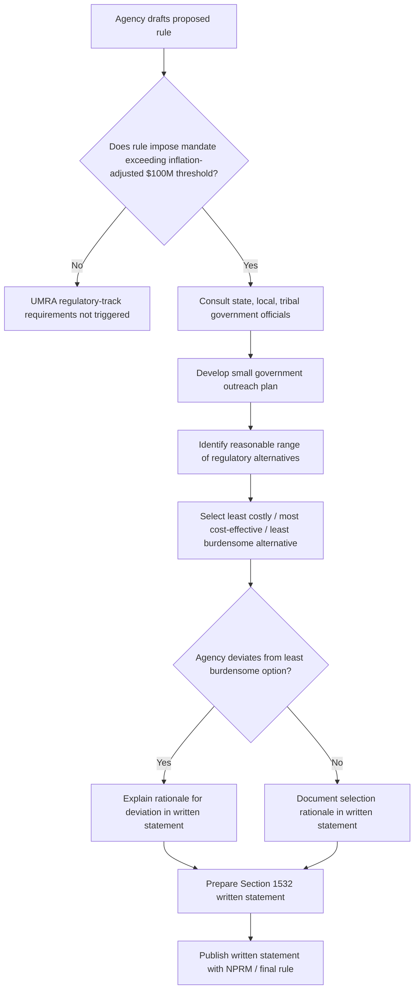

## The Unfunded Mandates Reform Act

### Overview

The Unfunded Mandates Reform Act of 1995 (UMRA), codified principally at 2 U.S.C. §§ 1501–1571, requires Congress and federal agencies to assess the costs that proposed legislation and regulations impose on state, local, and tribal governments and on the private sector, when those costs are not accompanied by federal funding to cover them. UMRA operates in two parallel tracks: a **legislative track** (applicable to congressional bill consideration) and a **regulatory track** (applicable to agency rulemaking, the focus most relevant to administrative law practice).

### Legislative History and Purpose

- **Unfunded Mandates Reform Act of 1995** (Pub. L. 104-4): enacted amid the "Contract with America" era of federalism-focused reform, responding to state and local government complaints that federal statutes and regulations increasingly imposed compliance costs without corresponding federal funding or with insufficient consideration of fiscal impact.
- **Purpose**: to curb the practice of imposing unfunded federal mandates on state, local, and tribal governments and the private sector by requiring explicit cost disclosure and consideration of alternatives before such mandates are imposed, with the underlying theory that transparency and process discipline — not an outright prohibition — would check mandate proliferation.
- UMRA does not prohibit unfunded mandates; it is a **procedural and disclosure statute**, similar in structural philosophy to the RFA and the PRA.

### Key Definitions

- **"Federal mandate"** (2 U.S.C. § 658(6)): includes both a **federal intergovernmental mandate** (a duty imposed on state, local, or tribal governments, including conditions on federal financial assistance in certain circumstances) and a **federal private sector mandate** (an enforceable duty imposed on the private sector).
- **"Regulatory mandate"** — a mandate imposed via agency rule, as opposed to a mandate contained directly in statutory text (the legislative-track focus).
- **Exclusions from "mandate" status**: conditions on voluntary federal grant participation are generally excluded unless they meet specific statutory criteria; duties that are a condition of federal assistance the recipient voluntarily accepts are generally not "mandates" under UMRA absent specified exceptions (2 U.S.C. § 658(5)–(7)).

### The Regulatory Track: Agency Obligations Under UMRA

#### Threshold: The Cost Trigger

UMRA's regulatory-track requirements are triggered when an agency proposes or promulgates a rule that includes a federal mandate likely to result in the expenditure by state, local, and tribal governments in the aggregate, or by the private sector, of **$100 million or more in any one year** (adjusted for inflation; the statute directs annual inflation adjustment, so the operative dollar figure is higher in current-year terms than the original 1995 figure). [Inference] The precise current inflation-adjusted threshold changes each year per OMB's published adjustment; the exact current-year figure should be verified against the most recent OMB guidance rather than assumed static, though it is understood to be substantially above the original $100 million baseline given cumulative inflation since 1995.

#### Step 1: Written Statement (2 U.S.C. § 1532)

Before promulgating any general notice of proposed rulemaking (or any final rule for which a NPRM was not published) that includes a federal mandate exceeding the threshold, the agency must prepare a written statement containing:

1. Identification of the federal law authorizing the mandate
2. A qualitative and quantitative assessment of anticipated costs and benefits, including the extent to which such costs will be borne by state, local, tribal governments or the private sector, and the extent to which federal funding covers the costs
3. Estimates of future compliance costs and disproportionate budgetary effects on particular regions, income groups, or governmental entities
4. A description of the agency's prior consultation with affected state, local, and tribal government officials
5. A summary of comments received from consulted governments and the agency's response
6. A description of the extent to which the agency has considered alternatives and selected the **least costly, most cost-effective, or least burdensome alternative** that achieves the statutory objectives, or an explanation of why it did not do so

#### Step 2: Least Burdensome Alternative Selection (2 U.S.C. § 1535)

Section 1535 requires the agency to identify and consider a reasonable number of regulatory alternatives, and to select from among the alternatives the one that is the **least costly, most cost-effective, or least burdensome** option that achieves the statutory objectives — unless the agency explains in the written statement why it did not select such an alternative, or unless doing so is otherwise prohibited by law.

#### Step 3: Consultation with State, Local, and Tribal Governments (2 U.S.C. § 1534)

Agencies must, "to the extent permitted by law," consult with elected officials of affected state, local, and tribal governments (or their designated representatives) early in the rulemaking process regarding the potential costs and burdens of a regulatory mandate, and provide notice of the requirements of the rule to potentially affected governments.

#### Step 4: Small Government Agency Plan (2 U.S.C. § 1533)

For mandates significantly affecting small governments specifically, agencies must develop a plan that includes:

- Notification to potentially affected small governments
- Enabling their participation in the rulemaking process
- Providing information on compliance requirements

This overlaps functionally with, but is legally distinct from, the RFA's small governmental jurisdiction provisions.

### Diagram: UMRA Regulatory Track Workflow

### The Legislative Track (Congressional Budget Office Role)

Though less central to administrative law practice, the legislative track is structurally important context:

- The **Congressional Budget Office (CBO)** must prepare a cost estimate for any reported bill that includes a federal mandate, identifying whether it exceeds the statutory threshold.
- This triggers a **point of order** mechanism in both the House and Senate: a member can raise a point of order against a bill containing an unfunded mandate exceeding the threshold without full federal funding, which can be used to block or delay floor consideration unless waived.
- [Inference] The point-of-order mechanism has been used unevenly in practice and can be waived by procedural votes, meaning UMRA's legislative-track constraint functions more as a procedural friction point and information-forcing device than a hard substantive bar on unfunded mandate legislation.

### Judicial Review Limitations (2 U.S.C. § 1571)

UMRA contains one of the most restrictive judicial review provisions among the regulatory-process statutes:

- Compliance or noncompliance with most UMRA requirements is **explicitly excluded from judicial review** under § 1571(a)(2).
- A narrow exception exists: courts may review whether an agency has complied with the § 1532 requirement to prepare a written statement (i.e., whether the statement exists and addresses the required elements), but even this review is limited — courts generally cannot review the **substance or adequacy** of the agency's cost-benefit assessment or alternative-selection analysis within that statement.
- § 1571(a)(3) further specifies that if an agency fails to prepare the written statement, a court's remedy is limited to **remanding the rule** for the agency to complete the statement; courts cannot invalidate the rule for a UMRA violation itself, and no injunctive relief is available on UMRA grounds to block the rule's effectiveness pending remand.

[Inference] This judicial review structure makes UMRA, in practical enforcement terms, even weaker than the RFA's post-SBREFA § 611 regime — UMRA's core substantive requirements (identifying the least burdensome alternative, consulting affected governments) are essentially unreviewable for adequacy, leaving the written-statement existence requirement as the primary (and narrow) judicially enforceable component. This is a significant point of scholarly and practitioner critique of UMRA's practical effectiveness.

### Relationship to EO 12866, RFA, and PRA

UMRA analysis often runs in parallel with other regulatory-process statutes for the same rule:

- A rule imposing significant costs on state/local governments or the private sector may simultaneously be a "significant regulatory action" under EO 12866 (triggering OIRA cost-benefit review), have small-entity implications under the RFA, and create new information collection burdens under the PRA.
- Unlike the RFA (post-SBREFA) or the PRA, UMRA has no equivalent to a specialized advocacy office (like SBA's Office of Advocacy) monitoring compliance, nor a panel-consultation mechanism analogous to EPA/OSHA's SBAR panels — its enforcement relies primarily on the written-statement disclosure requirement and political/legislative pressure rather than institutionalized third-party oversight.

### Comparative Table: UMRA vs. RFA vs. EO 12866/Circular A-4

| Dimension | UMRA | RFA (post-SBREFA) | EO 12866 / Circular A-4 |
| --- | --- | --- | --- |
| Affected party focus | State/local/tribal governments; private sector (mandate-specific) | Small businesses, organizations, governments | General public / society |
| Cost trigger | Inflation-adjusted $100 million/year threshold | "Significant economic impact on substantial number" (undefined numerically) | $200 million/year or material sectoral effect (EO 14094 threshold) |
| Core analytical product | § 1532 written statement | IRFA / FRFA | Regulatory Impact Analysis |
| Alternative-selection standard | Least costly / most cost-effective / least burdensome | Significant alternatives minimizing small-entity impact | Alternative maximizing net benefits |
| Consultation requirement | Yes — state/local/tribal officials (§ 1534) | No formal consultation mandate outside SBAR panels (EPA/OSHA only) | Interagency circulation, not external government consultation |
| Judicial review | Extremely limited — written-statement existence only, no substantive review, no injunctive relief (§ 1571) | Yes, since SBREFA § 611 — remand only | No direct judicial review of EO compliance |
| Independent watchdog office | None comparable | SBA Office of Advocacy | OIRA itself |

**Key Points**

- UMRA is a **disclosure and consideration** statute, not a substantive prohibition on unfunded mandates — it does not prevent Congress or agencies from imposing costly mandates, provided the required analysis and consultation occur.
- The regulatory-track threshold (inflation-adjusted from an original $100 million baseline) is the key gatekeeping figure determining whether an agency's UMRA obligations are triggered for a given rule.
- UMRA's judicial review provision (§ 1571) is unusually restrictive even by administrative-process-statute standards: courts can confirm a written statement exists but generally cannot assess its substantive adequacy, and no rule invalidation or injunctive relief is available on UMRA grounds.
- UMRA operates on both a legislative track (CBO cost estimates and congressional points of order) and a regulatory track (agency written statements and consultation), with the regulatory track being the more administrative-law-relevant mechanism.
- UMRA frequently runs parallel to EO 12866, RFA, and PRA analyses for the same rule, but lacks the specialized advocacy infrastructure (e.g., SBA Office of Advocacy, SBAR panels) that strengthens RFA enforcement.

**Example**

Suppose the Department of Transportation proposes a rule requiring all state departments of transportation to retrofit highway signage nationwide to a new reflectivity standard, with an estimated aggregate state compliance cost of $150 million in the first year (exceeding the inflation-adjusted UMRA threshold).

1. DOT must consult with state transportation officials (or their representative associations, e.g., AASHTO) early in the rulemaking process regarding anticipated costs.
2. DOT identifies several alternatives: (a) an immediate nationwide retrofit mandate, (b) a phased retrofit schedule tied to normal sign replacement cycles, (c) a performance-based standard allowing states to choose compliance methods.
3. DOT selects the phased approach as the least burdensome alternative achieving the safety objective, and documents this selection — along with cost estimates, consultation summary, and rationale for not selecting the immediate nationwide mandate — in its § 1532 written statement.
4. If a state government later challenges the rule, arguing DOT's cost estimate was arbitrary or its alternative analysis inadequate, a reviewing court could confirm that a written statement exists and addresses the required topics, but under § 1571 would generally lack authority to assess whether the phased approach was actually the most cost-effective option, and could not enjoin the rule or invalidate it solely on UMRA grounds even if the statement were deficient — remand for statement completion is the limited remedy.

**Related Topics**

- OIRA interagency review and return letters (parallel EO 12866 process often triggered alongside UMRA for high-cost rules)
- Cost-benefit analysis methodology and its critics (UMRA's "least burdensome alternative" standard as a distinct but related concept to net-benefit maximization)
- The Regulatory Flexibility Act and small entity impact analysis (comparable disclosure-based statute with stronger post-SBREFA judicial review)
- Federalism doctrine in administrative law: *New York v. United States*, 505 U.S. 144 (1992), and *Printz v. United States*, 521 U.S. 898 (1997), as constitutional backdrop to anti-commandeering concerns UMRA partially addresses through process
- Congressional Budget Office mandate cost-estimation methodology (legislative track)
- Tribal consultation requirements in federal rulemaking beyond UMRA (e.g., Executive Order 13175)
- Comparative state government advocacy mechanisms: National Governors Association, National Conference of State Legislatures engagement in federal rulemaking
- Judicial review limitations across regulatory-process statutes: UMRA § 1571 compared to RFA § 611 and APA § 706