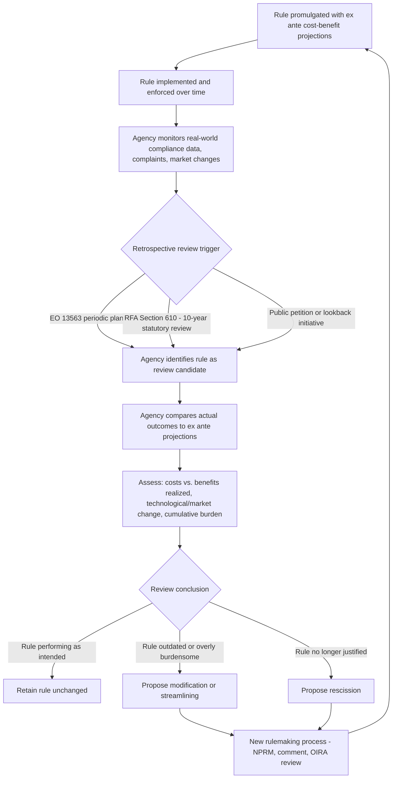

## Retrospective Review and Regulatory Lookback Initiatives

### Overview

Retrospective review refers to the systematic re-examination of existing federal regulations after their promulgation to assess whether they continue to achieve their intended objectives efficiently, and whether they should be retained, modified, streamlined, or rescinded. Unlike prospective regulatory review (OIRA's EO 12866 review of new rules before publication), retrospective review — sometimes called "regulatory lookback" — evaluates the actual, realized effects of rules already in force, often against the ex ante cost-benefit projections made at the time of adoption.

### Legal and Executive Basis

- **Executive Order 12866** (1993), § 5: directed agencies to submit to OIRA a program for periodic review of existing significant regulations to determine whether they should be modified or eliminated to make the agency's regulatory program more effective in achieving regulatory objectives.
- **Executive Order 13563** (2011), § 6: substantially elevated retrospective review as a priority, directing each agency to develop and periodically update a **plan for retrospective analysis of existing significant rules** to determine whether they should be modified, streamlined, expanded, or repealed, considering cumulative effects of regulation, including cumulative burdens.
- **Executive Order 13610** (2012), "Identifying and Reducing Regulatory Burdens": reinforced EO 13563's retrospective review mandate, directing agencies to give priority to reforms that reduce unjustified regulatory burden and requiring periodic public reporting.
- **5 U.S.C. § 610** (part of the Regulatory Flexibility Act): a narrower, statutorily mandated retrospective review specifically for rules with significant small-entity impact, requiring review within 10 years of promulgation.
- **Executive Order 13771** (2017, "Reducing Regulation and Controlling Regulatory Costs") and its rescission by **Executive Order 13992** (2021): illustrate how retrospective/deregulatory review priorities can shift sharply across administrations — EO 13771 imposed a "two-out, one-in" deregulatory offset requirement and a regulatory cost cap, later rescinded at the outset of the subsequent administration.
- **Executive Order 14094** (2023), "Modernizing Regulatory Review": reinforced retrospective review as an ongoing OIRA/OMB priority, alongside its revisions to EO 12866 significance thresholds.

### Rationale for Retrospective Review

1. **Ex ante uncertainty correction** — cost-benefit analyses performed before a rule takes effect rely on projections; actual market responses, technological change, and behavioral effects may diverge substantially from initial estimates.
2. **Regulatory accumulation** — individual rules may each be independently justified, but their cumulative burden on a regulated sector may exceed what any single cost-benefit analysis captured in isolation.
3. **Technological and market obsolescence** — rules calibrated to technology or market conditions at the time of adoption may become outdated, overly stringent, or insufficiently protective as circumstances change.
4. **Democratic accountability and adaptive governance** — retrospective review provides a feedback loop allowing agencies (and the public) to assess whether real-world outcomes matched projected outcomes, informing future rulemaking methodology.

[Inference] Despite consistent executive branch emphasis on retrospective review across administrations since at least EO 12866, government accountability studies (e.g., by the Government Accountability Office and academic administrative law scholars) have repeatedly found that systematic follow-through — as opposed to selective, high-profile lookback exercises — has been inconsistent, with resource constraints and lack of a strong external enforcement mechanism (unlike, for example, the RFA's SBREFA-enabled judicial review) frequently cited as contributing factors.

### Types of Retrospective Review Mechanisms

#### 1. Agency-Initiated Periodic Review Plans (EO 13563)

Agencies develop and publish retrospective review plans identifying candidate rules for reassessment, generally prioritizing:

- Rules with the highest estimated costs or burdens
- Rules subject to significant stakeholder complaints
- Rules affected by substantial technological change since adoption
- Rules nearing or exceeding statutory review deadlines (where applicable, e.g., RFA § 610)

#### 2. Statutory "Sunset" or Periodic Review Requirements

Some individual statutes build in mandatory periodic reassessment (distinct from the general EO-based retrospective review framework), e.g., certain environmental statutes requiring periodic reconsideration of specific standards (illustrative pattern; specific statutory review cycles vary by program and should be verified against the particular statute in question).

#### 3. Regulatory Lookback Initiatives (Executive Branch-Wide Campaigns)

Periodic, administration-specific government-wide initiatives directing agencies to conduct systematic review of existing rules within a defined window, often accompanied by public solicitation of suggestions for rules to eliminate or streamline. [Unverified — administration-specific details change; verify current initiative status] Different administrations have launched named lookback or burden-reduction initiatives with varying structures (e.g., "regulatory reform task forces" established under some administrations pursuant to executive order, tasked with identifying rules for repeal, replacement, or modification); specific current initiatives should be verified against the most recent executive orders and OMB guidance rather than assumed to persist unchanged across administrations.

#### 4. Guidance Document and Deregulatory Cost-Offset Requirements

Some administrations have layered additional retrospective/deregulatory mechanisms onto the basic EO 13563 framework, such as requiring a specified number of existing regulations to be identified for elimination or cost-offset for each new significant regulation issued (the EO 13771 "two-out, one-in" model, since rescinded). These mechanisms illustrate that retrospective review can be structured either as a neutral evidence-gathering exercise or as an explicitly deregulatory-biased quota system, a distinction with significant methodological and political implications.

### Diagram: Retrospective Review Cycle

### Methodological Challenges in Retrospective Analysis

**Establishing the Counterfactual**

Unlike prospective CBA, which projects a hypothetical baseline, retrospective analysis must reconstruct what would have happened absent the rule using actual historical data — a methodologically harder problem, often requiring quasi-experimental techniques (difference-in-differences, synthetic control methods, regression discontinuity) to isolate the rule's causal effect from confounding economic, technological, or policy changes occurring over the same period.

**Data Availability**

Ex post evaluation requires longitudinal data on compliance costs, health/safety/environmental outcomes, and market behavior that agencies may not have systematically collected at the time of rule adoption, limiting the rigor of comparison against original projections. [Inference] This data gap is frequently cited in administrative law and regulatory economics literature as one of the principal practical obstacles to robust retrospective review, distinguishable from the political/institutional obstacles (e.g., limited resources, absence of strong statutory enforcement) also commonly cited.

**Distinguishing Rule Effects from External Shocks**

Economic recessions, technological disruption, or unrelated regulatory changes occurring during a rule's implementation period can confound simple before-after comparisons, requiring careful econometric controls to attribute observed outcomes correctly to the rule itself.

### OIRA's Role in Retrospective Review

OIRA reviews agency retrospective review plans and, per EO 13563, coordinates cross-agency retrospective review priorities, but generally does **not** conduct the retrospective analyses itself — that remains an agency function, with OIRA serving an oversight, coordination, and prioritization role analogous to (but less procedurally formalized than) its EO 12866 prospective review function. Retrospective review plans and outcomes are generally published by agencies and can be tracked via agency regulatory agendas and reginfo.gov, though [Unverified] the degree of centralized public tracking and reporting consistency has varied across administrations and should be verified against current OMB/OIRA reporting practices.

### Comparative Table: Prospective vs. Retrospective Review

| Dimension | Prospective Review (EO 12866) | Retrospective Review (EO 13563 / lookback) |
| --- | --- | --- |
| Timing | Before rule promulgation | After rule has been in effect |
| Primary actor | OIRA (centralized gatekeeping) | Issuing agency (OIRA coordinates/oversees) |
| Analytical basis | Projected costs/benefits (ex ante) | Observed/realized costs and benefits (ex post) |
| Methodology | Circular A-4 cost-benefit projection | Quasi-experimental / longitudinal evaluation methods |
| Formal trigger | Mandatory before publication of significant rules | Periodic plans (EO 13563); 10-year statutory cycle for small-entity rules (RFA § 610) |
| Judicial enforceability | Not directly judicially reviewable | Not directly judicially reviewable; RFA § 610 review obligation similarly limited |
| Typical output | Regulatory Impact Analysis, return letter (if deficient) | Rule retention, amendment, or rescission proposal |

**Key Points**

- Retrospective review is primarily an executive-order-driven practice (EO 12866 § 5, EO 13563 § 6, EO 13610) rather than a comprehensive freestanding statutory mandate, with the narrower RFA § 610 10-year review as one of the few explicit statutory retrospective requirements.
- The central methodological distinction from prospective CBA is the shift from projected to observed effects, which introduces counterfactual-reconstruction and data-availability challenges not present in ex ante analysis.
- Retrospective review priorities and structures (e.g., deregulatory offset requirements like EO 13771) can shift significantly across administrations, illustrating that "retrospective review" is not a single fixed methodology but a policy framework whose emphasis and mechanics are politically contingent.
- OIRA's role in retrospective review is coordinative and prioritization-focused rather than a formal gatekeeping review comparable to its EO 12866 function.
- Persistent critiques (from GAO, academic scholars, and government watchdog analyses) center on inconsistent agency follow-through and the absence of strong external enforcement mechanisms comparable to those found in RFA's SBREFA-era judicial review.

**Example**

Suppose OSHA adopted a workplace noise exposure standard in the 1990s, with an ex ante Regulatory Impact Analysis projecting specific annual compliance costs and hearing-loss-prevention benefits based on then-available hearing protection technology and industry noise data.

1. Under its EO 13563 retrospective review plan, OSHA identifies this rule as a candidate for review, given both its age and stakeholder complaints about compliance costs for certain industry subsectors.
2. OSHA gathers two decades of enforcement data, workers' compensation claims related to hearing loss, and technological data on hearing protection equipment improvements since the rule's adoption.
3. Using a difference-in-differences approach comparing exposed and comparable non-exposed industry segments, OSHA finds actual compliance costs were lower than originally projected (due to technological improvements in hearing protection equipment) while hearing-loss reduction benefits were realized largely as projected.
4. Based on this analysis, OSHA proposes a targeted amendment simplifying certain recordkeeping requirements (addressing a documented complaint source) while retaining the core exposure limit, publishing this conclusion as part of its retrospective review reporting.
5. This amendment proposal would itself proceed through standard notice-and-comment rulemaking and, if significant, through EO 12866 prospective OIRA review — illustrating how retrospective review findings feed back into the prospective rulemaking pipeline.

**Related Topics**

- OIRA interagency review and return letters (prospective review counterpart to retrospective review)
- Cost-benefit analysis methodology and its critics (ex ante methodology whose accuracy retrospective review is designed to test)
- The Regulatory Flexibility Act and small entity impact analysis (source of the statutory § 610 10-year review requirement)
- Executive Order 13771 and 13992: case study in politically contingent deregulatory offset mechanisms
- Quasi-experimental methods in policy evaluation: difference-in-differences, synthetic control, regression discontinuity design
- Government Accountability Office reports on federal retrospective review implementation
- Regulatory guidance documents and their exclusion from/inclusion in formal retrospective review frameworks
- Sunset provisions and periodic statutory reauthorization as legislative-track analogs to executive retrospective review
- Cumulative regulatory burden analysis as a distinct methodological challenge within retrospective review