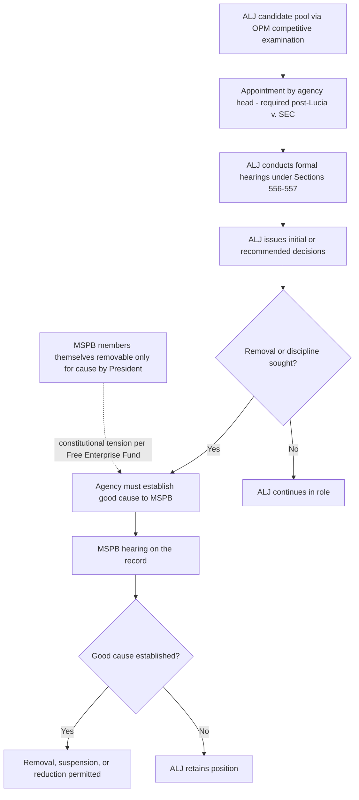

## Administrative Law Judges: Appointment, Tenure, and Decisional Independence

### Overview

Administrative law judges (ALJs) are the presiding officers who conduct formal adjudicatory hearings under 5 U.S.C. §§ 554, 556, and 557. The statutory and constitutional architecture governing their appointment, tenure, and decisional independence is designed to balance two competing concerns: (1) ensuring ALJs possess sufficient independence from the agencies whose cases they hear to render impartial decisions, and (2) respecting the constitutional accountability structure of executive power, particularly the Appointments Clause and the President's removal authority over executive officers. This tension has become especially prominent following *Lucia v. SEC* and subsequent litigation over ALJ removal protections.

### Statutory Framework: Appointment

**Competitive Examination and Selection (5 U.S.C. § 3105)**

Agencies appoint ALJs "as may be necessary for proceedings required to be conducted in accordance with sections 556 and 557." Historically, ALJ selection operated through:

- A competitive, merit-based examination process administered by the **Office of Personnel Management (OPM)**, involving a rigorous qualification and scoring system for candidates (with legal experience requirements, a structured interview, and a veterans' preference component).
- Selection from OPM's resulting register of qualified candidates, constraining agencies' hiring discretion relative to typical political or at-will appointments.

[Unverified — verify current OPM procedures] The precise mechanics of the OPM ALJ hiring register have been subject to periodic administrative reform and litigation over the register's suspension and reconstitution; current procedural details should be verified against OPM's most recent published regulations rather than assumed static, as this area has seen procedural flux.

**Appointments Clause Requirements Post-*Lucia***

***Lucia v. SEC***, 585 U.S. 237 (2018), fundamentally reshaped the constitutional status of ALJ appointment:

- The Supreme Court held that SEC ALJs are **"Officers of the United States"** under the Appointments Clause (Art. II, § 2, cl. 2), not mere employees, because they exercise significant discretion in carrying out important governmental functions — conducting adversarial hearings, taking evidence, ruling on the admissibility of evidence, and issuing decisions containing factual and legal findings that (absent further agency review) become final.
- As "inferior officers," ALJs must be appointed by the President, a court of law, or the **head of the department** — appointment through the ordinary competitive civil-service hiring process (i.e., by agency staff rather than the agency head) violates the Appointments Clause.
- The remedy for an Appointments Clause violation is a **new hearing before a properly appointed, different ALJ** (or the same ALJ, if properly reappointed by the agency head), not merely review by a properly appointed official of the improperly conducted hearing.

**Post-*Lucia* Agency Response**

Following *Lucia*, numerous agencies (including the SEC and Social Security Administration) undertook formal ratification of their existing ALJs' appointments — agency heads formally "reappointed" or ratified the appointments of sitting ALJs to cure the Appointments Clause defect identified in *Lucia*. [Inference] This wave of ratification actions itself generated substantial follow-on litigation regarding whether ratification adequately cured the defect for pending cases and how far back the ratification requirement's remedial reach extended; specific case outcomes on ratification adequacy are agency- and circuit-specific and should be verified against current case law.

### Tenure and Removal Protections

**Statutory Removal Standard (5 U.S.C. § 7521)**

ALJs enjoy removal protections substantially stronger than typical federal employees:

- An ALJ may be removed, suspended, reduced in grade or pay, or furloughed only for **good cause** established and determined by the **Merit Systems Protection Board (MSPB)** after an opportunity for a hearing on the record.
- This is a **two-layer removal protection structure**: (1) the agency must show good cause to the MSPB, and (2) MSPB members themselves are removable by the President only for cause — creating a "for-cause upon for-cause" insulation structure.

**Performance Evaluation Insulation**

ALJs are generally excluded from the standard federal employee performance rating and bonus system applicable to most civil servants, a structural feature intended to prevent agencies from using performance ratings or compensation incentives to pressure ALJs toward outcomes favorable to the agency in its role as a litigant before them.

### The Constitutional Removal Power Challenge: *Free Enterprise Fund* and *Jarkesy*-Adjacent Litigation

**"For-Cause Upon For-Cause" Structures and *Free Enterprise Fund***

***Free Enterprise Fund v. Public Company Accounting Oversight Board***, 561 U.S. 477 (2010), held unconstitutional a similar (though not identical) multi-layer for-cause removal structure applicable to PCAOB members, reasoning that such layered insulation from presidential removal authority impermissibly diffused accountability in violation of Article II's vesting of executive power in the President.

[Inference] Because ALJ removal protection under § 7521 similarly involves layered for-cause insulation (agency must show cause to MSPB; MSPB members removable only for cause), this structure has been argued by some litigants and scholars to raise analogous *Free Enterprise Fund* concerns, though the Supreme Court has not squarely resolved whether § 7521's specific structure is unconstitutional under that precedent — this remains a genuinely contested and evolving area of doctrine that should be tracked through current litigation rather than treated as settled.

**Structural Challenges to Agency Adjudication More Broadly**

***SEC v. Jarkesy***, 603 U.S. 109 (2024), while decided principally on Seventh Amendment jury-trial grounds (holding the SEC's use of in-house administrative adjudication with ALJs to impose civil penalties for securities fraud violated the defendant's right to a jury trial because the claims were akin to common-law fraud actions), has significant downstream implications for the scope of formal ALJ adjudication, particularly regarding when Congress may permissibly assign adjudication of "public rights" versus "private rights" matters to agency ALJs rather than Article III courts. [Inference] *Jarkesy*'s full implications for the broader universe of agency ALJ adjudications — beyond the SEC civil penalty context specifically at issue — remain the subject of ongoing litigation and scholarly debate as lower courts apply its reasoning to other agencies' enforcement structures; specific application to any given agency's ALJ proceedings should be independently verified against post-*Jarkesy* case law.

### Diagram: ALJ Appointment and Removal Structure

### Decisional Independence Protections in Practice

**Separation of Functions (5 U.S.C. § 554(d))**

As discussed in formal adjudication doctrine, agency staff who perform investigative or prosecutorial functions in a case are barred from advising the ALJ on the decision in that or a factually related case — reinforcing decisional independence at the case level, distinct from the officer-level removal protections.

**Ex Parte Communication Restrictions (5 U.S.C. § 557(d))**

ALJs are shielded from off-the-record influence by agency personnel or outside parties once a matter is noticed for hearing, with violations subject to public disclosure and potential adverse consequences for the offending party.

**Assignment Rotation and Case-Docketing Independence**

[Inference] Many agencies structure ALJ case assignment through rotational or randomized docketing systems specifically to prevent agency management from selectively routing cases to ALJs perceived as more favorable to the agency's litigating position, though the specific assignment mechanics vary by agency and are generally established through internal agency procedure rather than uniform statutory command.

### Comparative Table: ALJs vs. Other Adjudicative Officials

| Dimension | Administrative Law Judges (ALJ) | Administrative Judges (AJ) / Non-ALJ Hearing Officers | Article III Judges |
| --- | --- | --- | --- |
| Governing statute | 5 U.S.C. §§ 3105, 556, 557, 7521 | Agency-specific statutes/regulations; not governed by APA ALJ provisions | Article III, U.S. Constitution |
| Appointment | Agency head (post-*Lucia*); historically OPM competitive process | Varies by agency; typically agency discretion | President with Senate confirmation |
| Tenure protection | Good cause via MSPB, two-layer structure | Varies; often at-will or agency-discretion removal | Life tenure during good behavior |
| Presides over | Formal §§ 556–557 on-the-record hearings | Informal or agency-specific hearing procedures (e.g., some immigration, veterans' benefits proceedings) | Article III cases and controversies |
| Decision finality | Becomes final agency decision absent appeal (§ 557(b)) | Governed by agency-specific finality rules | Final subject to appellate review |
| Constitutional officer status | "Officer of the United States" per *Lucia* (context-dependent on discretion exercised) | Generally not addressed as Officers under *Lucia*'s reasoning unless functionally similar | Article III officers by constitutional design |

### Illustrative Application in Environmental and Administrative Enforcement

ALJs preside over formal adjudications in various environmental enforcement contexts, including EPA administrative penalty proceedings where the governing statute and regulations call for formal, on-the-record hearings. The *Lucia* appointment requirements and § 7521 removal protections apply equally to EPA ALJs (and ALJs across all agencies utilizing them) as to the SEC ALJs at issue in *Lucia* itself, since the statutory framework (§§ 3105, 7521) is government-wide rather than agency-specific. [Inference] Post-*Jarkesy*, environmental enforcement proceedings seeking civil penalties analogous to common-law causes of action could face similar Seventh Amendment jury-trial challenges if litigants argue the claims are not confined to the "public rights" doctrine exception articulated in that decision; this is an emerging and unsettled area that should be tracked through subsequent circuit court treatment rather than treated as resolved for any specific environmental statute.

**Key Points**

- *Lucia v. SEC* established that ALJs performing functions of the type at issue there are constitutional "Officers of the United States," requiring appointment by the agency head (not ordinary civil-service hiring) under the Appointments Clause.
- Section 7521 creates a two-layer "for-cause upon for-cause" removal protection structure (agency shows cause to MSPB; MSPB members removable only for cause), which has drawn constitutional scrutiny analogous to *Free Enterprise Fund*'s concerns about diffused executive accountability, though the Supreme Court has not definitively resolved this specific question as applied to ALJs.
- Decisional independence operates on two distinct levels: officer-level protections (appointment and removal structure) and case-level protections (separation of functions under § 554(d), ex parte restrictions under § 557(d)).
- *SEC v. Jarkesy* introduces a significant, still-developing constraint on the scope of matters that can be assigned to agency ALJ adjudication at all, particularly for civil penalty proceedings resembling common-law causes of action, with implications extending beyond the securities enforcement context in which it arose.
- The competitive, merit-based ALJ selection process (traditionally administered through OPM) is intended to insulate ALJ hiring from ordinary political appointment dynamics, distinguishing ALJs from typical political or discretionary agency hires.

**Example**

Suppose EPA brings an administrative civil penalty action against a facility for Clean Air Act violations, assigned to an EPA ALJ for a formal § 556 hearing.

1. The presiding ALJ was appointed by the EPA Administrator (agency head) directly, satisfying *Lucia*'s Appointments Clause requirement — had the ALJ instead been hired through an ordinary staff-level civil service process without agency-head appointment or ratification, the facility could challenge the proceeding's validity on Appointments Clause grounds, with the potential remedy being a new hearing before a properly appointed ALJ.
2. During the hearing, EPA enforcement staff who investigated the facility are barred under § 554(d) from advising the ALJ on the decision.
3. If EPA management later wished to remove this ALJ over dissatisfaction with a pattern of penalty-reducing decisions, it could not do so directly — it would need to establish good cause before the MSPB, which would conduct its own hearing on the record before permitting removal.
4. If the facility separately argues that EPA's civil penalty claim is analogous to a common-law tort/fraud-type claim (rather than falling within the "public rights" doctrine), it could raise a *Jarkesy*-based Seventh Amendment challenge to the very use of ALJ adjudication (as opposed to an Article III jury trial) for that specific claim — an argument whose success depends on how courts characterize the particular environmental claim's public-rights versus private-rights character, an unsettled and evolving analysis post-*Jarkesy*.

**Related Topics**

- Formal adjudication under Sections 554, 556, and 557 (the procedural framework ALJs administer)
- *Lucia v. SEC* and the Appointments Clause: officer versus employee distinction and its application beyond ALJs
- *Free Enterprise Fund v. PCAOB* and multi-layer for-cause removal structures
- *SEC v. Jarkesy* and the public rights/private rights distinction in agency adjudication
- Separation of powers doctrine: unitary executive theory and removal power litigation (*Seila Law v. CFPB*, 591 U.S. 197 (2020), as related removal-power precedent)
- Merit Systems Protection Board structure, jurisdiction, and its own removal-protection litigation history
- Seventh Amendment jury trial rights in administrative enforcement proceedings post-*Jarkesy*
- EPA administrative penalty proceedings and formal hearing requirements under environmental statutes
- Comparative analysis: immigration judges and veterans' benefits adjudicators as non-ALJ administrative adjudicators outside the § 3105/7521 framework