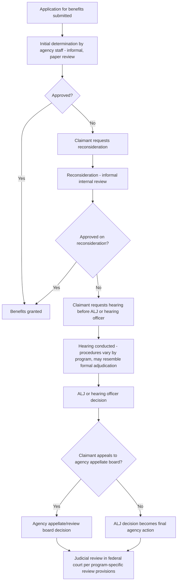

## Informal Adjudication, Licensing, and Benefits Determinations

### Overview

Informal adjudication encompasses the vast majority of federal agency decisionmaking that affects individual rights, benefits, or obligations but falls outside the trial-type formal adjudication procedures of 5 U.S.C. §§ 554, 556, and 557. Where formal adjudication is triggered by statutory language requiring determination "on the record after opportunity for an agency hearing," informal adjudication governs everything else — licensing decisions, most benefits determinations, permit issuances, and countless other individualized agency actions — subject to a comparatively thin set of express APA procedural requirements but a richer body of judicially developed and constitutional due process constraints.

### The APA's Minimal Express Framework for Informal Adjudication

Unlike formal adjudication, informal adjudication has no dedicated procedural section comparable to §§ 556–557. The APA's express informal adjudication provisions are comparatively sparse:

- **5 U.S.C. § 555** ("Ancillary matters"): applies to both formal and informal proceedings and includes baseline procedural protections — the right to appear by counsel or other representative, prompt notice of denial of a request, and a requirement that agencies conclude matters presented to them within a reasonable time.
- **5 U.S.C. § 555(e)**: requires that, except when notice or the denial is self-explanatory, an agency's denial of a written application, petition, or other request must be accompanied by a brief statement of the grounds for denial.
- **5 U.S.C. § 706(2)(A)** (judicial review): the operative constraint on informal adjudication is not a procedural code but the **arbitrary and capricious** standard applied on judicial review — courts assess whether the agency's decision was reasoned and supported by the administrative record, rather than requiring the agency to have followed a specific pre-decision procedural template.

### Licensing Under the APA

**Definitional Scope (5 U.S.C. § 551(9))**

"Licensing" under the APA includes the agency process respecting the grant, renewal, denial, revocation, suspension, annulment, withdrawal, limitation, amendment, modification, or conditioning of a license. "License" (§ 551(8)) is defined broadly to include the whole or part of an agency permit, certificate, approval, registration, charter, membership, statutory exemption, or other form of permission.

**Procedural Character**

- Most licensing proceedings are informal, governed by agency-specific regulations rather than APA-mandated trial-type procedures, unless the organic statute triggers formal adjudication under the *Florida East Coast Railway* on-the-record analysis.
- Environmental and administrative law licensing contexts include permit issuance under statutes such as the Clean Water Act (NPDES permits), Clean Air Act (Title V operating permits, though these have their own detailed notice-and-comment-like procedures under specific regulatory schemes), and various natural resource extraction and land-use permitting programs.
- **5 U.S.C. § 558(c)** imposes specific procedural protections on license **withdrawal, suspension, revocation, or annulment**: except in cases of willfulness or where public health, interest, or safety requires otherwise, a licensee must be given notice of facts or conduct warranting the action and an opportunity to demonstrate or achieve compliance with all lawful requirements before institution of proceedings for withdrawal, suspension, revocation, or annulment of a license. Additionally, when a licensee has made a timely and sufficient application for renewal, the existing license does not expire until the application is finally determined by the agency (§ 558(c)).

### Benefits Determinations

**Common Structural Pattern**

Federal benefits programs (Social Security disability, veterans' benefits, certain public assistance programs, and comparable schemes) typically employ a **multi-tiered administrative review structure** that blends elements of both informal and formal process:

1. **Initial determination** by agency staff (informal, typically paper-based review)
2. **Reconsideration** (informal, internal agency review)
3. **Hearing** before an ALJ or comparable hearing officer (this stage can trigger formal §§ 556–557 procedures if the underlying statute's language satisfies the on-the-record trigger, or may follow agency-specific formal-like procedures established by regulation even without a strict APA formal-adjudication trigger)
4. **Agency appellate/review board** review
5. **Judicial review** in federal district court or a specialized court, depending on the program's statutory review provisions

[Inference] Social Security disability determinations are frequently cited as the paradigmatic example of this tiered structure, and the hearing stage before a Social Security ALJ is often discussed alongside formal adjudication doctrine, though the precise degree to which Social Security hearings track full § 556/557 formal procedures versus agency-specific regulatory procedures modeled on but not strictly identical to the APA formal track is a nuanced question that benefits from verification against current SSA regulations (20 C.F.R. Parts 404, 416) for programmatic specifics.

### Diagram: Typical Multi-Tiered Benefits Determination Structure

### Constitutional Due Process in Informal Adjudication and Benefits Contexts

Because informal adjudication lacks a comprehensive statutory procedural code, constitutional due process doctrine plays an outsized role in shaping the actual procedures agencies must afford, particularly for benefits determinations involving a cognizable property or liberty interest.

**The Threshold Question: Is There a Protected Interest?**

- ***Board of Regents v. Roth***, 408 U.S. 564 (1972): due process protections attach only where the government action deprives a person of a constitutionally protected liberty or property interest; property interests in benefits arise from "existing rules or understandings" (often state or federal statutes/regulations creating an entitlement), not from the Constitution itself.
- ***Perry v. Sindermann***, 408 U.S. 593 (1972): companion case clarifying that a property interest can arise from implied, not just express, rules or mutual understandings.

**What Process Is Due: *Goldberg* and *Mathews***

- ***Goldberg v. Kelly***, 397 U.S. 254 (1970): held that welfare recipients facing termination of benefits are entitled to an evidentiary hearing **before** termination (not merely a post-termination hearing), given the severity of the deprivation to subsistence-level recipients; this case established a relatively robust pre-deprivation process floor for certain benefits.
- ***Mathews v. Eldridge***, 424 U.S. 319 (1976): narrowed and generalized the due process inquiry into the now-standard three-factor balancing test, applied there to hold that Social Security disability benefit termination did **not** require a pre-termination evidentiary hearing (post-termination hearing sufficed), given the availability of retroactive benefits if the claimant ultimately prevailed and the relatively lower stakes compared to *Goldberg*'s subsistence-level welfare context, balanced against the government's administrative burden interest.

$$Process\ Due = f(Private\ Interest,\ Risk\ of\ Erroneous\ Deprivation\ \times\ Value\ of\ Additional\ Safeguards,\ Government\ Interest)$$

[Inference] The *Goldberg*/*Mathews* distinction is frequently taught as illustrating a spectrum: the severity and immediacy of the private interest at stake (subsistence welfare in *Goldberg* versus disability benefits with retroactive-payment cushioning in *Mathews*) drives significantly different due process outcomes even though both involve benefits terminations, underscoring that "what process is due" is highly fact- and context-dependent rather than a fixed rule applicable uniformly across all benefits programs.

### The "Hard Look" Doctrine and Informal Adjudication Review

Because informal adjudication lacks a formal evidentiary record requirement comparable to § 556(e), judicial review typically applies the framework from ***Citizens to Preserve Overton Park, Inc. v. Volpe***, 401 U.S. 402 (1971):

- Review is generally confined to the **administrative record** that was before the agency at the time of decision (the "record rule"), though *Overton Park* also recognized limited circumstances warranting review beyond the administrative record, such as when the agency failed to adequately explain its action or when there is a strong showing of bad faith or improper behavior.
- Courts examine whether the agency **examined the relevant data and articulated a satisfactory explanation** for its action, including a rational connection between the facts found and the choice made — the "hard look" standard associated with ***Motor Vehicle Mfrs. Ass'n v. State Farm***, 463 U.S. 29 (1983) (decided in the rulemaking context but broadly applicable to arbitrary-and-capricious review generally, including informal adjudication).
- Agencies generally cannot rely on post-hoc rationalizations offered by agency counsel during litigation that were not part of the agency's actual contemporaneous reasoning (***SEC v. Chenery Corp.***, 318 U.S. 80 (1943), the foundational "Chenery" principle).

### Comparative Table: Formal Adjudication vs. Informal Adjudication (Licensing/Benefits Focus)

| Dimension | Formal Adjudication | Informal Adjudication (Licensing/Benefits) |
| --- | --- | --- |
| APA statutory basis | §§ 554, 556, 557 | § 555 (thin baseline); largely agency-specific regulations |
| Triggering condition | Statute requires "on the record after opportunity for agency hearing" | Default track absent formal-adjudication triggering language |
| Evidentiary record | Exclusive record (transcript, exhibits, filings) mandatory | Administrative record compiled per agency practice; no APA-mandated exclusivity rule comparable to § 556(e) |
| Presiding officer | ALJ or agency members (§ 556(b)) | Varies widely: agency staff, hearing officers, ALJs (program-dependent) |
| Cross-examination | Guaranteed as required for full and true disclosure | Not guaranteed by the APA itself; may exist via agency regulation or due process analysis |
| Standard of judicial review | Substantial evidence (§ 706(2)(E)) | Arbitrary and capricious (§ 706(2)(A)) |
| Primary source of procedural content | APA text itself | Constitutional due process doctrine (*Mathews* balancing) + agency-specific regulations |
| License-specific protections | N/A (licensing usually informal unless formal trigger present) | § 558(c): notice and opportunity to achieve compliance before license withdrawal/revocation; license renewal pendency protection |

### Environmental and Administrative Law Applications

**Permitting as Informal Adjudication**

Most environmental permitting decisions (e.g., individual NPDES permits, air permits not subject to a formal on-the-record trigger, land-use and resource extraction permits) proceed as informal adjudication, governed by agency-specific notice-and-comment-like procedures established in implementing regulations rather than APA formal adjudication requirements. Judicial review of permit denials or conditions generally proceeds under the arbitrary-and-capricious/*Overton Park* record-review framework.

**License Revocation Protections in Environmental Contexts**

Section 558(c)'s notice-and-opportunity-to-comply requirement is particularly relevant where an environmental permit holder faces revocation for violations — absent willfulness or an immediate public health/safety justification, the permittee is generally entitled to notice of the specific violations and an opportunity to come into compliance before the agency proceeds with revocation.

**Key Points**

- Informal adjudication is the default APA category for agency individualized decisionmaking, governed by a comparatively minimal express statutory framework (chiefly § 555) supplemented heavily by constitutional due process doctrine and agency-specific regulations.
- Licensing (broadly defined under § 551(8)–(9)) typically proceeds informally unless the organic statute's language triggers formal §§ 556–557 procedures under the *Florida East Coast Railway* analysis; § 558(c) provides specific baseline protections against summary license revocation.
- The *Goldberg*/*Mathews* line of cases illustrates that constitutional due process requirements for benefits determinations are context-dependent, turning on the severity of the private interest, the risk of erroneous deprivation, and the government's administrative burden — not a uniform procedural floor across all programs.
- Judicial review of informal adjudication applies the arbitrary-and-capricious standard (§ 706(2)(A)) under the *Overton Park*/*State Farm* "hard look" framework, generally confined to the administrative record and excluding post-hoc litigation rationalizations under *Chenery*.
- Multi-tiered benefits determination structures (initial determination, reconsideration, hearing, appellate board, judicial review) blend informal and formal-like elements, with the hearing stage often being the point of greatest procedural formality even when not strictly triggering full APA formal adjudication.

**Example**

Suppose an individual applies for Social Security Disability Insurance benefits and is denied at the initial determination stage.

1. The claimant requests reconsideration (informal internal review); if denied again, the claimant requests a hearing.
2. At the hearing before a Social Security ALJ, the claimant presents medical evidence and testimony; while this hearing has trial-like features (testimony, documentary evidence, representation by counsel), whether it constitutes "formal adjudication" in the full §§ 556–557 sense depends on the specific statutory and regulatory framework governing SSA hearings, which should be checked against 20 C.F.R. Part 404 rather than assumed automatically.
3. Under *Mathews v. Eldridge*, if benefits were being terminated (rather than an initial denial), the claimant would generally not be constitutionally entitled to a pre-termination hearing — a post-termination hearing with the possibility of retroactive back-benefits satisfies due process, contrasting with *Goldberg*'s pre-termination hearing requirement for subsistence welfare benefits.
4. If the ALJ denies benefits, the claimant may appeal to the Social Security Appeals Council, and ultimately seek judicial review in federal district court, where the court applies the substantial evidence standard specific to the SSA's statutory review provisions (a notable exception where Congress specified substantial evidence review even for what is structurally an informal-adjudication-adjacent process, illustrating that the formal/informal line does not perfectly predict the applicable judicial review standard in every program).

**Related Topics**

- Formal adjudication under Sections 554, 556, and 557 (the procedural counterpart informal adjudication is defined against)
- Administrative law judges: appointment, tenure, and decisional independence (ALJs also preside in many informal/hybrid benefits hearing contexts)
- *Mathews v. Eldridge* balancing test: detailed application across federal benefits programs
- *Citizens to Preserve Overton Park v. Volpe* and the administrative record rule
- *Motor Vehicle Mfrs. Ass'n v. State Farm* and the "hard look" arbitrary-and-capricious standard
- *SEC v. Chenery Corp.* and the prohibition on post-hoc rationalization in judicial review
- Section 558(c) license revocation protections and their application to environmental permit enforcement
- NPDES and Title V permitting procedures as informal adjudication case studies
- Property interests in government benefits: *Board of Regents v. Roth* and *Perry v. Sindermann*
- Judicial review standards compared: substantial evidence versus arbitrary and capricious across program-specific statutory review provisions