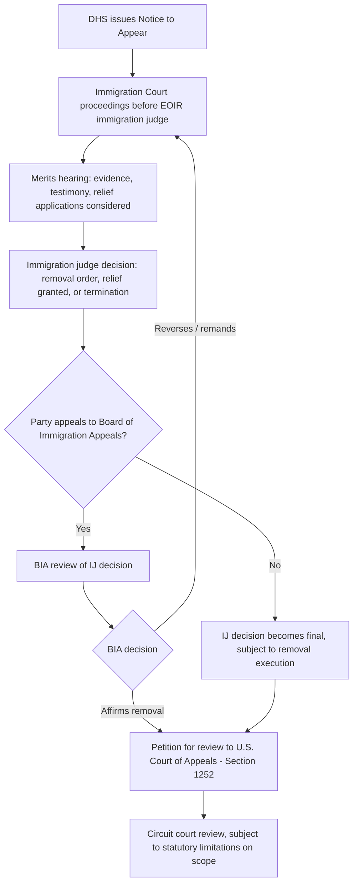

## Mass Adjudication Systems: Social Security Disability and Immigration Proceedings


### Overview

Mass adjudication systems are administrative processes designed to resolve extremely high volumes of individualized claims — often numbering in the hundreds of thousands or millions annually — using standardized procedures, streamlined evidentiary frameworks, and large corps of adjudicators. Social Security disability determinations and immigration removal proceedings represent the two paradigmatic mass adjudication systems in U.S. administrative law, and both illustrate the distinctive doctrinal and institutional challenges that arise when due process principles developed for individualized, low-volume adjudication must be operationalized at industrial scale.

### Structural Characteristics of Mass Adjudication

[Inference] Scholars of administrative law (e.g., work associated with Jerry Mashaw's foundational study of Social Security disability adjudication, *Bureaucratic Justice*) have identified several recurring structural features that distinguish mass adjudication from traditional individualized formal adjudication:

1. **Bureaucratic rationality model** — reliance on standardized criteria, medical-vocational grids, and routinized decision protocols rather than case-by-case discretionary judgment, to promote consistency and manage volume.
2. **Multi-tiered review structures** with informal initial stages funneling into more formal (or formal-like) hearing stages only for a subset of claims.
3. **Heavy reliance on non-Article-III, non-traditional-ALJ adjudicators** in some systems (particularly immigration) to manage caseload, raising distinct independence and due process questions from those applicable to APA-governed ALJs.
4. **Persistent backlog and delay challenges**, given the mismatch between claim volume and adjudicator capacity, which itself becomes a due process concern under the "value of additional safeguards" and timeliness prongs of due process analysis.

### Social Security Disability Adjudication

**Statutory and Regulatory Framework**

- Social Security Disability Insurance (SSDI) and Supplemental Security Income (SSI) disability determinations are governed by Title II and Title XVI of the Social Security Act, respectively, with implementing regulations at 20 C.F.R. Parts 404 and 416.
- Judicial review proceeds under 42 U.S.C. § 405(g), which specifies that the Commissioner's factual findings are conclusive if supported by **substantial evidence** — a standard borrowed from and functionally similar to APA § 706(2)(E) even though SSA hearings are not always analyzed as strictly falling within APA §§ 556–557's formal adjudication category.

**The Five-Step Sequential Evaluation Process**

SSA employs a standardized, sequential analytical framework (20 C.F.R. § 404.1520) to promote decisional consistency across the enormous claim volume:

1. Is the claimant currently engaged in substantial gainful activity? If yes, not disabled.
2. Does the claimant have a severe medically determinable impairment? If no, not disabled.
3. Does the impairment meet or equal a listed impairment (the "Listings")? If yes, disabled.
4. Can the claimant perform past relevant work given their residual functional capacity? If yes, not disabled.
5. Can the claimant perform any other work existing in significant numbers in the national economy, considering age, education, and work experience (often assessed using standardized **medical-vocational guidelines**, sometimes called "the grids")? If no, disabled.

**Multi-Tiered Structure**

1. **Initial determination** — state Disability Determination Services (DDS) agencies, operating under federal-state cooperative agreements, make the initial disability determination on behalf of SSA.
2. **Reconsideration** — a second DDS-level review (though some states participate in pilot programs modifying or eliminating this step).
3. **Hearing before an SSA ALJ** — the claimant's first opportunity for an in-person (or video/telephone) hearing, testimony, and representation.
4. **Appeals Council review** — SSA's internal appellate body, which may grant or deny review of the ALJ's decision.
5. **Judicial review** in federal district court under § 405(g).

**Volume and Backlog Challenges**

[Unverified — verify current SSA operational data] SSA's disability hearing system has experienced substantial backlogs and multi-year wait times at the ALJ hearing stage at various points, with the scale of pending caseloads and average wait times fluctuating based on funding, staffing, and administrative reforms across different periods; current backlog figures should be checked against SSA's most recent published operational statistics rather than assumed from general historical awareness, as this figure changes significantly over time and is politically salient.

**Due Process Analysis Specific to SSA**

*Mathews v. Eldridge* itself arose from the SSA disability context and remains the controlling due process framework: the Court found the existing multi-tiered system (with a post-termination, pre-final-denial hearing opportunity, and the possibility of retroactive benefits) constitutionally adequate for benefit termination cases, distinguishing the subsistence-welfare context of *Goldberg v. Kelly*.

### Diagram: SSA Disability Determination Process

```mermaid
flowchart TD
    A[Claimant files disability application] --> B[State DDS initial determination]
    B --> C{Approved?}
    C -->|Yes| D[Benefits awarded]
    C -->|No| E[Claimant requests reconsideration]
    E --> F[State DDS reconsideration review]
    F --> G{Approved?}
    G -->|Yes| D
    G -->|No| H[Claimant requests hearing]
    H --> I[SSA ALJ hearing: testimony, medical evidence, vocational expert]
    I --> J[Five-step sequential evaluation applied]
    J --> K[ALJ decision]
    K --> L{Claimant seeks Appeals Council review?}
    L -->|Yes, review granted| M[Appeals Council decision]
    L -->|Review denied or not sought| N[ALJ decision becomes final agency action]
    M --> O[Judicial review in federal district court - Section 405(g), substantial evidence standard]
    N --> O
```

### Immigration Removal Proceedings

**Statutory and Institutional Framework**

- Immigration removal proceedings are governed principally by the Immigration and Nationality Act (INA), 8 U.S.C. § 1101 et seq., with removal proceedings specifically under 8 U.S.C. § 1229a.
- Immigration judges (IJs) are **not** APA "administrative law judges" under 5 U.S.C. § 3105/7521 — they are employees of the **Executive Office for Immigration Review (EOIR)**, an agency component within the **Department of Justice**, appointed and supervised through DOJ's own hiring and management structure rather than the OPM competitive ALJ process.
- This distinction is doctrinally significant: immigration judges lack the § 7521 good-cause removal protection and the structural insulation from agency (DOJ/Attorney General) direction that APA ALJs possess, a point of substantial scholarly and practitioner critique regarding immigration judge independence.

**Structural Independence Concerns**

[Inference] Because IJs are DOJ employees subject to standard executive branch supervisory authority rather than § 7521 protections, and because the Attorney General retains authority to refer cases to themselves for decision and to issue precedential decisions binding on IJs (a power without a close analog in most APA-ALJ contexts), immigration adjudication has been the subject of extensive scholarly critique regarding structural independence deficits relative to formal APA adjudication — this is a well-established point of academic and practitioner concern, though characterizations of its practical severity vary and reflect contested normative and empirical assessments rather than uniform consensus.

**Tiered Structure**

1. **Initial charging document** (Notice to Appear) issued by Department of Homeland Security (DHS)
2. **Immigration Court proceedings** before an EOIR immigration judge — includes merits hearings, evidentiary presentation, and decision
3. **Board of Immigration Appeals (BIA)** — EOIR's internal appellate body reviewing IJ decisions
4. **Judicial review** — petition for review directly to the relevant U.S. Court of Appeals (not district court), per 8 U.S.C. § 1252, with significant statutory limitations on the scope of judicial review for certain categories of claims (e.g., discretionary relief denials)

**Volume and Docket Management**

[Unverified — verify current EOIR operational data] The immigration court system has experienced substantial and, at various points, historically unprecedented case backlogs, with pending caseloads and average case-resolution times fluctuating significantly based on funding, judge staffing levels, and shifting enforcement/prosecutorial priorities across administrations; specific current backlog figures should be verified against EOIR's most recent published statistics rather than assumed static, given how rapidly and substantially this metric has moved historically.

**Due Process in Immigration Proceedings**

- Removal proceedings implicate due process because removal constitutes a significant deprivation of liberty interests, even though immigration status itself is not a traditional "property" interest in the *Roth* sense.
- ***Reno v. Flores***, 507 U.S. 292 (1993), and subsequent immigration due process cases establish that noncitizens in removal proceedings are entitled to due process, though the specific contours (right to counsel at government expense generally not required in civil immigration proceedings, unlike criminal proceedings under *Gideon v. Wainwright*) differ significantly from criminal due process protections.
- [Inference] The absence of a general right to government-funded counsel in immigration proceedings (which are classified as civil rather than criminal) is a major structural distinction from criminal adjudication and a significant point of ongoing policy debate, given empirical findings frequently cited in immigration scholarship correlating representation with case outcomes; specific statistical claims about representation effects should be sourced to current empirical studies rather than treated as fixed figures.

### Diagram: Immigration Removal Proceeding Structure



### Comparative Table: SSA Disability vs. Immigration Adjudication

| Dimension | SSA Disability Adjudication | Immigration Removal Proceedings |
| --- | --- | --- |
| Governing statute | Social Security Act, Titles II/XVI; 42 U.S.C. § 405(g) | Immigration and Nationality Act, 8 U.S.C. § 1229a |
| Adjudicator | SSA Administrative Law Judge (APA § 3105 ALJ) | EOIR Immigration Judge (DOJ employee, not APA ALJ) |
| Adjudicator removal protection | § 7521 good-cause/MSPB protection | No comparable statutory protection; DOJ supervisory authority, including Attorney General self-referral power |
| Standardized decision framework | Five-step sequential evaluation; medical-vocational grids | Case-by-case merits analysis under INA relief categories; less standardized quantitative framework |
| Appellate body | SSA Appeals Council | Board of Immigration Appeals (BIA) |
| Judicial review forum | Federal district court | U.S. Court of Appeals (direct petition for review) |
| Judicial review standard | Substantial evidence (42 U.S.C. § 405(g)) | Varies; substantial evidence for factual findings, but significant statutory limitations on reviewability for certain discretionary determinations |
| Right to government-funded counsel | No general right (civil benefits context) | No general right (civil proceeding, despite liberty interest at stake) |
| Nature of interest at stake | Property interest in benefits (*Roth* framework) | Liberty interest (freedom from removal/detention) |

### Common Critiques of Mass Adjudication Systems

1. **Consistency versus individualization tradeoff** — standardized frameworks (SSA's grids, immigration's precedential BIA decisions) promote consistency across high volume but can be criticized for insufficient attention to case-specific nuance.
2. **"Refugee roulette" / outcome variance critique** — empirical studies in both systems have documented significant **outcome variance across individual adjudicators** deciding similar cases, raising equal-protection-adjacent fairness concerns even absent a formal legal violation. [Inference] This adjudicator-variance critique has been particularly prominent in immigration asylum scholarship (sometimes referenced under the informal term "refugee roulette," drawn from empirical studies of cross-judge grant-rate disparities) and in SSA ALJ allowance-rate studies; specific statistical findings should be sourced to the original empirical studies rather than cited from memory, as methodologies and time periods vary across studies.
3. **Backlog as a due process problem** — under the *Mathews* framework, prolonged delay itself can be characterized as increasing the "risk of erroneous deprivation" (e.g., evidence staleness, claimant hardship during pendency), making systemic backlog a live due process and administrative law concern rather than a purely administrative inconvenience.
4. **Adjudicator independence structural critique** — particularly acute for immigration judges given DOJ's dual prosecutorial/adjudicative institutional role (DHS prosecutes, but EOIR/DOJ adjudicates, and the Attorney General sits atop the adjudicative structure), a structural feature critics argue is in tension with the separation-of-functions principle embodied in APA § 554(d) for formal adjudication, even though immigration proceedings are not APA-formal adjudications and thus § 554(d) does not directly apply.

**Key Points**

- Both SSA disability and immigration adjudication systems handle enormous claim volumes through multi-tiered structures combining informal/administrative initial stages with a formal-like hearing stage, but they differ sharply in adjudicator independence structure: SSA ALJs have § 7521 protections; immigration judges do not.
- SSA's five-step sequential evaluation and medical-vocational grids exemplify the "bureaucratic rationality" model of mass adjudication — standardized criteria designed to promote consistency at scale.
- Immigration judges are DOJ employees within EOIR, not APA ALJs under § 3105/7521, a structural distinction with significant implications for adjudicator independence given DOJ's dual enforcement and adjudicative institutional roles.
- Both systems have experienced substantial backlog challenges, which under *Mathews v. Eldridge*'s framework can itself implicate due process concerns through delayed resolution's effect on the risk of erroneous outcomes.
- Neither system provides a general right to government-funded counsel, reflecting the civil (rather than criminal) classification of both benefits determinations and removal proceedings, despite the liberty interest at stake in the immigration context.

**Example**

Consider a claimant denied Social Security disability benefits and a noncitizen in removal proceedings, both experiencing multi-month or multi-year delays awaiting their respective hearings.

- The SSA claimant's case proceeds through DDS initial determination and reconsideration before reaching an ALJ hearing; the ALJ applies the five-step sequential evaluation, potentially consulting a vocational expert on step five regarding availability of work in the national economy given the claimant's residual functional capacity. If denied, the claimant can seek Appeals Council review and then judicial review in federal district court under the substantial evidence standard.
- The noncitizen's case proceeds before an EOIR immigration judge who, as a DOJ employee, adjudicates removability and any applications for relief (e.g., asylum, cancellation of removal) without the same statutory removal protections the SSA ALJ enjoys; if the DOJ's institutional priorities shift, the immigration judge does not have the same insulation from supervisory pressure. If denied, the noncitizen can appeal to the BIA and then petition for review directly to the relevant U.S. Court of Appeals — bypassing district court entirely, unlike the SSA claimant's path.
- Both claimants' delay-related hardships (financial hardship pending SSA benefits; prolonged uncertainty and potential detention pending immigration resolution) illustrate how backlog functions as a substantive due process variable under *Mathews*, not merely an administrative efficiency concern.

**Related Topics**

- Informal adjudication, licensing, and benefits determinations (the broader doctrinal category within which SSA disability adjudication sits)
- Administrative law judges: appointment, tenure, and decisional independence (contrast with EOIR immigration judges' structural position)
- *Mathews v. Eldridge* balancing test: origin in the SSA disability context and application to backlog/delay claims
- Jerry Mashaw's "bureaucratic justice" model and competing models of administrative adjudication (moral judgment model, professional treatment model)
- Board of Immigration Appeals precedential decisionmaking and Attorney General self-referral authority
- Right to counsel in civil proceedings: *Gideon v. Wainwright*'s criminal-context limits and the civil/criminal due process divide
- Adjudicator outcome variance studies: empirical administrative law research on decisional consistency across ALJs/IJs
- Judicial review pathways compared: district court (SSA) versus direct circuit court petition for review (immigration)
- EOIR institutional structure within the Department of Justice and separation-of-functions critiques