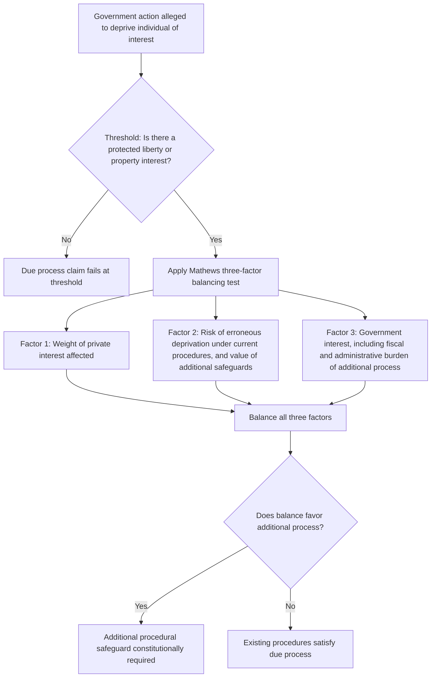

## Constitutional Due Process and the Mathews v. Eldridge Balancing Test

### Overview

The Due Process Clauses of the Fifth Amendment (applicable to the federal government) and Fourteenth Amendment (applicable to the states) prohibit the deprivation of "life, liberty, or property" without "due process of law." In the administrative law context, procedural due process doctrine governs what pre- and post-deprivation procedures the government must afford individuals before or after agency action affecting a protected interest. *Mathews v. Eldridge*, 424 U.S. 319 (1976), supplies the controlling analytical framework — a three-factor balancing test that has become the central methodology for resolving procedural due process claims against administrative agencies across virtually every area of federal and state regulatory practice.

### The Threshold Inquiry: Identifying a Protected Interest

Before the *Mathews* balancing test applies at all, a claimant must establish that government action deprives them of a constitutionally protected **liberty** or **property** interest. This threshold determination is analytically prior to and separate from the balancing test itself.

**Property Interests**

- ***Board of Regents v. Roth***, 408 U.S. 564 (1972): property interests protected by due process are not created by the Constitution itself but arise from "existing rules or understandings that stem from an independent source such as state law" — statutes, regulations, contracts, or mutually explicit understandings that create a legitimate claim of entitlement, as opposed to a mere unilateral expectation or "abstract need or desire."
- ***Perry v. Sindermann***, 408 U.S. 593 (1972): clarified that property interests can arise from implied as well as express rules, including de facto policies and practices creating a mutually understood entitlement.
- Applied to benefits: a statutory entitlement program (e.g., Social Security disability benefits, welfare benefits meeting statutory eligibility criteria) creates a property interest in continued receipt of benefits so long as eligibility criteria are met, per ***Goldberg v. Kelly***, 397 U.S. 254 (1970).
- Applied to licenses/permits: a validly issued license or permit can constitute a property interest, particularly where renewal is expected absent cause, implicating APA § 558(c)'s statutory renewal-pendency protection as a parallel statutory reinforcement of this constitutional principle.

**Liberty Interests**

- Liberty interests encompass a broader traditional category — freedom from bodily restraint, and (per due process doctrine developed largely outside the pure administrative benefits context) certain reputational, associational, and occupational interests, subject to doctrinal limits (e.g., *Paul v. Davis*, 424 U.S. 693 (1976), limiting reputation-alone claims absent a change in legal status — the "stigma-plus" doctrine).
- In immigration proceedings, freedom from removal/detention implicates liberty interests, though the specific due process content afforded differs from purely domestic contexts given the civil (not criminal) classification of removal proceedings.

### The *Mathews v. Eldridge* Framework

**Factual and Procedural Background**

*Mathews* arose when a Social Security disability recipient challenged the constitutionality of SSA's practice of terminating disability benefits based on an informal, paper-review process (without a pre-termination evidentiary hearing), followed by the opportunity for a full evidentiary hearing only after termination, with retroactive benefits available if the claimant ultimately prevailed. The claimant argued *Goldberg v. Kelly*'s pre-termination hearing requirement for welfare benefits should extend to disability benefits.

**The Three-Factor Test**

The Supreme Court held that identifying the specific dictates of due process generally requires consideration of three distinct factors:

1. **The private interest that will be affected by the official action** — the nature and weight of what the individual stands to lose.
2. **The risk of an erroneous deprivation of such interest through the procedures used, and the probable value, if any, of additional or substitute procedural safeguards** — how likely the existing process is to produce mistakes, and how much a proposed additional safeguard (e.g., a pre-deprivation hearing, cross-examination rights) would actually reduce that error risk.
3. **The government's interest, including the function involved and the fiscal and administrative burdens that the additional or substitute procedural requirement would entail** — the cost, in resources and administrative complexity, of providing the additional process sought.

$$Process\ Due = f\big(Private\ Interest,\ \Delta Risk_{error} \times Value_{safeguard},\ Government\ Burden\big)$$

**Application in *Mathews* Itself**

Weighing these factors, the Court held that a pre-termination evidentiary hearing was **not** constitutionally required for disability benefits termination, reasoning:

- The private interest, while significant, was less severe than *Goldberg*'s subsistence-welfare context, because disability benefits are not based on financial need alone, and because retroactive benefits would be available if the claimant prevailed at the post-termination hearing, partially mitigating the harm of erroneous termination.
- The risk of erroneous deprivation from the existing paper-based process was relatively low, because disability determinations rest heavily on objective, documentable medical evidence (unlike welfare eligibility, which the Court characterized in *Goldberg* as often turning on more subjective, credibility-dependent factors better tested through in-person hearing).
- The government's administrative and fiscal burden in providing full pre-termination evidentiary hearings for the large volume of disability determinations would be substantial.

### Diagram: Mathews Balancing Test Analytical Flow

### *Goldberg v. Kelly* as the Pre-*Mathews* High-Water Mark

Understanding *Mathews* requires contrast with *Goldberg*, decided six years earlier:

- *Goldberg* held that welfare recipients are entitled to an **evidentiary hearing before termination** of benefits, including the right to confront and cross-examine adverse witnesses, present evidence orally, and receive a decision based exclusively on the hearing record with a statement of reasons — procedural protections closely resembling formal adjudication.
- *Goldberg*'s reasoning emphasized the severity of terminating subsistence-level benefits for the poorest recipients, for whom any interruption could mean deprivation of the very means of survival while an appeal was pending, and characterized welfare eligibility determinations as often turning on witness credibility and factual disputes well-suited to oral hearing procedures.
- [Inference] *Mathews* is widely understood in administrative law scholarship as having significantly narrowed *Goldberg*'s practical reach by generalizing and formalizing the balancing methodology in a way that, in most subsequent applications, has favored post-deprivation process over pre-deprivation hearings outside the specific subsistence-welfare context *Goldberg* addressed; this is a characterization broadly shared across administrative law commentary, though reasonable disagreement exists about precisely how much doctrinal ground *Mathews* eroded from *Goldberg* versus simply supplying a more explicit methodology for reaching similar results in comparable future cases.

### Subsequent Application and Doctrinal Development

**Pre- vs. Post-Deprivation Process**

The *Mathews* framework has been applied across a wide range of administrative contexts to determine whether pre-deprivation process (a hearing before the government acts) or post-deprivation process (a hearing after the government has already acted, with potential retroactive remedy) satisfies due process:

- ***Cleveland Board of Education v. Loudermill***, 470 U.S. 532 (1985): applying *Mathews* to public employment termination, held that a tenured public employee is entitled to **some form of pretermination hearing**, though it need not be elaborate — notice of the charges, an explanation of the employer's evidence, and an opportunity to respond, with a more complete post-termination hearing available thereafter. This illustrates *Mathews*'s flexibility: the required pre-deprivation process can be minimal ("something less" than a full evidentiary hearing) rather than all-or-nothing.
- ***Mackey v. Montrym***, 443 U.S. 1 (1979): applied *Mathews* to uphold summary suspension of a driver's license without a pre-suspension hearing (for refusal to submit to a breathalyzer test), emphasizing the state's strong interest in swift removal of dangerous drivers and the availability of a prompt post-suspension hearing.

**Application Beyond Individual Benefits**

- The *Mathews* test has been extended well beyond benefits termination to contexts including property seizure and forfeiture, occupational licensing, prisoner disciplinary proceedings (with modifications reflecting the incarceration context, see ***Wolff v. McDonnell***, 418 U.S. 539 (1974)), and government contractor debarment.
- ***Hamdi v. Rumsfeld***, 542 U.S. 507 (2004): notably applied the *Mathews* framework in the national security/enemy combatant detention context, illustrating the test's doctrinal reach even into areas implicating significant government security interests, while still requiring some baseline notice and opportunity to be heard before a neutral decisionmaker.

### Interaction with Statutory and APA Procedural Requirements

The *Mathews* constitutional floor operates independently of, but often in practice alongside, APA statutory procedural requirements:

- Congress or an agency can provide **more** process than *Mathews* constitutionally requires (e.g., full formal adjudication under §§ 556–557 even where a bare due process floor might be satisfied by less).
- Congress or an agency **cannot** provide less process than the constitutional *Mathews* floor requires, regardless of the APA's specific statutory adjudication classification — meaning even purely informal adjudication (with minimal APA statutory procedural content) must still satisfy whatever the *Mathews* balancing test independently demands given the specific interest and context at issue.
- [Inference] This means *Mathews* functions as a constitutional backstop that fills the procedural gap left by informal adjudication's thin statutory framework (see the informal adjudication and licensing/benefits content elsewhere in this syllabus), making it, in practice, the primary source of enforceable procedural content for the large majority of federal agency action that does not trigger APA formal adjudication.

### Comparative Table: *Goldberg* vs. *Mathews* vs. *Loudermill*

| Dimension | *Goldberg v. Kelly* (1970) | *Mathews v. Eldridge* (1976) | *Cleveland Bd. of Educ. v. Loudermill* (1985) |
| --- | --- | --- | --- |
| Context | Welfare benefits termination | Disability benefits termination | Public employee termination |
| Private interest characterization | Severe — subsistence-level survival need | Significant but less severe; retroactive benefits available | Significant property interest in continued employment |
| Pre-deprivation hearing required? | Yes — full evidentiary hearing before termination | No — post-termination hearing sufficient | Yes, but minimal — notice and opportunity to respond, not full hearing |
| Analytical methodology | Fact-specific reasoning, pre-dates formal three-factor test | Establishes the three-factor balancing test | Applies *Mathews* factors, introduces "something less" than full hearing concept |
| Doctrinal significance | High-water mark for pre-deprivation process requirements | Establishes the now-dominant general methodology | Illustrates *Mathews*'s flexibility — minimal pre-deprivation process can suffice |

### Application in Administrative and Environmental Law Contexts

*Mathews* balancing is frequently invoked in environmental and administrative regulatory contexts involving:

- **Permit suspension or revocation** — balancing the permittee's interest in continued operation against the risk of erroneous revocation and the government's interest in prompt environmental protection action, informed also by APA § 558(c)'s statutory notice-and-compliance-opportunity requirement discussed elsewhere in this syllabus.
- **Emergency administrative orders** (e.g., under environmental statutes authorizing summary orders to address imminent hazards) — the government's interest in swift action to prevent harm often weighs heavily in favor of permitting post-deprivation process only, paralleling *Mackey v. Montrym*'s reasoning regarding public safety.
- **Property seizures and forfeitures** in environmental enforcement contexts (e.g., seizure of illegally trafficked wildlife or contaminated goods) — implicating property interest due process analysis under the *Mathews* framework.

[Inference] The specific due process content required in any given environmental enforcement or permitting due process challenge is highly fact-dependent under *Mathews*'s balancing methodology, and specific outcomes should be assessed against the particular statutory scheme, the severity of the interest at stake, and the government's articulated urgency interest, rather than assumed uniformly across environmental enforcement contexts generally.

**Key Points**

- The *Mathews* threshold inquiry (protected liberty or property interest) is analytically distinct from and prior to the three-factor balancing test itself — no protected interest means no due process claim regardless of how the balancing factors would otherwise resolve.
- The three *Mathews* factors — private interest, risk of erroneous deprivation weighed against the value of additional safeguards, and government burden — together determine what specific process (timing, formality, content) is constitutionally required, not merely whether some process is due.
- *Mathews* significantly generalized and, in most subsequent applications, narrowed *Goldberg v. Kelly*'s pre-deprivation hearing requirement, largely confining *Goldberg*'s robust pre-termination protections to its specific subsistence-welfare context.
- *Loudermill* demonstrates the framework's flexibility: due process does not demand an all-or-nothing choice between full hearing and no hearing — "some kind of hearing," even a minimal notice-and-response opportunity, can satisfy the pre-deprivation prong while a fuller hearing follows post-deprivation.
- *Mathews* operates as an independent constitutional floor beneath APA statutory procedures, meaning it supplies the primary source of enforceable procedural content for informal adjudication, where APA statutory requirements are comparatively thin.

**Example**

Suppose a state environmental agency summarily suspends a facility's wastewater discharge permit based on a field inspector's finding of an immediate contamination risk to a public water supply, without a pre-suspension hearing, but provides a hearing opportunity within five business days post-suspension.

1. **Threshold**: the permit constitutes a property interest (a validly issued license under *Roth*'s "existing rules or understandings" framework), so due process analysis applies.
2. **Factor 1 (private interest)**: significant — the facility loses discharge authority and associated revenue/operations during suspension, though this is a business/property interest rather than subsistence-level survival need, situating it closer to *Mathews*/*Loudermill* than to *Goldberg*.
3. **Factor 2 (risk of erroneous deprivation)**: depends on the reliability of the inspector's field finding; if based on documented water quality sampling data (relatively objective), the error risk is lower than if based on a more subjective, disputed assessment — a full pre-suspension evidentiary hearing would add limited value if the underlying data is already robust and available for prompt post-suspension review.
4. **Factor 3 (government interest)**: very strong given the imminent public health risk to a water supply, paralleling *Mackey v. Montrym*'s public safety rationale for permitting summary action.
5. **Balancing conclusion**: given the strong government urgency interest, the relatively lower incremental value of a pre-suspension hearing (assuming reasonably objective triggering data), and the prompt post-suspension hearing opportunity, a court applying *Mathews* would likely find the summary-suspension-then-prompt-hearing procedure constitutionally adequate — though this is an illustrative application, and the actual outcome would depend heavily on the specific factual record regarding the reliability of the initial finding and the promptness/adequacy of the post-suspension hearing actually provided.

**Related Topics**

- Informal adjudication, licensing, and benefits determinations (the doctrinal area where *Mathews* supplies the primary procedural content)
- Mass adjudication systems: Social Security disability and immigration proceedings (*Mathews*'s origin context and continued application)
- *Board of Regents v. Roth* and *Perry v. Sindermann*: property interest threshold doctrine
- *Cleveland Board of Education v. Loudermill* and the "something less than a full hearing" pre-deprivation standard
- Procedural due process in emergency administrative action and summary suspension authority
- *Wolff v. McDonnell* and due process in institutional/custodial contexts as a specialized *Mathews* application
- Formal adjudication under Sections 554, 556, and 557 as the statutory ceiling above the constitutional *Mathews* floor
- Section 558(c) license revocation protections as a statutory parallel to constitutional due process principles
- Comparative due process analysis in property seizure, forfeiture, and emergency order contexts in environmental enforcement