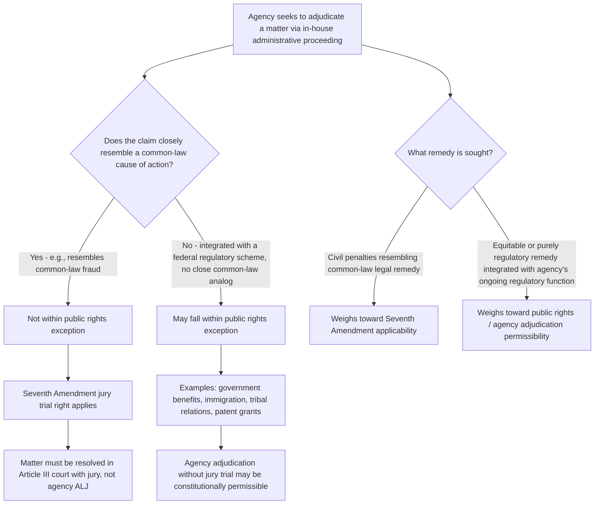

## SEC v. Jarkesy and Article III Limits on Agency Adjudication

### Overview

*SEC v. Jarkesy*, 603 U.S. 109 (2024), is a landmark Supreme Court decision holding that the Securities and Exchange Commission's use of in-house administrative adjudication (before an SEC ALJ) to impose civil penalties for securities fraud violates the defendant's Seventh Amendment right to a jury trial. Although decided primarily on Seventh Amendment grounds rather than Article III grounds directly, the decision is closely bound up with — and has substantial implications for — the broader constitutional doctrine governing when Congress may assign adjudication of a matter to a non-Article-III agency tribunal rather than requiring adjudication in an Article III court, making it a pivotal case for understanding the outer constitutional limits of agency adjudicative authority.

### Factual and Procedural Background

[Unverified — verify specific facts against the opinion] George Jarkesy was charged by the SEC with securities fraud in connection with two hedge funds he managed; the SEC pursued the matter through its own in-house administrative enforcement proceeding (rather than filing suit in federal district court), resulting in an ALJ-adjudicated finding of liability and imposition of civil penalties, which the SEC's full Commission then affirmed on internal review. Jarkesy challenged the constitutionality of this administrative adjudication process, and the Fifth Circuit ruled in his favor on multiple independent constitutional grounds before the Supreme Court granted certiorari.

### The Seventh Amendment Holding

**Core Holding**

The Supreme Court held that when the SEC seeks civil penalties against a defendant for securities fraud, the defendant is entitled to a jury trial under the Seventh Amendment, because the SEC's antifraud provisions replicate common-law fraud, and thus the matter is appropriately characterized as involving a "suit at common law" within the meaning of the Seventh Amendment.

**The "Public Rights" Exception and Its Limits**

The central doctrinal battleground in *Jarkesy* was the scope of the **"public rights" doctrine** — a body of precedent holding that certain matters, because they involve rights created by the government itself (as opposed to private common-law rights), may be assigned to non-Article-III adjudication (including agency adjudication without a jury) without violating Article III or the Seventh Amendment.

- The Court reasoned that whether a matter falls within the public rights exception depends on the **substance of the claim**, not merely its formal statutory label. Because SEC antifraud claims closely resemble common-law fraud actions in the elements required and the remedy sought (civil penalties, which the Court characterized as a type of remedy historically associated with common-law courts rather than equitable or administrative remedies), the claim was not transformed into a "public right" simply because Congress assigned its enforcement to an agency and styled the cause of action as a statutory violation.
- The Court distinguished this from matters more clearly within the traditional public rights category — such as government benefit programs, immigration, relations with Indian tribes, and the granting of public benefits like patents — where the right being adjudicated is closely integrated with a federal regulatory scheme and does not closely parallel a preexisting common-law cause of action.
- ***Granfinanciera, S.A. v. Nordberg***, 492 U.S. 33 (1989) (a bankruptcy fraudulent conveyance case establishing that the Seventh Amendment right to a jury trial can attach even in a statutory cause of action if it is legal in nature and enforces private rights), and ***Atlas Roofing Co. v. Occupational Safety and Health Review Commission***, 430 U.S. 442 (1977) (upholding OSHA's administrative civil penalty scheme against a Seventh Amendment challenge, on the theory that OSHA safety violations were a new statutory public right without a close common-law analog), are the key precedential poles the Court navigated — *Jarkesy* effectively narrowed *Atlas Roofing*'s practical reach by emphasizing that the "close relationship to common law" inquiry, not simply the "new statutory scheme" characterization, is what determines Seventh Amendment applicability.

### Diagram: Jarkesy's Public Rights Analysis

### Relationship to Article III (Not Directly Reached, But Doctrinally Adjacent)

The Fifth Circuit's decision below had rested on **three independent constitutional grounds**: (1) the Seventh Amendment jury-trial violation; (2) a nondelegation doctrine violation (Congress's grant of authority to the SEC to choose between administrative and judicial forums lacked an intelligible principle); and (3) the ALJ removal-protection structure's incompatibility with Article II (a *Free Enterprise Fund*-style unconstitutional removal-insulation argument).

- The Supreme Court's majority opinion resolved the case **solely on Seventh Amendment grounds**, expressly declining to reach the nondelegation and Article II removal issues.
- [Inference] Because the Court did not reach the Article II/removal question, the broader constitutional status of ALJ removal protections generally (including the § 7521 structure discussed in ALJ appointment and tenure doctrine) remains formally unresolved by *Jarkesy* itself, even though the case is frequently discussed alongside that issue given the overlapping facts and the Fifth Circuit's parallel reasoning; this distinction — what *Jarkesy* actually held versus what adjacent issues it left open — is important for accurately characterizing the decision's precedential scope.
- The Article III implications of *Jarkesy* are best understood as **indirect but significant**: by narrowing the public rights exception's practical scope (tying it closely to whether a claim resembles a common-law action), the decision constrains not only Seventh Amendment analysis but also the closely related body of doctrine governing when Congress may assign adjudication to a non-Article-III tribunal at all, since the public rights doctrine originated in, and remains partly analyzed through, the Article III context (see ***Stern v. Marshall***, 564 U.S. 462 (2011), a bankruptcy-court Article III case applying closely related public-rights reasoning).

### *Stern v. Marshall* and the Broader Public Rights Lineage

- ***Stern v. Marshall***, 564 U.S. 462 (2011): held that a bankruptcy court (a non-Article-III tribunal) lacked constitutional authority to enter final judgment on a state-law counterclaim (tortious interference) that was not necessarily resolved in ruling on a creditor's proof of claim, because the counterclaim was the type of matter Article III reserves for courts whose judges have life tenure and salary protection.
- *Stern* and *Jarkesy* share a common analytical thread: both scrutinize whether a claim's substance — its resemblance to a traditional common-law or private-rights cause of action — places it outside the scope of matters Congress may permissibly assign to non-Article-III adjudicators, regardless of the specific constitutional provision (Article III structural limits in *Stern*; the Seventh Amendment in *Jarkesy*) formally at issue.
- [Inference] Read together, *Stern* and *Jarkesy* are often characterized in post-2024 administrative law commentary as reflecting a broader jurisprudential trend toward more searching judicial scrutiny of agency and non-Article-III adjudicative authority generally, narrowing the practical scope of the public rights doctrine that had, for decades following cases like *Atlas Roofing* and ***Crowell v. Benson***, 285 U.S. 22 (1932), afforded Congress relatively substantial latitude to assign adjudicative functions to agencies and other non-Article-III bodies; the full doctrinal and practical extent of this trend, however, continues to develop through subsequent lower-court application and should be tracked through current case law rather than treated as fully settled.

### Immediate Practical Impact on SEC Enforcement

- Following *Jarkesy*, the SEC's ability to pursue civil penalties for securities fraud through its own in-house ALJ adjudication process (as opposed to filing suit in federal district court) is constitutionally constrained for claims resembling common-law fraud.
- [Unverified — verify current SEC practice] The SEC's post-*Jarkesy* enforcement posture, including the extent to which it has shifted fraud-based civil penalty actions to federal district court filings rather than in-house administrative proceedings, reflects an evolving operational response that should be verified against current SEC enforcement statistics and public guidance rather than assumed from the decision's holding alone, since institutional practice adjustments following major precedent typically continue to develop for a period after the decision.

### Broader Implications for Other Agencies' Administrative Enforcement

**Which Agencies Are Potentially Affected**

Any federal agency that uses in-house administrative adjudication to impose penalties for conduct closely resembling a common-law cause of action (fraud, misrepresentation, breach of duty, and similar traditional legal wrongs) faces potential *Jarkesy*-based challenges, distinguishing such claims from more clearly "public rights" regulatory violations that lack a close common-law analog.

**Distinguishing Public Rights Claims Likely to Survive *Jarkesy***

- Violations of purely regulatory, technical compliance requirements created entirely by a federal statutory/regulatory scheme with no close common-law analog (e.g., certain licensing, reporting, or technical standard violations) are more likely to remain within the permissible public rights category.
- ***Atlas Roofing***'s specific holding regarding OSHA administrative penalties remains formally on the books, though *Jarkesy*'s reasoning arguably narrows the conceptual space in which *Atlas Roofing*-type reasoning (new statutory public right, no close common-law analog) can be invoked going forward, particularly for agency enforcement actions that functionally resemble traditional tort, fraud, or contract-type claims even when framed in modern regulatory-statutory terms.

**Environmental Enforcement Implications**

[Inference] For environmental law specifically, agencies such as EPA that pursue administrative civil penalties through ALJ adjudication for violations of environmental statutes (e.g., Clean Air Act, Clean Water Act, RCRA administrative penalty proceedings) face a live, currently unsettled question post-*Jarkesy*: to the extent a particular environmental violation and penalty claim can be characterized as closely resembling a common-law cause of action (for instance, claims sounding in something analogous to nuisance, trespass, or fraud in specific circumstances) rather than a purely regulatory/technical violation integrated with the agency's ongoing regulatory scheme, a *Jarkesy*-style Seventh Amendment challenge could potentially be raised; how courts will resolve this characterization question for various environmental enforcement contexts is an actively developing area that should be tracked through post-*Jarkesy* circuit court treatment rather than treated as resolved for any specific environmental statute or penalty scheme.

### Comparative Table: Matters Likely Within vs. Outside the Post-*Jarkesy* Public Rights Exception

| Category | Likely Within Public Rights (Agency Adjudication Permissible) | Likely Outside Public Rights (Article III / Jury Trial Required) |
| --- | --- | --- |
| Nature of claim | Purely statutory/regulatory violation, no close common-law analog | Claim closely resembles common-law fraud, tort, or similar legal action |
| Illustrative examples | Government benefits eligibility; immigration status determinations; patent/trademark grant disputes; tribal relations matters | Securities fraud civil penalties (*Jarkesy* itself); other agency penalty schemes closely tracking common-law fraud/misrepresentation elements |
| Remedy sought | Often equitable, injunctive, or benefit-conferral/denial in nature | Civil penalties or damages-like legal remedies historically associated with common-law courts |
| Integration with ongoing regulatory scheme | Closely integrated; right exists only because of and within the federal regulatory scheme | Right/wrong exists independent of the specific regulatory scheme; scheme merely provides an enforcement mechanism for a pre-existing type of legal wrong |
| Pre-*Jarkesy* precedent | *Crowell v. Benson*; benefits/immigration/patent lineage | *Granfinanciera*; *Stern v. Marshall* (Article III bankruptcy context) |

### Comparative Table: *Jarkesy* vs. *Atlas Roofing* vs. *Stern v. Marshall*

| Dimension | *Atlas Roofing* (1977) | *Stern v. Marshall* (2011) | *SEC v. Jarkesy* (2024) |
| --- | --- | --- | --- |
| Constitutional provision | Seventh Amendment | Article III | Seventh Amendment |
| Tribunal at issue | OSHRC (administrative) | Bankruptcy court (non-Article-III) | SEC ALJ (administrative) |
| Claim type | OSHA safety violation penalties | State-law tortious interference counterclaim | Securities fraud civil penalties |
| Outcome | Agency adjudication upheld — new statutory public right | Bankruptcy court lacked authority — resembled traditional common-law claim | Agency adjudication struck down — resembled common-law fraud |
| Doctrinal trajectory | Represents high point of public-rights deference to Congress | Begins narrowing trend, Article III context | Extends narrowing trend explicitly to Seventh Amendment, agency-adjudication context |

**Key Points**

- *Jarkesy*'s core holding is narrower than sometimes characterized: it holds that SEC securities fraud civil penalty claims trigger the Seventh Amendment jury-trial right because they closely resemble common-law fraud, not that all agency administrative adjudication is unconstitutional.
- The decision resolved the case solely on Seventh Amendment grounds, expressly declining to reach the nondelegation and Article II removal-power arguments the Fifth Circuit had also relied upon — the broader constitutional status of ALJ removal protections remains formally unaddressed by *Jarkesy* itself.
- The "public rights" doctrine's scope now turns centrally on whether a claim's substance resembles a traditional common-law cause of action, not merely on whether Congress labeled the claim as a new statutory violation or assigned it to agency enforcement — a substance-over-form approach that narrows *Atlas Roofing*'s practical reach without formally overruling it.
- *Jarkesy* and *Stern v. Marshall* reflect a shared analytical lineage scrutinizing non-Article-III adjudication, though they arise under different constitutional provisions (Seventh Amendment versus Article III structural limits) and different tribunal types (agency ALJ versus bankruptcy court).
- The decision's implications for agencies beyond the SEC — including environmental enforcement agencies using administrative penalty proceedings — remain an actively developing area, turning on fact-specific characterization of whether a given enforcement claim resembles a common-law cause of action or a purely regulatory public-rights matter.

**Example**

Consider two hypothetical EPA enforcement actions post-*Jarkesy*:

1. **Technical permit violation**: EPA pursues an administrative civil penalty against a facility for failing to submit required monitoring reports under a Clean Air Act operating permit — a purely regulatory, recordkeeping-type violation with no close common-law analog, existing only because of the specific federal permitting scheme. This claim likely remains within the public rights exception and can continue to be adjudicated through EPA's in-house ALJ process without triggering a Seventh Amendment jury-trial requirement.
2. **Fraudulent emissions reporting**: EPA pursues an administrative civil penalty against a facility for knowingly submitting falsified emissions data to conceal violations — a claim that arguably closely resembles common-law fraud (knowing misrepresentation intended to deceive the regulator, causing regulatory reliance on false information). Under *Jarkesy*'s reasoning, a defendant facing such a claim could plausibly argue this resembles a common-law fraud action closely enough to trigger the Seventh Amendment, requiring EPA to pursue the civil penalty in federal district court with a jury trial available, rather than through in-house ALJ adjudication — though the precise outcome of such a characterization argument for this specific type of environmental claim remains unresolved and would depend on how courts apply *Jarkesy*'s reasoning to the particular statutory and factual context.

**Related Topics**

- Administrative law judges: appointment, tenure, and decisional independence (the Article II removal question *Jarkesy* left unresolved)
- Formal adjudication under Sections 554, 556, and 557 (the procedural framework within which agency ALJ adjudication, now constitutionally constrained by *Jarkesy*, operates)
- *Stern v. Marshall* and Article III limits on non-Article-III tribunal authority in the bankruptcy context
- *Granfinanciera v. Nordberg* and the Seventh Amendment's application to statutory causes of action enforcing private rights
- *Atlas Roofing Co. v. OSHRC* and the pre-*Jarkesy* public rights deference framework
- Nondelegation doctrine revival and its relationship to agency adjudicative forum-selection authority
- *Free Enterprise Fund v. PCAOB* and multi-layer removal protection challenges, adjacent to but distinct from *Jarkesy*'s holding
- Post-*Jarkesy* circuit court application to non-securities regulatory enforcement contexts, including environmental, tax, and financial regulatory penalty schemes
- SEC enforcement practice shifts and forum-selection strategy following *Jarkesy*