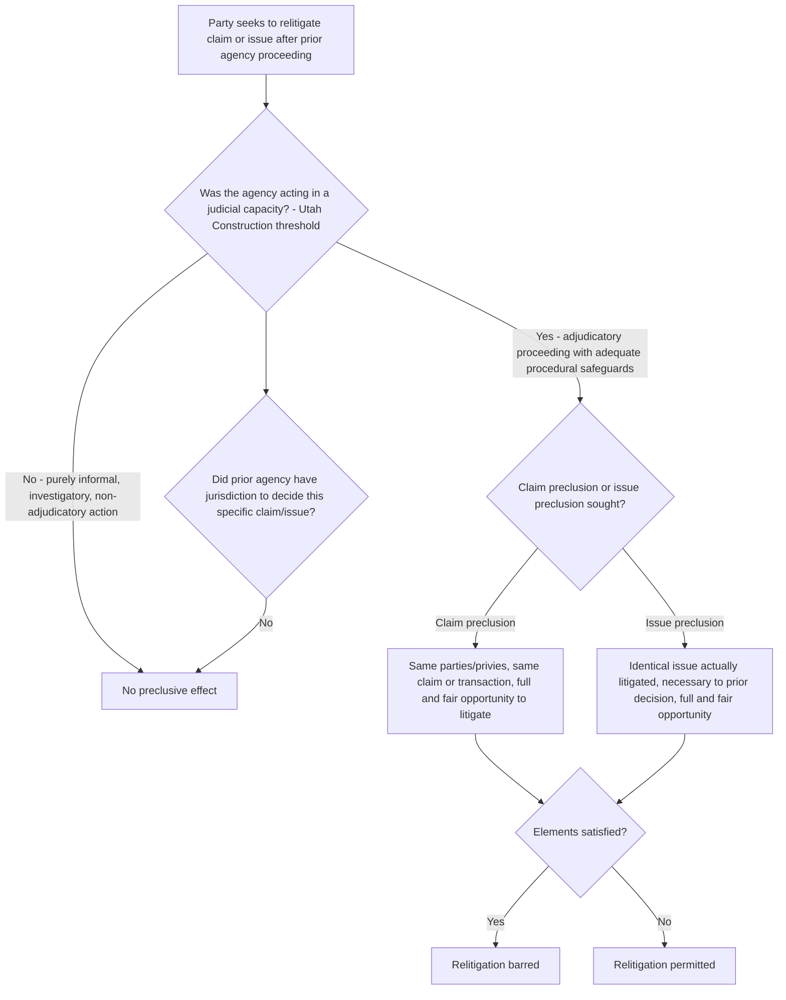

## Administrative Res Judicata and Collateral Estoppel

### Overview

Administrative res judicata (claim preclusion) and collateral estoppel (issue preclusion) are doctrines that limit relitigation of matters previously decided in an agency adjudicative proceeding — either in a subsequent proceeding before the same agency, a different agency, or a court. Though rooted in judicial preclusion doctrine, the application of these principles to administrative agency decisions is a distinct and more qualified body of law, reflecting both the practical value of finality in agency decisionmaking and important limits on that finality given the diversity, informality, and varying procedural rigor of administrative adjudication.

### Foundational Doctrine: *United States v. Utah Construction & Mining Co.*

The foundational case establishing that administrative agency adjudications can have preclusive effect is ***United States v. Utah Construction & Mining Co.***, 384 U.S. 394 (1966):

> When an administrative agency is acting in a judicial capacity and resolves disputed issues of fact properly before it which the parties have had an adequate opportunity to litigate, the courts have not hesitated to apply res judicata to enforce repose.

This formulation establishes the core doctrinal predicate: preclusion applies to agency decisions only when the agency was **acting in a judicial capacity** (i.e., conducting an adjudicatory proceeding with adequate procedural safeguards), not to purely informal, investigatory, or non-adjudicatory agency actions.

### Claim Preclusion (Res Judicata) in the Administrative Context

**Core Elements (General Framework, Adapted from Judicial Doctrine)**

1. A final decision on the merits by a tribunal (agency) acting in a judicial capacity
2. Identity of parties (or privies) between the prior and subsequent proceeding
3. Identity of the claim or cause of action (same transaction or occurrence, under most modern "transactional" approaches to claim preclusion)
4. Full and fair opportunity to litigate the claim in the prior proceeding

**Application to Agency Decisions**

- Claim preclusion bars a party from relitigating, in a subsequent proceeding (whether before the same agency, a different agency, or a court), a claim that was or could have been raised and resolved in a prior agency adjudication meeting the *Utah Construction* judicial-capacity threshold.
- [Inference] Because agencies often have specialized, narrower jurisdictional mandates than courts, the "could have been raised" prong of claim preclusion is applied somewhat more cautiously in the administrative context — a party generally cannot be barred from raising a claim in a subsequent proceeding if the prior agency lacked jurisdiction or authority to adjudicate that claim in the first proceeding, distinguishing administrative claim preclusion from the broader transactional scope sometimes applied between courts of general jurisdiction.

### Issue Preclusion (Collateral Estoppel) in the Administrative Context

**Core Elements**

1. The issue sought to be precluded is identical to an issue actually litigated and determined in the prior proceeding
2. The issue was actually litigated (not merely raised but not resolved)
3. Determination of the issue was necessary and essential to the prior judgment
4. The party against whom preclusion is asserted had a full and fair opportunity to litigate the issue in the prior proceeding
5. (In some formulations) mutuality of parties, though modern doctrine — both judicial and administrative — has substantially relaxed the mutuality requirement, permitting **nonmutual issue preclusion** in many contexts, per ***Parklane Hosiery Co. v. Shore***, 439 U.S. 322 (1979) (judicial context, extending nonmutual offensive collateral estoppel).

**Distinctive Administrative Considerations**

- **"Acting in a judicial capacity" threshold**: as with claim preclusion, issue preclusion applies only where the prior agency proceeding involved adequate adjudicatory procedures — formal adjudication under §§ 556–557 is the paradigmatic case satisfying this threshold, but adequately structured informal adjudication with sufficient procedural safeguards (notice, opportunity to present evidence, a reasoned decision) can also qualify.
- **Adequacy of procedural opportunity**: courts scrutinize whether the prior agency proceeding afforded procedural protections roughly comparable to judicial litigation — the absence of cross-examination rights, formal discovery, or a full evidentiary hearing in an informal agency proceeding can defeat preclusive effect even if the agency purported to resolve the issue.

### Diagram: Administrative Preclusion Analysis Framework

### Preclusive Effect of Agency Decisions in Subsequent Court Proceedings

Agency adjudications satisfying the *Utah Construction* threshold can have preclusive effect not only in subsequent agency proceedings but also in subsequent judicial litigation:

- ***Astoria Federal Savings & Loan Ass'n v. Solimino***, 501 U.S. 104 (1991): addressed whether an unreviewed state administrative agency's finding could preclude a subsequent federal Age Discrimination in Employment Act (ADEA) claim in federal court; the Court held that ordinary preclusion principles apply unless a statute evinces a contrary congressional intent — but found that the ADEA's specific statutory structure (requiring claimants to first resort to state administrative remedies before filing suit) indicated Congress did not intend that resort to be preclusive of the subsequent federal claim, illustrating that statutory context can override the general presumption of administrative preclusion.
- This case demonstrates a recurring analytical move: courts first ask whether general preclusion principles would apply under *Utah Construction*, then examine whether the specific governing statute's structure and purpose indicate Congress intended a contrary result (i.e., intended the administrative proceeding to be a non-preclusive prerequisite rather than a preclusive final determination).

### Preclusion Between Different Agencies

- Courts have applied preclusion doctrine to bar relitigation of issues decided by one agency in a subsequent proceeding before a **different** agency, provided the *Utah Construction* judicial-capacity threshold and standard preclusion elements are satisfied, and provided no statutory indication suggests Congress intended each agency's proceeding to be independent of the other's findings.
- [Inference] Interagency preclusion questions are particularly fact-sensitive because different agencies often operate under materially different procedural rules, evidentiary standards, and statutory mandates, making the "identity of issue" and "adequate opportunity to litigate" prongs more contestable than in same-agency or agency-to-court preclusion contexts; specific interagency preclusion outcomes should be evaluated against the particular statutory schemes and procedural postures involved rather than assumed uniformly.

### Exceptions and Limits on Administrative Preclusion

**Policy-Based and Jurisdictional Limits**

1. **Agency lacked jurisdiction or authority** over the claim/issue in the prior proceeding — preclusion cannot extend an agency's actual decisional authority beyond what it possessed.
2. **Change in controlling legal standard** — a subsequent change in the governing legal framework (e.g., a new statute, regulation, or controlling judicial precedent) can defeat issue preclusion where applying the prior determination under the old standard would be inequitable or legally inappropriate, particularly relevant in areas of evolving regulatory standards.
3. **Different burden of proof or procedural adequacy** — if the prior proceeding applied a materially different (typically lower) burden of proof or afforded significantly less procedural protection than would be constitutionally or statutorily required in the subsequent proceeding, preclusion may be denied on adequacy-of-opportunity grounds.
4. **Public interest and non-acquiescence considerations**: some agencies have historically taken the position that they need not be bound by adverse circuit court rulings outside the specific case decided (a policy of "non-acquiescence" in circuits where the agency disagrees with governing precedent), a related but analytically distinct doctrine from party-specific preclusion, concerning instead an agency's institutional relationship to binding precedent across different circuits. [Inference] Non-acquiescence policies have historically been most prominently associated with Social Security Administration practice regarding certain circuit court rulings on disability standards, and the scope and current status of such policies is agency- and issue-specific, warranting verification against current agency practice rather than being treated as a fixed, universal administrative law rule.

**Informal Adjudication and Preclusion**

- Because informal adjudication often lacks the procedural rigor (cross-examination, formal evidentiary record, structured burden of proof) associated with formal adjudication, courts more readily deny preclusive effect to informal agency determinations, particularly where the subsequent proceeding involves higher procedural stakes or a different, more rigorous standard.
- [Inference] This creates a practical asymmetry: agencies that rely heavily on informal adjudication (the majority of agency individualized decisionmaking, as discussed in relation to licensing and benefits determinations) may find their determinations afforded less preclusive weight in subsequent proceedings than agencies whose relevant decisions were reached through full formal adjudication, an outcome-relevant distinction that litigants and agencies alike should factor into procedural strategy.

### Comparative Table: Claim Preclusion vs. Issue Preclusion in the Administrative Context

| Dimension | Claim Preclusion (Res Judicata) | Issue Preclusion (Collateral Estoppel) |
| --- | --- | --- |
| What is barred | Relitigating the entire claim or cause of action | Relitigating a specific issue actually decided |
| Scope | Bars claims that were raised **or could have been raised** (subject to agency jurisdictional limits) | Bars only issues **actually litigated and necessarily decided** |
| Identity requirement | Same claim/transaction, same parties or privies | Same specific issue; mutuality relaxed in many modern applications |
| Typical administrative context | Same claimant seeking same type of relief from same agency in a later proceeding | A specific factual or legal finding (e.g., a factual determination) reused in a different but related proceeding |
| Key threshold case | *United States v. Utah Construction & Mining Co.* | *United States v. Utah Construction & Mining Co.*; *Parklane Hosiery* (nonmutual issue preclusion, judicial context) |

### Application in Environmental and Administrative Enforcement Contexts

- **Permit proceedings and enforcement**: a factual finding made in a formal permit revocation adjudication (e.g., that a facility exceeded a specific emissions threshold on a given date) could potentially preclude relitigation of that specific factual issue in a subsequent, related civil penalty enforcement proceeding against the same facility, provided the permit revocation proceeding satisfied the *Utah Construction* judicial-capacity threshold.
- **Multi-agency environmental regulation**: where both federal and state agencies have overlapping regulatory authority over the same activity (common in cooperative federalism environmental programs), findings in one agency's proceeding may or may not preclude relitigation before the other agency, depending on the specific statutory delegation structure and whether Congress or the relevant interagency agreement indicates an intent for independent review.
- [Inference] Environmental law's frequent reliance on cooperative federalism structures (state-delegated implementation of federal environmental programs) makes interagency and agency-to-court preclusion questions particularly recurrent and consequential in this field, though specific preclusion outcomes remain highly dependent on the particular statutory scheme, the procedural character of the prior proceeding, and the specific issue or claim at stake, requiring case-specific analysis rather than reliance on a general rule.

**Key Points**

- *United States v. Utah Construction & Mining Co.* establishes the foundational threshold: administrative preclusion applies only when the agency was acting in a **judicial capacity** with adequate adjudicatory procedures — purely informal, investigatory, or non-adjudicatory agency action does not carry preclusive weight.
- Claim preclusion bars relitigation of an entire claim (including matters that could have been but were not raised, subject to jurisdictional limits), while issue preclusion bars only specific issues actually litigated and necessarily decided — a narrower but often more practically significant doctrine in the administrative context given agencies' typically narrower jurisdictional scope.
- *Astoria Federal Savings & Loan v. Solimino* demonstrates that the general presumption favoring administrative preclusion can be overridden by specific statutory context indicating Congress intended a prior administrative proceeding to be non-preclusive (there, a mandatory state administrative exhaustion requirement under the ADEA).
- Informal adjudication, given its comparatively thin procedural protections, is more readily denied preclusive effect than formal adjudication, creating a practical strategic distinction litigants should account for depending on which procedural track resolved the prior matter.
- Preclusion doctrine operates alongside, but is analytically distinct from, agency non-acquiescence policies, which concern an agency's institutional relationship to adverse circuit precedent rather than preclusion as between specific parties and specific prior proceedings.

**Example**

Suppose a facility's discharge permit is formally revoked by a state environmental agency following a formal adjudicatory hearing (satisfying *Utah Construction*'s judicial-capacity threshold) that specifically finds the facility discharged a pollutant above the permitted threshold on three specific dates.

1. If the state agency subsequently pursues a separate civil penalty action against the same facility for the same three discharge events, the facility would likely be barred by **issue preclusion** from relitigating whether the discharges exceeded the permitted threshold on those specific dates, since that issue was actually litigated, necessarily decided, and the facility had a full and fair opportunity to contest it in the revocation proceeding.
2. If the federal EPA subsequently seeks to bring its own separate enforcement action for the same discharges under a federal statute administered cooperatively with the state, whether the state agency's factual findings preclude relitigation before EPA depends on the specific cooperative federalism statutory structure — if the federal statute's delegation framework indicates federal enforcement authority is intended to operate independently of, and not be bound by, state administrative findings, preclusion may not apply, paralleling *Astoria*'s statutory-context override analysis.
3. If the facility argues that a wholly separate, unrelated permit condition (never raised or addressed in the revocation hearing) should have been challenged in that same proceeding and is now barred, this would raise a **claim preclusion** question — whether that unrelated condition was part of the same "claim" or transaction as the revocation proceeding, and whether the state agency had jurisdiction to have addressed it, would determine whether claim preclusion bars its later assertion.

**Related Topics**

- Formal adjudication under Sections 554, 556, and 557 (the paradigmatic "judicial capacity" proceeding satisfying *Utah Construction*'s threshold)
- Informal adjudication, licensing, and benefits determinations (context for the reduced preclusive weight often given to informal agency determinations)
- *Astoria Federal Savings & Loan Ass'n v. Solimino* and statutory override of the general administrative preclusion presumption
- Cooperative federalism structures in environmental law and interagency preclusion questions
- Nonmutual issue preclusion and *Parklane Hosiery Co. v. Shore* in the broader judicial preclusion context
- Agency non-acquiescence policy and its relationship to (but distinction from) party-specific preclusion doctrine
- Judicial review of agency factual findings under the substantial evidence standard, as it interacts with the preclusive weight later given to those same findings
- Exhaustion of administrative remedies doctrine as a related but distinct threshold requirement preceding preclusion analysis