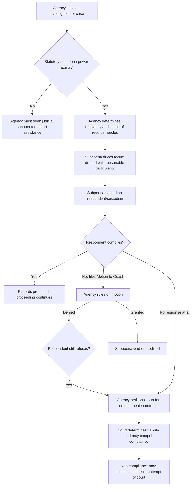

## Administrative Subpoenas and Compelled Production of Records

### Overview and Legal Basis

An administrative subpoena is a compulsory process issued by an administrative agency, in the exercise of its investigatory or quasi-judicial power, directing a person to appear and testify (*subpoena ad testificandum*) or to produce documents, records, or other tangible things (*subpoena duces tecum*). Unlike judicial subpoenas, administrative subpoenas are typically issued directly by the agency or its authorized officers without prior court approval, deriving their force from the agency's enabling statute rather than from the Rules of Court.

The power to issue subpoenas is not inherent in administrative agencies. It must be expressly granted by statute, since it is an exercise of compulsory process that intrudes upon private rights. This is a recurring theme in Philippine administrative law: agencies are creatures of statute, and their coercive powers exist only insofar as the legislature has conferred them.

**Key Points**

- Administrative subpoena power is delegated, not inherent — it must trace to an enabling law.
- It arises in the exercise of an agency's investigatory, visitorial, or quasi-judicial functions.
- Non-compliance does not automatically constitute contempt; most agencies must seek judicial enforcement unless the enabling statute grants direct contempt power.
- The exercise of subpoena power is subject to constitutional limitations, chiefly the right against unreasonable searches and seizures and the right against self-incrimination.

### Statutory Sources of Subpoena Power

Philippine administrative agencies typically derive subpoena power from one of the following:

1. **The Revised Administrative Code of 1987** (Executive Order No. 292) — Book VII, Chapter 3, grants agencies conducting adjudication the power to issue subpoenas as an incident of their quasi-judicial authority, subject to the Rules of Court on the matter to the extent practicable.
2. **Specific charter or enabling statutes** — e.g., the Securities Regulation Code (R.A. No. 8799) empowers the Securities and Exchange Commission (SEC) to issue subpoenas in aid of its investigative functions; the Anti-Money Laundering Act (R.A. No. 9160, as amended) grants the Anti-Money Laundering Council (AMLC) authority to issue subpoenas; the National Labor Relations Commission (NLRC) and Department of Labor and Employment (DOLE) have subpoena powers under the Labor Code.
3. **Ombudsman Act (R.A. No. 6770)** — grants the Office of the Ombudsman broad power to require the production of documents and to punish contumacious refusal as indirect contempt, subject to court enforcement.
4. **Environmental statutes** — the Department of Environment and Natural Resources (DENR), Environmental Management Bureau (EMB), and Pollution Adjudication Board (PAB) derive investigatory and compulsory-process powers from Presidential Decree No. 1586 (Environmental Impact Statement System), the Philippine Clean Air Act (R.A. No. 8749), the Philippine Clean Water Act (R.A. No. 9275), and related implementing rules, permitting them to require submission of records, monitoring data, and compliance reports, and to conduct inspections as part of enforcement of environmental compliance certificates (ECCs) and discharge permits.

**Example**

The Pollution Adjudication Board, in adjudicating a complaint against a manufacturing facility for exceeding effluent standards, may issue a subpoena duces tecum requiring the facility to produce its self-monitoring reports (SMRs), wastewater treatment logs, and chemical inventory records for the relevant period. Refusal to comply may result in the Board treating the refusal as evidence adverse to the respondent, or seeking judicial assistance to compel production, depending on the enabling framework.

### Nature and Classification

Administrative subpoenas may be classified as follows:

| Type | Description | Legal Basis |
| --- | --- | --- |
| Subpoena ad testificandum | Compels a witness to appear and testify | General grant under enabling statute or E.O. 292 |
| Subpoena duces tecum | Compels production of documents, books, records | Same, often paired with visitorial powers |
| Investigative subpoena | Issued during a fact-finding or preliminary investigation stage, prior to any formal charge | Common in SEC, AMLC, competition law (PCC) contexts |
| Adjudicatory subpoena | Issued in the course of a formal administrative case or hearing | Governed by agency's rules of procedure, analogous to Rules of Court |

### Requisites for Validity

For an administrative subpoena to be validly issued and enforceable, jurisprudence and administrative law principles generally require:

1. **Statutory authority** — the issuing officer or body must have express or clearly implied power to subpoena.
2. **Relevancy** — the documents or testimony sought must be relevant to a matter within the agency's jurisdiction, i.e., connected to a pending investigation, inquiry, or case.
3. **Reasonable particularity** — the subpoena duces tecum must describe the documents sought with reasonable specificity; a subpoena that is a "fishing expedition" or unduly broad may be quashed as oppressive.
4. **Non-oppressiveness** — compliance must not be unreasonably burdensome, considering the volume of records, time to produce, and cost.
5. **Compliance with due process** — the subpoena must be properly served, allow a reasonable period to comply, and the recipient must have an opportunity to object or move to quash before a competent tribunal.

**Key Points**

- Relevance and particularity are the two most litigated requisites, mirroring the "reasonableness" standard applied to administrative searches generally.
- The standard is analogous to, but historically more lenient than, the probable cause standard for criminal search warrants — administrative subpoenas need not meet probable cause, but must not be arbitrary or oppressive.

### Constitutional Limitations

**Right Against Unreasonable Searches and Seizures (Article III, Section 2, 1987 Constitution)**

Administrative subpoenas, unlike physical searches, do not typically require a warrant because the recipient retains custody and control of the documents until actual production — the intrusion is considered less severe than a physical search of premises. However, Philippine jurisprudence has held that compulsory production of records can still implicate this right if the subpoena is used as a pretext for an unreasonable, indiscriminate rummaging through private papers. The controlling test is whether the subpoena is reasonably relevant to a lawful inquiry and not overly broad.

**Right Against Self-Incrimination (Article III, Section 17)**

This right, in its constitutional formulation, protects against being compelled to be a witness against oneself in a *testimonial* sense. Philippine and comparative jurisprudence have generally held that:

- Purely testimonial compulsion (compelling a person to admit guilt verbally) is protected.
- The compelled production of pre-existing business records is generally *not* protected by the right against self-incrimination, because the records exist independently of compulsion and their contents are not "testimonial" utterances of the custodian — this is sometimes called the "required records doctrine" or, in the U.S. analog, the *Shapiro v. United States* / collective entity doctrine.
- Corporations and other juridical entities cannot invoke the right against self-incrimination at all, since it is a personal right available only to natural persons; a corporate custodian may be compelled to produce corporate records even though those records might incriminate the corporation.
- An individual custodian may still resist production of *personal* papers (as opposed to entity records) on self-incrimination grounds, and may resist the "act of production" itself if that act would testimonially communicate the existence, possession, or authenticity of documents whose existence is not already known to the agency. [Inference — Philippine case law on the "act of production" doctrine specifically, as distinct from the general records doctrine, is less developed than in U.S. federal jurisprudence; agencies and counsel should verify current controlling doctrine before relying on this distinction in a specific proceeding.]

**Right to Privacy**

Where subpoenas seek financial records, medical records, or other data protected by special confidentiality statutes (e.g., the Bank Secrecy Law, R.A. No. 1405; the Data Privacy Act, R.A. No. 10173), the subpoena must also satisfy any additional statutory conditions those laws impose — for instance, bank deposits are generally exempt from subpoena absent a specific statutory exception (such as AMLC's power to inquire into deposits related to unlawful activities, subject to court authorization in most circumstances).

### Procedure for Issuance and Service

### Grounds to Quash or Object

A recipient of an administrative subpoena may move to quash, typically on the following grounds:

- The agency lacks jurisdiction over the subject matter or the person.
- The subpoena was not issued by an officer authorized to do so.
- The documents sought are not relevant to any matter under legitimate investigation.
- The subpoena is unreasonably broad, oppressive, or fails to describe the records with particularity.
- The documents are privileged (e.g., attorney-client privilege, executive privilege, trade secrets protection where applicable) or otherwise protected by a specific confidentiality statute.
- Compliance would violate a constitutional right (e.g., compelled testimonial self-incrimination of a natural person, as distinguished from mere document production).
- Improper service or failure to allow reasonable time to comply.

**Example**

A corporation under investigation by a competition authority for alleged anti-competitive agreements may resist a subpoena seeking "all internal communications from the past ten years" as unreasonably broad and not narrowly tailored to the specific conduct under investigation, while conceding that communications relevant to the specific pricing decisions at issue during a defined period are properly discoverable.

### Enforcement Mechanisms

Because most Philippine administrative agencies are not itself courts, refusal to comply with an administrative subpoena generally cannot be punished directly as contempt by the agency (subject to specific statutory exceptions granting direct contempt power, such as certain provisions applicable to the Ombudsman and some constitutional commissions). The typical enforcement path is:

1. The agency, through the Office of the Solicitor General or its own legal counsel (depending on its charter), files a petition in the Regional Trial Court to compel compliance.
2. The court, after hearing, may issue an order directing production.
3. Continued refusal after a valid court order may then be punished as indirect contempt of court under Rule 71 of the Rules of Court.

Agencies with express statutory contempt powers (where granted) may cite the recalcitrant party for contempt directly, but such citations are typically still reviewable by the courts via certiorari if issued with grave abuse of discretion.

**Key Points**

- The two-step structure — agency subpoena, then judicial enforcement — is the default rule absent a specific statute granting direct contempt power.
- Direct agency contempt power is the exception and must be clearly and expressly conferred by statute; it will not be presumed.

### Application in Environmental Enforcement

Environmental regulators frequently rely on compulsory production of records as a core enforcement tool because environmental violations (effluent discharge, air emissions, hazardous waste handling) are often documented in the very self-monitoring records that regulated entities are required to keep under their ECC, Permit to Operate, or Discharge Permit conditions.

Typical categories of records compelled in environmental administrative proceedings include:

- Self-Monitoring Reports (SMRs) and Compliance Monitoring Reports (CMRs)
- Environmental Compliance Certificate (ECC) conditions and compliance documentation
- Hazardous waste generator registration and manifest records (under DENR Administrative Order governing hazardous waste management, implementing R.A. No. 6969)
- Wastewater discharge permit records and laboratory analysis results
- Air emission testing results and Permit to Operate compliance data
- Corporate environmental management system records and internal audit reports

**Example**

Under the Philippine Clean Water Act framework, the EMB may issue a notice requiring a facility to produce its Discharge Permit compliance records after a fish-kill incident is reported downstream. If the facility fails to produce these records within the period specified, the EMB may treat this as an aggravating factor in imposing administrative fines, refer the matter for judicial enforcement of the subpoena, or, where its implementing rules so provide, issue a cease-and-desist order pending compliance, since the EMB and PAB do have distinct authority to issue such orders independent of the subpoena-enforcement track.

### Distinctions from Related Concepts

| Concept | Distinguishing Feature |
| --- | --- |
| Administrative subpoena | Compels testimony/production; enforced via courts absent express contempt power |
| Search and inspection (visitorial power) | Physical entry and on-site inspection of premises, often warrantless if authorized by statute for regulatory/licensing purposes and conducted reasonably |
| Cease-and-desist order (CDO) | Substantive enforcement order stopping an activity, not a discovery tool |
| Show-cause order | Requires a party to explain or justify conduct; may accompany but is distinct from a subpoena |
| Letter of inquiry / request for information | Often voluntary or based on reporting obligations rather than compulsory process backed by contempt sanction |

### Illustrative Diagram — Subpoena Power Within Agency Investigation Structure

<svg xmlns="http://www.w3.org/2000/svg" viewBox="0 0 760 420">
<text x="380" y="28" text-anchor="middle" font-size="18" font-weight="bold" fill="#1a1a1a">Administrative Subpoena Power Structure (svg_diagram)</text>
<rect x="40" y="60" width="220" height="70" rx="8" fill="#e8f0fe" stroke="#3b5bdb" stroke-width="1.5" />
<text x="150" y="90" text-anchor="middle" font-size="13" fill="#1a1a1a">Enabling Statute</text>
<text x="150" y="110" text-anchor="middle" font-size="11" fill="#444">(charter, E.O. 292, special law)</text>
<rect x="300" y="60" width="220" height="70" rx="8" fill="#e6f7e6" stroke="#2b8a3e" stroke-width="1.5" />
<text x="410" y="90" text-anchor="middle" font-size="13" fill="#1a1a1a">Agency / Authorized Officer</text>
<text x="410" y="110" text-anchor="middle" font-size="11" fill="#444">issues subpoena</text>
<rect x="560" y="60" width="160" height="70" rx="8" fill="#fff4e6" stroke="#e8590c" stroke-width="1.5" />
<text x="640" y="90" text-anchor="middle" font-size="13" fill="#1a1a1a">Respondent</text>
<text x="640" y="110" text-anchor="middle" font-size="11" fill="#444">custodian of records</text>
<line x1="260" y1="95" x2="300" y2="95" stroke="#333" stroke-width="1.5" marker-end="url(#arrow)" />
<line x1="520" y1="95" x2="560" y2="95" stroke="#333" stroke-width="1.5" marker-end="url(#arrow)" />
<rect x="300" y="180" width="220" height="90" rx="8" fill="#f3f0ff" stroke="#7048e8" stroke-width="1.5" />
<text x="410" y="205" text-anchor="middle" font-size="13" fill="#1a1a1a">Limits on Power</text>
<text x="410" y="225" text-anchor="middle" font-size="11" fill="#444">Relevance • Particularity</text>
<text x="410" y="242" text-anchor="middle" font-size="11" fill="#444">Non-oppressiveness</text>
<text x="410" y="259" text-anchor="middle" font-size="11" fill="#444">Constitutional rights</text>
<line x1="410" y1="130" x2="410" y2="180" stroke="#333" stroke-width="1.5" marker-end="url(#arrow)" />
<rect x="80" y="310" width="230" height="80" rx="8" fill="#ffe3e3" stroke="#c92a2a" stroke-width="1.5" />
<text x="195" y="335" text-anchor="middle" font-size="13" fill="#1a1a1a">Non-Compliance</text>
<text x="195" y="355" text-anchor="middle" font-size="11" fill="#444">Motion to quash, or</text>
<text x="195" y="372" text-anchor="middle" font-size="11" fill="#444">outright refusal</text>
<rect x="450" y="310" width="230" height="80" rx="8" fill="#e3fafc" stroke="#0c8599" stroke-width="1.5" />
<text x="565" y="335" text-anchor="middle" font-size="13" fill="#1a1a1a">Judicial Enforcement</text>
<text x="565" y="355" text-anchor="middle" font-size="11" fill="#444">RTC petition to compel;</text>
<text x="565" y="372" text-anchor="middle" font-size="11" fill="#444">indirect contempt (Rule 71)</text>
<line x1="410" y1="270" x2="195" y2="310" stroke="#333" stroke-width="1.5" marker-end="url(#arrow)" />
<line x1="195" y1="390" x2="450" y2="350" stroke="#333" stroke-width="1.5" marker-end="url(#arrow)" />
</svg>

### Practical Compliance and Litigation Considerations

**Key Points**

- Counsel receiving an administrative subpoena should promptly assess: (1) the issuing officer's authority, (2) relevance and scope, (3) applicable privileges, and (4) the deadline and mode of service, before deciding between compliance, negotiated narrowing, or a formal motion to quash.
- Partial compliance coupled with a timely objection to specific overbroad items is common practice and generally preserves the objection better than blanket non-compliance.
- For entities subject to environmental regulation, maintaining organized, retrievable self-monitoring records is itself a compliance obligation independent of any subpoena, since deficient recordkeeping can itself be a separate violation.
- [Unverified] The precise administrative and judicial remedies, timelines, and forms available to contest a subpoena can vary by agency-specific rules of procedure; the general framework above should be checked against the specific agency's current rules of procedure before use in an actual proceeding.

**Related Topics**

- Visitorial and inspection powers of regulatory agencies
- Cease-and-desist orders and temporary environmental protection orders under the Clean Air and Clean Water Acts
- Judicial review of interlocutory administrative orders (doctrine of primary jurisdiction and exhaustion of administrative remedies)
- The "required records" doctrine and self-incrimination in regulatory contexts
- Confidentiality statutes intersecting with subpoena power (Bank Secrecy Law, Data Privacy Act)
- Contempt powers of quasi-judicial agencies and constitutional commissions
- Search and seizure standards applicable to environmental compliance inspections
- Due process in administrative fact-finding versus adjudicatory proceedings