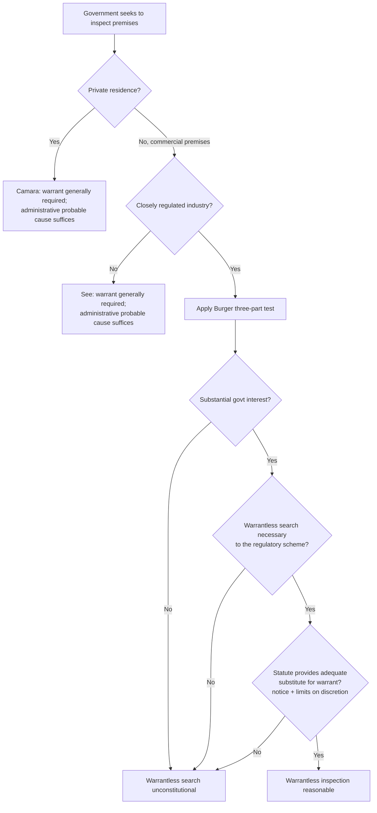

## Administrative Searches, Inspections, and Fourth Amendment Limits

### Overview

Administrative searches and inspections are warrantless or specially-authorized intrusions by government agencies into private premises, records, or operations, conducted not to gather evidence of crime in the ordinary sense but to enforce regulatory compliance — health, safety, fire, labor, environmental, and licensing standards. Because these inspections are a form of government intrusion into person, house, papers, or effects, they implicate constitutional search-and-seizure protections even though their purpose is civil/regulatory rather than criminal.

In the United States, this protection is the **Fourth Amendment** ("The right of the people to be secure in their persons, houses, papers, and effects, against unreasonable searches and seizures, shall not be violated..."). In the Philippines, the analogous and textually similar protection is **Article III, Section 2 of the 1987 Constitution**. Because much of the doctrinal architecture on administrative searches was developed in U.S. constitutional law and has been persuasive or directly cited in Philippine jurisprudence, this topic is best understood as a shared doctrinal framework, with jurisdiction-specific modifications noted throughout.

**Key Points**

- Administrative searches occupy a middle ground: less protected than searches for criminal evidence in some respects (lower probable cause standard), but still constitutionally constrained (not wholly discretionary).
- The core tension is between the government's legitimate regulatory interest in ensuring compliance without needing individualized suspicion, and the individual's/entity's interest in freedom from arbitrary government intrusion.
- The doctrine bifurcates significantly depending on whether the search targets a private residence, ordinary commercial premises, or a "closely regulated" industry.

### Foundational U.S. Doctrine

**Frank v. Maryland (1959) and the Early Rule**

Initially, U.S. courts held that administrative inspections (e.g., housing code enforcement) did not require a warrant at all, reasoning that such inspections were not searches for evidence of crime and posed lesser intrusion than criminal searches.

**Camara v. Municipal Court (1967) and See v. City of Seattle (1967)**

The U.S. Supreme Court reversed course, holding that the Fourth Amendment *does* apply to administrative inspections of private residences (*Camara*) and commercial premises (*See*), and that a warrant is generally required before a housing or fire inspector may enter over the occupant's objection. Critically, however, the Court relaxed the probable cause standard for such warrants: instead of individualized suspicion that a specific violation exists at a specific location, "administrative probable cause" may be based on **neutral, reasonable legislative or administrative standards** — for example, area-wide inspection schedules, the passage of time, the nature of the building, or condition of the neighborhood — rather than suspicion of a specific violation at the specific premises.

**Key Points**

- *Camara/See* established that a warrant is the default rule for administrative inspections of private and commercial premises, but redefined "probable cause" in the administrative context to be much less demanding than in criminal law.
- This is often called the "administrative warrant" or "area warrant" — justified by general regulatory schemes rather than particularized suspicion.

### The Closely Regulated Industry Exception

**Colonnade Catering Corp. v. United States (1970) and United States v. Biswell (1972)**

The Court carved out an exception for industries historically subject to pervasive government regulation (originally liquor and firearms dealing), holding that warrantless inspections could be constitutionally reasonable in such industries because:

1. The owner has a **reduced expectation of privacy** by voluntarily entering a pervasively regulated business.
2. Warrantless inspection is necessary to further an **urgent regulatory interest**.
3. The inspection program (frequency, scope, and limits on inspector discretion) provides a **constitutionally adequate substitute for a warrant**.

**New York v. Burger (1987) — The Modern Three-Part Test**

*Burger* (involving warrantless inspection of a vehicle dismantling business) synthesized and formalized the closely-regulated-industry exception into a three-part test for warrantless administrative inspections to be reasonable under the Fourth Amendment:

1. There must be a **substantial government interest** that the regulatory scheme is designed to address.
2. The warrantless inspection must be **necessary to further the regulatory scheme** (i.e., a warrant requirement would frustrate the inspection's purpose, such as by giving advance notice and allowing concealment of violations).
3. The statute's inspection program must provide a **constitutionally adequate substitute for a warrant** in terms of certainty and regularity of application — meaning the statute must:

   a. advise the owner that the search is being made pursuant to law and has a properly defined scope, and

   b. limit the discretion of inspecting officers as to time, place, and scope (e.g., through defined hours, frequency, or a neutral inspection scheme).

**Example**

A junkyard/auto-dismantling business, statutorily required to maintain a police-book record of vehicle parts and to permit warrantless inspection during business hours, may be validly inspected without a warrant because the industry is closely regulated (theft and trafficking in stolen vehicle parts), the inspection scheme is time-limited and scope-limited by statute, and surprise inspection is necessary to prevent concealment of contraband parts.

### Consent, Plain View, and Open Fields

Independent of the closely-regulated-industry framework, several general Fourth Amendment doctrines also apply to reduce or eliminate the warrant requirement in administrative contexts:

- **Consent** — a business owner or occupant may voluntarily consent to inspection, waiving the warrant requirement; consent must be voluntary and not the product of coercion or misrepresentation of authority.
- **Plain view doctrine** — if an inspector lawfully present on the premises observes evidence of a violation in plain view, no additional warrant is needed to note or seize that evidence.
- **Open fields doctrine** — areas outside the "curtilage" of a home or business (open land, fields) generally receive no Fourth Amendment protection, permitting warrantless observation, which is particularly relevant to environmental enforcement (e.g., aerial or open-land observation of waste disposal sites, discharge points, or land clearing).
- **Curtilage** — the area immediately surrounding a home (or, by extension, areas functionally akin to it for a business) receives heightened protection; the *Dow Chemical v. United States* (1986) case held that aerial photography of an industrial complex's outdoor manufacturing areas, taken from navigable airspace with a standard mapping camera, did not constitute a Fourth Amendment search because such areas were more akin to open fields/industrial curtilage without a reasonable expectation of privacy from aerial observation.

### Administrative Search Warrants Distinguished from Criminal Warrants

| Feature | Criminal Search Warrant | Administrative Search Warrant |
| --- | --- | --- |
| Standard | Probable cause to believe specific evidence of crime is at a specific place | "Administrative probable cause" — reasonable legislative/administrative standards (e.g., area norms, time elapsed, condition) |
| Purpose | Gather evidence of a crime already suspected | Ensure regulatory compliance, whether or not a violation is suspected |
| Particularity | Must describe the specific place and specific items/persons | May authorize broader inspection of the premises pursuant to a general regulatory scheme |
| Individualized suspicion | Required | Not required if based on neutral criteria |
| Issued by | Judge, based on sworn affidavit | Judge, magistrate, or in some contexts an authorized administrative official — but in Philippine practice, warrants remain a judicial function |

### Philippine Constitutional Framework

Article III, Section 2 of the 1987 Constitution provides the general warrant requirement and reasonableness standard for searches and seizures, and Philippine jurisprudence has adopted a broadly similar analytical structure, while emphasizing certain distinctions:

1. **General rule**: warrantless searches are *per se* unreasonable, subject to specific, well-recognized exceptions.
2. **Recognized exceptions relevant to administrative/regulatory searches** include: (a) searches of moving vehicles, (b) plain view, (c) consented searches, (d) stop-and-frisk, (e) searches incidental to a lawful arrest, (f) customs searches, (g) inspections of businesses that are the subject of government regulation and licensing under a valid police power measure, and (h) exigent circumstances.
3. **Visitorial powers** — many Philippine regulatory statutes (labor, health, environmental, food and drug, customs, and financial regulation) expressly grant agencies visitorial and inspection powers exercisable without a judicial warrant, justified under the police power and the reduced expectation of privacy in regulated commercial activity, echoing the closely-regulated-industry rationale of *Colonnade/Biswell/Burger*.
4. **Limits** — even statutorily-authorized warrantless inspections must be reasonable in scope, time, and manner; an inspection that becomes a pretext for a general exploratory search for evidence of an unrelated offense, or that involves unreasonable force or intrusion into areas beyond the regulatory purpose, may be struck down or its fruits excluded.

**Key Points**

- The Philippine framework does not require a separately labeled "closely regulated industry" doctrine to reach similar outcomes; it reaches them through the police power and statutory-visitorial-power route, but courts still examine reasonableness of scope and manner.
- The exclusionary rule (Article III, Section 3(2)) applies to evidence obtained through unreasonable administrative searches, just as it does to ordinary criminal searches, though its application in purely civil/administrative adjudication contexts (as opposed to criminal prosecution) is more contested and fact-specific. [Inference — the precise contours of exclusionary-rule application to administrative adjudicatory proceedings, as distinct from criminal trials, are not uniformly settled and should be checked against current controlling jurisprudence for the specific agency and proceeding type at issue.]

### Application to Environmental Enforcement

Environmental regulation is one of the paradigm contexts for administrative search doctrine because effective enforcement often depends on inspectors' ability to enter facilities, observe operations, take samples, and review records without advance notice that would allow concealment or temporary cessation of violations.

Typical environmental inspection scenarios and their doctrinal treatment:

- **Routine compliance inspections of a facility holding a Permit to Operate or Discharge Permit** — generally justified as a condition attached to the privilege of holding the permit; the regulated entity is treated as having consented to reasonable inspection as part of accepting the permit, echoing the closely-regulated-industry rationale.
- **Sampling of emissions or effluent** — generally treated as a form of inspection rather than a "search" in the traditional sense, though physical entry onto the premises to take samples still implicates the same constitutional framework.
- **Aerial or remote-sensing observation of outdoor industrial areas** — generally not restricted by search-and-seizure protections under the open fields/industrial curtilage reasoning of *Dow Chemical*, permitting agencies to use satellite imagery, drone surveillance and similar means to detect large-scale violations (e.g., illegal land clearing, discharge plumes) without a warrant. [Inference — the specific application of aerial/remote-sensing doctrine to drone-based enforcement is an evolving area, and jurisdictions may impose additional statutory constraints (e.g., aviation, privacy, or drone-specific regulation) beyond the constitutional baseline; current agency-specific rules should be verified.]
- **Emergency inspections following a reported spill, fish-kill, or contamination event** — often justified independently under exigent-circumstances reasoning, in addition to any statutory visitorial power.

**Example**

An EMB inspection team may enter a factory's premises without a warrant to inspect its wastewater treatment facility and take effluent samples, where the factory's Discharge Permit expressly conditions continued operation on submission to periodic and unannounced compliance inspections. If, during that same visit, the inspectors also search the factory's private administrative offices for unrelated financial records without consent or independent authority, that separate intrusion would not be justified by the same regulatory rationale and would require either consent, a warrant, or another applicable exception.

### Limits on Scope and the "Pretext" Problem

A recurring litigation issue is whether an administrative inspection was used as a **pretext** to search for evidence of an unrelated crime without meeting the higher criminal probable cause standard. Courts generally examine:

- Whether the inspection stayed within the scope authorized by the regulatory statute or permit condition.
- Whether the inspecting officers were regulatory personnel or were accompanied by/acting at the direction of criminal investigators.
- Whether items seized were within plain view during a lawful regulatory inspection, or required additional search beyond the inspection's legitimate purpose.

**Key Points**

- Administrative search authority is purpose-bound; exceeding the regulatory purpose to conduct what is functionally a criminal investigation without independent criminal-search authority risks suppression of evidence and potential civil liability for the inspecting officers/agency.
- Joint agency task forces (e.g., environmental enforcement paired with law enforcement for suspected environmental crimes under R.A. No. 9275 or the Revised Penal Code provisions on illegal disposal) should structure inspections carefully to preserve the validity of both the administrative and any parallel criminal process.

### Illustrative Diagram — Scope of Protection by Location Type

<svg xmlns="http://www.w3.org/2000/svg" viewBox="0 0 760 380">
<text x="380" y="26" text-anchor="middle" font-size="17" font-weight="bold" fill="#1a1a1a">Fourth Amendment Protection Gradient by Location Type (svg_diagram)</text>
<rect x="40" y="60" width="150" height="260" fill="#ffe3e3" stroke="#c92a2a" stroke-width="1.5" rx="6" />
<text x="115" y="85" text-anchor="middle" font-size="12" font-weight="bold" fill="#1a1a1a">Home / Curtilage</text>
<text x="115" y="110" text-anchor="middle" font-size="10" fill="#444">Highest protection</text>
<text x="115" y="128" text-anchor="middle" font-size="10" fill="#444">Camara warrant</text>
<text x="115" y="146" text-anchor="middle" font-size="10" fill="#444">generally required</text>
<rect x="220" y="60" width="150" height="260" fill="#fff4e6" stroke="#e8590c" stroke-width="1.5" rx="6" />
<text x="295" y="85" text-anchor="middle" font-size="12" font-weight="bold" fill="#1a1a1a">Ordinary Commercial</text>
<text x="295" y="110" text-anchor="middle" font-size="10" fill="#444">Moderate protection</text>
<text x="295" y="128" text-anchor="middle" font-size="10" fill="#444">See warrant, admin.</text>
<text x="295" y="146" text-anchor="middle" font-size="10" fill="#444">probable cause</text>
<rect x="400" y="60" width="150" height="260" fill="#fff9db" stroke="#f08c00" stroke-width="1.5" rx="6" />
<text x="475" y="85" text-anchor="middle" font-size="12" font-weight="bold" fill="#1a1a1a">Closely Regulated Industry</text>
<text x="475" y="110" text-anchor="middle" font-size="10" fill="#444">Reduced protection</text>
<text x="475" y="128" text-anchor="middle" font-size="10" fill="#444">Burger 3-part test,</text>
<text x="475" y="146" text-anchor="middle" font-size="10" fill="#444">warrantless allowed</text>
<rect x="580" y="60" width="150" height="260" fill="#e6f7e6" stroke="#2b8a3e" stroke-width="1.5" rx="6" />
<text x="655" y="85" text-anchor="middle" font-size="12" font-weight="bold" fill="#1a1a1a">Open Fields</text>
<text x="655" y="110" text-anchor="middle" font-size="10" fill="#444">No protection</text>
<text x="655" y="128" text-anchor="middle" font-size="10" fill="#444">Warrantless observation</text>
<text x="655" y="146" text-anchor="middle" font-size="10" fill="#444">permitted</text>
<line x1="40" y1="350" x2="730" y2="350" stroke="#333" stroke-width="1.5" marker-end="url(#arrow2)" />
<text x="385" y="370" text-anchor="middle" font-size="11" fill="#444">Decreasing expectation of privacy →</text>
</svg>

### Practical Compliance Framework for Regulated Entities

**Key Points**

- A regulated facility should know in advance, as part of its compliance program, which of its permits or licenses contain inspection-consent clauses, since these substantially narrow available objections to warrantless entry.
- Facility personnel should distinguish between (a) cooperating with a lawful regulatory inspection within its statutory/permit scope, and (b) consenting to a broader search beyond that scope, since the latter requires a separate, voluntary, and informed consent.
- Documentation of the inspection's scope, personnel present, and materials reviewed or sampled is valuable both for compliance recordkeeping and for any later challenge to the inspection's reasonableness.
- [Unverified] Because inspection authority and its limits are frequently defined at the level of implementing rules and regulations (IRRs) and permit conditions rather than the enabling statute alone, entity-specific and current IRRs should be consulted rather than relying solely on the general constitutional framework described here.

**Related Topics**

- Visitorial powers of DOLE, DENR-EMB, and other regulatory bodies
- The exclusionary rule and its application in administrative adjudication
- Consent searches and waiver of constitutional rights in regulatory contexts
- Environmental compliance certificates (ECC) and permit conditions as consent-to-inspection mechanisms
- Aerial and remote-sensing surveillance in environmental enforcement
- Administrative subpoenas and compelled production of records (related compulsory-process tool)
- Exigent circumstances doctrine in environmental emergency response
- Due process limits on the scope and manner of administrative inspections