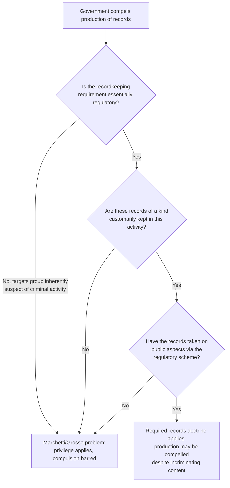

## The Required Records Doctrine and Self-Incrimination

### Overview

The required records doctrine is an exception to the privilege against self-incrimination, holding that a person or entity may be compelled to produce records that are required by law to be kept, even if those records contain incriminating information, without violating the constitutional right against self-incrimination. The doctrine reconciles two competing interests: the government's need to regulate activity through mandatory recordkeeping, and the individual's constitutional protection against compelled self-incriminating testimony.

This doctrine sits at the intersection of administrative law's compulsory-process powers (subpoenas, required filings, mandatory recordkeeping) and constitutional criminal procedure, and it is a recurring flashpoint in regulatory enforcement — particularly in heavily documented, permit-based regimes such as environmental law, securities regulation, tax administration, and customs.

**Key Points**

- The doctrine does not eliminate the privilege against self-incrimination; it defines a category of records to which the privilege does not attach in the first place.
- It applies to records, not to compelled oral testimony — testimonial compulsion remains fully protected.
- The doctrine is available only to natural persons in its self-incrimination dimension, since corporations and other juridical entities cannot invoke the privilege against self-incrimination at all (a separate, broader rule that operates independently of the required records doctrine).

### Origins in U.S. Jurisprudence

**Shapiro v. United States (1948)**

The doctrine originates from *Shapiro*, where the U.S. Supreme Court upheld the compelled production of records that a price-control regulation required a business to keep, even though the records incriminated the individual who produced them. The Court reasoned that because the records were required to be kept as a condition of engaging in a regulated activity, and served a public regulatory purpose independent of any individual's guilt or innocence, they were "public" in a relevant sense and fell outside the privilege's protection.

**Marchetti v. United States (1968) and Grosso v. United States (1968)**

The Court significantly narrowed the doctrine's reach in these companion cases, striking down federal wagering tax registration and reporting requirements as applied to gamblers, because the requirement to register and report was aimed at a group "inherently suspect of criminal activities" (illegal gambling was itself often criminal under state law), such that compliance would itself amount to self-incrimination in a "real and appreciable" sense — the recordkeeping/reporting scheme was not a genuine, neutral regulatory scheme but was targeted at a "selective group inherently suspect of criminal activities."

**California v. Byers (1971)**

The Court further refined the doctrine, upholding a "hit and run" statute requiring drivers involved in accidents to stop and give identifying information, on the theory that the requirement was regulatory (traffic safety), directed at the public at large rather than a suspect class, and any incriminating aspect was incidental rather than the statute's target.

### The Three-Part Test

From this line of cases, U.S. courts (and analytically similar reasoning in comparative administrative law) distilled a three-part test for whether the required records doctrine applies:

1. **The requirement to keep or maintain records must be essentially regulatory in nature.** The recordkeeping scheme must serve a legitimate administrative or public purpose independent of gathering evidence for criminal prosecution.
2. **The records must be of a kind that the regulated party customarily keeps** ("records of a kind customarily kept"), i.e., the kind of records typically maintained in the ordinary course of the regulated activity, not a novel category invented solely for law-enforcement surveillance purposes.
3. **The records must have taken on "public aspects"** that render them analogous to public documents — because the government has required their creation and maintenance for a public regulatory purpose, and often may inspect or demand them at will as an incident of the regulatory scheme, they lose the purely private character that would otherwise trigger full self-incrimination protection.

If a recordkeeping or reporting requirement is instead targeted at a group "inherently suspect of criminal activity" (the *Marchetti/Grosso* problem), or the compelled reporting is not genuinely regulatory but is a disguised means of extracting confessions, the required records doctrine will not apply, and the ordinary self-incrimination privilege will bar compulsion.

### Distinguishing the "Act of Production" Doctrine

A separate and often-confused strand of self-incrimination doctrine concerns not the *content* of records but the *act* of producing them. Even where the contents of a document are not privileged (e.g., a voluntarily prepared business document, or a required record), the physical act of producing it in response to a subpoena can itself be testimonial, because production implicitly communicates:

- that the documents exist,
- that they are in the custodian's possession or control, and
- that the produced documents are the ones described in the subpoena (authentication).

Under *United States v. Doe (1984)* and later *Fisher v. United States (1976)*, this "implicit testimony" inherent in the act of production can be privileged even when the document's contents are not, **unless** the existence, possession, and authenticity of the documents are already a "foregone conclusion" independently known to the government — in which case production adds nothing testimonial and is not privileged.

**Key Points**

- Content privilege and act-of-production privilege are analytically distinct; a record can be fully subject to the required records doctrine on its contents while still raising an act-of-production question if the government does not already know the record exists.
- The "foregone conclusion" exception frequently resolves the act-of-production issue in regulatory contexts, because required records are — by definition — known to the government to exist (since the law itself mandates that they be kept), which tends to support treating their production as a foregone conclusion.
- [Inference — the interaction between the required records doctrine and the act-of-production doctrine, especially in edge cases involving digital records, encrypted files, or self-created records beyond the strict regulatory minimum, remains an actively litigated and evolving area in U.S. jurisprudence; current circuit-specific case law should be checked for any live matter.]

### Corporate and Entity Records — A Separate, Broader Rule

It is important not to conflate the required records doctrine with the entirely separate rule that **corporations, partnerships, and other collective/juridical entities cannot invoke the privilege against self-incrimination at all**, regardless of whether the records at issue are "required records" in the *Shapiro* sense.

- A corporate custodian of records may be compelled to produce corporate records even if the records incriminate the corporation, because the corporation itself has no self-incrimination privilege (*Hale v. Henkel*, 1906; *Wilson v. United States*, 1911; *Bellis v. United States*, 1974).
- This entity rule applies even to records that are *not* government-required — i.e., ordinary internal corporate records, minutes, and correspondence — because the rationale is that a collective entity, as a creature of the state granted special privileges (limited liability, perpetual existence), implicitly submits to reasonable governmental regulation and visitorial power as a condition of that grant.
- A custodian who is a natural person may still resist producing the corporate records on **personal** act-of-production grounds in narrow circumstances (e.g., if the act of production would incriminate the individual personally, as distinct from the entity), though this is a heavily limited and fact-specific area.

| Doctrine | What It Covers | Who May Invoke |
| --- | --- | --- |
| Required records doctrine | Content of records mandated by regulatory law | Natural persons (removes privilege as to content) |
| Entity/collective entity rule | Any records of a corporation, partnership, or association | No privilege exists for the entity itself, regardless of records' nature |
| Act-of-production doctrine | The implicit testimony in the act of producing documents | Natural persons, subject to foregone-conclusion exception |

### Philippine Constitutional Treatment

Article III, Section 17 of the 1987 Constitution provides that "No person shall be compelled to be a witness against himself." Philippine jurisprudence on the privilege against self-incrimination has generally tracked the U.S. framework's core distinctions:

1. **The privilege is personal** and available only to natural persons, not to corporations or juridical entities — consistent with the entity rule.
2. **The privilege protects testimonial compulsion**, not the production of physical or documentary evidence whose existence does not depend on the person's state of mind — a formulation broadly consonant with the required records/act-of-production framework, though Philippine case law has developed its own vocabulary (e.g., distinguishing "testimonial compulsion" from mechanical or physical acts such as producing a specimen, submitting to fingerprinting, or standing in a police lineup, none of which the privilege protects).
3. **Regulatory recordkeeping and reporting obligations** imposed on regulated industries (financial reporting, tax records, environmental compliance records, business permits) are generally treated as valid exercises of police power and taxing power, and compliance with such requirements is not typically treated as self-incrimination, consistent with the *Shapiro* rationale, though Philippine courts have not always framed the analysis using the identical three-part U.S. test. [Inference — Philippine jurisprudence has not extensively developed a doctrinally separate, named "required records doctrine" test to the same granularity as U.S. case law; the substantive outcome (regulatory records are generally compellable) is well established, but practitioners should verify whether a specific Philippine case has adopted or distinguished the *Shapiro/Marchetti/Byers* framework by name before citing it as directly controlling doctrine.]

### Application to Environmental Regulatory Records

Environmental law is one of the paradigm contexts in which the required records doctrine (or its functional equivalent) operates, because environmental statutes routinely mandate that regulated facilities create and maintain specific records as a condition of their permits:

- Self-Monitoring Reports (SMRs) under discharge and emission permits
- Hazardous waste generator manifests and waste tracking records under R.A. No. 6969 and its implementing rules
- Chemical inventory and Material Safety Data Sheet (MSDS) recordkeeping
- Environmental Compliance Certificate (ECC) compliance monitoring records
- Import/export records for regulated or hazardous substances

**Example**

A facility operating under a Permit to Operate air pollution source installations is required by its permit conditions and the Clean Air Act's implementing rules to maintain continuous emissions monitoring records. If those records reveal repeated exceedances of allowable emission limits, the facility cannot resist an EMB subpoena or inspection demand for those records on self-incrimination grounds, because: (1) the recordkeeping requirement is genuinely regulatory (protecting public health and air quality, not targeted at a criminally suspect class), (2) such monitoring records are of a kind the facility is required to customarily keep as part of routine permit compliance, and (3) the records have public aspects by virtue of the permit condition requiring their maintenance and availability for inspection. This reasoning would apply regardless of whether the facility operator is compelled to be a witness in a related administrative or criminal proceeding, since only the *content* privilege is at issue and it does not attach to these particular records — though if the government did not already know a specific supplementary log existed, an individual custodian might still raise a narrow act-of-production objection to that specific undisclosed document.

**Key Points**

- The heavier and more detailed a statute's mandatory recordkeeping requirements are, the stronger the case for characterizing resulting records as "required records" outside self-incrimination protection.
- Records a regulated entity keeps *voluntarily*, beyond what the law mandates, are not protected by the required records doctrine (since the doctrine's rationale — that the record's public character arises from the legal mandate — does not extend to purely voluntary recordkeeping), though such purely voluntary records may still face the ordinary Fifth Amendment/Section 17 content analysis, which for a natural person's private papers can differ from the required-records analysis. [Inference — the treatment of voluntarily-created but incriminating environmental compliance documentation, where not strictly mandated by permit or statute, is a less settled area and depends heavily on the specific record's character and the jurisdiction's current doctrine.]

### Illustrative Diagram — Overlapping Doctrines Affecting Compelled Production

<svg xmlns="http://www.w3.org/2000/svg" viewBox="0 0 760 400">
<text x="380" y="26" text-anchor="middle" font-size="17" font-weight="bold" fill="#1a1a1a">Doctrines Governing Compelled Production of Records (svg_diagram)</text>
<circle cx="280" cy="210" r="140" fill="#e8f0fe" stroke="#3b5bdb" stroke-width="1.5" fill-opacity="0.6" />
<circle cx="480" cy="210" r="140" fill="#fff4e6" stroke="#e8590c" stroke-width="1.5" fill-opacity="0.6" />

<text x="200" y="150" font-size="12" font-weight="bold" fill="`#1a1a1a`">Required Records Doctrine</text>

<text x="180" y="172" font-size="10" fill="#444">Content not privileged if:</text>

<text x="185" y="190" font-size="10" fill="#444">- regulatory in nature</text>

<text x="185" y="206" font-size="10" fill="#444">- customarily kept</text>

<text x="185" y="222" font-size="10" fill="#444">- has public aspects</text>

<text x="520" y="150" font-size="12" font-weight="bold" fill="`#1a1a1a`">Act-of-Production Doctrine</text>

<text x="500" y="172" font-size="10" fill="#444">Production itself testimonial if:</text>

<text x="505" y="190" font-size="10" fill="#444">- existence not known</text>

<text x="505" y="206" font-size="10" fill="#444">- possession not known</text>

<text x="505" y="222" font-size="10" fill="#444">- authenticity in question</text>

<text x="330" y="260" font-size="10" font-weight="bold" fill="`#1a1a1a`">Overlap zone:</text>

<text x="300" y="278" font-size="9" fill="#444">Required record, but existence</text>

<text x="300" y="292" font-size="9" fill="#444">unknown to government</text>

<text x="300" y="306" font-size="9" fill="#444">→ foregone conclusion test applies</text>

<text x="380" y="370" text-anchor="middle" font-size="10" fill="#666">Entity/collective-entity rule operates independently: no privilege at all for corporate records, regardless of overlap above (svg_diagram note)</text>

</svg>

### Practical Analytical Checklist

**Key Points**

- Step 1: Identify whether the entity asserting the privilege is a natural person or a juridical entity — if the latter, the required records doctrine is largely academic, since no privilege exists in the first place.
- Step 2: If a natural person, determine whether the record sought is one the person is legally required to keep under a genuinely regulatory statute or permit condition, as opposed to a purely voluntary record.
- Step 3: If required, assess whether the requirement targets the public generally/a regulated industry (favoring the doctrine's application) or a group inherently suspect of criminal activity (favoring *Marchetti/Grosso* and full privilege protection).
- Step 4: Even if the content is unprotected as a required record, separately assess whether the specific act of producing it would communicate previously unknown facts about existence, possession, or authentication — and if so, whether the foregone-conclusion exception resolves that separately.
- [Unverified] The precise doctrinal labels and tests applied may differ across jurisdictions and specific regulatory contexts; this checklist reflects the general analytical structure derived primarily from U.S. constitutional doctrine and should be calibrated against controlling authority for the specific forum and record type at issue.

**Related Topics**

- Administrative subpoenas and compelled production of records
- The privilege against self-incrimination in administrative versus criminal proceedings
- Corporate/collective entity rule and lack of self-incrimination privilege for juridical persons
- The foregone conclusion doctrine and digital/encrypted records
- Mandatory environmental recordkeeping and self-monitoring report regimes
- Testimonial versus physical/mechanical compulsion under Article III, Section 17
- Use and derivative-use immunity in administrative investigations
- Exhaustion of administrative remedies and judicial review of compelled-production orders