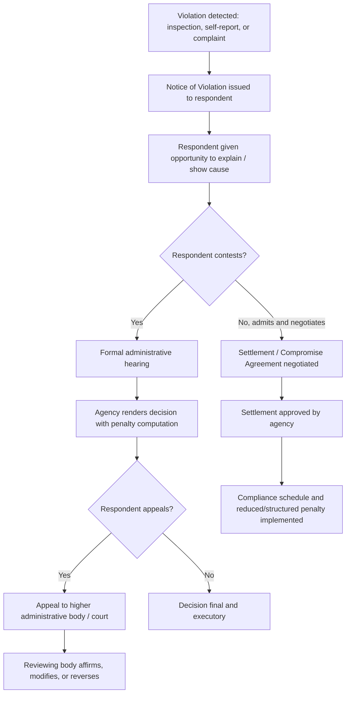

## Civil Penalty Assessment and Settlement Practice

### Overview

Civil penalty assessment is the process by which an administrative agency, acting under statutory authority, imposes monetary sanctions on a regulated entity for violations of applicable laws, rules, or permit conditions, without resort to criminal prosecution. Settlement practice refers to the negotiated resolution of such penalty proceedings — through consent decrees, compromise agreements, or administrative settlements — in lieu of full adjudicatory litigation to conclusion.

This is a core enforcement mechanism across administrative law generally, and is especially prominent in environmental regulation, where statutory penalty schedules, continuing-violation provisions, and negotiated settlement have become the dominant mode of resolving compliance disputes, given the comparatively high cost and duration of full adjudication for both the agency and the regulated party.

**Key Points**

- Civil penalties are remedial/regulatory in character (deterrence and compliance-inducement), distinct from criminal fines (punitive, requiring proof beyond reasonable doubt) and from compensatory damages (restoring an injured party).
- Agencies typically possess express statutory authority to assess civil penalties administratively, subject to a right of appeal or judicial review, rather than needing to sue in court for every assessment.
- Settlement is favored by both agencies and regulated entities because it conserves enforcement resources, provides certainty, and — properly structured — can secure faster actual compliance than protracted litigation.

### Statutory and Constitutional Basis for Civil Penalty Power

**Delegation Requirement**

As with other administrative powers, the authority to impose civil penalties must be traceable to an express statutory grant; it is not inherent in the general grant of regulatory authority to an agency. Enabling statutes typically specify:

- the acts or omissions constituting a violation,
- the applicable penalty range (often a schedule of minimum/maximum amounts, sometimes per day of violation),
- the administrative procedure for assessment (notice, hearing, or opportunity to be heard),
- the availability of aggravating/mitigating factors,
- and the mode of appeal or judicial review.

**Due Process Requirements**

Because a civil penalty is a deprivation of property, due process requires, at minimum:

1. **Notice** of the specific charge/violation and the potential penalty.
2. **Opportunity to be heard**, whether through written explanation, a formal hearing, or a structured administrative process, proportional to the stakes and complexity involved.
3. **A reasoned decision** stating the factual and legal basis for the penalty imposed.
4. **Availability of appeal or judicial review**, typically via petition for review to a higher administrative body and ultimately to the courts (in the Philippine system, typically via Rule 43 of the Rules of Court to the Court of Appeals, for quasi-judicial agency decisions, subject to the specific review mode set by the agency's charter).

**Key Points**

- The degree of procedural formality required scales with the severity of the penalty and the complexity of the factual issues — a large per-day continuing penalty assessed against a major facility warrants more robust process than a minor, fixed fine for a paperwork lapse.
- Philippine administrative due process, as articulated in *Ang Tibay v. CIR* and its progeny, requires substantial evidence to support factual findings and a genuinely considered decision, but does not require the full panoply of judicial trial procedure.

### Philippine Environmental Penalty Framework

Philippine environmental statutes typically provide their own penalty schedules and administrative assessment mechanisms:

- **Philippine Clean Air Act (R.A. No. 8749)** — establishes administrative fines for violations of emission standards and permit conditions, with escalating fines for repeated or continuing violations, and criminal penalties for more serious or repeated offenses.
- **Philippine Clean Water Act (R.A. No. 9275)** — authorizes the Pollution Adjudication Board (and, by delegation, the EMB) to impose administrative fines for discharge permit violations, with a statutory daily fine structure for continuing violations until corrective action is taken, in addition to potential cease-and-desist or closure orders.
- **Toxic Substances and Hazardous and Nuclear Wastes Control Act (R.A. No. 6969)** — provides for administrative and criminal penalties for improper handling, storage, transport, or disposal of hazardous wastes and toxic substances.
- **Ecological Solid Waste Management Act (R.A. No. 9003)** — provides administrative penalties for local government units and establishments failing to comply with solid waste segregation, collection, and disposal requirements.
- **Presidential Decree No. 1586 (EIS System)** — non-compliance with ECC conditions can result in suspension or cancellation of the ECC, administrative fines, and orders to cease operations, in addition to potential criminal liability for operating without a required ECC.

**Example**

Under the Clean Water Act framework, a facility discharging wastewater in excess of effluent standards may be assessed a fine calculated on a per-day basis from the date of the violation until the facility demonstrates corrective compliance, calculated as:

$$\text{Total Penalty} = \text{Daily Fine Rate} \times \text{Number of Days in Violation}$$

If the daily fine rate is set by regulation at, for example, ₱10,000 per day (illustrative figure only — actual rates are fixed by the specific implementing rules and should be verified against current DENR/PAB issuances), and the violation persists for 45 days before corrective action is verified, the computed base penalty would be:

$$\text{Total Penalty} = 10{,}000 \times 45 = 450{,}000$$

subject to any statutory caps, aggravating/mitigating adjustments, and the specific implementing rules' computation methodology in force at the time of the violation. [Unverified — actual daily fine rates and cap amounts are set and periodically revised by DENR administrative orders and should be confirmed against the currently effective schedule before use in any actual computation.]

### Penalty Assessment Methodology — Common Factors

Across most Philippine and comparative regulatory schemes, the following factors typically inform the actual penalty amount within the statutory range:

| Factor | Effect on Penalty |
| --- | --- |
| Gravity/extent of environmental harm | Aggravating if severe or irreversible |
| Duration of violation (continuing vs. one-time) | Aggravating if prolonged; often computed per day |
| Economic benefit gained from non-compliance | Aggravating — designed to remove any cost advantage from violating rather than complying |
| History of prior violations | Aggravating if repeat offender |
| Good faith efforts to comply / self-reporting | Mitigating |
| Cooperation with the investigation | Mitigating |
| Prompt corrective action taken | Mitigating |
| Size and financial capacity of the violator | May adjust penalty to ensure meaningful deterrence without being confiscatory |

**Key Points**

- The "economic benefit" factor reflects a widely used regulatory principle: a penalty that is lower than the cost the violator avoided by not complying creates a perverse incentive to violate and treat the fine as a mere cost of doing business; well-designed penalty schedules aim to at least recapture that avoided cost.
- Self-reporting and voluntary disclosure programs, where available, can substantially reduce assessed penalties as a matter of policy, encouraging regulated entities to detect and report their own violations rather than concealing them.

### Settlement Practice — Mechanisms and Considerations

**Consent Decrees / Compromise Agreements**

Many environmental and regulatory statutes expressly authorize the agency to enter into compromise agreements with a respondent, subject to conditions:

- The respondent typically admits the violation (or at least the underlying facts) without necessarily admitting legal liability in the same terms as a full adjudicated finding.
- The agency and respondent agree on a penalty amount (often reduced from the maximum statutory exposure) in exchange for prompt payment and/or a binding compliance schedule.
- The settlement typically includes specific, verifiable corrective actions with defined timelines (e.g., installation of pollution control equipment, submission of revised monitoring protocols).
- Settlements often include a **stipulated penalty clause** for failure to meet the compliance schedule, allowing streamlined enforcement of the settlement itself without relitigating the underlying violation.

**Supplemental Environmental Projects (SEPs) — Comparative Practice**

In some jurisdictions (notably U.S. EPA practice), settlements may permit a violator to fund an environmentally beneficial project (beyond what the law otherwise requires) in partial lieu of a portion of the monetary penalty, on the theory that this can produce greater net environmental benefit than payment into a general treasury fund. [Unverified — the availability and legal basis for SEP-equivalent arrangements under Philippine environmental law and DENR practice specifically should be verified against current implementing rules, as such practice is well-established in the U.S. context but its precise Philippine-law analog and constraints require confirmation.]

**Key Points**

- Settlement negotiations typically occur "without prejudice," meaning statements made during negotiation cannot later be used as admissions if settlement talks fail and the matter proceeds to formal adjudication — a protection analogous to Rule 130 provisions on offers of compromise, though the precise evidentiary treatment of administrative settlement negotiations may differ from judicial compromise negotiations and should be confirmed for the specific proceeding.
- Agencies must ensure that settlement penalty amounts, while negotiated, remain within statutory bounds and are not so low as to constitute an abuse of discretion or a failure to fulfill the agency's statutory enforcement mandate; settlements are frequently subject to internal agency approval levels (e.g., requiring higher-level sign-off for settlements below a certain percentage of the maximum exposure).
- A well-drafted settlement should specify: the admitted facts, the penalty amount and payment terms, the compliance schedule with interim milestones, monitoring/reporting obligations to verify compliance, stipulated penalties for breach, and a release of the specific claims being settled (with care to define the scope of the release precisely).

### Distinguishing Civil Penalties from Related Sanctions

| Sanction Type | Purpose | Standard of Proof | Typical Forum |
| --- | --- | --- | --- |
| Civil/administrative penalty | Deterrence, compliance inducement | Substantial evidence | Agency, subject to judicial review |
| Criminal fine/imprisonment | Punishment, retribution | Proof beyond reasonable doubt | Regular courts |
| Compensatory damages | Restore injured party | Preponderance of evidence | Regular courts (or agency if statute grants) |
| Cease-and-desist / closure order | Stop ongoing harm | Substantial evidence / prima facie showing | Agency |
| License suspension/revocation | Remove privilege to operate | Substantial evidence | Agency |

**Key Points**

- The same underlying conduct can trigger multiple sanction types simultaneously (e.g., a serious environmental violation may result in an administrative fine, a cease-and-desist order, and separate criminal prosecution), and double jeopardy protections generally do not bar this because administrative and criminal sanctions serve different purposes and require different standards of proof — though the precise application of this principle can be fact- and statute-specific. [Inference — whether a particular combination of administrative and criminal sanctions under a specific environmental statute could raise double jeopardy or "double sanction" concerns depends on statutory design and current jurisprudence, and should be independently verified for the specific statute at issue.]

### Illustrative Diagram — Penalty Calculation and Adjustment Flow

<svg xmlns="http://www.w3.org/2000/svg" viewBox="0 0 760 380">
<text x="380" y="26" text-anchor="middle" font-size="17" font-weight="bold" fill="#1a1a1a">Civil Penalty Computation Flow (svg_diagram)</text>
<rect x="40" y="60" width="180" height="60" rx="6" fill="#e8f0fe" stroke="#3b5bdb" stroke-width="1.5" />
<text x="130" y="95" text-anchor="middle" font-size="12" fill="#1a1a1a">Base Statutory Rate</text>
<rect x="290" y="60" width="180" height="60" rx="6" fill="#e6f7e6" stroke="#2b8a3e" stroke-width="1.5" />
<text x="380" y="95" text-anchor="middle" font-size="12" fill="#1a1a1a">× Duration (days)</text>
<rect x="540" y="60" width="180" height="60" rx="6" fill="#fff4e6" stroke="#e8590c" stroke-width="1.5" />
<text x="630" y="95" text-anchor="middle" font-size="12" fill="#1a1a1a">= Base Penalty</text>
<line x1="220" y1="90" x2="290" y2="90" stroke="#333" stroke-width="1.5" marker-end="url(#a3)" />
<line x1="470" y1="90" x2="540" y2="90" stroke="#333" stroke-width="1.5" marker-end="url(#a3)" />
<line x1="630" y1="120" x2="630" y2="160" stroke="#333" stroke-width="1.5" marker-end="url(#a3)" />
<rect x="470" y="170" width="220" height="90" rx="6" fill="#f3f0ff" stroke="#7048e8" stroke-width="1.5" />
<text x="580" y="195" text-anchor="middle" font-size="12" fill="#1a1a1a">Aggravating/Mitigating</text>
<text x="580" y="213" text-anchor="middle" font-size="10" fill="#444">+ economic benefit gained</text>
<text x="580" y="229" text-anchor="middle" font-size="10" fill="#444">+ repeat offense</text>
<text x="580" y="245" text-anchor="middle" font-size="10" fill="#444">− good faith, self-report</text>
<line x1="470" y1="215" x2="330" y2="215" stroke="#333" stroke-width="1.5" marker-end="url(#a3)" />
<rect x="120" y="170" width="210" height="90" rx="6" fill="#ffe3e3" stroke="#c92a2a" stroke-width="1.5" />
<text x="225" y="200" text-anchor="middle" font-size="12" fill="#1a1a1a">Final Assessed Penalty</text>
<text x="225" y="225" text-anchor="middle" font-size="10" fill="#444">subject to statutory cap</text>
<text x="225" y="241" text-anchor="middle" font-size="10" fill="#444">and possible settlement reduction</text>
<line x1="225" y1="260" x2="225" y2="300" stroke="#333" stroke-width="1.5" marker-end="url(#a3)" />
<text x="225" y="320" text-anchor="middle" font-size="11" fill="#444">Negotiated Settlement</text>
<text x="225" y="336" text-anchor="middle" font-size="10" fill="#666">(compliance schedule + stipulated penalties)</text>
</svg>

### Judicial Review of Penalty Assessments

Once an administrative penalty decision becomes final at the agency level (after exhausting available administrative appeal), judicial review is generally available but is typically **limited in scope**:

- Courts generally do not re-weigh evidence or substitute their judgment for the agency's on factual findings supported by substantial evidence (the doctrine of primary jurisdiction and respect for administrative expertise).
- Judicial review typically examines whether the agency acted within its jurisdiction, observed due process, and did not commit grave abuse of discretion (e.g., an arbitrarily excessive penalty, a penalty imposed without legal basis, or a decision unsupported by substantial evidence).
- The doctrine of **exhaustion of administrative remedies** generally requires a respondent to pursue all available administrative appeals before seeking judicial review, subject to well-recognized exceptions (e.g., purely legal questions, patent illegality, urgency, or futility of further administrative recourse).

**Key Points**

- Because judicial review is deferential, the administrative record compiled during the initial investigation and hearing is critical — a respondent's best opportunity to contest facts and penalty computation is usually at the agency level, not on appeal.
- Settlement, precisely because it forecloses the need for this potentially lengthy review process, is often strategically preferable for a respondent with a genuinely strong compliance path forward, even where the respondent believes it might ultimately prevail on some issues in a full contest.

### Practical Framework for Respondents Facing Penalty Assessment

**Key Points**

- Assess exposure early: calculate the maximum potential penalty under the applicable statutory schedule (including continuing/per-day exposure) before deciding whether to contest or negotiate.
- Document mitigating factors contemporaneously — corrective action taken, self-reporting, cooperation — since these carry more weight when documented in real time rather than asserted retrospectively.
- Evaluate settlement not only on the monetary penalty but on the compliance schedule's feasibility, since a settlement with an unrealistic timeline can generate stipulated-penalty exposure that exceeds what a contested proceeding might have produced.
- Preserve the right to seek judicial review where a settlement is not reached, by ensuring all administrative appeal steps and deadlines are met even while settlement discussions continue, since settlement talks alone typically do not toll statutory or regulatory appeal periods absent an explicit agreement to that effect. [Unverified — whether pursuing settlement discussions tolls or otherwise affects applicable appeal periods depends on the specific agency's rules of procedure and should be confirmed rather than assumed.]

**Next Steps**

- Continuing violations and per-day penalty computation methodologies
- Cease-and-desist orders and their relationship to penalty assessment
- Exhaustion of administrative remedies and exceptions
- Judicial review standards: substantial evidence and grave abuse of discretion
- Self-reporting and voluntary disclosure programs in environmental compliance
- License suspension and revocation as a complementary enforcement tool
- Double jeopardy and multiple-sanction issues in administrative/criminal overlap
- Comparative settlement mechanisms: consent decrees and supplemental environmental projects