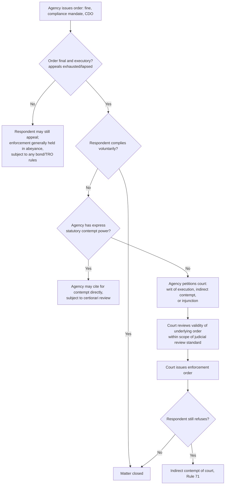

## Consent Decrees and Judicial Enforcement of Agency Orders

### Overview

A consent decree is a court-approved and court-entered agreement between a government agency (or other enforcing party) and a respondent, which resolves an enforcement action by setting out agreed-upon obligations — typically corrective measures, compliance schedules, and penalties — while being backed by the court's contempt power for non-compliance. Judicial enforcement of agency orders, more broadly, refers to the mechanisms by which administrative determinations that are not self-executing become binding and coercively enforceable through the courts.

These two concepts are closely linked: a consent decree is one specific vehicle for converting a negotiated administrative settlement into a judicially enforceable instrument, but judicial enforcement also arises in non-consensual contexts — where an agency must go to court to compel compliance with an order the respondent has resisted.

**Key Points**

- A consent decree differs from a purely administrative settlement/compromise agreement in that it is entered as a court order (or, in some systems, filed with and given force by a court), making its violation punishable as contempt of court rather than merely triggering further administrative proceedings.
- Judicial enforcement becomes necessary because most administrative agencies, being creatures of statute rather than courts, generally lack inherent contempt power; without express statutory authority to hold violators in contempt directly, the agency's only recourse against a non-compliant party is to seek a court order compelling compliance.
- Consent decrees combine the efficiency of negotiated settlement with the coercive force of judicial process, making them a favored tool in complex, long-duration regulatory compliance matters such as environmental remediation.

### Why Judicial Enforcement Is Necessary

Administrative agencies typically issue several categories of orders in the course of investigation and enforcement:

- Cease-and-desist orders
- Compliance orders (requiring specific corrective action within a set timeframe)
- Orders imposing administrative fines
- Orders suspending or revoking permits/licenses

While an agency's own charter may allow it to enforce some of these directly (e.g., through license suspension, which the agency itself controls), many orders — particularly monetary fines and affirmative compliance mandates — are not "self-executing." If the respondent simply refuses to pay or refuses to undertake the ordered corrective action, the agency generally cannot use its own force to compel compliance; it must instead:

1. Seek a **writ of execution** or its administrative-law equivalent from a court with jurisdiction, once the agency's order has become final and executory (i.e., all administrative appeals exhausted or the appeal period lapsed without appeal).
2. Alternatively, file a **petition for indirect contempt** under Rule 71 of the Rules of Court (Philippine practice) if the order in question is treated as analogous to a court order for contempt purposes, or if a specific statute grants that treatment.
3. In some regulatory schemes, seek an **injunction** compelling specific compliance or restraining continued violation, particularly where irreparable environmental harm is ongoing.

### Consent Decrees — Structure and Function

**Core Elements**

A well-structured consent decree, whether in Philippine environmental practice, comparative U.S. practice (a major source of doctrinal development in this area), or general regulatory settlement practice, typically contains:

1. **Recitals/Findings** — a statement of the alleged violations and the basis for the agency's/court's jurisdiction, often with the respondent neither admitting nor denying liability, only agreeing to the decree's terms (a common formulation to avoid the settlement being treated as an admission usable in other proceedings).
2. **Injunctive/Compliance Provisions** — specific, measurable, and time-bound obligations (e.g., installation of pollution control equipment by a date certain, submission of periodic compliance reports, cessation of a specific practice).
3. **Monetary Terms** — civil penalties, cost recovery, and, in some systems, funding for supplemental environmental projects.
4. **Stipulated Penalties** — a pre-agreed schedule of additional penalties for failure to meet specific decree milestones, allowing for streamlined enforcement of the decree itself without relitigating the underlying violation.
5. **Reporting and Monitoring Obligations** — periodic certification of compliance, often independently verified.
6. **Retention of Jurisdiction** — the court (or agency, depending on the framework) retains jurisdiction over the matter for the duration of the decree to resolve compliance disputes without requiring a wholly new action.
7. **Termination Provisions** — conditions under which the decree is deemed satisfied and terminated.
8. **Force Majeure / Modification Clauses** — provisions addressing circumstances that may excuse or require adjustment of compliance deadlines.

**Key Points**

- The "neither admit nor deny" formulation is common precisely because it allows resolution without the collateral consequences (in related civil suits, insurance disputes, or reputational contexts) that a formal admission of liability would carry, while still giving the enforcing agency the substantive relief it is seeking.
- Because a consent decree is entered as a court order, its violation is enforceable by the court's own contempt power, which is generally a stronger and more immediate enforcement tool than a purely administrative order requiring a separate enforcement action.
- Retention of jurisdiction is critical for long-duration environmental remediation decrees, since it allows the court to resolve implementation disputes (e.g., disagreement over whether a remediation milestone was actually met) without the parties needing to file an entirely new case.

### Distinguishing Consent Decrees from Administrative Compromise Agreements

| Feature | Administrative Compromise Agreement | Consent Decree |
| --- | --- | --- |
| Entered by | Agency and respondent | Court (often on joint motion of agency and respondent, or as a judgment) |
| Enforcement mechanism on breach | Agency reopens proceeding / assesses stipulated penalty administratively | Contempt of court |
| Judicial involvement | Typically none, unless separately petitioned | Direct — decree is itself a court order/judgment |
| Typical use case | Routine penalty settlements, permit compliance | Complex, high-value, or long-duration matters; multi-party litigation; cases already in court |
| Review standard if challenged | Administrative appeal, then judicial review | Direct motion to the court that entered it (e.g., to modify or vacate) |

**Key Points**

- Not every settlement needs to be elevated to a consent decree; the choice typically depends on the complexity and duration of compliance obligations, the desirability of court-backed contempt enforcement, and whether litigation was already pending in court (as opposed to purely at the administrative level).
- In the Philippine system, where quasi-judicial agency decisions are themselves subject to Rule 43 review by the Court of Appeals, a settlement reached during the pendency of that review can be embodied in a judgment based on compromise, which the Court of Appeals or trial court can approve and which then carries the force of a final judgment enforceable by execution and, where applicable, contempt.

### Philippine Framework for Judicial Enforcement of Agency Orders

**Finality and Execution**

Once an administrative decision becomes final and executory — either because no appeal was taken within the reglementary period, or because all available administrative and judicial appeals have been exhausted — it is generally enforceable through:

- A **writ of execution** issued by the agency itself (where its charter grants this power, as with many quasi-judicial bodies exercising adjudicatory functions analogous to courts), or
- Certification to and execution through the regular courts, where the agency's own charter does not grant execution power.

**Indirect Contempt (Rule 71, Rules of Court)**

Where a court (including, in the exercise of judicial review, the Court of Appeals or Supreme Court) issues an order enforcing or affirming an administrative determination, disobedience of that court order is punishable as indirect contempt, following the procedural safeguards of Rule 71 — a verified petition, notice, and hearing, since indirect contempt (unlike direct contempt committed in the court's presence) may not be summarily punished.

**Injunctive Relief in Environmental Enforcement**

Given the often irreversible nature of environmental harm, Philippine environmental litigation practice — including proceedings under the Rules of Procedure for Environmental Cases (A.M. No. 09-6-8-SC) — provides specialized remedies such as the **Writ of Kalikasan** and **Writ of Continuing Mandamus**, which can operate alongside or as an alternative to ordinary judicial enforcement of agency orders:

- The **Writ of Continuing Mandamus** compels a government agency or officer to perform a legally mandated environmental duty (including enforcement of its own prior orders) and allows the court to retain jurisdiction to monitor compliance over time, functioning similarly to a consent decree's retained-jurisdiction feature but directed at compelling the *agency's* performance of duty rather than a private respondent's compliance.
- The **Writ of Kalikasan** provides an extraordinary remedy for environmental damage of significant magnitude affecting the life, health, or property of inhabitants in two or more cities or provinces, and can result in court-ordered protective and remedial measures enforceable through the court's contempt power.

**Key Points**

- These specialized environmental writs illustrate how judicial enforcement in the environmental sphere often extends beyond simply enforcing a specific prior agency order — courts can compel the agency itself to act, creating a second layer of judicial oversight over agency enforcement diligence.
- [Inference — the precise interplay between a pending consent-decree-like settlement at the agency level and a simultaneous continuing mandamus or Kalikasan proceeding in court has not been extensively codified in a single controlling framework; practitioners handling overlapping proceedings should carefully map jurisdictional and procedural interactions specific to the facts, since this is an area where coordination problems can arise.]

### Modification and Termination of Consent Decrees

Long-duration consent decrees, particularly in environmental remediation, may require modification if circumstances materially change (new technology, changed scientific understanding of contamination, force majeure events). Courts generally apply a standard requiring the moving party to show a **significant change in factual conditions or law** that renders continued enforcement of the original terms inequitable, rather than allowing modification merely because a party finds compliance burdensome or has had a change of heart — reflecting a general principle that consent decrees, once entered, carry a strong presumption of finality and should not be lightly reopened.

**Example**

A consent decree requiring a mining company to complete a specific remediation technique for tailings containment by a fixed date might be modified if an unforeseen geological condition renders the specified technique infeasible, provided the company demonstrates this changed condition to the court's satisfaction and proposes an alternative remediation approach that achieves equivalent or better environmental protection — rather than simply seeking to delay or reduce its obligations without such a substituted showing.

### Illustrative Diagram — Consent Decree Lifecycle

<svg xmlns="http://www.w3.org/2000/svg" viewBox="0 0 760 400">
<text x="380" y="26" text-anchor="middle" font-size="17" font-weight="bold" fill="#1a1a1a">Consent Decree Lifecycle (svg_diagram)</text>
<rect x="30" y="60" width="160" height="65" rx="6" fill="#e8f0fe" stroke="#3b5bdb" stroke-width="1.5" />
<text x="110" y="88" text-anchor="middle" font-size="11" fill="#1a1a1a">Violation / Enforcement Action</text>
<text x="110" y="104" text-anchor="middle" font-size="9" fill="#444">Agency investigates, files case</text>
<rect x="230" y="60" width="160" height="65" rx="6" fill="#e6f7e6" stroke="#2b8a3e" stroke-width="1.5" />
<text x="310" y="88" text-anchor="middle" font-size="11" fill="#1a1a1a">Negotiation</text>
<text x="310" y="104" text-anchor="middle" font-size="9" fill="#444">Terms, schedule, penalties</text>
<rect x="430" y="60" width="160" height="65" rx="6" fill="#fff4e6" stroke="#e8590c" stroke-width="1.5" />
<text x="510" y="88" text-anchor="middle" font-size="11" fill="#1a1a1a">Court Approval</text>
<text x="510" y="104" text-anchor="middle" font-size="9" fill="#444">Entered as judgment/order</text>
<rect x="630" y="60" width="110" height="65" rx="6" fill="#f3f0ff" stroke="#7048e8" stroke-width="1.5" />
<text x="685" y="88" text-anchor="middle" font-size="11" fill="#1a1a1a">Implementation</text>
<text x="685" y="104" text-anchor="middle" font-size="9" fill="#444">Monitoring period</text>
<line x1="190" y1="92" x2="230" y2="92" stroke="#333" stroke-width="1.5" marker-end="url(#a4)" />
<line x1="390" y1="92" x2="430" y2="92" stroke="#333" stroke-width="1.5" marker-end="url(#a4)" />
<line x1="590" y1="92" x2="630" y2="92" stroke="#333" stroke-width="1.5" marker-end="url(#a4)" />
<line x1="685" y1="125" x2="685" y2="170" stroke="#333" stroke-width="1.5" marker-end="url(#a4)" />
<rect x="530" y="180" width="210" height="80" rx="6" fill="#ffe3e3" stroke="#c92a2a" stroke-width="1.5" />
<text x="635" y="205" text-anchor="middle" font-size="11" fill="#1a1a1a">Non-Compliance Path</text>
<text x="635" y="223" text-anchor="middle" font-size="9" fill="#444">Contempt of court proceedings</text>
<text x="635" y="238" text-anchor="middle" font-size="9" fill="#444">Stipulated penalties enforced</text>
<rect x="280" y="180" width="210" height="80" rx="6" fill="#e3fafc" stroke="#0c8599" stroke-width="1.5" />
<text x="385" y="205" text-anchor="middle" font-size="11" fill="#1a1a1a">Compliance Path</text>
<text x="385" y="223" text-anchor="middle" font-size="9" fill="#444">Periodic certification</text>
<text x="385" y="238" text-anchor="middle" font-size="9" fill="#444">Milestones verified</text>
<line x1="620" y1="175" x2="655" y2="180" stroke="#333" stroke-width="1" stroke-dasharray="3,3" />
<line x1="420" y1="260" x2="420" y2="300" stroke="#333" stroke-width="1.5" marker-end="url(#a4)" />
<rect x="310" y="300" width="220" height="60" rx="6" fill="#e6f7e6" stroke="#2b8a3e" stroke-width="1.5" />
<text x="420" y="325" text-anchor="middle" font-size="11" fill="#1a1a1a">Termination / Satisfaction</text>
<text x="420" y="343" text-anchor="middle" font-size="9" fill="#444">Decree dissolved per its terms</text>
</svg>

### Third-Party Participation and Public Interest Considerations

Because consent decrees resolve public enforcement actions (often involving environmental or public health interests broader than the immediate parties), several jurisdictions' practice — and increasingly Philippine environmental litigation, given citizen-suit provisions in statutes such as the Clean Air Act and Clean Water Act, and the broader public-interest orientation of the Rules of Procedure for Environmental Cases — recognizes some role for public or third-party input before a decree is finally approved:

- **Public comment periods** on proposed consent decrees, particularly in matters of significant public interest, allowing affected communities or public-interest groups to raise concerns before judicial approval.
- **Intervention** by affected third parties (e.g., a community group asserting the proposed remediation is inadequate) may be sought, subject to the court's discretion and applicable rules on intervention.
- Courts reviewing a proposed consent decree for approval typically assess whether its terms are **fair, reasonable, and consistent with the underlying statute's purposes**, rather than merely rubber-stamping the parties' agreement, since the decree resolves a public enforcement action rather than a purely private dispute.

**Key Points**

- This public-interest review function distinguishes consent decrees from ordinary private settlements, and is one reason courts do not treat them as purely contractual matters immune from substantive scrutiny.
- [Inference — the extent and formality of public comment/intervention practice specifically for environmental consent decrees in the Philippine system is less developed and codified than in some comparative systems; the general availability of citizen suits and intervention under the Rules of Procedure for Environmental Cases supports some role for third-party input, but the specific procedural mechanics for a consent-decree-type settlement should be verified against current rules and any relevant jurisprudence.]

**Related Topics**

- Civil penalty assessment and settlement practice (administrative compromise as decree precursor)
- Writ of Continuing Mandamus and Writ of Kalikasan under the Rules of Procedure for Environmental Cases
- Indirect contempt of court under Rule 71
- Finality and execution of quasi-judicial agency decisions
- Citizen suits and third-party intervention in environmental enforcement
- Supplemental environmental projects and alternative penalty structures
- Judicial review standards for approving negotiated settlements of public enforcement actions
- Cease-and-desist orders and their relationship to consent decree compliance schedules