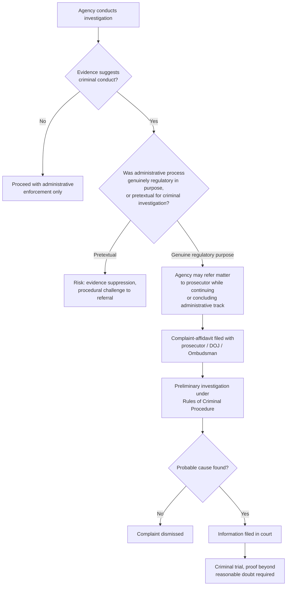

## Referral of Matters for Criminal Prosecution

### Overview

Referral for criminal prosecution is the process by which an administrative agency, upon discovering evidence of conduct that constitutes a criminal offense (as distinguished from a purely administrative or civil violation), transmits the matter to the appropriate prosecutorial authority for the filing of criminal charges, since administrative agencies generally lack the power to prosecute crimes themselves or to impose criminal penalties such as imprisonment.

This referral function sits at the boundary between the administrative and criminal justice systems, and its proper handling raises distinct procedural, evidentiary, and constitutional issues — particularly regarding the interplay between administrative investigatory tools (subpoenas, compelled document production, inspections) and the heightened protections that attach once a matter is genuinely criminal in character.

**Key Points**

- Agencies typically possess civil/administrative enforcement power (fines, cease-and-desist orders, permit revocation) but not the power to prosecute crimes; that function belongs to the public prosecutor (in the Philippines, the National Prosecution Service under the Department of Justice, or the Office of the Ombudsman for public officers) and, following indictment, to the regular courts.
- Many regulatory statutes expressly criminalize certain conduct (e.g., operating without a required permit, willful violation of environmental standards, falsification of compliance reports) in addition to providing administrative sanctions, creating parallel administrative and criminal tracks for the same underlying conduct.
- The referral decision — when and how an agency moves a matter from administrative to criminal handling — carries significant procedural consequences, especially regarding the continued use of administrative compulsory process once criminal exposure becomes apparent.

### Statutory Basis for Referral

Referral authority and obligation are typically established by:

1. **The agency's own charter or enabling statute**, which may expressly direct the agency to refer matters involving probable criminal violations to the Department of Justice (DOJ) or other prosecutorial body.
2. **General provisions of criminal procedure**, since any private person, government officer, or agency with knowledge of facts constituting a crime may file a complaint or provide information to the prosecutor, and agencies acting as complainants play this role for regulatory crimes.
3. **Specific environmental statutes** — the Clean Air Act, Clean Water Act, R.A. No. 6969 (Toxic Substances and Hazardous Waste), and the Revised Forestry Code, among others, define specific criminal offenses (often for willful, repeated, or grossly negligent violations, or for violations causing substantial environmental damage) that the DENR or its bureaus are directed or authorized to refer for prosecution, typically after or alongside pursuing administrative remedies.

**Key Points**

- Referral is generally treated as filing a complaint-affidavit with the prosecutor's office, initiating the preliminary investigation process under the Rules of Criminal Procedure, rather than the agency itself adjudicating criminal guilt.
- Some statutes make administrative exhaustion (completion of the administrative process) a practical or even formal prerequisite before criminal referral, particularly where the criminal offense is defined by reference to a violation of an administrative order (e.g., "willful failure to comply with a cease-and-desist order" as a separate criminal offense from the underlying environmental violation itself).

### The Administrative-Criminal Interface: Key Tensions

**Use of Administrative Compulsory Process for Criminal Ends**

A central and recurring issue is whether an agency may use its administrative subpoena, inspection, or reporting powers — which typically operate under a relaxed "administrative probable cause" or regulatory-purpose standard — to gather evidence that is then used or intended to be used in a criminal prosecution. This raises the "pretext" problem discussed in relation to administrative searches: if an agency's compulsory process is genuinely exercised for a legitimate regulatory purpose, evidence incidentally discovered that reveals criminal conduct can generally still be referred and used, but if the administrative process was invoked as a subterfuge to evade the higher probable cause and procedural protections required for criminal investigation, courts may suppress the resulting evidence or otherwise sanction the agency's conduct.

**Rights of the Respondent Once Criminal Exposure Is Apparent**

Once it becomes reasonably apparent that a matter may result in criminal referral, several protections become more pointed:

- **The privilege against self-incrimination** (Article III, Section 17) applies with full force to testimonial compulsion, even though it does not bar compelled production of required records (see the required records doctrine).
- **The right to counsel** in custodial investigation contexts (Article III, Section 12) attaches specifically to custodial interrogation, not to ordinary administrative fact-finding interviews where the person is not in custody — but agencies should be attentive to the point at which an interview shifts from general fact-finding to something closer to accusatory questioning of a specific suspect.
- **Miranda-type warnings** are not generally required for non-custodial administrative interviews, but many agencies adopt internal practice of advising a person that statements could be used in a subsequent criminal referral, both for fairness and to protect the integrity of any eventual referral.

### Parallel Proceedings: Administrative and Criminal Tracks

**Independence of the Two Tracks**

Philippine jurisprudence generally treats administrative and criminal proceedings arising from the same facts as independent of each other, meaning:

- A finding (or lack of finding) of administrative liability does not automatically determine criminal liability, and vice versa, because the two proceedings apply different standards of proof (substantial evidence versus proof beyond reasonable doubt) and serve different purposes.
- An acquittal in a criminal case does not automatically extinguish administrative liability for the same underlying conduct, since administrative liability may be established even where guilt beyond reasonable doubt cannot be, and conversely.
- Simultaneous prosecution of both tracks generally does not violate double jeopardy, because double jeopardy protection applies to successive *criminal* prosecutions for the same offense, not to the coexistence of civil/administrative and criminal sanctions for the same conduct.

**Suspension of Administrative Proceedings Pending Criminal Resolution**

While the two tracks are formally independent, agencies and courts sometimes consider suspending administrative proceedings pending resolution of a related criminal case, particularly where:

- the same factual and legal issues are genuinely intertwined, and
- proceeding with both simultaneously risks inconsistent factual findings or prejudices the respondent's ability to defend the criminal case (e.g., compelled administrative testimony potentially undermining the privilege against self-incrimination in the parallel criminal matter).

This is a matter of prudential judgment rather than an absolute rule, and agencies retain discretion to proceed administratively notwithstanding a pending criminal referral, especially where urgent regulatory action (e.g., a cease-and-desist order to stop ongoing environmental harm) cannot practically await the criminal process's conclusion.

**Key Points**

- The general independence-of-proceedings principle protects the practical effectiveness of administrative enforcement — an agency should not need to wait years for a criminal case to conclude before it can, for example, revoke a permit or impose a compliance order to stop ongoing harm.
- At the same time, the risk that compelled administrative statements/records could later surface in a parallel criminal case is real, and this is where the required records doctrine, the act-of-production doctrine, and any applicable use/derivative-use immunity provisions become practically important (see related topic on self-incrimination).

### Application in Environmental Enforcement

Environmental statutes typically define specific criminal offenses distinct from, though often overlapping factually with, administrative violations:

- **Operating without a required Environmental Compliance Certificate** — administratively sanctionable (suspension/fine) and, under P.D. No. 1586's implementing framework, potentially criminally punishable if operation proceeds despite denial or absence of the required ECC.
- **Illegal disposal of hazardous waste** under R.A. No. 6969 — carries both administrative penalties (against the facility/permit) and criminal penalties (against responsible individuals) for knowing or willful violations.
- **Illegal logging and forest destruction** under the Revised Forestry Code (P.D. No. 705) — a paradigm case where administrative seizure of forest products and equipment proceeds alongside criminal prosecution of the individuals responsible.
- **Willful violation of a final cease-and-desist order** — often independently criminalized as contempt-like conduct, separate from the underlying environmental violation the CDO addressed.

**Example**

An EMB inspection of a facility discharging industrial wastewater without a Discharge Permit may reveal not only the civil/administrative violation (operating without a permit, warranting fines and a compliance order) but also facts suggesting the facility's managers knowingly falsified self-monitoring reports to conceal the unpermitted discharge. The falsification of official/required reports may constitute a separate criminal offense (potentially under the environmental statute's own penal provisions, and/or general provisions on falsification of documents), warranting referral to the DOJ for preliminary investigation of the individuals involved, while the EMB simultaneously proceeds with administrative fines and a compliance order against the facility itself.

**Key Points**

- Referral decisions in environmental matters often distinguish between the *facility/entity* (subject to administrative and, where the entity can be held liable, criminal sanctions) and *responsible individual officers* (who bear personal criminal liability, since imprisonment cannot be imposed on a juridical entity), requiring agencies to identify with reasonable specificity which individuals had knowledge of or directed the violative conduct.
- Referral for criminal prosecution of falsification, fraud, or willful/repeated violations often carries greater deterrent weight than administrative fines alone, since it exposes responsible individuals to personal criminal liability including potential imprisonment, distinct from a facility's civil penalty exposure.

### Illustrative Diagram — Divergence of Administrative and Criminal Tracks

<svg xmlns="http://www.w3.org/2000/svg" viewBox="0 0 760 360">
<text x="380" y="26" text-anchor="middle" font-size="17" font-weight="bold" fill="#1a1a1a">Divergent Administrative and Criminal Tracks (svg_diagram)</text>
<rect x="300" y="55" width="160" height="55" rx="6" fill="#e8f0fe" stroke="#3b5bdb" stroke-width="1.5" />
<text x="380" y="87" text-anchor="middle" font-size="12" fill="#1a1a1a">Same Underlying Facts</text>
<line x1="380" y1="110" x2="220" y2="150" stroke="#333" stroke-width="1.5" marker-end="url(#a5)" />
<line x1="380" y1="110" x2="540" y2="150" stroke="#333" stroke-width="1.5" marker-end="url(#a5)" />
<rect x="90" y="155" width="260" height="90" rx="6" fill="#e6f7e6" stroke="#2b8a3e" stroke-width="1.5" />
<text x="220" y="180" text-anchor="middle" font-size="12" font-weight="bold" fill="#1a1a1a">Administrative Track</text>
<text x="220" y="200" text-anchor="middle" font-size="10" fill="#444">Standard: substantial evidence</text>
<text x="220" y="216" text-anchor="middle" font-size="10" fill="#444">Sanctions: fine, CDO, permit action</text>
<text x="220" y="232" text-anchor="middle" font-size="10" fill="#444">Forum: agency, then court review</text>
<rect x="410" y="155" width="260" height="90" rx="6" fill="#fff4e6" stroke="#e8590c" stroke-width="1.5" />
<text x="540" y="180" text-anchor="middle" font-size="12" font-weight="bold" fill="#1a1a1a">Criminal Track</text>
<text x="540" y="200" text-anchor="middle" font-size="10" fill="#444">Standard: proof beyond reasonable doubt</text>
<text x="540" y="216" text-anchor="middle" font-size="10" fill="#444">Sanctions: fine and/or imprisonment</text>
<text x="540" y="232" text-anchor="middle" font-size="10" fill="#444">Forum: prosecutor, then regular courts</text>

<text x="380" y="290" text-anchor="middle" font-size="11" fill="#444">Independent outcomes — no automatic collateral effect either direction</text>

<text x="380" y="308" text-anchor="middle" font-size="11" fill="#444">No double jeopardy bar between the two tracks</text>

</svg>

### Role of the Ombudsman and Special Prosecutorial Bodies

Where the respondent is a public officer or employee, or where the alleged conduct involves graft or corruption in connection with regulatory enforcement (e.g., a regulator allegedly accepting a bribe to overlook an environmental violation), referral may instead route through, or in parallel with, the **Office of the Ombudsman**, which has both administrative disciplinary jurisdiction over public officers and the authority to investigate and prosecute graft and corruption cases before the Sandiganbayan or regular courts, depending on the offense and the officer's rank/salary grade.

**Key Points**

- Agencies encountering evidence of corruption or malfeasance by their own personnel, or by other public officials in connection with a regulated activity, generally have an independent obligation to refer such matters to the Ombudsman, separate from any referral of the primary regulatory violation to the DOJ.
- This creates a potential three-track scenario in some environmental enforcement matters: (1) administrative action against the regulated entity, (2) criminal referral to the DOJ against responsible private individuals, and (3) referral to the Ombudsman regarding any public officer whose conduct facilitated or concealed the violation.

### Practical Considerations for Agencies Making Referral Decisions

**Key Points**

- Agencies should build a referral package that clearly separates (a) findings supporting administrative liability, (b) evidence specifically supporting elements of any criminal offense, and (c) the chain of custody and manner of collection for any physical or documentary evidence, since criminal prosecution will scrutinize evidentiary foundation more rigorously than administrative adjudication typically does.
- Timing matters: referring too early, before an adequate evidentiary record exists, risks a prosecutor's dismissal for lack of probable cause; referring too late risks prescription (statute of limitations) issues, particularly for environmental offenses with statutorily short prescriptive periods relative to the time needed to detect and investigate violations. [Unverified — specific prescriptive periods vary by statute (e.g., special environmental laws often carry their own prescriptive periods distinct from the general Revised Penal Code framework) and should be confirmed against the specific offense being considered for referral.]
- Coordination between the agency's legal officers and the prosecutor's office prior to formal referral, where feasible, can help ensure the referral package addresses the specific elements the prosecutor will need to establish probable cause, improving the referral's practical effectiveness.
- Agencies should be mindful that referral does not require or presume administrative proceedings have concluded; many statutes and general practice permit simultaneous pursuit of both tracks, but agencies should track statutory language carefully, since some specific offenses are defined in a way that requires a final administrative determination (e.g., a final CDO) as a threshold element of the criminal offense itself.

**Related Topics**

- The required records doctrine and self-incrimination (interaction with compelled administrative statements later used or sought in criminal proceedings)
- Administrative subpoenas and compelled production of records (pretext and use-for-criminal-purposes limits)
- Civil penalty assessment and settlement practice (relationship between administrative settlement and preserved criminal exposure)
- Consent decrees and judicial enforcement of agency orders (contempt versus criminal referral as enforcement paths)
- Double jeopardy and the independence of administrative and criminal proceedings
- Preliminary investigation procedure under the Rules of Criminal Procedure
- Jurisdiction and procedure before the Office of the Ombudsman and the Sandiganbayan
- Prescription periods for environmental and special-law criminal offenses