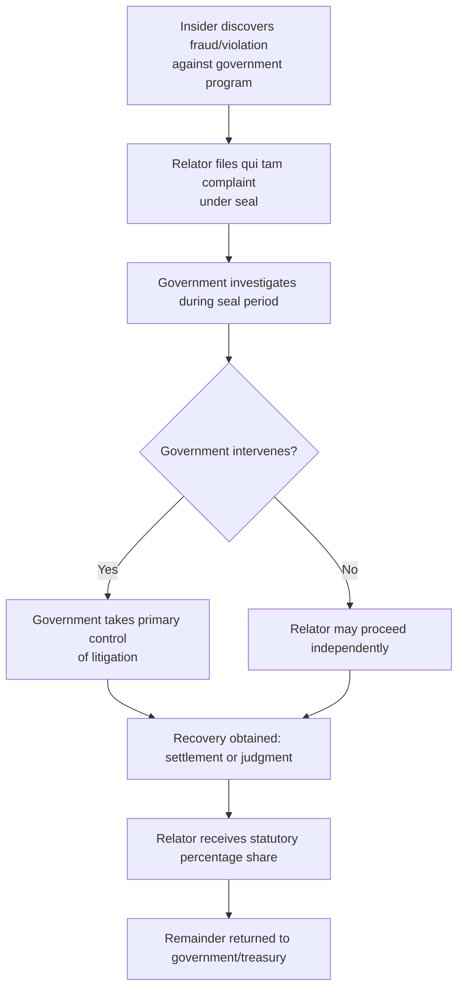

## Whistleblower Protections and Qui Tam Style Enforcement Incentives

### Overview

Whistleblower protection refers to the body of legal safeguards shielding individuals who report violations of law — including regulatory non-compliance, fraud, corruption, or environmental harm — from retaliation by their employer or the regulated entity involved. Qui tam-style enforcement incentives refer to mechanisms, most fully developed in U.S. law, that allow a private person (a "relator") to bring an enforcement action on behalf of the government and share in any resulting recovery, thereby harnessing private information and initiative to supplement scarce public enforcement resources.

These two concepts are related but distinct: whistleblower protection is fundamentally defensive (protecting the reporter from harm), while qui tam mechanisms are affirmatively incentivizing (rewarding the reporter with a share of recovery and, in some models, standing to litigate). Many modern regulatory frameworks combine both — protecting whistleblowers from retaliation while also offering monetary incentives or a formal role in enforcement.

**Key Points**

- Whistleblower protection addresses the practical reality that insiders (employees, contractors, competitors) are often uniquely positioned to detect violations that would otherwise evade agency detection, but face strong disincentives to report absent legal protection.
- Qui tam incentive structures further address the "who bears the cost of enforcement" problem by giving the whistleblower a direct financial stake in successful enforcement, aligning private incentives with public enforcement goals.
- Both mechanisms are especially significant in environmental law, where violations often occur on private property, are documented in internal records, and may otherwise be difficult for regulators to detect through inspection alone.

### The Qui Tam Concept — Origins and U.S. Framework

**Historical and Etymological Background**

"Qui tam" is short for the Latin phrase *qui tam pro domino rege quam pro se ipso in hac parte sequitur* ("who sues on behalf of the King as well as for himself"), reflecting the ancient common-law concept of a private person suing to enforce a public right while sharing in any resulting penalty.

**The U.S. False Claims Act (FCA) Model**

The most developed and influential qui tam framework is the U.S. federal False Claims Act, which allows a private relator to file a lawsuit *in the name of the government* alleging that a person or entity defrauded a federal program (originally focused on fraud against government contracts, later extended in practice to various forms of false claims for government funds or false certifications of regulatory compliance tied to federal funding or contracts).

Key structural features of this model include:

1. **Relator standing** — the private individual, not the government, initiates the lawsuit, though it is filed "under seal" and the government is given an opportunity to investigate and decide whether to intervene.
2. **Government intervention option** — if the government intervenes, it typically takes over primary control of the litigation; if it declines, the relator may proceed with the action independently.
3. **Statutory recovery share** — a successful relator is entitled to a percentage of the recovery (historically ranging roughly from 15–25% if the government intervenes, and 25–30% if it does not, subject to statutory caps and case-specific factors), creating a direct financial incentive.
4. **Anti-retaliation provisions** — the FCA includes its own retaliation cause of action, allowing a relator-employee to sue for reinstatement, back pay, and other relief if retaliated against for the protected whistleblowing activity.

**Key Points**

- The qui tam mechanism effectively deputizes private citizens as enforcers of public law, addressing situations where government enforcement resources are limited relative to the volume of potential violations.
- [Unverified] The specific percentage recovery shares and procedural details of the FCA framework have been subject to periodic amendment; current statutory percentages and caps should be verified against the currently effective U.S. federal statute if being cited for precise figures in a specific matter.

### Comparative and Philippine Context

**Absence of a General Qui Tam Statute**

Philippine law does not have a general, FCA-style qui tam statute allowing private citizens to sue on behalf of the government for a share of recovered penalties across the board. However, several distinct but functionally related mechanisms exist:

- **Citizen suits under environmental statutes** — the Philippine Clean Air Act (R.A. No. 8749), the Clean Water Act (R.A. No. 9275), and the Ecological Solid Waste Management Act (R.A. No. 9003) contain citizen-suit provisions allowing any citizen to file an action to enforce the statute's provisions or to compel the concerned government agency to perform its duty, without needing to show a personal, differentiated injury as in ordinary standing doctrine. These citizen suits, however, generally do not carry a qui tam-style monetary bounty for the citizen-plaintiff; the primary relief sought is typically injunctive/compliance-oriented rather than a personal financial share of a recovered penalty.
- **Rewards for informants** — various Philippine regulatory and revenue statutes (notably in customs and tax administration, and some anti-smuggling and anti-corruption contexts) provide for informant's rewards, typically a percentage of recovered duties, taxes, or the value of seized/forfeited goods, payable to a person who provides originally sourced information leading to a successful enforcement action. This is closer in spirit to the qui tam financial-incentive model, though it is administratively structured (the agency itself pursues the case and pays a reward) rather than granting the informant a private right to litigate on the government's behalf.
- **Whistleblower protection under the Anti-Graft context** — the Witness Protection, Security and Benefit Act (R.A. No. 6981) provides protection (including admission to a witness protection program, immunity from prosecution in appropriate cases, and security) for witnesses in cases involving grave offenses, including certain corruption and organized-crime-adjacent matters, but is not itself an environmental or general regulatory whistleblower statute.
- **Internal agency whistleblower/hotline mechanisms** — many Philippine regulatory agencies, including DENR bureaus, maintain internal reporting channels (hotlines, online complaint portals) for reporting violations, environmental damage, or agency personnel misconduct, generally without a codified anti-retaliation cause of action comparable to the FCA's, though general labor law protections against illegal dismissal may apply where an employee is terminated in retaliation for reporting employer misconduct, subject to proof of the causal link.

**Key Points**

- [Inference — the Philippine regulatory landscape does not currently have a comprehensive, environmental-specific qui tam or bounty statute equivalent to the FCA; existing mechanisms are narrower (informant's rewards in specific revenue/customs contexts) or oriented toward standing/injunctive relief (citizen suits) rather than a general private right to sue for a share of recovered penalties across environmental law broadly. Given that legislative proposals in this area can and do arise, current bills and any newly enacted legislation should be checked before concluding this remains the state of the law at any given time.]
- Practitioners advising a prospective Philippine whistleblower in an environmental matter should carefully distinguish which of these several, narrower mechanisms (if any) applies to the specific fact pattern, since no single unified "whistleblower law" analogous to the FCA governs the field.

### General Anti-Retaliation Protections

Even absent a qui tam bounty mechanism, anti-retaliation protection for whistleblowers is a distinct and independently important legal category, generally covering:

1. **Protected activity** — reporting a suspected violation to a supervisor, internal compliance channel, or external regulator/law enforcement body, participating in an ensuing investigation, or refusing to participate in the unlawful conduct itself.
2. **Adverse action** — termination, demotion, harassment, pay reduction, or other materially adverse changes in employment conditions taken because of the protected activity.
3. **Causal connection** — the whistleblower must generally show, directly or through circumstantial evidence (timing, disparate treatment, shifting explanations by the employer), that the adverse action was motivated by the protected activity rather than legitimate, independent business reasons.
4. **Burden-shifting frameworks** — many statutory whistleblower schemes (again, most elaborately developed in U.S. federal and state law) employ a burden-shifting structure: once the whistleblower makes a prima facie showing of protected activity, knowledge by the employer, and temporal proximity to the adverse action, the burden shifts to the employer to articulate a legitimate, non-retaliatory reason, which the whistleblower may then attempt to show is pretextual.

**Key Points**

- Robust anti-retaliation protection is often considered the more foundational and universally necessary component of whistleblower policy, since even a purely informational reporting channel (without any financial bounty) is far less effective if employees reasonably fear termination or other reprisal for using it.
- In the Philippine labor law context, an employee terminated in retaliation for reporting employer misconduct (including environmental violations) may pursue an illegal dismissal complaint before the NLRC, potentially framing the retaliatory termination as lacking just or authorized cause under the Labor Code, even without reliance on a dedicated whistleblower statute — though this route requires proving the retaliatory motive as the operative cause of dismissal.

### Application to Environmental Enforcement

**Why Whistleblowers Matter Disproportionately in Environmental Compliance**

Environmental violations frequently involve:

- Internal falsification of self-monitoring reports or bypassing of pollution control equipment during off-hours, which are difficult for periodic agency inspections to detect.
- Deliberate concealment of hazardous waste disposal practices.
- Internal knowledge (by plant operators, environmental compliance officers, or contractors) of non-compliance that is not reflected in the facility's official records at all.

Because these forms of violation are structurally difficult to detect through inspection or required recordkeeping alone (indeed, sometimes precisely because the required records have been falsified), whistleblower reporting can be one of the few practical routes to detection.

**Example**

An environmental compliance officer within a manufacturing facility discovers that the facility's wastewater treatment system is being bypassed on night shifts to reduce operating costs, with the falsified self-monitoring reports submitted to the EMB reflecting compliant discharge levels that do not reflect actual practice. If the officer reports this internally and is subsequently terminated shortly afterward under a pretextual performance justification, this pattern — protected activity, employer knowledge, adverse action, suspicious timing, and a potentially pretextual stated reason — would support an illegal dismissal claim, and the underlying environmental violation and falsification would separately support administrative enforcement (fines, compliance orders) and criminal referral for falsification, quite independently of the employment dispute's outcome.

**Key Points**

- Agencies benefit from actively publicizing accessible, confidential reporting channels for exactly this kind of insider information, since the practical value of whistleblower reporting depends heavily on whether potential reporters know the channel exists and trust its confidentiality and non-retaliation assurances.
- Environmental compliance programs within regulated entities increasingly include their own internal whistleblower/ethics hotlines, both to detect and correct problems before they escalate to external regulatory or criminal exposure, and to demonstrate good-faith compliance efforts that may mitigate penalties if a violation is later discovered.

### Illustrative Diagram — Whistleblower Protection vs. Qui Tam Incentive Structures

<svg xmlns="http://www.w3.org/2000/svg" viewBox="0 0 760 340">
<text x="380" y="26" text-anchor="middle" font-size="17" font-weight="bold" fill="#1a1a1a">Two Distinct but Complementary Mechanisms (svg_diagram)</text>
<rect x="60" y="60" width="290" height="230" rx="8" fill="#e8f0fe" stroke="#3b5bdb" stroke-width="1.5" />
<text x="205" y="90" text-anchor="middle" font-size="13" font-weight="bold" fill="#1a1a1a">Whistleblower Protection</text>
<text x="205" y="115" text-anchor="middle" font-size="10" fill="#444">Purpose: shield from retaliation</text>
<text x="205" y="135" text-anchor="middle" font-size="10" fill="#444">Trigger: protected reporting activity</text>
<text x="205" y="155" text-anchor="middle" font-size="10" fill="#444">Remedy: reinstatement, back pay,</text>
<text x="205" y="171" text-anchor="middle" font-size="10" fill="#444">damages for retaliation</text>
<text x="205" y="195" text-anchor="middle" font-size="10" fill="#444">PH examples: NLRC illegal dismissal,</text>
<text x="205" y="211" text-anchor="middle" font-size="10" fill="#444">Witness Protection Act (narrow scope)</text>
<text x="205" y="240" text-anchor="middle" font-size="10" fill="#666">Foundational — needed regardless</text>
<text x="205" y="256" text-anchor="middle" font-size="10" fill="#666">of any bounty mechanism</text>
<rect x="410" y="60" width="290" height="230" rx="8" fill="#fff4e6" stroke="#e8590c" stroke-width="1.5" />
<text x="555" y="90" text-anchor="middle" font-size="13" font-weight="bold" fill="#1a1a1a">Qui Tam / Incentive Model</text>
<text x="555" y="115" text-anchor="middle" font-size="10" fill="#444">Purpose: reward and incentivize reporting</text>
<text x="555" y="135" text-anchor="middle" font-size="10" fill="#444">Trigger: original information leading</text>
<text x="555" y="151" text-anchor="middle" font-size="10" fill="#444">to successful recovery</text>
<text x="555" y="175" text-anchor="middle" font-size="10" fill="#444">Remedy: percentage of recovery,</text>
<text x="555" y="191" text-anchor="middle" font-size="10" fill="#444">possible private litigation right</text>
<text x="555" y="215" text-anchor="middle" font-size="10" fill="#444">PH examples: customs/tax informant</text>
<text x="555" y="231" text-anchor="middle" font-size="10" fill="#444">rewards (narrow, sector-specific)</text>
<text x="555" y="256" text-anchor="middle" font-size="10" fill="#666">No general FCA-style statute in PH law</text>
</svg>

### Interaction with Agency Investigation Powers

Whistleblower-sourced information often serves as the initial trigger for the exercise of other investigatory and enforcement powers already discussed in this chapter:

| Whistleblower Report Content | Likely Agency Response |
| --- | --- |
| Allegation of falsified self-monitoring reports | Administrative subpoena for underlying raw monitoring data and instrument logs |
| Allegation of unpermitted nighttime discharge | Unannounced inspection, possibly timed to the alleged period of violation |
| Allegation of bribery of an inspector | Referral to the Ombudsman in addition to the underlying environmental violation |
| Allegation of concealed hazardous waste disposal site | Site inspection, sampling, and potential referral for criminal prosecution under R.A. No. 6969 |

**Key Points**

- A whistleblower report, standing alone, is generally treated as a lead requiring independent verification through the agency's own investigatory tools (subpoena, inspection, sampling) rather than a sufficient basis by itself for a final administrative or criminal determination — due process requires the agency to develop an independent evidentiary record.
- Confidentiality of the whistleblower's identity during the investigative phase is often critical both to protect the individual from retaliation and to preserve the integrity of the investigation (preventing evidence destruction or witness tampering), though ultimate disclosure may become necessary if the matter proceeds to formal adjudication or criminal trial where confrontation rights apply.

### Practical Design Considerations for Whistleblower Programs

**Key Points**

- Effective programs generally require: (1) a clear, accessible, and genuinely confidential reporting channel; (2) explicit anti-retaliation policy commitments, ideally backed by a real enforcement mechanism rather than aspirational language alone; (3) a defined process for triaging and investigating reports; and (4) periodic communication to the workforce that the channel exists and has been used effectively, to build trust.
- Where financial incentives are legally available (e.g., customs/tax informant reward schemes), clear published criteria for reward eligibility and calculation reduce disputes and improve the credibility of the incentive.
- [Unverified] The comparative effectiveness of pure protection-based whistleblower regimes versus incentive-based (qui tam/bounty) regimes in maximizing detection of environmental violations specifically is a matter of ongoing empirical and policy debate rather than settled consensus, and any comparative effectiveness claims should be treated as contested rather than established fact.

**Next Steps**

- Citizen suit provisions under Philippine environmental statutes (standing and available relief)
- Informant's reward schemes in Philippine customs and tax administration as a comparative model
- The U.S. False Claims Act qui tam mechanism in greater procedural detail
- NLRC illegal dismissal doctrine as applied to retaliatory termination claims
- Confidentiality of investigative sources versus confrontation rights in adjudicatory proceedings
- Corporate compliance program design and its mitigating effect on penalty assessment
- The Witness Protection, Security and Benefit Act (R.A. No. 6981) and its scope of application
- Referral of matters for criminal prosecution (whistleblower-sourced evidence as referral trigger)