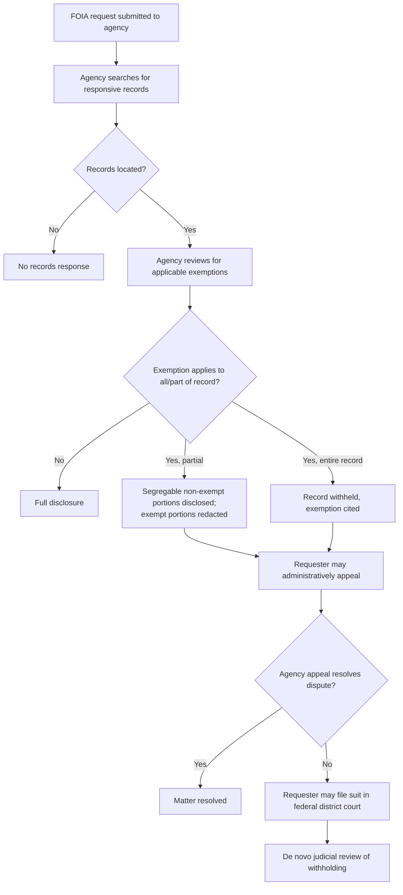
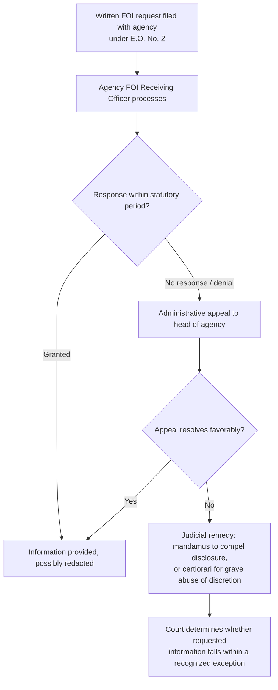

## The Freedom of Information Act: Exemptions and Litigation Strategy

### Jurisdictional Note

There is no Philippine statute formally titled a "Freedom of Information Act." Access to government information in the Philippines is governed by: (1) the constitutional right to information under Article III, Section 7 and the state policy of full public disclosure under Article II, Section 28; and (2) **Executive Order No. 2, series of 2016** ("Operationalizing in the Executive Branch the People's Constitutional Right to Information"), which applies FOI as policy only to Executive branch agencies, not to Congress, the Judiciary, constitutional commissions, or local government units except where those bodies voluntarily adopt similar policies. The term "Freedom of Information Act" as a specific, comprehensively litigated statutory exemption scheme is most fully developed in **U.S. federal law (5 U.S.C. § 552)**. Because this syllabus item is framed generically, both frameworks are addressed below, clearly labeled, so the doctrinally rich U.S. exemption/litigation architecture is available as a reference model while the actually-controlling Philippine framework is not misstated as being the same thing.

**Key Points**

- Treat "FOIA exemptions" analysis in a Philippine administrative law context as informed by, but not directly governed by, U.S. FOIA case law — the U.S. framework is instructive for structure and analytical categories, not controlling authority.
- E.O. No. 2 is an executive issuance, not a statute; it can be modified or revoked by a subsequent President without need for congressional action, which is itself a significant structural distinction from a legislated FOIA.
- Numerous "Right to Information," "Freedom of Information," or "People's FOIA" bills have been filed in the Philippine Congress over multiple congresses without enactment as of the most recent well-established legislative record; the current status of any such bill should be verified for currency given the fluid nature of pending legislation.

### U.S. Federal FOIA — Statutory Framework and Exemptions

**Basic Structure**

5 U.S.C. § 552 establishes a general presumption that records held by federal executive branch agencies must be disclosed upon request, subject to nine specifically enumerated exemptions and three exclusions. The burden is placed on the agency to justify withholding, and the statute is construed with a presumption favoring disclosure.

**The Nine Exemptions**

| Exemption | Subject Matter |
| --- | --- |
| 1 | Properly classified national security information |
| 2 | Internal personnel rules and practices (narrowed significantly by subsequent case law to genuinely trivial administrative matters) |
| 3 | Information specifically exempted by another statute |
| 4 | Trade secrets and confidential commercial/financial information |
| 5 | Inter-agency or intra-agency deliberative process, attorney-client, and attorney work-product privileged materials |
| 6 | Personnel, medical, and similar files whose disclosure would constitute a clearly unwarranted invasion of personal privacy |
| 7 | Records compiled for law enforcement purposes, subject to sub-categories (7A–7F) addressing interference with proceedings, privacy, informant identity, techniques, and safety |
| 8 | Reports related to examination of financial institutions |
| 9 | Geological and geophysical information concerning wells |

**Key Points**

- Exemptions 4 (commercial/trade secret) and 5 (deliberative process) are the most heavily litigated in the environmental and regulatory context, since they frequently arise when a company resists disclosure of compliance data it submitted to a regulator, or when an agency resists disclosure of internal draft analyses preceding a final regulatory decision.
- The deliberative process privilege under Exemption 5 protects the "give and take" of internal agency decision-making but does not protect purely factual material that can be segregated from the deliberative/opinion content, nor does it protect the agency's final, adopted rationale once a decision is made.
- Exemption 4's trade secret/confidential business information protection is central to environmental regulatory contexts because regulated entities frequently submit proprietary process information (e.g., specific chemical formulations, proprietary pollution control technology specifications) alongside compliance data that itself must often be disclosed.

### U.S. FOIA Litigation Strategy

**Pre-Litigation Steps**

1. **Craft the request with precision** — overly broad requests invite delay and increase the surface area for exemption claims; overly narrow requests risk missing responsive material. Reasonably describing records (rather than open-ended categories) improves both search efficiency and the strength of any later "adequacy of search" argument.
2. **Exhaust the administrative appeal** — nearly all agencies require exhaustion of an internal administrative appeal from an initial denial before judicial review is available, and courts generally enforce this exhaustion requirement except in narrow circumstances (e.g., constructive denial through unreasonable delay).
3. **Track statutory response deadlines** — FOIA imposes response deadlines (with provisions for extensions in unusual circumstances); an agency's failure to respond within the statutory period can itself support treating the request as constructively denied, permitting suit even without a formal appeal decision.

**Core Litigation Issues**

Once in court, FOIA litigation typically centers on:

1. **Adequacy of the search** — whether the agency conducted a search reasonably calculated to uncover all responsive records, assessed through agency affidavits (often called *Vaughn* declarations, after *Vaughn v. Rosen*) describing the search methodology.
2. **Applicability of claimed exemptions** — courts review exemption claims de novo, typically relying on a **Vaughn index**, an itemized log describing each withheld document or redaction and the specific exemption(s) claimed, sufficiently detailed to allow meaningful adversarial testing without revealing the protected content itself.
3. **Segregability** — even where an exemption validly applies to part of a document, the agency must disclose any reasonably segregable non-exempt portions; courts often require the agency to affirmatively demonstrate that it considered segregability rather than withholding entire documents wholesale.
4. **In camera review** — courts may examine withheld documents privately to assess the validity of exemption claims where the Vaughn index and agency affidavits are insufficient to resolve the dispute.
5. **Attorney's fees** — a requester who "substantially prevails" may recover reasonable attorney's fees and litigation costs, which functions as an important incentive structure encouraging FOIA litigation to enforce the statute's disclosure presumption despite the individually modest stakes typical of many requests.

**Key Points**

- Litigation strategy often centers on forcing the agency to justify withholding at a level of specificity that reveals whether the claimed exemption is being used as a genuine protection or as a pretext to avoid releasing merely embarrassing or inconvenient (but non-exempt) information.
- Environmental FOIA litigation frequently involves competitor-versus-competitor disputes over Exemption 4 trade secret claims (a competitor seeking a rival's environmental compliance submissions) as much as public-interest-versus-government disputes, adding a reverse-FOIA dimension where the submitter of information may itself sue to block the agency's proposed disclosure.

### Reverse-FOIA Actions

A distinct litigation posture arises when the *submitter* of information (e.g., a regulated company that provided data to the agency under an assurance or expectation of confidentiality) seeks to prevent the agency from voluntarily disclosing that information in response to a third party's FOIA request — a "reverse-FOIA" suit, typically framed under the Administrative Procedure Act rather than FOIA itself (since FOIA does not grant submitters an independent cause of action to block disclosure).

**Key Points**

- Reverse-FOIA actions place the submitter, rather than the requester, in the position of plaintiff, and the relevant question becomes whether the agency's decision to disclose was arbitrary and capricious under general administrative law review standards, not simply whether an exemption "could" have applied.
- This dynamic is especially salient in environmental regulation, where regulated entities routinely submit process and formulation data alongside required environmental compliance information, creating an ongoing tension between public interest in environmental transparency and legitimate trade secret protection.

### The Philippine Framework: Executive Order No. 2 (2016)

**Scope and Coverage**

E.O. No. 2 operationalizes the constitutional right to information specifically within the Executive branch, covering all government offices under the Office of the President, executive departments, bureaus, and agencies, including government-owned and controlled corporations, but excluding Congress, the Judiciary, the Office of the Ombudsman, and constitutional commissions unless those bodies separately adopt comparable policies (some have done so through their own issuances).

**Exceptions to Disclosure under E.O. No. 2**

E.O. No. 2 does not use "exemptions" numbered as in U.S. FOIA, but incorporates by reference "exceptions" recognized under the Constitution, existing law, and jurisprudence, generally including:

- Information covered by executive privilege (as recognized in Philippine jurisprudence, e.g., *Neri v. Senate Committee*, and related doctrine on presidential communications, deliberative process, and state secrets)
- National security and defense information
- Information affecting public order and safety
- Information on investigations conducted by administrative, civil, or criminal bodies that may prejudice a fair trial
- Trade secrets and confidential business information, and bank deposit information protected by the Bank Secrecy Law
- Personal information protected by the Data Privacy Act
- Records of ongoing deliberations and decision-making processes (analogous in spirit to the U.S. deliberative process privilege)

**Key Points**

- Because these exceptions are drawn from existing constitutional doctrine, statutes, and jurisprudence rather than enumerated exhaustively within E.O. No. 2 itself, applying them requires cross-referencing the specific underlying legal source of each claimed exception (e.g., the Data Privacy Act for personal information, the Bank Secrecy Law for deposit records, *Neri* and related cases for executive privilege) rather than relying on E.O. No. 2's text alone.
- [Inference — because E.O. No. 2 is a policy issuance rather than a statute with its own developed body of implementing case law comparable to U.S. FOIA's decades of Vaughn-index and segregability jurisprudence, the practical litigation mechanics (evidentiary showings required to justify withholding, standard forms of index or log expected) are less standardized in Philippine practice; practitioners should expect more reliance on general administrative law and constitutional-right-to-information jurisprudence than on a dedicated FOIA-specific procedural body of doctrine.]

**Procedure and Remedies under E.O. No. 2**

1. A written request is filed with the concerned agency's designated FOI Receiving Officer.
2. The agency must act on the request within a specified period (generally set at 15 working days, extendable in certain circumstances), providing either the requested information, a partial response with redactions, or a denial with stated legal basis.
3. A denial may be appealed to the head of agency and, further, is generally understood to be subject to judicial review through ordinary remedies (e.g., mandamus to compel disclosure of a legal duty, or certiorari where grave abuse of discretion in denial is alleged), given that E.O. No. 2 implements an underlying constitutional right rather than creating a wholly new and exclusive statutory remedy scheme.

**Key Points**

- Because E.O. No. 2 does not itself create a specialized cause of action or dedicated court analogous to U.S. FOIA's direct statutory judicial review provision, remedies for wrongful denial in the Philippines are generally pursued through the general framework of special civil actions (mandamus, certiorari) rather than a FOIA-specific statutory suit.
- Requesters should also consider that the underlying constitutional right to information under Article III, Section 7 exists independently of E.O. No. 2 and may support a mandamus action even against bodies not covered by E.O. No. 2, subject to the general limitations Philippine jurisprudence has placed on the right (e.g., that it does not extend to matters properly covered by recognized privileges, and generally applies to matters of public concern in which the requester need not show a distinct personal interest beyond that of a citizen).

### Application to Environmental Transparency

Access-to-information disputes are particularly significant in environmental law because:

- Environmental Impact Statements, Environmental Compliance Certificates, and associated public consultation records are, by design under the EIS System, meant to be publicly accessible to support informed community participation — though specific supporting technical data submitted by a proponent may still raise trade-secret withholding questions.
- Self-monitoring reports, compliance monitoring data, and inspection findings held by DENR/EMB are frequently the subject of citizen and civil-society requests, particularly following pollution incidents, and disputes over access to this data can significantly affect the practical ability of affected communities to pursue citizen suits or participate meaningfully in permitting processes.
- Comparative U.S. FOIA litigation over Toxics Release Inventory-type data, permit compliance records, and internal agency risk assessments provides an instructive (though not controlling) analytical model for how Philippine practitioners might frame arguments regarding the balance between trade secret protection and public environmental-health interest in disclosure.

**Example**

A community organization seeking DENR/EMB records on a factory's history of emission monitoring results following a reported air quality incident would, under the Philippine framework, request the information under E.O. No. 2 (if the responding body is covered) and rely on the constitutional right to information and any state policy favoring environmental disclosure; any denial based on an asserted trade-secret exception would need to be scrutinized to confirm the withheld material genuinely constitutes proprietary process information rather than the underlying emissions/compliance results themselves, which are less plausibly characterized as trade secrets given their direct relevance to public health and their status as compliance data required to be generated and reported under the facility's permit.

**Key Points**

- A recurring line-drawing exercise in both the U.S. and Philippine contexts is distinguishing genuinely proprietary process/formulation information (properly protectable) from the environmental performance/compliance data itself (generally not properly withheld as a trade secret, given its public regulatory character, echoing the required records doctrine's public-aspects reasoning).
- Because Philippine practice lacks a dedicated FOIA-specific litigation body of doctrine, practitioners often draw analogically on the required-records/public-aspects reasoning (see the related topic on the required records doctrine) to argue that compliance data mandated by permit conditions is not the kind of "confidential business information" a trade-secret-type exception is meant to protect.

### Illustrative Diagram — Comparative Structure

<svg xmlns="http://www.w3.org/2000/svg" viewBox="0 0 760 320">
<text x="380" y="26" text-anchor="middle" font-size="17" font-weight="bold" fill="#1a1a1a">Comparative FOI Frameworks (svg_diagram)</text>
<rect x="50" y="60" width="300" height="220" rx="8" fill="#e8f0fe" stroke="#3b5bdb" stroke-width="1.5" />
<text x="200" y="90" text-anchor="middle" font-size="13" font-weight="bold" fill="#1a1a1a">US Federal FOIA</text>
<text x="200" y="115" text-anchor="middle" font-size="10" fill="#444">Source: statute, 5 U.S.C. § 552</text>
<text x="200" y="133" text-anchor="middle" font-size="10" fill="#444">9 enumerated exemptions</text>
<text x="200" y="151" text-anchor="middle" font-size="10" fill="#444">De novo judicial review</text>
<text x="200" y="169" text-anchor="middle" font-size="10" fill="#444">Vaughn index practice</text>
<text x="200" y="187" text-anchor="middle" font-size="10" fill="#444">Fee-shifting for prevailing requesters</text>
<text x="200" y="205" text-anchor="middle" font-size="10" fill="#444">Reverse-FOIA suits available</text>
<text x="200" y="230" text-anchor="middle" font-size="10" fill="#666">Applies to all federal executive</text>
<text x="200" y="246" text-anchor="middle" font-size="10" fill="#666">agencies uniformly</text>
<rect x="410" y="60" width="300" height="220" rx="8" fill="#fff4e6" stroke="#e8590c" stroke-width="1.5" />
<text x="560" y="90" text-anchor="middle" font-size="13" font-weight="bold" fill="#1a1a1a">Philippine E.O. No. 2</text>
<text x="560" y="115" text-anchor="middle" font-size="10" fill="#444">Source: executive issuance,</text>
<text x="560" y="131" text-anchor="middle" font-size="10" fill="#444">implementing Art. III Sec. 7</text>
<text x="560" y="151" text-anchor="middle" font-size="10" fill="#444">Exceptions drawn from existing</text>
<text x="560" y="167" text-anchor="middle" font-size="10" fill="#444">law/jurisprudence, not enumerated</text>
<text x="560" y="187" text-anchor="middle" font-size="10" fill="#444">Mandamus/certiorari for enforcement</text>
<text x="560" y="205" text-anchor="middle" font-size="10" fill="#444">No dedicated FOIA fee-shifting statute</text>
<text x="560" y="230" text-anchor="middle" font-size="10" fill="#666">Covers Executive branch only;</text>
<text x="560" y="246" text-anchor="middle" font-size="10" fill="#666">revocable by subsequent President</text>
</svg>

### Practical Litigation/Advocacy Checklist

**Key Points**

- Identify the correct governing framework first — confirm whether the responding body is covered by E.O. No. 2, is subject to its own separate transparency issuance, or falls outside both, in which case reliance on the bare constitutional right and general mandamus doctrine becomes necessary.
- For any claimed exception/exemption, identify its specific underlying legal source (Data Privacy Act, Bank Secrecy Law, executive privilege jurisprudence, trade secret doctrine) rather than treating "confidentiality" as a generic, self-justifying category.
- Where trade secret/confidential business information is asserted to withhold environmental compliance data, consider framing an argument analogous to the required records doctrine — that legally mandated compliance records have public aspects that place them outside the category of protectable trade secrets, regardless of the framework invoked.
- Document the request and any denial in writing at each stage, since the availability and strength of mandamus/certiorari review depends on a clear administrative record showing a demand, a refusal, and (for mandamus) a clear legal duty to disclose.
- [Unverified] Given that FOI-related legislative proposals in the Philippines remain a live area of potential reform, confirm whether any newly enacted general FOI statute has since superseded or supplemented E.O. No. 2 before relying on this framework as current law in an actual matter.

**Related Topics**

- Executive privilege and the presidential communications privilege (*Neri v. Senate Committee* and progeny)
- The constitutional right to information under Article III, Section 7 and Article II, Section 28
- Environmental Impact Statement System public disclosure requirements under P.D. No. 1586
- The required records doctrine and public aspects of mandated compliance records
- Data Privacy Act intersections with public records requests
- Mandamus and certiorari as remedies for wrongful denial of information requests
- Comparative U.S. FOIA litigation over environmental compliance and Toxics Release Inventory data
- Citizen suits and standing to compel environmental disclosure