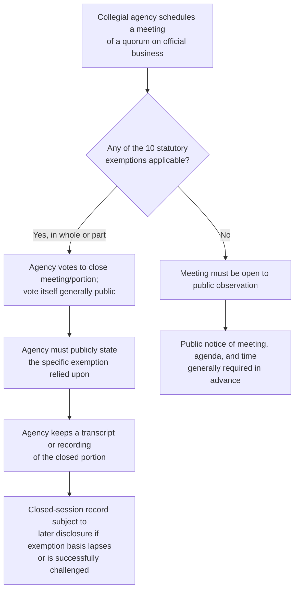
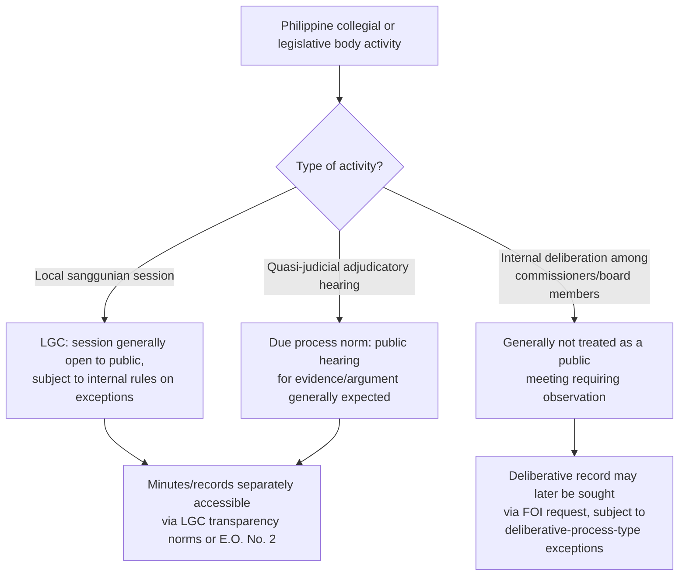

## The Government in the Sunshine Act and Open Meeting Requirements

### Jurisdictional Note

There is no Philippine statute titled the "Government in the Sunshine Act." That is a U.S. federal law, 5 U.S.C. § 552b, enacted in 1976, applicable to specifically enumerated multi-member federal agencies headed by a collegial body (commissions, boards). Philippine open-meeting/open-session norms instead derive from: (1) the constitutional policy of full public disclosure (Article II, Section 28) and the right to information (Article III, Section 7); (2) the Local Government Code's requirement that sanggunian sessions be open to the public; and (3) scattered provisions in specific agency charters requiring public hearings or open sessions for certain proceedings (e.g., rate-setting bodies, some quasi-judicial hearings). Both frameworks are addressed below, clearly labeled, since the U.S. statute offers the doctrinally developed structural model while the Philippine framework is what actually governs Philippine agency practice.

**Key Points**

- "Open meetings" and "open records/FOI" are related but distinct transparency mechanisms — open meetings govern *how a collegial body deliberates and decides* (real-time access to the decision-making process itself), while FOI/records access governs *after-the-fact access to documents* the body produces.
- The U.S. Sunshine Act model is most relevant here as a comparative structural reference for how a legislature might design closed-session exceptions and enforcement mechanisms, not as controlling Philippine law.

### U.S. Government in the Sunshine Act — Structure

**Coverage**

The Sunshine Act applies to "agencies" defined as those headed by a collegial body of two or more members, a majority of whom are appointed by the President with Senate confirmation — covering bodies such as the Securities and Exchange Commission, Federal Trade Commission, Federal Communications Commission, and similar multi-member regulatory commissions. It does not apply to single-headed executive departments or to agencies headed by a single administrator.

**General Rule and the Ten Exemptions**

The default rule is that every portion of an agency meeting (defined as deliberations of at least a quorum of the body's members where official agency business is conducted) must be open to public observation. The statute enumerates ten specific exemptions permitting closure of all or part of a meeting, generally paralleling the FOIA exemption categories but adapted to the meeting context:

| Exemption Category | Rationale |
| --- | --- |
| National defense/foreign policy (properly classified) | Same rationale as FOIA Exemption 1 |
| Internal personnel rules | Narrow, matters of internal agency management only |
| Matters specifically exempted by other statute | Same rationale as FOIA Exemption 3 |
| Trade secrets/confidential commercial information | Same rationale as FOIA Exemption 4 |
| Matters involving accusation of a crime or formal censure | Protects individuals from public airing of unresolved accusations |
| Personal privacy | Same rationale as FOIA Exemption 6 |
| Law enforcement investigatory records/information | Same rationale as FOIA Exemption 7 |
| Financial institution examination/condition reports | Same rationale as FOIA Exemption 8 |
| Financial speculation/significant financial effects on an agency's own regulated market | Distinct meeting-specific concern — premature disclosure could allow market manipulation |
| Matters concerning agency litigation, adjudication, or settlement negotiations | Protects the agency's litigation position and settlement posture |

**Key Points**

- The Sunshine Act's exemptions closely track FOIA's, reflecting a deliberate legislative design choice to maintain rough parity between what can be withheld from real-time meeting observation and what can be withheld from post-hoc document disclosure, though the two statutes remain independently applicable (an agency could theoretically close a meeting under one framework while facing different obligations under the other for resulting documents).
- Exemption 9's financial-speculation category is meeting-specific in a way that has no direct FOIA parallel, reflecting the unique real-time market-sensitivity concern that arises when a regulatory body is actively deliberating on a matter that could move markets if the direction of the deliberation became known before a final decision.

**Procedural Requirements**

Beyond the substantive open/closed determination, the Sunshine Act imposes procedural discipline:

1. **Advance public notice** of the time, place, and subject matter of a meeting, and whether it is open or closed, generally required at least one week in advance, subject to expedited procedures for urgent matters.
2. **Recorded vote to close** — a decision to close a meeting or portion thereof generally requires a recorded vote of the members, itself publicly available, along with a statement of which specific statutory exemption is being invoked.
3. **Certification by legal counsel** — the agency's general counsel typically must certify that the stated exemption legally justifies closure.
4. **Retention of a transcript or recording** of any closed session, so that a reviewable record exists even though the public did not have contemporaneous access.

**Enforcement and Judicial Review**

Any person may bring a civil action to enforce the Sunshine Act's requirements, including seeking an order to open a future meeting or to release a transcript of an improperly closed one. Courts review the agency's closure justification, generally examining whether the claimed exemption was legitimately applicable rather than deferring broadly to the agency's own characterization.

**Key Points**

- Unlike FOIA, which centers on document production, Sunshine Act litigation centers on the propriety of the closure decision and vote itself, with the transcript of the closed session often serving as the key evidentiary record for after-the-fact judicial review of whether closure was justified.
- A final agency action taken in violation of the Sunshine Act's procedural requirements is not automatically void, but courts weigh the nature and extent of the violation in determining an appropriate remedy, which can include ordering release of the closed-session record without necessarily invalidating the substantive decision reached.

### The Philippine Framework: Open Sessions in Practice

**Local Government Code — Sanggunian Sessions**

The Local Government Code of 1991 (R.A. No. 7160) requires that regular and special sessions of local legislative bodies (sangguniang panlalawigan, panlungsod, bayan, and barangay) be open to the public, reflecting the general constitutional policy of transparency in government deliberation at the local level, subject to the local body's own internal rules on the conduct of sessions and any specific statutorily recognized bases for executive/closed session (such as matters involving personnel discipline or certain sensitive security matters, addressed through the body's internal rules of procedure rather than a single generalized statutory exemption list akin to the Sunshine Act's ten categories).

**National-Level Collegial Bodies**

Various Philippine national regulatory and quasi-judicial bodies structured as multi-member commissions (e.g., the Securities and Exchange Commission's En Banc, the National Labor Relations Commission's divisions, the Energy Regulatory Commission) generally conduct their formal adjudicatory hearings as public proceedings, consistent with due process norms and the general constitutional right to a public hearing embedded in Philippine administrative due process jurisprudence, though *internal deliberations* among commissioners in reaching a decision are generally not conducted as public "meetings" in the Sunshine Act sense — Philippine practice more closely resembles the distinction (also present to a degree in U.S. law for adjudicatory as opposed to open, general "meetings") between an open adjudicatory *hearing* (where evidence is publicly presented and argued) and closed-door *deliberation* (where the decision-makers privately confer to reach their determination), the latter of which is generally not required to be open even under the Sunshine Act's own terms, since deliberative privacy in reaching a decision is treated differently from the process of gathering evidence and argument.

**Executive Order No. 2 and Meeting-Adjacent Transparency**

E.O. No. 2's FOI framework (addressed in the related topic on the Freedom of Information Act) primarily governs documentary access rather than real-time meeting observation, meaning that even where E.O. No. 2 applies, it does not by itself create a Sunshine-Act-style right to observe live agency deliberations; a requester under E.O. No. 2 would instead seek minutes, transcripts, or records of a meeting after the fact, subject to the same exceptions discussed in that related topic.

**Key Points**

- Philippine practice, taken as a whole, more heavily emphasizes open *adjudicatory hearings* (a due-process-driven transparency norm) and open *legislative sessions* at the local government level (an LGC-driven norm), rather than a generalized statutory requirement that the internal deliberative meetings of national collegial administrative bodies be open to public observation in the way the U.S. Sunshine Act mandates for covered federal commissions.
- [Inference — the absence of a Philippine national-level Sunshine-Act equivalent for collegial administrative bodies' internal deliberations appears to reflect a general legal-cultural distinction (also partially present in U.S. law) between requiring open evidentiary/argument proceedings and requiring open internal decisional deliberation, but this characterization should be treated as an analytical observation rather than a settled doctrinal holding, since no single controlling Philippine case or statute definitively frames the distinction in these terms.]

### Comparative Analysis — Structural Differences

| Feature | U.S. Sunshine Act | Philippine Practice |
| --- | --- | --- |
| Source | Federal statute, 5 U.S.C. § 552b | Constitutional policy + LGC + agency charters + E.O. No. 2 (documents only) |
| Scope | Specifically enumerated multi-member federal agencies | Local legislative bodies (LGC); quasi-judicial hearings (due process norm) |
| What must be open | The deliberative meeting itself | Legislative sessions; adjudicatory hearings (not internal deliberation) |
| Exemption structure | Ten enumerated, FOIA-parallel categories | No single enumerated list; drawn from internal rules, security concerns, personnel matters |
| Closure procedure | Recorded vote, counsel certification, public statement of exemption | Governed by each body's own internal rules of procedure |
| Enforcement | Dedicated civil action under the statute | General mandamus/certiorari; LGC-specific remedies for local sessions |
| Record of closed sessions | Mandatory transcript/recording requirement | Not uniformly mandated across contexts |

### Application to Environmental Regulatory Bodies

**U.S. Comparative Context**

U.S. multi-member environmental and related regulatory commissions (to the extent structured as collegial bodies covered by the Sunshine Act, as opposed to single-administrator agencies like the U.S. EPA, which is headed by a single Administrator and thus falls outside the Sunshine Act's coverage entirely) illustrate the exemption categories in practice — for instance, closed deliberation on pending enforcement litigation strategy or settlement negotiations under the litigation-related exemption.

**Philippine Environmental Bodies**

The Pollution Adjudication Board, structured as a multi-member body under DENR, and similar collegial environmental adjudicatory bodies, generally conduct their formal hearings on pollution complaints as public proceedings consistent with administrative due process norms, while internal deliberation among board members in arriving at a decision is not typically treated as requiring public observation, mirroring the general Philippine pattern described above rather than a Sunshine-Act-style open-deliberation requirement.

**Key Points**

- Environmental advocacy groups seeking greater real-time transparency into how a Philippine environmental adjudicatory body reaches its decisions (as opposed to simply observing the public hearing where evidence was presented) would, under current Philippine practice, generally need to rely on post-decision access to the written decision and, where applicable under E.O. No. 2, to non-deliberative supporting records, rather than a right to observe the deliberation itself.
- [Unverified] Advocacy for a Philippine legislative proposal specifically modeled on the U.S. Sunshine Act, extending open-meeting requirements to internal deliberations of national collegial administrative bodies (including environmental ones), does not appear to have resulted in a currently enacted general statute as of the most recent well-established legislative record; current bills, if any, should be checked for status before relying on this as settled or changing law.

### Illustrative Diagram — Hearing vs. Deliberation Distinction

<svg xmlns="http://www.w3.org/2000/svg" viewBox="0 0 760 300">
<text x="380" y="26" text-anchor="middle" font-size="17" font-weight="bold" fill="#1a1a1a">Open Hearing vs. Closed Deliberation (svg_diagram)</text>
<rect x="60" y="60" width="300" height="180" rx="8" fill="#e6f7e6" stroke="#2b8a3e" stroke-width="1.5" />
<text x="210" y="90" text-anchor="middle" font-size="13" font-weight="bold" fill="#1a1a1a">Public Hearing Phase</text>
<text x="210" y="115" text-anchor="middle" font-size="10" fill="#444">Evidence presented</text>
<text x="210" y="133" text-anchor="middle" font-size="10" fill="#444">Arguments made by parties</text>
<text x="210" y="151" text-anchor="middle" font-size="10" fill="#444">Public/press may observe</text>
<text x="210" y="169" text-anchor="middle" font-size="10" fill="#444">Transcribed as part of case record</text>
<text x="210" y="195" text-anchor="middle" font-size="10" fill="#666">Consistently open in both</text>
<text x="210" y="211" text-anchor="middle" font-size="10" fill="#666">US and PH practice</text>
<rect x="400" y="60" width="300" height="180" rx="8" fill="#ffe3e3" stroke="#c92a2a" stroke-width="1.5" />
<text x="550" y="90" text-anchor="middle" font-size="13" font-weight="bold" fill="#1a1a1a">Internal Deliberation Phase</text>
<text x="550" y="115" text-anchor="middle" font-size="10" fill="#444">Members privately confer</text>
<text x="550" y="133" text-anchor="middle" font-size="10" fill="#444">Weigh evidence, draft decision</text>
<text x="550" y="151" text-anchor="middle" font-size="10" fill="#444">US: covered by Sunshine Act</text>
<text x="550" y="169" text-anchor="middle" font-size="10" fill="#444">unless exemption applies</text>
<text x="550" y="195" text-anchor="middle" font-size="10" fill="#666">PH: generally not required</text>
<text x="550" y="211" text-anchor="middle" font-size="10" fill="#666">to be open to the public</text>
<line x1="360" y1="150" x2="400" y2="150" stroke="#333" stroke-width="1.5" marker-end="url(#a6)" />
</svg>

### Practical Considerations for Advocates and Practitioners

**Key Points**

- When analyzing a Philippine agency's meeting practice, first classify the activity as a public hearing (generally expected to be open under due process norms), a legislative session (governed by LGC transparency requirements if local), or internal deliberation (generally not required to be open), since the applicable transparency expectation differs sharply across these categories.
- Where a client seeks maximal insight into a Philippine collegial body's reasoning process, the more reliable practical route is typically a well-crafted post-decision request for the written decision and any non-deliberative supporting record (under E.O. No. 2 where applicable) rather than an attempt to assert a live-observation right analogous to the U.S. Sunshine Act, which has no direct Philippine national-level counterpart.
- Advocates seeking legislative reform toward a Philippine open-meetings statute for collegial administrative bodies can look to the U.S. Sunshine Act's exemption structure and procedural safeguards (recorded closure votes, mandatory transcripts of closed sessions, counsel certification) as a tested comparative model, while accounting for the distinct Philippine constitutional and administrative law context in which such a proposal would need to fit.

**Related Topics**

- The Freedom of Information Act: exemptions and litigation strategy (documentary access vs. real-time meeting access)
- Due process requirements for public hearings in quasi-judicial administrative adjudication
- The Local Government Code's transparency provisions for sanggunian sessions
- Executive privilege and the deliberative process privilege in Philippine jurisprudence
- Public participation requirements in the Environmental Impact Statement System
- Notice-and-comment rulemaking and public hearing requirements
- Structural distinctions between single-administrator and multi-member collegial agencies
- Comparative administrative law: transposing U.S. transparency statutes to Philippine legal design