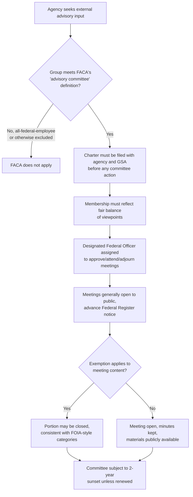

## The Federal Advisory Committee Act

### Jurisdictional Note

The Federal Advisory Committee Act (FACA) is U.S. federal law. There is no equivalent Philippine statute specifically regulating the formation, operation, and transparency of executive-branch advisory committees as a general class. Philippine practice relies instead on ad hoc executive orders creating specific technical working groups, task forces, or advisory bodies (e.g., for environmental policy, climate change, or specific regulatory reforms), each governed by its own creating issuance rather than a single overarching framework statute. This entry documents FACA as the doctrinally developed U.S. model, with a closing comparative note on Philippine practice.

### Overview and Purpose

FACA, enacted in 1972, regulates the creation, operation, and transparency of advisory committees established or utilized by the U.S. federal executive branch — bodies of private citizens, experts, or stakeholder representatives convened to provide advice or recommendations to federal officials or agencies. The statute responded to congressional concern that advisory committees had proliferated without adequate oversight, potentially serving as a vehicle for narrow special-interest influence over federal policy without public visibility.

**Key Points**

- FACA's core theory is that advisory committees can meaningfully shape federal policy outcomes even though they lack formal decision-making authority, because agencies often defer heavily to expert or stakeholder advisory input; transparency and balance requirements are designed to guard against capture of this influential-but-informal channel.
- The statute applies to committees "established" by statute or executive action, and to certain committees "utilized" by an agency even if not formally established by the government, closing a potential loophole where an agency could rely on an ostensibly private/independent group as a de facto advisory body while avoiding FACA's requirements.

### Coverage and Key Definitions

**What Counts as an "Advisory Committee"**

FACA broadly defines a covered advisory committee as any committee, board, commission, council, conference, panel, task force, or similar group established or utilized by the President or an agency to obtain advice or recommendations, with certain statutory exclusions, most notably:

- Committees composed wholly of full-time federal officers or employees (since these are treated as internal governmental deliberation, not external advisory input).
- Certain intergovernmental bodies (e.g., committees composed solely of representatives of state, local, or tribal governments acting in their official governmental capacities, subject to specific statutory conditions).
- Committees created by other specific statutes that provide their own, alternative transparency framework superseding FACA.

**Key Points**

- The "utilized" prong is doctrinally significant because it prevents agencies from achieving substantially the same advisory function through a nominally independent or agency-adjacent group while evading FACA's balance, transparency, and management requirements — courts have scrutinized arrangements where an agency exercises significant control over a formally private group's membership, agenda, or work product.
- The all-federal-employee exclusion reflects that FACA's purpose is to police *external* input into government decision-making, not internal interagency coordination.

### Core Substantive Requirements

**1. Charter Requirement**

Before an advisory committee may meet or take any action, it must have a formal charter, filed with the agency and, for most committees, with the General Services Administration (GSA), specifying its objectives and scope of activity, the agency it reports to, its duration, and other operational details.

**2. Fair Balance of Viewpoints**

The statute and its implementing regulations require that committee membership be "fairly balanced in terms of the points of view represented and the functions to be performed," a requirement intended to prevent a committee from being effectively captured by a single interest group or perspective while nominally serving as neutral expert advice to the agency.

**3. Open Meetings, Subject to Exemptions**

FACA generally requires advisory committee meetings to be open to public observation, with advance public notice in the Federal Register, and generally permits members of the public to file statements or, at the discretion of the chair, to speak — subject to closure for the same substantive categories of exemption recognized under the Government in the Sunshine Act/FOIA framework (e.g., properly classified information, trade secrets, personal privacy) where those categories are genuinely applicable to a given meeting's content.

**4. Record-Keeping and Public Availability of Materials**

Detailed minutes of each meeting must be kept, and records, reports, transcripts, working papers, and other materials made available to or prepared by the committee are generally subject to public inspection and copying, subject to FOIA-style exemptions where applicable.

**5. Agency/Federal Officer Oversight**

Each advisory committee must have a designated federal officer or employee who approves or calls each meeting, approves the agenda, attends the meeting, and may adjourn it when doing so is in the public interest — ensuring the committee remains genuinely advisory to, and supervised by, the agency rather than operating as an independent decision-making body.

**6. Termination/Renewal (Sunset Provision)**

Advisory committees are generally subject to a two-year duration limit unless renewed, requiring periodic reassessment of whether the committee remains necessary, which guards against the indefinite proliferation of advisory bodies that outlive their original purpose.

### Litigation and Enforcement Themes

**Standing and Judicial Review**

Courts have generally permitted judicial review of FACA compliance, often in the context of a party challenging the process by which an agency developed a rule or policy, arguing the agency relied on advice from a committee that failed to satisfy FACA's balance, charter, or openness requirements. A significant line of litigation addressed whether a private organization providing collective advice to an agency (for example, an industry association or advocacy coalition working closely with an agency on policy development) should be treated as a de facto FACA advisory committee subject to the statute's requirements, turning on the degree of agency control, initiative, and management of the group's role.

**Remedy Where a FACA Violation Is Found**

Where a court finds a FACA violation, remedies have varied by case and by the nature of the violation, ranging from ordering disclosure of committee records and proceedings, to (in some circumstances) vacating agency action that relied on tainted or improperly constituted advisory input, though courts have not uniformly required vacatur for every technical violation, often weighing the materiality of the violation to the ultimate agency decision. [Inference — the precise remedial calculus (when a FACA violation requires setting aside the underlying agency action versus a lesser remedy such as ordering disclosure) is fact- and circuit-specific in U.S. practice, and current controlling case law in the relevant circuit should be checked for a specific matter rather than assuming a uniform remedial rule.]

**Key Points**

- FACA litigation frequently arises not as a freestanding challenge to the committee's existence, but as a collateral attack embedded within a broader challenge to a substantive rule or policy the agency adopted, where the advisory committee's role in shaping that outcome is put at issue.
- The "de facto advisory committee" doctrine is one of the most consequential and fact-intensive areas of FACA litigation, since it determines whether an agency can rely on close, sustained collaboration with an outside group without triggering FACA's balance and transparency obligations.

### Application in Environmental Policy Contexts

Advisory committees are a common feature of U.S. federal environmental policymaking — for example, scientific advisory boards providing technical input on emission standards, risk assessment methodologies, or water quality criteria to agencies such as the EPA. FACA litigation in the environmental context has frequently centered on:

- Whether industry stakeholders were disproportionately represented relative to public health or environmental advocacy perspectives, raising a fair-balance challenge.
- Whether a scientific advisory panel's charter and scope were properly filed and adhered to.
- Whether agency reliance on informally convened stakeholder input (short of a formally chartered committee) should have been treated as a de facto advisory committee subject to FACA.

**Example**

If a federal environmental agency convenes a panel to recommend updated air quality standards, and that panel's membership is drawn overwhelmingly from regulated industry representatives with minimal public health or environmental science representation, an affected party could challenge the resulting standard by arguing the panel violated FACA's fair-balance requirement, seeking either disclosure of the panel's full deliberative record or, depending on the court's assessment of materiality, a broader challenge to the standard itself as tainted by a procedurally defective advisory process.

**Key Points**

- The fair-balance requirement is one of FACA's most consequential provisions for environmental policy specifically, because scientific and technical advisory input often has outsized practical influence on the substance of resulting regulatory standards, making the composition of the advisory body a meaningful point of leverage for stakeholders seeking to influence (or challenge) the ultimate regulatory outcome.

### Illustrative Diagram — FACA's Position in the Regulatory Process

<svg xmlns="http://www.w3.org/2000/svg" viewBox="0 0 760 300">
<text x="380" y="26" text-anchor="middle" font-size="17" font-weight="bold" fill="#1a1a1a">FACA's Role in Agency Policy Development (svg_diagram)</text>
<rect x="40" y="60" width="180" height="70" rx="6" fill="#e8f0fe" stroke="#3b5bdb" stroke-width="1.5" />
<text x="130" y="90" text-anchor="middle" font-size="11" fill="#1a1a1a">Agency identifies need</text>
<text x="130" y="106" text-anchor="middle" font-size="11" fill="#1a1a1a">for external expert input</text>
<rect x="280" y="60" width="200" height="70" rx="6" fill="#e6f7e6" stroke="#2b8a3e" stroke-width="1.5" />
<text x="380" y="85" text-anchor="middle" font-size="11" fill="#1a1a1a">FACA-compliant advisory</text>
<text x="380" y="101" text-anchor="middle" font-size="11" fill="#1a1a1a">committee chartered</text>
<text x="380" y="117" text-anchor="middle" font-size="9" fill="#444">balanced, open, supervised</text>
<rect x="540" y="60" width="180" height="70" rx="6" fill="#fff4e6" stroke="#e8590c" stroke-width="1.5" />
<text x="630" y="90" text-anchor="middle" font-size="11" fill="#1a1a1a">Committee provides</text>
<text x="630" y="106" text-anchor="middle" font-size="11" fill="#1a1a1a">advice/recommendations</text>
<line x1="220" y1="95" x2="280" y2="95" stroke="#333" stroke-width="1.5" marker-end="url(#a7)" />
<line x1="480" y1="95" x2="540" y2="95" stroke="#333" stroke-width="1.5" marker-end="url(#a7)" />
<line x1="630" y1="130" x2="630" y2="170" stroke="#333" stroke-width="1.5" marker-end="url(#a7)" />
<rect x="440" y="180" width="280" height="80" rx="6" fill="#f3f0ff" stroke="#7048e8" stroke-width="1.5" />
<text x="580" y="205" text-anchor="middle" font-size="11" fill="#1a1a1a">Agency issues rule/policy,</text>
<text x="580" y="221" text-anchor="middle" font-size="11" fill="#1a1a1a">informed by (not bound by) advice</text>
<text x="580" y="239" text-anchor="middle" font-size="9" fill="#444">Committee has no decisional authority itself</text>
<line x1="440" y1="220" x2="220" y2="220" stroke="#333" stroke-width="1" stroke-dasharray="4,3" marker-end="url(#a7)" />
<text x="120" y="215" text-anchor="middle" font-size="9" fill="#666">Challenge if FACA</text>
<text x="120" y="228" text-anchor="middle" font-size="9" fill="#666">violated upstream</text>
</svg>

### Comparative Note: Philippine Advisory Body Practice

Philippine executive-branch advisory bodies — technical working groups, inter-agency task forces, and expert panels convened for environmental policy development (e.g., bodies advising on climate change adaptation strategy, biodiversity policy, or specific EIS-related technical standards) — are typically created through individual executive orders, department administrative orders, or special laws, each specifying (or, at times, not specifying in detail) its own membership composition, operating rules, and any public transparency obligations, without a unifying framework statute analogous to FACA imposing uniform charter, balance, openness, and sunset requirements across all such bodies.

**Key Points**

- [Inference — the absence of a Philippine FACA-equivalent means that fair-balance and transparency safeguards for Philippine advisory bodies depend entirely on the specific terms of each body's creating issuance, producing significant body-to-body variation rather than a uniform baseline; this is an observation about structural difference rather than a claim that Philippine advisory bodies are necessarily less balanced or transparent in practice, which would depend on the specific issuance and body examined.]
- Advocates seeking greater consistency in Philippine environmental advisory body composition and transparency could look to FACA's structural elements (mandatory charter, fair-balance requirement, designated supervising officer, open meetings subject to defined exceptions, and periodic sunset review) as a reform model, adapted to the Philippine constitutional and administrative context.

**Related Topics**

- The Government in the Sunshine Act and open meeting requirements (parallel U.S. transparency framework)
- The Freedom of Information Act: exemptions and litigation strategy (records generated by advisory committees)
- Notice-and-comment rulemaking and the role of pre-rule stakeholder input
- Scientific advisory panels in environmental standard-setting (comparative U.S. EPA practice)
- Philippine technical working groups and inter-agency task forces in environmental policy
- Judicial review of rulemaking procedurally tainted by upstream advisory defects
- Agency capture theory and safeguards against regulatory capture
- Public participation requirements in the Environmental Impact Statement System