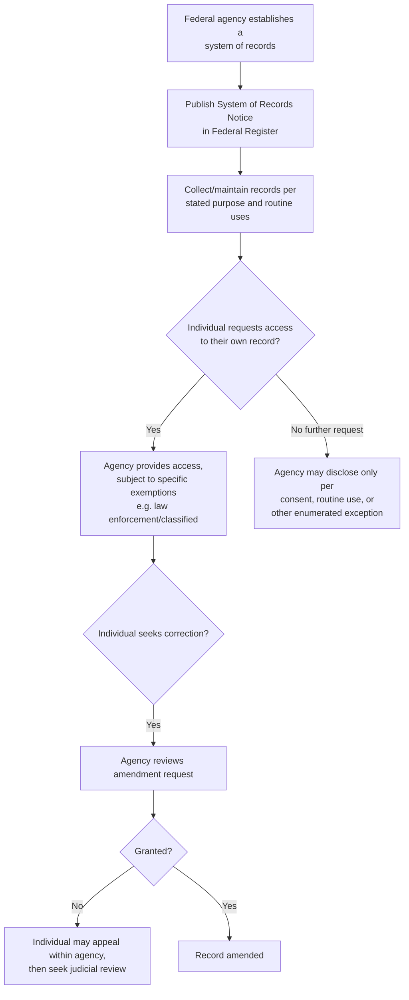
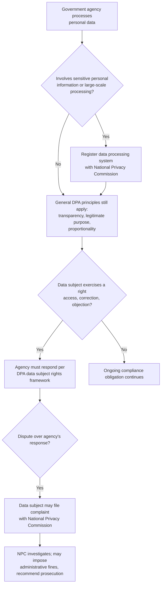

## The Privacy Act and Government Data Protection

### Jurisdictional Note

"The Privacy Act" as a specific, named statute refers to the U.S. Privacy Act of 1974 (5 U.S.C. § 552a), governing how U.S. federal agencies collect, maintain, use, and disclose personal information about individuals held in federal "systems of records." The Philippine functional counterpart is the **Data Privacy Act of 2012 (R.A. No. 10173)**, administered by the National Privacy Commission (NPC), which applies to both government and private-sector processing of personal data and is structured around a different set of core principles. Both frameworks are addressed below, clearly labeled.

### U.S. Privacy Act of 1974 — Structure and Core Requirements

**Purpose and Scope**

The Privacy Act was enacted in response to concerns about the growth of federal computerized record-keeping and the potential for government databases to be used for surveillance, discrimination, or other harms to individual privacy. It applies to "systems of records" — groups of records under an agency's control from which information is retrieved by an individual's name or other personal identifier — maintained by U.S. federal executive branch agencies.

**Core Substantive Requirements**

1. **Fair Information Practice Principles** — the Act embeds several principles that later became influential internationally in data protection law generally:
   - **Notice** — agencies must publish a "System of Records Notice" (SORN) in the Federal Register describing the existence, character, and routine uses of each system of records.
   - **Purpose limitation** — information should generally be collected and used only for purposes relevant to the agency's authorized function.
   - **Consent/routine use limitation on disclosure** — records generally may not be disclosed without the individual's written consent, except under specifically enumerated exceptions (the most significant being "routine use" — a disclosure compatible with the purpose for which the record was collected, as described in the published SORN).
   - **Individual access** — individuals generally have a right to access and review records about themselves.
   - **Correction/amendment** — individuals may request amendment of records they believe are inaccurate, irrelevant, untimely, or incomplete, with a defined administrative appeal process if the agency denies the request.
   - **Accuracy, relevance, and completeness** — agencies must maintain records with a standard of accuracy sufficient for fairness to the individual, particularly for records used in making determinations about the individual.
2. **The Twelve Disclosure Exceptions** — the Act's general non-disclosure-without-consent rule is subject to enumerated exceptions, including: disclosure to agency officers/employees with a need to know; disclosures required under FOIA; routine use disclosures; disclosures for statistical/archival purposes; disclosures to Congress or the Government Accountability Office; disclosures pursuant to court order; and disclosures for law enforcement purposes upon written request from the relevant law enforcement agency.
3. **Civil Remedies** — the Act provides a private right of action for individuals harmed by an agency's failure to comply, including for improper refusal to amend a record, improper disclosure, and failure to maintain accurate records, with statutory minimum damages available for certain intentional or willful violations, in addition to actual damages.

**Key Points**

- The routine-use exception is the most heavily litigated and practically significant limitation on the Act's non-disclosure default, since it can be drafted broadly enough by an agency's own SORN to substantially narrow the practical protection the Act otherwise provides.
- The Act applies specifically to "systems of records" retrieved by personal identifier — data held by an agency that is not organized or retrieved by reference to an individual generally falls outside its core protections, an important scoping limitation distinct from more comprehensive, identifier-agnostic data protection regimes.

### Interaction with FOIA

The Privacy Act and FOIA operate in tension for records that are both personal to an individual and potentially subject to a third party's disclosure request: FOIA's Exemption 6 (personal privacy) is often the mechanism through which the Privacy Act's non-disclosure protections are given effect when a third party seeks a record about someone else, requiring the agency to balance the requester's interest in disclosure against the privacy interest of the record's subject.

**Key Points**

- An individual seeking their *own* record can generally invoke either FOIA or the Privacy Act's access provisions, but the two statutes provide somewhat different exemption structures and procedural mechanics, meaning the choice of framework can affect the scope of what is ultimately disclosed.
- A third party seeking someone else's personal record held by a federal agency must go through FOIA (since the Privacy Act's access right is generally personal to the record's subject), where Exemption 6 becomes the operative gatekeeping provision informed by Privacy Act values.

### The Philippine Framework: Data Privacy Act of 2012 (R.A. No. 10173)

**Scope**

Unlike the U.S. Privacy Act's exclusive focus on federal government systems of records, the Philippine Data Privacy Act applies broadly to the processing of personal data by both government and private-sector entities, whether the processing occurs within the Philippines or, in some circumstances, involves Philippine data subjects' information processed abroad, subject to the statute's specific jurisdictional provisions.

**Core Principles**

The DPA is built around three core principles that data processing must comply with:

1. **Transparency** — data subjects must be informed of the nature, purpose, and extent of processing of their personal data.
2. **Legitimate purpose** — processing must be compatible with a declared and specified purpose, not contrary to law, morals, or public policy.
3. **Proportionality** — processing must be adequate, relevant, and limited to what is necessary for the declared purpose (a data-minimization principle).

**Key Data Subject Rights**

- Right to be informed
- Right to object to processing
- Right to access
- Right to correct/rectify
- Right to erasure or blocking
- Right to data portability
- Right to damages for inaccurate, incomplete, outdated, false, unlawfully obtained, or unauthorized use of personal data
- Right to file a complaint with the National Privacy Commission

**Government-Specific Provisions**

The DPA contains provisions specifically applicable to government agencies processing personal data, including:

- Requirements for government agencies to register their data processing systems with the NPC where the processing involves sensitive personal information or a significant number of data subjects.
- Heightened accountability for government personnel who process personal data, with specific criminal penalties under the Act for unauthorized processing, access due to negligence, improper disposal, and malicious disclosure by any person, including government employees.
- A general expectation that government data-sharing agreements between agencies comply with DPA principles, particularly regarding purpose limitation and proportionality, since inter-agency data sharing raises similar routine-use-type concerns to those addressed in the U.S. framework.

**Key Points**

- The DPA's criminal penalty provisions are notably more robust than the U.S. Privacy Act's primarily civil remedial structure, reflecting a different regulatory design choice — the Philippine framework backs its substantive principles with criminal sanctions for serious violations (e.g., malicious disclosure, unauthorized processing of sensitive personal information) in addition to administrative enforcement by the NPC.
- Sensitive personal information under the DPA (race, ethnic origin, health, education, genetic/sexual life, proceedings for offenses, government-issued IDs) receives heightened protection requiring, generally, the data subject's consent or another specific statutory basis for lawful processing, a categorical approach broadly analogous to, but not identically structured as, sensitive-category protections found in other comparative data protection regimes.

### Comparative Structure

| Feature | U.S. Privacy Act (1974) | Philippine Data Privacy Act (2012) |
| --- | --- | --- |
| Scope | U.S. federal agencies only | Government and private sector, PH and cross-border data of PH subjects |
| Core organizing concept | "System of records" retrieved by personal identifier | "Processing" of "personal data" broadly defined |
| Oversight body | No single dedicated commission; internal agency compliance, OMB guidance, judicial enforcement | National Privacy Commission |
| Primary remedy | Civil action, statutory damages for willful violations | Administrative fines, civil damages, and criminal penalties |
| Special category data | No distinct "sensitive" category as such; general accuracy/relevance standard applies uniformly | Explicit "sensitive personal information" category with heightened consent requirements |
| Interaction with access-to-information law | Interacts with FOIA (Exemption 6) | Interacts with E.O. No. 2 FOI exceptions (personal information protected by DPA cited as a recognized exception) |

### Application to Environmental Regulatory Data

**Where Personal Data Intersects Environmental Regulation**

Environmental regulatory processes generate and require personal data in various forms: permit applications naming responsible officers, complaint records naming complainants, inspection reports naming facility personnel, and, in community-facing contexts, personal information of residents participating in public consultations or filing environmental complaints.

**U.S. Context**

A federal environmental agency's system of records containing, for example, whistleblower complaint files naming both the whistleblower and accused individuals would generally be subject to Privacy Act SORN publication and access/amendment rights, while third-party FOIA requests for such records would need to navigate Exemption 6 (and, where law-enforcement-related, Exemption 7(C)) privacy balancing.

**Philippine Context**

A DENR/EMB complaint file naming a whistleblower or affected community member, or an inspection report containing facility employees' personal information, is subject to the DPA's transparency, legitimate purpose, and proportionality principles, meaning the agency must have a lawful basis for collecting and retaining that personal information and must protect it against unauthorized disclosure — while balancing this against the general public disclosure policy for compliance/environmental performance data addressed under the related FOI topic, since environmental compliance data about a facility (a juridical entity) is generally not "personal data" of an individual within the DPA's scope, but named individuals within reports (inspectors, employees, complainants) do fall within the DPA's protection.

**Key Points**

- A useful analytical distinction in both frameworks is between the *entity-level compliance data* (facility emissions, discharge levels — not personal data, generally subject to disclosure-favoring norms) and *individual-level personal data embedded within the same records* (names, contact details, personal identifiers of complainants, employees, or officers — protected personal/sensitive data requiring a lawful basis for processing and disclosure).
- Agencies handling environmental complaints, particularly from whistleblowers, must reconcile the DPA's data protection obligations toward the complainant with the practical needs of investigation (which may require identifying the complainant to relevant investigators) and any eventual due process rights of an accused party to know the basis of allegations against them — a genuine tension without a single formulaic resolution, requiring case-specific judgment consistent with both frameworks' principles.

### Illustrative Diagram — Personal vs. Entity Data in Environmental Records

<svg xmlns="http://www.w3.org/2000/svg" viewBox="0 0 760 300">
<text x="380" y="26" text-anchor="middle" font-size="17" font-weight="bold" fill="#1a1a1a">Personal Data vs. Entity Compliance Data (svg_diagram)</text>
<rect x="60" y="60" width="300" height="200" rx="8" fill="#e8f0fe" stroke="#3b5bdb" stroke-width="1.5" />
<text x="210" y="90" text-anchor="middle" font-size="13" font-weight="bold" fill="#1a1a1a">Entity Compliance Data</text>
<text x="210" y="115" text-anchor="middle" font-size="10" fill="#444">Emission/discharge levels</text>
<text x="210" y="133" text-anchor="middle" font-size="10" fill="#444">Permit conditions</text>
<text x="210" y="151" text-anchor="middle" font-size="10" fill="#444">Facility compliance history</text>
<text x="210" y="175" text-anchor="middle" font-size="10" fill="#666">Generally NOT personal data —</text>
<text x="210" y="191" text-anchor="middle" font-size="10" fill="#666">disclosure-favoring norms apply</text>
<text x="210" y="215" text-anchor="middle" font-size="10" fill="#666">(FOI/E.O. No. 2 framework governs)</text>
<rect x="400" y="60" width="300" height="200" rx="8" fill="#ffe3e3" stroke="#c92a2a" stroke-width="1.5" />
<text x="550" y="90" text-anchor="middle" font-size="13" font-weight="bold" fill="#1a1a1a">Embedded Personal Data</text>
<text x="550" y="115" text-anchor="middle" font-size="10" fill="#444">Complainant/whistleblower identity</text>
<text x="550" y="133" text-anchor="middle" font-size="10" fill="#444">Employee/officer names</text>
<text x="550" y="151" text-anchor="middle" font-size="10" fill="#444">Inspector contact details</text>
<text x="550" y="175" text-anchor="middle" font-size="10" fill="#666">Protected personal data —</text>
<text x="550" y="191" text-anchor="middle" font-size="10" fill="#666">DPA/Privacy Act principles apply</text>
<text x="550" y="215" text-anchor="middle" font-size="10" fill="#666">requires lawful basis, safeguards</text>
</svg>

### Practical Compliance Checklist for Agencies

**Key Points**

- Maintain a clear inventory distinguishing entity-level regulatory data (generally disclosure-favoring) from embedded personal data (generally protection-favoring) within the same records, since a blanket disclosure or blanket withholding approach applied to an entire document risks mishandling one category or the other.
- For U.S. federal practice: ensure SORNs are current and accurately describe routine uses actually being relied upon, since routine-use disclosures exceeding what is described in the published notice create Privacy Act exposure.
- For Philippine practice: confirm registration obligations with the NPC where processing involves sensitive personal information or reaches the statutory threshold, and ensure any inter-agency data-sharing arrangement is documented consistently with DPA purpose-limitation and proportionality principles.
- In both frameworks, build a defensible, documented process for handling access and correction/amendment requests, since disputes over accuracy or improper disclosure are recurring sources of both litigation (U.S.) and NPC complaints (Philippines).
- [Unverified] Specific registration thresholds, penalty amounts, and NPC circular requirements under the DPA are subject to periodic issuance and amendment by the National Privacy Commission; current NPC circulars should be checked for the applicable thresholds and procedures in force at the time of any specific compliance determination.

**Related Topics**

- The Freedom of Information Act: exemptions and litigation strategy (Exemption 6/personal privacy interaction)
- The National Privacy Commission's enforcement powers and administrative fine structure
- Sensitive personal information categories and consent requirements under the Data Privacy Act
- Whistleblower confidentiality versus due process rights of accused parties in agency investigations
- Government data-sharing agreements and inter-agency processing safeguards
- Comparative data protection frameworks: sectoral (U.S.) versus omnibus (Philippine/EU-influenced) models
- Administrative subpoenas and compelled production of records (personal data implications)
- Data breach notification obligations under the Data Privacy Act