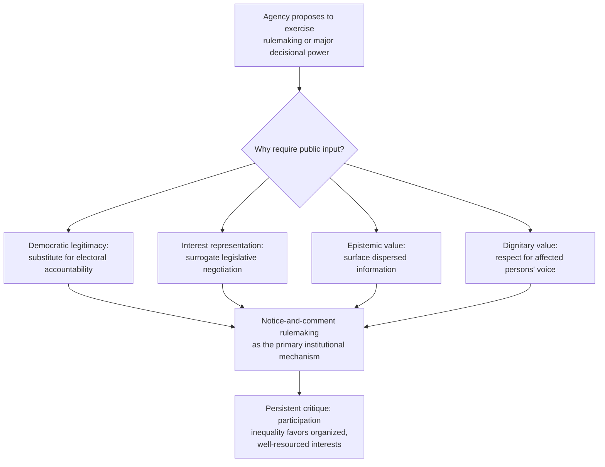
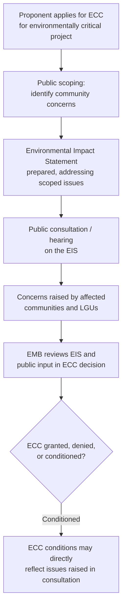

## Public Participation Theory and Notice and Comment as Democratic Input

### Overview

Public participation theory addresses the normative and functional justifications for involving affected persons and the general public in administrative decision-making, and notice-and-comment rulemaking is the most institutionalized procedural mechanism through which that participation is operationalized in modern administrative states. This topic sits at the theoretical foundation beneath the more mechanical procedural topics (subpoenas, inspections, penalty assessment) covered elsewhere in this course, asking not merely *how* agencies exercise power but *why* and *on what basis* that exercise is considered legitimate in a democratic system where agencies are not directly elected.

**Key Points**

- Administrative agencies exercise substantial lawmaking-like power (rulemaking) and law-applying power (adjudication) without the direct electoral accountability of legislators, creating what is often called the "democratic deficit" or "legitimacy problem" of the administrative state.
- Public participation mechanisms are one of the primary institutional responses to this legitimacy problem, alongside judicial review, legislative oversight, and executive political accountability.
- Notice-and-comment rulemaking is simultaneously a legitimacy-enhancing device, an information-gathering mechanism for the agency, and (in practice) a forum contested by organized interests with unequal capacity to participate effectively.

### Theoretical Justifications for Public Participation

**1. Democratic Legitimacy Theory**

Because unelected agency officials exercise significant discretionary power, participation mechanisms are theorized to substitute, in part, for the electoral accountability that legitimizes legislative action — allowing those who will be affected by a rule to have a voice in its formation, even without a vote on the agency head's tenure.

**2. Interest Representation / Pluralist Theory**

A distinct theoretical strand (associated with the mid-20th century "interest representation" model of administrative law) conceives of notice-and-comment as a surrogate legislative process, where the agency functions somewhat like a legislature receiving input from competing interest groups, and the resulting rule reflects a negotiated or at least considered balance among those interests, with courts reviewing for genuine consideration of all substantially affected interests rather than for majoritarian democratic pedigree as such.

**3. Epistemic/Information-Forcing Theory**

Participation is also justified instrumentally: affected parties, technical experts, and the public often hold information (local conditions, practical implementation challenges, technical data) that the agency itself lacks, and notice-and-comment is designed to surface this information before a rule is finalized, improving the substantive quality of the resulting rule independent of any democratic-legitimacy rationale.

**4. Dignitary/Process-Value Theory**

A further justification, more prominent in due-process theory generally, holds that being heard has independent value to the individual regardless of whether the input changes the outcome — the opportunity to participate is partly about respecting the affected person's status and voice, not solely about optimizing substantive results.

**Key Points**

- These theories are not mutually exclusive and are often invoked in combination; a specific participation requirement (e.g., a mandatory public hearing before permit issuance) may simultaneously serve legitimacy, information-forcing, and dignitary functions.
- Critics have long noted a tension between the pluralist/interest-representation theory's aspirations and the practical reality that well-resourced, organized interests (regulated industries, in particular) often participate far more effectively than diffuse public interests (individual citizens, under-resourced community groups), raising a persistent "participation inequality" critique.

### Notice-and-Comment Rulemaking — U.S. Comparative Model

**Basic Structure (Administrative Procedure Act, 5 U.S.C. § 553)**

The U.S. Administrative Procedure Act's notice-and-comment ("informal rulemaking") process is the most doctrinally developed comparative model:

1. **Notice of Proposed Rulemaking (NPRM)** — the agency publishes the proposed rule text and its legal/factual basis in the Federal Register.
2. **Comment period** — the public, including affected industries, advocacy organizations, and individuals, may submit written comments, typically for a period of 30 to 60 days or longer for complex rules.
3. **Agency response to significant comments** — the agency must consider and respond to significant comments in the rule's preamble/statement of basis and purpose when the final rule is published, though it need not respond to every comment individually, only those raising substantial issues that could affect the rule's validity or design.
4. **Final rule publication** — the agency publishes the final rule, generally with a statement explaining changes made in response to comments and the agency's reasoning for rejecting significant alternative proposals.
5. **Judicial review for adequacy** — courts reviewing the resulting rule (typically under the "arbitrary and capricious" standard) assess whether the agency's response to significant comments was reasoned, and whether the final rule is a "logical outgrowth" of the proposed rule (i.e., commenters had fair notice that the final rule's approach was a reasonably foreseeable outcome of the proposal, even if not identical to it).

**Key Points**

- The "logical outgrowth" doctrine polices against agencies using notice-and-comment as empty formality — if the final rule diverges too far from what was actually proposed, affected parties may not have had a meaningful opportunity to comment on the approach ultimately adopted, undermining the participation rationale itself.
- The requirement to respond to significant comments (rather than merely receiving them) is what gives notice-and-comment its substantive rather than purely symbolic character — an agency that received extensive comments but responded to none of the significant technical objections risks a rule being vacated as arbitrary and capricious for failure of reasoned decision-making.

### Philippine Framework for Public Participation and Rulemaking Notice

**General Due Process and Participation Norms**

Philippine administrative law does not have a single omnibus rulemaking-procedure statute equivalent to the U.S. APA's Section 553, but public participation requirements are embedded in:

- **The Administrative Code of 1987 (Book VII)**, which generally requires public participation for certain rules, particularly those that fix rates, prices, or wages, or otherwise substantially affect the public — often through publication and hearing requirements, though the Code's rulemaking procedural requirements are less uniformly detailed than the U.S. APA's Section 553 framework.
- **Specific environmental statutes**, several of which contain explicit public participation and hearing requirements for particular categories of decisions.

**Environmental Impact Statement System — Public Participation**

Presidential Decree No. 1586 and its implementing rules require public participation as a structural feature of the ECC application process for environmentally critical projects and projects in environmentally critical areas, including:

- Public scoping to identify issues of concern to affected communities before the Environmental Impact Statement is prepared.
- Public consultations and, for certain categories of projects, formal public hearings, generally required before the EMB acts on an ECC application.
- Opportunity for affected communities and local government units to raise concerns that the proponent and EMB must address in the EIS review process.

**Key Points**

- The EIS System's public participation requirements are among the most concretely institutionalized public participation mechanisms in Philippine environmental administrative practice, reflecting a deliberate policy choice to embed community input directly into the permitting decision rather than relying solely on post-decision judicial review as the primary check.
- [Inference — the practical rigor and consistency of public participation implementation under the EIS System (e.g., depth of consultation, genuine responsiveness to concerns raised, versus pro forma compliance) has been the subject of ongoing policy and civil-society critique in Philippine environmental governance; the extent of any such critique's validity is an empirical and context-specific question beyond what can be stated as settled doctrine here.]

**Rate-Fixing and Quasi-Legislative Hearings**

Philippine regulatory bodies exercising quasi-legislative rate-fixing power (e.g., the Energy Regulatory Commission for utility rates, or various agencies setting fees and charges) generally must comply with a required publication and hearing process before rates take effect, reflecting the Administrative Code's general due-process expectation that measures affecting the public significantly are not adopted without an opportunity for affected parties to be heard, though the specific hearing/comment procedures often vary by the agency's own charter and rules of procedure rather than following a single, uniform national template.

**Key Points**

- Because Philippine practice lacks a single unifying rulemaking-procedure statute, public participation obligations must be located agency-by-agency and statute-by-statute, in contrast to the U.S. APA's default applicability across virtually all federal agency rulemaking absent a specific exemption.
- [Unverified] The degree to which Philippine courts apply a "logical outgrowth"-equivalent doctrine (scrutinizing whether a final rule stayed within the bounds of what was actually subject to public comment) has not been as extensively and uniformly developed in reported Philippine jurisprudence as in U.S. federal administrative law; this should be treated as an area where the comparative U.S. doctrine is instructive rather than directly controlling.

### Comparative Structure

| Feature | U.S. APA Notice-and-Comment | Philippine Practice |
| --- | --- | --- |
| Governing framework | Single statute, 5 U.S.C. § 553, applies broadly | Fragmented: Administrative Code + sector-specific statutes (EIS System, rate-fixing charters) |
| Default requirement | Presumptive for all "legislative rules" absent exemption | Varies by statute; not a uniform default across all agency rulemaking |
| Response-to-comments obligation | Explicit, judicially enforced ("reasoned response to significant comments") | Less uniformly codified; general due process reasoning applies but with less developed doctrinal specificity |
| "Logical outgrowth" doctrine | Well-developed | Not extensively codified as a named, uniform doctrine |
| Signature participatory institution | Federal Register notice-and-comment | EIS System public scoping/consultation; rate-fixing hearings |

### Critiques and Limits of Participation Theory in Practice

**The Participation Inequality Critique**

Because effective participation in notice-and-comment or public consultation processes often requires technical expertise, legal resources, and sustained monitoring capacity, well-resourced regulated industries and organized interest groups tend to participate more frequently, more technically, and more persistently than individual citizens or under-resourced community organizations, raising the concern that formally neutral participation processes can, in practice, systematically favor concentrated interests over diffuse public interests — sometimes termed "regulatory capture through participation" as distinct from more overt forms of capture.

**The Ossification Critique**

A distinct critique (particularly prominent in U.S. administrative law scholarship) holds that the accretion of judicially enforced procedural requirements around notice-and-comment (extensive record requirements, exhaustive response obligations, hard-look judicial review) has made rulemaking so procedurally burdensome and litigation-exposed that agencies increasingly avoid formal rulemaking altogether, shifting toward less participatory tools (guidance documents, enforcement discretion, adjudication) that may achieve similar substantive ends with less public input — an outcome arguably contrary to participation theory's own goals.

**The Tokenism/Symbolic Compliance Critique**

A further critique, especially relevant to public consultation requirements embedded in project-specific processes like the EIS System, holds that consultation requirements can be satisfied in a formally compliant but substantively hollow manner — holding a required hearing without genuine openness to altering the proposed course of action — raising the question of whether procedural participation rights alone are sufficient without additional substantive or structural safeguards (e.g., requiring specific, reasoned responses to concerns raised, as the U.S. logical-outgrowth and reasoned-response doctrines attempt to institutionalize).

**Key Points**

- These critiques do not argue that public participation requirements are without value, but rather that the *design* of participation mechanisms matters enormously to whether they achieve their theoretical justifications in practice — participation rights without a genuine responsiveness obligation risk collapsing into symbolic legitimacy rather than substantive legitimacy or improved decision quality.
- Addressing the participation inequality critique has prompted various institutional responses in different systems, including funded intervenor programs (allowing resource-constrained public interest participants access to funding or technical assistance to participate effectively), extended comment periods for complex rules, and outreach requirements specifically targeting affected communities rather than relying solely on passive publication.

### Illustrative Diagram — Participation Theory to Practice Pipeline

<svg xmlns="http://www.w3.org/2000/svg" viewBox="0 0 760 340">
<text x="380" y="26" text-anchor="middle" font-size="17" font-weight="bold" fill="#1a1a1a">From Participation Theory to Institutional Practice (svg_diagram)</text>
<rect x="40" y="55" width="200" height="70" rx="6" fill="#e8f0fe" stroke="#3b5bdb" stroke-width="1.5" />
<text x="140" y="85" text-anchor="middle" font-size="11" fill="#1a1a1a">Theoretical Justification</text>
<text x="140" y="103" text-anchor="middle" font-size="9" fill="#444">legitimacy, epistemic, dignitary</text>
<rect x="290" y="55" width="200" height="70" rx="6" fill="#e6f7e6" stroke="#2b8a3e" stroke-width="1.5" />
<text x="390" y="85" text-anchor="middle" font-size="11" fill="#1a1a1a">Institutional Mechanism</text>
<text x="390" y="103" text-anchor="middle" font-size="9" fill="#444">notice-comment, EIS consultation</text>
<rect x="540" y="55" width="180" height="70" rx="6" fill="#fff4e6" stroke="#e8590c" stroke-width="1.5" />
<text x="630" y="85" text-anchor="middle" font-size="11" fill="#1a1a1a">Formal Compliance</text>
<text x="630" y="103" text-anchor="middle" font-size="9" fill="#444">notice given, hearing held</text>
<line x1="240" y1="90" x2="290" y2="90" stroke="#333" stroke-width="1.5" marker-end="url(#a8)" />
<line x1="490" y1="90" x2="540" y2="90" stroke="#333" stroke-width="1.5" marker-end="url(#a8)" />
<line x1="630" y1="125" x2="630" y2="165" stroke="#333" stroke-width="1.5" marker-end="url(#a8)" />
<rect x="440" y="175" width="280" height="130" rx="6" fill="#ffe3e3" stroke="#c92a2a" stroke-width="1.5" />
<text x="580" y="200" text-anchor="middle" font-size="12" font-weight="bold" fill="#1a1a1a">Gap: Formal vs. Substantive</text>
<text x="580" y="222" text-anchor="middle" font-size="9" fill="#444">Participation inequality:</text>
<text x="580" y="236" text-anchor="middle" font-size="9" fill="#444">organized interests dominate</text>
<text x="580" y="256" text-anchor="middle" font-size="9" fill="#444">Tokenism: hearing without</text>
<text x="580" y="270" text-anchor="middle" font-size="9" fill="#444">genuine responsiveness</text>
<text x="580" y="290" text-anchor="middle" font-size="9" fill="#444">Ossification: avoidance of</text>
<text x="580" y="304" text-anchor="middle" font-size="9" fill="#666">participatory process altogether</text>
</svg>

### Application to Environmental Governance

Environmental decision-making is one of the paradigm contexts in which public participation theory has the most direct institutional expression, because:

- Environmental harms often fall disproportionately on communities with limited resources to participate effectively in technical regulatory processes (an environmental justice dimension of the participation inequality critique).
- The EIS System's structural embedding of public consultation directly into the permitting decision (rather than participation only through after-the-fact litigation) reflects a strong institutional commitment to the epistemic and legitimacy theories described above.
- International environmental law instruments and soft-law principles (e.g., Principle 10 of the Rio Declaration, emphasizing access to information, participation, and justice in environmental matters) have influenced domestic Philippine and comparative practice toward treating public participation as a substantive environmental governance value in its own right, not merely a generic administrative law procedural nicety.

**Example**

A proposed mining project requiring an ECC under the EIS System illustrates the theoretical stakes concretely: the public scoping and consultation process is designed to surface local community concerns (water source impacts, displacement, livelihood effects) that the proponent's own technical studies might not have fully anticipated (epistemic theory), to give affected residents a genuine voice in a decision that will materially affect their lives despite their having no vote over the EMB's decision-makers (democratic legitimacy theory), and to respect the affected community's dignity and standing as stakeholders rather than passive subjects of a decision made entirely elsewhere (dignitary theory) — while remaining vulnerable, in practice, to the critique that a well-resourced proponent's technical and legal team may dominate the consultation process relative to an under-resourced local community group (participation inequality critique).

**Key Points**

- This example illustrates why public participation theory is not merely an abstract academic topic but directly shapes how specific procedural requirements (scoping, consultation, hearing) should be designed and evaluated — a hearing that technically satisfies the EIS System's requirements but fails to meaningfully surface and address community concerns arguably fails the deeper theoretical purposes the requirement was designed to serve, even while remaining formally compliant.

**Related Topics**

- The Environmental Impact Statement System and Environmental Compliance Certificate process
- Notice-and-comment rulemaking doctrine and the "logical outgrowth" test (comparative U.S. model)
- Environmental justice and disproportionate impact in public participation design
- The Freedom of Information Act: exemptions and litigation strategy (informational precondition to meaningful participation)
- Citizen suits and standing to enforce participation requirements
- Regulatory capture theory and its relationship to participation inequality
- International environmental law principles on access, participation, and justice (Rio Declaration Principle 10)
- Due process theory: dignitary versus instrumental justifications for procedural rights